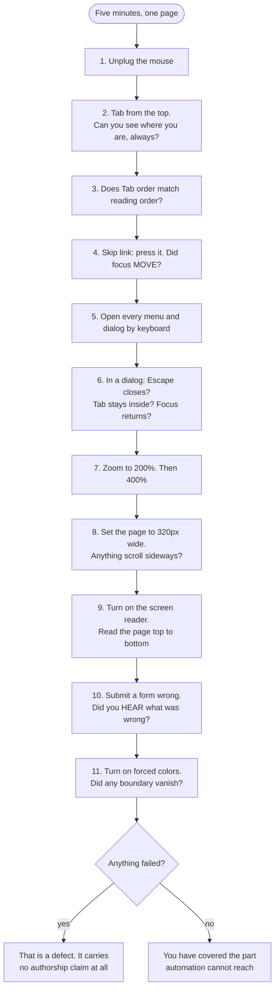

# The five-minute manual pass

Written for someone who has never used a screen reader. Do it in this order; the
order is chosen so the cheapest checks eliminate the most.

Do not start by opening an automated scanner. It has already told you what it
can, and what it can is about a third of the problem: axe-core's own coverage
report claims 57.38% of issues *by volume*, and that number is high precisely
because the things automation catches — missing alt, low contrast, unlabelled
fields — are the most numerous. Counted as *distinct success criteria a machine
can fully verify*, coverage is around 30%: roughly 15 of WCAG 2.1 AA's 50.

Everything below sits in the other 70%. Every step of it passes axe.

One piece of vocabulary, because the rest of this assumes it. ARIA is a set of
HTML attributes, all beginning `aria-`, that tell assistive technology things the
markup does not already say: `aria-label` supplies a name for a control that has
no visible text, `aria-live` marks a region whose updates should be spoken,
`aria-current` marks the page you are on. They change what a screen reader
announces and nothing else — no pixel on the page moves — which is why they are
so easy to get wrong without noticing.

---

## The pass, end to end

Eleven steps, five minutes, one page. Every step passes an automated scan already — that is the point of them.

## Minute 1 — hands off the mouse

**1.** Load the page. Press **Tab** once. A "Skip to content" link should appear.
Press **Enter**, then press **Tab** again. Did you land in the main content, or
back in the top navigation? Back in the navigation means the skip link scrolled
the page and left focus behind — `skip-link-that-moves-nothing`.

**2.** Keep pressing **Tab** through the whole page, watching for three things
at once.

Can you always see where you are? If the focus ring slides under a sticky header
and disappears, that is `focus-obscured-by-sticky-chrome`, a WCAG 2.2 AA failure
no automated engine can measure. Does the order match the layout? If focus jumps
from the left column to the footer and back up, that is
`focus-order-diverges-from-reading-order`, and the usual cause is CSS that
reordered the content while the source order stayed as written. And does anything
get skipped, or does focus vanish entirely? A clickable thing you can never reach
is `clickable-div-not-button`; focus landing on the document body is
`spa-route-change-focus-lost`.

**3.** Click a navigation link, or press Enter on one. **Where is focus now?**
Press Tab once. If you are back at the very top of the page, the route change
dropped you.

## Minute 2 — open something and close it

**4.** Tab to the first button that opens a modal, menu or dropdown. Press
**Enter**.

Did focus go inside the dialog? Across roughly three thousand driven trials only
24% of generated modals managed that on a bare prompt, so expect to find this one
(`focus-never-enters-the-dialog`). If focus did move, is it on a control, or on
an empty box? (`focus-lands-on-the-container-not-a-control`)

Keep Tabbing past the last control. You should loop back to the top of the
dialog, or reach the browser's own address bar — both are fine. Landing on the
page *behind* the overlay is `background-not-inert-behind-the-overlay`.

Now press **Escape**. Did it close, and did focus come back to the button you
pressed? Test the close button and a backdrop click too, because generated code
frequently restores focus on one route and not the others
(`focus-not-restored-on-dismiss`). Finally, if there is a dropdown inside the
modal, open it and press Escape once: only the dropdown should close
(`escape-not-wired-on-the-inner-layer`).

## Minute 3 — break the layout on purpose

**5.** Press **Ctrl/Cmd +** until the browser says 400%. Scroll to the bottom. Is
there a **horizontal** scrollbar? Is any text cut off or overlapping? Did the
navigation disappear entirely rather than collapsing into a menu? That is
`reflow-failure-at-320-css-pixels`. (Equivalent: drag the window to 320px wide.)

**6.** Still zoomed — did the **body text** get bigger, or only the boxes? Body
text that did not grow is sized in viewport units
(`type-sized-in-viewport-units`).

**7.** Turn on the OS high-contrast setting. Do icons vanish? Do card edges
disappear? Can you still tell which tab is selected? That is
`forced-colors-mode-erases-the-interface`, and generated UI is unusually exposed
to it because it leans on shadow and gradient for structure, which is exactly
what forced colors strips.

## Minute 4 — turn on a screen reader and do exactly two things

Mac: **Cmd + F5** for VoiceOver. Windows: install NVDA, which is free. Do not try
to browse — you will hate it and learn nothing. Do these two:

**8. Open the elements list.** VoiceOver: **Ctrl + Option + U**, then Left/Right
to move between Headings, Links and Landmarks. NVDA: **Insert + F7**.

Read the headings first. Does the list work as a table of contents for the page?
Is there exactly one level 1? Do the levels skip? Are there sections visible on
screen with no heading at all? That is `heading-levels-chosen-for-size`, and it
is the most valuable ten seconds in the whole pass, because 71.6% of screen
reader users navigate a long page by headings before they try anything else.

Then the links, where the question is simply how many of them say "Learn more"
(`link-text-that-only-works-next-to-its-picture`). Then the landmarks, where it
is how many entries say "navigation" and nothing more
(`landmarks-duplicated-and-unnamed`).

**9. Submit the main form with a deliberate mistake** — a bad email, a blank
required field. Press submit, then say nothing and listen.

Was the error spoken at all? Silence means `form-errors-visible-but-never-spoken`
— or `conditionally-rendered-live-region`, if the code looks like it should have
worked. And if it was spoken, does it tell you how to fix it, or only that it is
wrong? (`error-message-names-the-failure-not-the-remedy`)

## Minute 5 — two look-ups in the source

**10.** View source and search for the accessibility-overlay vendor names —
`acsbapp`, `userway`, `audioeye`, `equalweb`, `reciteme`. Any hit means
`accessibility-overlay-installed`: the problem was recognised and outsourced to a
script rather than fixed, and everything above is probably worse than it looked,
because the overlay may have been masking it. It is the fastest single signal
here. Be fair about it, though — the owner was often sold this in good faith, and
two class actions have been filed by exactly such businesses after they bought a
widget and were sued anyway.

**11.** Search for `aria-`. Read what comes back. If you see `aria-label` on a
`
`, `role="button"` on a `<button>`, `role="navigation"` on a `<nav>`, or
`aria-label="hero section"`, the accessibility work on this page is decorative:
`aria-label-on-a-generic-element`, `aria-label-cloaks-the-text-that-was-already-there`,
`redundant-role-on-a-semantic-element`. Then check whether there is an
`/accessibility` page claiming WCAG AA conformance
(`accessibility-statement-without-an-audit`).

If both are true, you have found the thing this file is for: a site that produced
the *appearance* of accessibility and none of it.

---

## What this pass will not find

So nobody mistakes it for complete: reading order inside complex widgets, table
header associations, text-spacing overrides, drag alternatives, session timeouts,
and anything about cognitive load beyond error messages. Those need the rendered
and assistive checks in `references/accessibility-beyond-the-checklist.md`.

But the eleven steps above will find the majority of what that file covers, and
not one of them requires you to know anything about accessibility before you
start.
