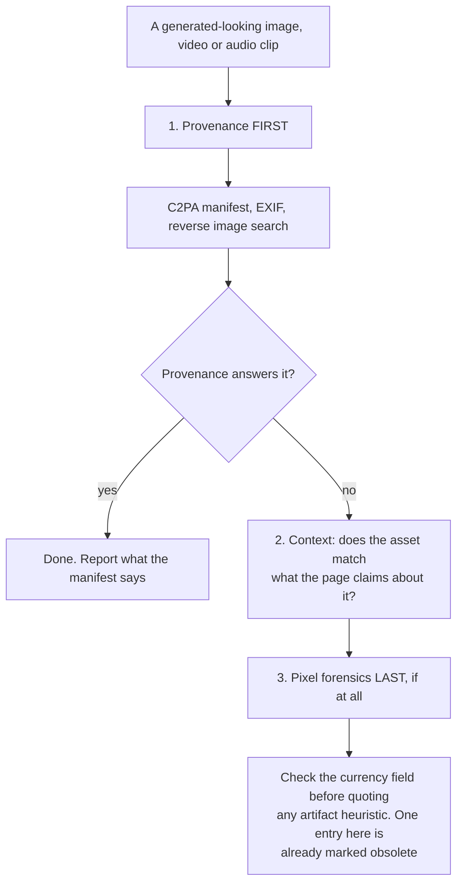

# Generated images, video and audio — provenance first

A separate file because the REVIEW ORDER is different. For a generated image, video or audio clip, provenance comes first — C2PA manifest, EXIF, reverse image search — and pixel forensics comes last if at all, because the artifact-based heuristics age in months. This catalog has already had to mark one obsolete: the mangled-hands entry was real and is now retired, and it is kept as a standing warning about how fast this file decays.

_11 items. Generated from catalog.json — edit there, then re-run `scripts/regenerate_references.py`. Do not hand-edit this file._

_Every item carries a **False positive when** line. Read it before you act on the item: these are cues for an editor, not evidence about an author._

<!-- humanize:ignore-start
     The diagram and index below quote the tells they document, and a
     mermaid label is not a sentence. -->

## When this file applies

## What is in this file

Severity is how loudly the tell announces itself, never how sure you should be about who wrote it. **Automated** means these scripts implement the check; *no* means it is yours to ask in the judge pass.

| item | severity | family | automated |
| --- | --- | --- | --- |
| [`identical-face-different-people`](#identical-face-different-people) | HIGH | visual | n/a |
| [`mockup-of-nothing`](#mockup-of-nothing) | HIGH | form | n/a |
| [`plausibly-wrong-chart`](#plausibly-wrong-chart) | HIGH | visual | n/a |
| [`uniform-detail-no-focus-falloff`](#uniform-detail-no-focus-falloff) | HIGH | visual | n/a |
| [`amber-white-balance-cast`](#amber-white-balance-cast) | med | visual | **no** |
| [`eight-second-shot-ceiling`](#eight-second-shot-ceiling) | med | visual | **no** |
| [`provenance-absent-or-stripped`](#provenance-absent-or-stripped) | med | residue | **no** |
| [`stock-collaboration-photography`](#stock-collaboration-photography) | med | form | n/a |
| [`ai-image-waxy-skin-mangled-hands`](#ai-image-waxy-skin-mangled-hands) | low | visual | n/a |
| [`breathless-uniform-prosody`](#breathless-uniform-prosody) | low | visual | n/a |
| [`no-idle-micro-behavior`](#no-idle-micro-behavior) | low | visual | n/a |

<!-- humanize:ignore-end -->

<!-- humanize:ignore-start
     Everything below is a specimen catalog. It quotes the tells it documents,
     including literal machine residue, so reviewing it with humanize_review.py
     would flag the exhibits rather than the writing. -->

### `identical-face-different-people`  ·  high · generic-llm · web-ui · llm-judge · family: visual

Across 'different' avatars or testimonial photos, the same underlying face recurs — same bone structure, eye spacing, smile — with only hair/clothes swapped, plus a shared teal-and-orange grade and creamy bokeh across all images.

**Why it reads AI:** A diffusion model collapses toward an attractive mean face, so a batch of generated people look like siblings. The shared grade and identical bokeh confirm one generator made them all.

**Detect:** llm-judge: 'Do the supposedly distinct people share one mean face with cosmetic variation, and do all images share an identical color grade and depth-of-field, indicating one generator produced them?'

**Fix:** Use distinct real people. If generating, vary seeds/prompts hard and verify faces are genuinely different, or avoid faces entirely. Diversify color grade and depth-of-field.

**False positive when:** Stock photo libraries legitimately reuse the same models across a set, and a real team photographed in one session shares a grade and a look by construction. Flag the same underlying face across supposedly different people, not consistency of styling.

**Before**

> Four testimonial avatars that are visibly the same face with different hairstyles, all teal-orange graded with identical background bokeh.

**After**

> Four genuinely distinct licensed portraits with varied lighting, framing, and color treatment — or four monogram/initial avatars instead of faces.

### `mockup-of-nothing`  ·  high · generic-llm · image · llm-judge · family: form

A hero visual that is chrome without a product: a browser frame or device bezel around an interface that does not exist, with invented chart shapes and plausible-but-fictional nav items.

**Why it reads AI:** More dishonest than the image-less hero, because it makes a claim. A generator cannot screenshot software it has never run, but it can draw something that looks like one.

**Detect:** Judge: is this a screenshot of a running application or an illustration of one? Look for data following a real distribution, labels naming domain-specific nouns, scrollbars, focus rings, timestamps, truncation, and empty states. A structural hint: a hero 'screenshot' built as a DOM tree or inline SVG rather than a raster, because a real screenshot is almost never hand-rebuilt in markup.

**Fix:** Replace it with a real screenshot, cropped to the view that makes the value legible, with real data in it. If the product is not built, an honest diagram of the intended mechanism is better than a fake of the finished thing.

**False positive when:** Deliberate illustration clearly presented as illustration, and pre-release products showing a design mock labelled as one.

**Before**

> A MacBook bezel around a hand-drawn dashboard with Project Alpha, Project Beta, Project Gamma.

**After**

> A screenshot of the real queue with three real table names in it.

### `plausibly-wrong-chart`  ·  high · generic-llm · chart · llm-judge · family: visual

A chart that looks right and is wrong: axes that do not start where they should, percentages that do not sum, a trend line fitted to points that do not support it, labels that do not match the data.

**Why it reads AI:** Generating a chart means generating its appearance. The model produces a convincing picture of an analysis, and nothing in the loop checks the picture against the data.

**Detect:** Read the numbers off the chart and check them against the source. This is arithmetic, not taste.

**Fix:** Rebuild the chart from the data. If there is no data, there is no chart.

**False positive when:** Humans make chart errors constantly too, which is the point: this finding is about the chart being wrong, not about who drew it. Like citation pathology, act on it with full confidence.

**Before**

> A pie chart whose wedges sum to 112%.

**After**

> The same comparison as a bar chart, from a CSV anyone can open.

### `uniform-detail-no-focus-falloff`  ·  high · generic-llm · image · llm-judge · family: visual

Detail distributed evenly rather than optically: everything equally sharp regardless of distance, or a flat Gaussian background wash that does not deepen with distance from the focal plane. Mid-tones perfectly smooth.

**Why it reads AI:** A lens has one focal plane and a circle of confusion that grows with distance. Diffusion models learned background blur as a style token rather than as geometry, so the blur has no depth structure. A real sensor also never produces perfectly smooth mid-tones, because it produces noise.

**Detect:** Look at whether sharpness falls off as a gradient or as two flat zones. A partial structural assist is available by computing high-frequency energy in depth bands.

**Fix:** If you must use the image, add real grain and a depth-aware blur. Better: use a photograph.

**False positive when:** Deep-focus photography, focus stacking, macro work, and small-sensor phone images with computational depth all break this. Heavy noise reduction also smooths mid-tones.

**Evidence:** Reported by practitioners as the strongest purely visual tell surviving into 2026, now that hands and text no longer work.

**Before**

> A portrait where the subject and the wall four metres behind are equally crisp.

**After**

> A photograph, or a render with a real depth pass.

### `amber-white-balance-cast`  ·  medium · chatgpt · image · structural · family: visual

**Automated here:** no — decidable mechanically, but this bundle does not implement it. Ask it yourself in the judge pass.

A global warm cast across generated images: whites drifting to cream, shadows muddy brown, skin pushed slightly yellow. It compounds, adding a layer with each edit round.

**Why it reads AI:** No camera and no photographer produces the same white balance across a kitchen, a beach and an office. A cast invariant to the scene implies a single rendering stage.

**Detect:** Compute the chromaticity of the brightest 1% of pixels. Neutral highlights sit near equal R/G/B; this skews R>G>B. A consistent cast across unrelated subjects from one source is close to conclusive.

**Fix:** Neutralize white balance in post by sampling a known-white object and correcting globally. Prompting alone is unreliable, because the cast is applied late in rendering.

**False positive when:** Golden-hour photography, tungsten interiors, deliberate warm grading across most commercial and film work, film-emulation looks, and anything shot under sodium light. The tell is a warm cast INVARIANT TO THE SCENE, not a warm cast. It is also trivially corrected, so its absence means nothing.

**Before**

> Product shot on a white seamless that samples at #F6EEDC.

**After**

> Same shot with the seamless corrected to #FAFAFA.

### `eight-second-shot-ceiling`  ·  medium · generic-llm · video · structural · family: visual

**Automated here:** no — decidable mechanically, but this bundle does not implement it. Ask it yourself in the judge pass.

**Currency:** Fading — still seen, but vendors have patched toward it and it is weakening.

Every shot runs five to ten seconds, because that is the generation window, and the piece is assembled entirely from cuts at that interval.

**Why it reads AI:** The edit rhythm is the tool's constraint rather than an editorial choice. No human edit has that little variance.

**Detect:** Measure shot lengths. A whole piece with no shot outside the five-to-ten-second band is the signal.

**Fix:** If you must use generated footage, cut against the grain: hold one shot long, and cut one hard and short.

**False positive when:** Music videos, trailers and social edits use fast uniform cutting deliberately. This is also expiring fast as generation windows lengthen.

**Before**

> A ninety-second piece of twelve eight-second shots.

**After**

> A piece with a twenty-second hold in it.

### `provenance-absent-or-stripped`  ·  medium · generic-llm · image · structural · family: residue

**Automated here:** no — decidable mechanically, but this bundle does not implement it. Ask it yourself in the judge pass.

The file's provenance record: a C2PA manifest naming a generator, a manifest naming a camera, or nothing at all, plus EXIF that is present, absent, or implausible.

**Why it reads AI:** A signed manifest from a generator is a positive fact about the file. Most 2026 guidance goes wrong by reading the converse.

**Detect:** Read the JUMBF box for a C2PA manifest, verify the signature against the C2PA trust list, and read EXIF and XMP. This is the only genuinely scriptable provenance test, and the asymmetry is the whole point: a signed generator manifest is close to proof of synthesis, and its absence proves nothing.

**Fix:** If you are PRODUCING work, sign your real photography. Lightroom and Photoshop emit Content Credentials, and several camera bodies sign at capture. It is the only durable way to prove your work is yours as detectors get less decisive.

**False positive when:** Constantly, in the negative direction. Every social upload, screenshot, re-save, CMS resize and CDN transform strips the manifest. Midjourney does not embed C2PA at all as of early 2026, so the most-used generator produces clean files. The standard has documented holes too: timestamps can be replaced without detection, and different validators return contradictory results. Never read a missing manifest as evidence of anything.

**Before**

> A hero image shipped as a stripped JPEG with no manifest and no EXIF.

**After**

> Signed at capture or export, with the manifest preserved through the build pipeline.

### `stock-collaboration-photography`  ·  medium · generic-llm · image · llm-judge · family: form

The diverse team around a laptop, mid-laugh, pointing at a screen that is not the product. Or its generated successor: same composition, same lighting, nobody real.

**Why it reads AI:** The image occupies the space where evidence would go. It is the visual form of copy that names no mechanism.

**Detect:** Judge: is this a photograph of this company's people, customers or product in use, or a generic image of work happening? Structural hints include stock-CDN filenames and hosts, and the same image on several pages.

**Fix:** Photograph your actual team, your actual customer, or your actual screen. A worse photograph of a real thing beats a better photograph of nothing.

**False positive when:** Licensed stock used knowingly for mood on a brand page, and industries where showing real customers is not permitted.

**Before**

> Smiling team around a laptop, stock CDN.

**After**

> The three people who built it, at their desks, badly lit.

### `ai-image-waxy-skin-mangled-hands`  ·  low · generic-llm · web-ui · llm-judge · family: visual

**Currency:** ⚠ OBSOLETE — retained as a caution, not as a test.

OBSOLETE AS A PRIMARY TEST. The 2022-2024 image giveaways — six-fingered hands, garbled signage, asymmetric eyes — are largely fixed in 2025-26 models. Repeating this advice now produces confident wrong answers in both directions.

**Why it reads AI:** It frequently no longer does, which is the point of this entry. Detection guidance moved to provenance-first methods precisely because visual-artifact heuristics stopped working.

**Detect:** Do not lead with anatomy. Lead with provenance: C2PA / Content Credentials, EXIF and capture metadata, reverse image search for an earlier appearance, and the publisher's own sourcing. Residual visual signal survives only in hard cases — closed fists, interlaced fingers, dense text-rich scenes, crowds in the mid-ground — and in tonal artifacts such as the amber cast and default shallow-depth-of-field bokeh.

**Fix:** Check provenance before appearance. If the image is yours to fix, the editorial question is unchanged: does this picture show something true, and would a real photograph have been better?

**False positive when:** Almost everywhere now. Real photographs contain motion-blurred hands, odd reflections and unreadable signage constantly. This entry is retained as a caution, not as a test.

**Evidence:** GIJN Reporter's Guide to Detecting AI-Generated Content; Pangram's image-classifier launch rationale; TextFake benchmark, arXiv:2606.01050.

**Before**

> Flagging a hero image as AI because a hand looks slightly off.

**After**

> Checking Content Credentials, running a reverse image search, and asking the designer where the file came from.

### `breathless-uniform-prosody`  ·  low · generic-llm · audio · llm-judge · family: visual

Synthetic narration with even stress, no breath, and emphasis landing on function words. Sentences all start at the same pitch and fall the same way.

**Why it reads AI:** Prosody encodes what the speaker means, and a system that has not understood the sentence stresses it by rule. Breath is the other giveaway, because a voice that never needs air has no body.

**Detect:** Listen for a breath. Then listen for where the emphasis lands: 'the RESULTS were surprising' rather than 'the results were SURPRISING'.

**Fix:** Record a person, or at minimum hand-mark emphasis and insert breaths. Proper nouns need a pronunciation pass regardless.

**False positive when:** Trained broadcast narrators are extremely even, and heavy compression removes audible breath. Radio and audiobook professionals get flagged by this constantly.

**Evidence:** Practitioner/editorial hypothesis. No calibrated individual-authorship inference or universal quality threshold is established here. Escalate only after demonstrating a reader or task failure.

**Before**

> Ninety seconds of even, breathless narration over stock footage.

**After**

> A take with a person in it, including the place they stumble.

### `no-idle-micro-behavior`  ·  low · generic-llm · video · llm-judge · family: visual

People in generated video do the thing they were asked to do and nothing else. No blinking at the wrong moment, no weight shift, no glance off-camera, no hand doing something absent-minded.

**Why it reads AI:** The model animates the prompt. Idle behavior is what a body does when nobody is directing it, and there is no instruction for it.

**Detect:** Watch a person who is not the focus of the shot. Real people are never doing only one thing.

**Fix:** Cut to the background actor and see whether the shot survives. Usually it does not, which tells you what to keep.

**False positive when:** Direction, and staged corporate footage, both produce unnaturally still extras. This is an underrated tell precisely because people look at the main subject.

**Evidence:** Practitioner/editorial hypothesis. No calibrated individual-authorship inference or universal quality threshold is established here. Escalate only after demonstrating a reader or task failure.

**Before**

> A conference room where everyone not speaking is perfectly still.

**After**

> Real footage, or a tighter shot that does not show the room.

<!-- humanize:ignore-end -->
