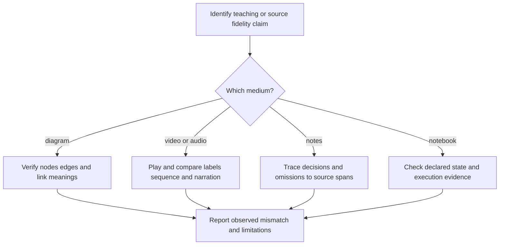

# Instructional media and source-bound notes

Review generated diagrams, video, audio, notebooks and notes against the task they claim to serve. Visual polish, smooth motion and fluent narration do not establish factual fidelity. These checks require source comparison or actual playback; this bundle does not automate OCR, audio analysis or notebook execution.

_7 items. Generated from catalog.json — edit there, then re-run `scripts/regenerate_references.py`. Do not hand-edit this file._

_Every item carries a **False positive when** line. Read it before you act on the item: these are cues for an editor, not evidence about an author._

<!-- humanize:ignore-start
     The diagram and index below quote the tells they document, and a
     mermaid label is not a sentence. -->

## When this file applies

## What is in this file

Severity is how loudly the tell announces itself, never how sure you should be about who wrote it. **Automated** means these scripts implement the check; *no* means it is yours to ask in the judge pass.

| item | severity | family | automated |
| --- | --- | --- | --- |
| [`diagram-edge-without-warrant`](#diagram-edge-without-warrant) | HIGH | shape | n/a |
| [`notebook-hidden-state-explanation`](#notebook-hidden-state-explanation) | HIGH | shape | n/a |
| [`notes-promote-speculation-to-decision`](#notes-promote-speculation-to-decision) | HIGH | shape | n/a |
| [`spoken-symbol-ambiguity`](#spoken-symbol-ambiguity) | HIGH | shape | n/a |
| [`video-text-changes-meaning`](#video-text-changes-meaning) | HIGH | shape | n/a |
| [`generated-image-purpose-mismatch`](#generated-image-purpose-mismatch) | med | shape | n/a |
| [`smooth-video-omits-process`](#smooth-video-omits-process) | med | shape | n/a |

<!-- humanize:ignore-end -->

<!-- humanize:ignore-start
     Everything below is a specimen catalog. It quotes the tells it documents,
     including literal machine residue, so reviewing it with humanize_review.py
     would flag the exhibits rather than the writing. -->

### `diagram-edge-without-warrant`  ·  high · generic-llm · multimedia · llm-judge · family: shape · lane: instructional-media

A tidy diagram asserts an unsupported dependency, causal direction, equivalence or link sign.

**Why it reads AI:** Review hypothesis about unexamined assembly or task mismatch. This pattern can occur in human work and does not establish authorship.

**Detect:** For each edge, identify the source statement, edge meaning and direction; inspect missing as well as invented relations.

**Fix:** Label edge semantics, correct unsupported links, and verify the graph against the explanation.

**False positive when:** A clearly labeled conjectural model may show hypotheses rather than established relations.

**Evidence:** Editorial application of https://arxiv.org/pdf/2402.11400. This source supports the mechanism or repair within its studied setting, not AI authorship detection or prevalence of this exact pattern.

### `notebook-hidden-state-explanation`  ·  high · generic-llm · multimedia · llm-judge · family: shape · lane: instructional-media

A tutorial notebook displays plausible outputs that depend on unshown state, execution order or unstated data.

**Why it reads AI:** Review hypothesis about unexamined assembly or task mismatch. This pattern can occur in human work and does not establish authorship.

**Detect:** In an authorized isolated environment, restart and run in order; compare outputs and declared dependencies.

**Fix:** Supply the missing state and data contract, make the execution order explicit, and rerun.

**False positive when:** Exploratory private notes may be incomplete if they make no reproducibility claim.

**Evidence:** Editorial application of https://ies.ed.gov/ncee/wwc/PracticeGuide/1. This source supports the mechanism or repair within its studied setting, not AI authorship detection or prevalence of this exact pattern.

### `notes-promote-speculation-to-decision`  ·  high · generic-llm · multimedia · llm-judge · family: shape · lane: instructional-media

Generated notes turn a suggestion into a decision, disagreement into consensus, or an unassigned task into a named commitment.

**Why it reads AI:** Review hypothesis about unexamined assembly or task mismatch. This pattern can occur in human work and does not establish authorship.

**Detect:** Link each decision, owner and deadline to a source span; retain uncertainty and dissent.

**Fix:** Restore the actual status and attribute only commitments present in the source.

**False positive when:** A clearly labeled proposed action plan may introduce assignments for later approval.

**Evidence:** Editorial application of https://aclanthology.org/2025.coling-main.143/. This source supports the mechanism or repair within its studied setting, not AI authorship detection or prevalence of this exact pattern.

### `spoken-symbol-ambiguity`  ·  high · generic-llm · multimedia · llm-judge · family: shape · lane: instructional-media

Narration collapses distinctions such as negation, subscripts or operator scope that are essential to the lesson.

**Why it reads AI:** Review hypothesis about unexamined assembly or task mismatch. This pattern can occur in human work and does not establish authorship.

**Detect:** Compare the script, audible output and captions; ask a listener to reconstruct the expression without the slide.

**Fix:** Rewrite for unambiguous spoken grouping and provide synchronized accessible notation.

**False positive when:** A talk for specialists may use established spoken conventions after defining them.

**Evidence:** Editorial application of https://ies.ed.gov/ncee/wwc/PracticeGuide/1. This source supports the mechanism or repair within its studied setting, not AI authorship detection or prevalence of this exact pattern.

### `video-text-changes-meaning`  ·  high · generic-llm · multimedia · llm-judge · family: shape · lane: instructional-media

A generated instructional video changes a label, numeral or equation across frames so the demonstrated claim becomes unstable.

**Why it reads AI:** Review hypothesis about unexamined assembly or task mismatch. This pattern can occur in human work and does not establish authorship.

**Detect:** Inspect task-critical text at transitions and held frames; compare OCR candidates manually to the intended transcript.

**Fix:** Composite verified text separately or regenerate and inspect the affected interval.

**False positive when:** Intentional text transformations are legitimate when the transition is the content.

**Evidence:** Editorial application of https://arxiv.org/abs/2505.04946. This source supports the mechanism or repair within its studied setting, not AI authorship detection or prevalence of this exact pattern.

### `generated-image-purpose-mismatch`  ·  medium · generic-llm · multimedia · llm-judge · family: shape · lane: instructional-media

A polished image is accepted on aesthetic appeal despite failing the object, relationship or teaching purpose it must convey.

**Why it reads AI:** Review hypothesis about unexamined assembly or task mismatch. This pattern can occur in human work and does not establish authorship.

**Detect:** Score task fidelity, composition, text accuracy and relevant physical relations separately from aesthetic preference.

**Fix:** Repair the failed purpose dimension or use a simpler diagram with verified relationships.

**False positive when:** Atmospheric art may have no factual or explanatory function and can be judged accordingly.

**Evidence:** Editorial application of https://ojs.aaai.org/index.php/AAAI/article/view/39666. This source supports the mechanism or repair within its studied setting, not AI authorship detection or prevalence of this exact pattern.

### `smooth-video-omits-process`  ·  medium · generic-llm · multimedia · llm-judge · family: shape · lane: instructional-media

An instructional clip looks smooth but skips the physical or procedural change it claims to demonstrate.

**Why it reads AI:** Review hypothesis about unexamined assembly or task mismatch. This pattern can occur in human work and does not establish authorship.

**Detect:** Map the required steps to observed events and ask which transformation is actually visible.

**Fix:** Show the missing transition or replace decorative motion with a labeled static sequence.

**False positive when:** A deliberately static establishing shot does not claim to demonstrate a process.

**Evidence:** Editorial application of https://arxiv.org/abs/2407.01094. This source supports the mechanism or repair within its studied setting, not AI authorship detection or prevalence of this exact pattern.

<!-- humanize:ignore-end -->
