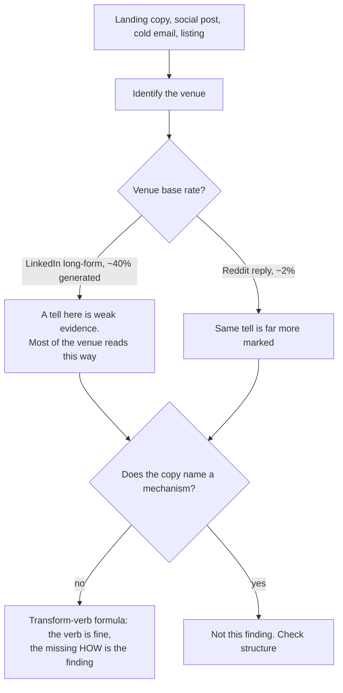

# Marketing copy and platform posts — written to a template

Landing-page copy, social posts, cold email, listings and résumés. One thing separates this file from document structure: these are venues with a HOUSE FORM, and the tell is the form arriving complete rather than any individual sentence. Severity follows demonstrated reader harm, not estimated AI prevalence. Check the genre before changing a familiar form.

_30 items. Generated from catalog.json — edit there, then re-run `scripts/regenerate_references.py`. Do not hand-edit this file._

_Every item carries a **False positive when** line. Read it before you act on the item: these are cues for an editor, not evidence about an author._

<!-- humanize:ignore-start
     The diagram and index below quote the tells they document, and a
     mermaid label is not a sentence. -->

## When this file applies

## What is in this file

Severity is how loudly the tell announces itself, never how sure you should be about who wrote it. **Automated** means these scripts implement the check; *no* means it is yours to ask in the judge pass.

| item | severity | family | automated |
| --- | --- | --- | --- |
| [`fabricated-testimonial-cards`](#fabricated-testimonial-cards) | HIGH | shape | n/a |
| [`false-precision-statistic`](#false-precision-statistic) | HIGH | residue | n/a |
| [`h1-names-a-category-not-a-product`](#h1-names-a-category-not-a-product) | HIGH | form | n/a |
| [`hook-break-lesson-list-close`](#hook-break-lesson-list-close) | HIGH | shape | n/a |
| [`linkedin-broetry-one-line-runs`](#linkedin-broetry-one-line-runs) | HIGH | shape | yes |
| [`magnitudes-without-a-baseline`](#magnitudes-without-a-baseline) | HIGH | form | yes |
| [`mechanism-never-named`](#mechanism-never-named) | HIGH | form | n/a |
| [`mirror-back-research-opener`](#mirror-back-research-opener) | HIGH | shape | n/a |
| [`substitutable-reply`](#substitutable-reply) | HIGH | shape | n/a |
| [`synthetic-executive-quote`](#synthetic-executive-quote) | HIGH | shape | n/a |
| [`synthetic-review-shape`](#synthetic-review-shape) | HIGH | shape | n/a |
| [`testimonial-with-no-traceable-source`](#testimonial-with-no-traceable-source) | HIGH | form | yes |
| [`transform-verb-marketing-formula`](#transform-verb-marketing-formula) | HIGH | shape | n/a |
| [`unfilled-placeholder-residue`](#unfilled-placeholder-residue) | HIGH | residue | yes |
| [`bullet-restates-its-own-title`](#bullet-restates-its-own-title) | med | form | n/a |
| [`credential-persona-opener`](#credential-persona-opener) | med | shape | n/a |
| [`engagement-bait-close`](#engagement-bait-close) | med | shape | n/a |
| [`eyebrow-with-no-information`](#eyebrow-with-no-information) | med | form | n/a |
| [`grok-forced-irreverence`](#grok-forced-irreverence) | med | shape | n/a |
| [`kimi-linkedin-confident-slop`](#kimi-linkedin-confident-slop) | med | shape | n/a |
| [`markdown-scaffolding-in-casual-comment`](#markdown-scaffolding-in-casual-comment) | med | shape | **no** |
| [`notability-padding`](#notability-padding) | med | shape | n/a |
| [`power-verb-metric-bullet`](#power-verb-metric-bullet) | med | shape | n/a |
| [`problem-agitate-solve-by-template`](#problem-agitate-solve-by-template) | med | shape | n/a |
| [`rhetorical-question-hook`](#rhetorical-question-hook) | med | shape | n/a |
| [`scripted-empathy-opener`](#scripted-empathy-opener) | med | shape | n/a |
| [`subhead-restates-the-h1`](#subhead-restates-the-h1) | med | form | n/a |
| [`subreddit-register-mismatch`](#subreddit-register-mismatch) | med | shape | n/a |
| [`synthetic-consensus`](#synthetic-consensus) | med | shape | n/a |
| [`cta-names-the-click-not-the-outcome`](#cta-names-the-click-not-the-outcome) | low | form | n/a |

<!-- humanize:ignore-end -->

<!-- humanize:ignore-start
     Everything below is a specimen catalog. It quotes the tells it documents,
     including literal machine residue, so reviewing it with humanize_review.py
     would flag the exhibits rather than the writing. -->

### `fabricated-testimonial-cards`  ·  high · generic-llm · marketing-copy · llm-judge · family: shape

A testimonial section with placeholder quotes attributed to alliterative invented names ('Sarah Smith, CEO at TechFlow'), AI-generated or generic avatars, and 5-star rows — for a product with no real customers.

**Why it reads AI:** Fake testimonials with alliterative names and synthetic avatars are a hollow-template tell — the generator fills the social-proof slot with plausible filler rather than real quotes.

**Detect:** llm-judge: 'Are the testimonials fabricated — too-neat alliterative names, vague company names (TechFlow, CloudSync), synthetic avatars, and quotes that fill a social-proof slot rather than coming from real customers?'

**Fix:** Remove fabricated proof until real testimonials exist. Replace with an honest early-access note, real logos you may show, or concrete product facts. Never ship invented people.

**False positive when:** A real testimonial from a real customer is the opposite of this finding, and placeholder testimonials in a design mockup, template or component library are expected and correct. Flag invented alliterative names and stock avatars on a SHIPPED page.

**Before**

> Three cards: 'This changed how our team works! — Sarah Sullivan, CEO @ TechFlow' / 'Sava Stone, CTO @ CloudSync' with stock-smiling AI avatars and 5 stars.

**After**

> A single honest line — 'In private beta with 40 teams; case studies coming soon' — or two real, attributed quotes with permission and actual photos.

### `false-precision-statistic`  ·  high · generic-llm · marketing-copy · llm-judge · family: residue

A specific-sounding number with no source: '73% of teams report improved collaboration', 'studies show a 3x increase'.

**Why it reads AI:** Precision is cheap to generate and expensive to verify. The model produces the shape of evidence because evidence-shaped claims are what its training rewarded.

**Detect:** Look for the citation. A statistic with a decimal point and no source is the strongest form.

**Fix:** Find the source, or cut the number and make the qualitative claim honestly.

**False positive when:** Real statistics are also specific. The tell is the missing source, not the number.

**Before**

> Studies show that 73% of distributed teams struggle with async communication.

**After**

> Every remote team I've worked on has had the same problem with async, and none of us solved it well.

### `h1-names-a-category-not-a-product`  ·  high · generic-llm · marketing-copy · llm-judge · family: form

The headline is a value proposition or a category description rather than a statement of what the thing is. The canonical form is a mad-lib: 'The AI-powered X for modern Y.'

**Why it reads AI:** A generator given a product name and a category has the category available and the mechanism not. The reader finishes the hero knowing which aisle the product is shelved in and nothing else.

**Detect:** Judge: after reading only the hero, can you name one thing the product does? A structural pre-filter is possible on the template shapes and on headlines containing no verb describing an action the software performs.

**Fix:** Say what it does, with a verb and an object. 'Turn Figma files into React components' beats any arrangement of platform, workspace, and modern teams. Test it by asking whether a competitor could use the same headline unchanged.

**False positive when:** Category-defining products genuinely name a category, and established brands can lead with positioning because the reader already knows the mechanism.

**Before**

> The AI-powered workspace for modern teams

**After**

> Turn Figma files into React components

### `hook-break-lesson-list-close`  ·  high · generic-llm · social-post · llm-judge · family: shape

The LinkedIn macro-frame, distinct from broetry: a standalone hook line, a blank line, a labelled transition ('Here's what I learned:', '3 things I'd do differently:'), a list of three, then an interrogative close. It survives re-flowing the paragraphs, which is what makes it a different tell from the line spacing.

**Why it reads AI:** It is the highest-engagement post structure in the training data, so it is what a model produces when asked for a LinkedIn post. It is also what a lot of humans produce, which is why it needs its base rate attached.

**Detect:** Judge the skeleton rather than the line breaks. The labelled transition plus a list of exactly three plus a question close is the shape.

**Fix:** Keep the story, drop the scaffold. Tell what happened and stop when it's told.

**False positive when:** This is a native LinkedIn convention that predates LLMs, and plenty of humans write it sincerely. Weight it by platform: LinkedIn long-form runs around 40% fully generated, so the prior is high there and nowhere else.

**Before**

> I got rejected 47 times.
> 
> Here's what I learned:
> 
> 1. Persistence matters
> 2. Feedback is a gift
> 3. Rejection isn't personal
> 
> What's your experience?

**After**

> I got rejected 47 times before Northwind said yes, and the only useful feedback came from the 31st, who told me my deck buried the number.

### `linkedin-broetry-one-line-runs`  ·  high · chatgpt · marketing-copy · structural · family: shape

**Automated here:** yes, these scripts implement it.

A post built as a vertical stack of one-line paragraphs separated by blank lines, opening with a contrarian hook and building to a 'here's what it taught me' payoff. Each line is a fragment; no paragraph exceeds one sentence.

**Why it reads AI:** Humans cluster sentences into uneven blocks; the metronomic one-line-paragraph stack with a manufactured hook-and-lesson arc reads as engagement-bait template.

**Detect:** structural: measure the run length of consecutive single-sentence paragraphs and paragraph-length variance; broetry shows runs of 8+ one-line paragraphs and near-zero length variance.

**Thresholds** (read by `scripts/humanize_review.py`): `min_run` = 4, `max_words_per_line` = 14

**Fix:** Write it as 2-3 real paragraphs first. Keep line breaks only where a genuine beat lands. Drop the manufactured arc; tell what actually happened, including the part that doesn't generalize.

**False positive when:** Poetry, song lyrics, and deliberately staccato personal essays. Also: broetry predates LLMs by years — it is a human LinkedIn convention that models learned, so on LinkedIn specifically it is weak evidence.

**Before**

> I got rejected 40 times.
> 
> Then everything changed.
> 
> Here's what failure taught me about success.
> 
> Lesson 1: Never give up. 🧵

**After**

> I got rejected by 40 companies before the 41st said yes — and the 41st only happened because a friend forwarded my resume past the screener. The lesson isn't 'never give up.' It's that the application pile is a lottery you win by knowing someone.

### `magnitudes-without-a-baseline`  ·  high · generic-llm · marketing-copy · structural · family: form

**Automated here:** yes, these scripts implement it.

'10x faster.' 'Cut costs by 40%.' A comparative claim with no comparand, no method and no source.

**Why it reads AI:** The figure does the rhetorical work of evidence while carrying none of the risk, which is exactly what a generator reaches for when it has no measurement to report. It is the visual-design sibling of the fabricated statistic.

**Detect:** Match multipliers and improvement frames attached to numbers, then check the surrounding block for a comparison target, a measurement method, a date or an outbound link. A bare percentage is deliberately NOT matched: a proportion is not a claim.

**Thresholds** (read by `scripts/humanize_review.py`): `min_count` = 1

**Fix:** Give every number its denominator and its method, or delete it. 'Median build time fell from 4m12s to 1m50s across our own CI over March' beats '3x faster' and cannot be doubted the same way.

**False positive when:** Claims with the comparand and method already attached pass and should. Regulated industries often have approved comparative language with the substantiation held elsewhere and linked.

**Before**

> 10x faster. Save 40% on costs.

**After**

> Median build time fell from 4m12s to 1m50s, measured across our own CI over March.

### `mechanism-never-named`  ·  high · generic-llm · marketing-copy · llm-judge · family: form

The page describes outcomes and never says how the thing works. You finish it unable to explain the product to someone else.

**Why it reads AI:** Placeholder copy produces placeholder layout, and the causal arrow runs that way. A generator writing from a product name and a category has outcomes available to it and no mechanism, so it writes the half it has.

**Detect:** Judge: after reading the page, write one sentence explaining the mechanism. If you cannot, the page never gave you one.

**Fix:** Add the sentence that says what actually happens: what goes in, what the system does, what comes out. It is usually one sentence and it is usually the most valuable one on the page.

**False positive when:** Brand and campaign pages that deliberately withhold detail, and products whose mechanism is genuinely the category (a font shop sells fonts).

**Before**

> Empower your team to do more with less.

**After**

> We watch your bank feed and match each line to an invoice; the 2% we cannot match go to whoever owns that ledger.

### `mirror-back-research-opener`  ·  high · generic-llm · email · llm-judge · family: shape

An opener that personalizes by reciting the recipient's own public information back at them: 'I came across your profile and was truly impressed by your background', or a paraphrase of their homepage hero.

**Why it reads AI:** It signals the opposite of what it intends. Reading someone's homepage is not research, and the recipient knows what is on their own homepage.

**Detect:** Judge whether the opener contains one fact that is NOT on the recipient's public profile headline or homepage.

**Fix:** Lead with something you noticed that they would not expect you to have noticed.

**False positive when:** Referencing a specific piece of someone's public work is good outreach. The tell is reciting their own summary of themselves.

**Before**

> I noticed your company helps businesses scale their operations.

**After**

> Your changelog says you moved off Elasticsearch in March. How did the reindex go?

### `substitutable-reply`  ·  high · generic-llm · social-post · llm-judge · family: shape

A comment that would fit unchanged under thousands of other posts: it restates the question, offers balanced general advice, and ends with encouragement.

**Why it reads AI:** The model answers the category, not the post. It is the social equivalent of specificity starvation, and it is what people actually mean when they say a comment feels like a bot.

**Detect:** Ask whether the reply contains one fact that could only have come from reading THIS post. If not, it is substitutable.

**Fix:** Quote the specific thing you are responding to, and say the thing only you would know.

**False positive when:** Plenty of humans write generic supportive comments, and on advice subreddits that is often the socially correct move.

**Before**

> That sounds really difficult, and it's completely valid to feel that way. Have you considered talking to a professional about it?

**After**

> The part about your manager copying HR on everything is the bit I'd document. Same thing happened to me and the paper trail is what saved it.

### `synthetic-executive-quote`  ·  high · generic-llm · marketing-copy · llm-judge · family: shape

A press-release quote attributed to a named executive that no executive said, containing no information: 'We're thrilled to partner with X to deliver best-in-class solutions to our customers.'

**Why it reads AI:** The quote slot is a template field, and the model fills it with the average of every quote it has seen. Putting a real person's name on it is the part that matters.

**Detect:** Judge whether the quote contains a fact, an opinion someone could disagree with, or a voice. Attributed quotes with none of the three are manufactured.

**Fix:** Get a real sentence from the real person, or drop the quote. A release without a quote is better than one with a fabricated one, and putting invented words in a named person's mouth is its own problem.

**False positive when:** PR quotes have been ghostwritten and approved for a century, and an approved quote is not fabricated. The line is whether the named person saw and agreed to it.

**Before**

> "We're thrilled to partner with Acme to deliver best-in-class solutions," said the CEO.

**After**

> "We bought them because we'd already rebuilt half of what they do, badly," said the CEO.

### `synthetic-review-shape`  ·  high · generic-llm · listing · llm-judge · family: shape

The generated review arc plus its content signature. Skeptic-conversion opener, three generic merits, recommendation close. It praises category virtues such as quality, value and convenience, and never names a use, a room, a defect, a comparison, or a moment.

**Why it reads AI:** Fake and generated reviews emphasize generic product merits rather than idiosyncratic experiences. A measured 3% of front-page Amazon reviews are generated, skewing toward five stars, and 93% of those carried a verified-purchase badge, so the badge does not save you.

**Detect:** Judge: does this review contain a single detail that could only come from owning the item? A corpus-level signal is stronger than the text: star-rating skew and burst timing at the product level.

**Fix:** One concrete artifact per review: what you did with it, where it sits, what went wrong, what you compared it to, how long you have had it. Drop the recommendation sentence, because the star rating already says it.

**False positive when:** 'I was skeptical' describes a genuinely common purchase experience, and most people are simply not good reviewers. Seeded and sampled reviews are legitimately labelled and legitimately glowing. Text alone on a single review is weak evidence.

**Before**

> I was skeptical at first, but this exceeded my expectations! The quality is excellent and the value is great. Highly recommend!

**After**

> Third one of these I've owned. The hinge on the previous two gave out around 14 months; this revision uses a metal pin. It does not fit a 15-inch laptop with a case on, despite the listing photo.

### `testimonial-with-no-traceable-source`  ·  high · generic-llm · marketing-copy · structural · family: form

**Automated here:** yes, these scripts implement it.

A quote attributed to 'Sarah C., Product Manager' with a generated face. A first name, a job title, no company, no link.

**Why it reads AI:** Nothing in the attribution can be checked, which is the design rather than an oversight. The template has a testimonial slot and a testimonial needs a face, so a face is fetched from wherever faces come from.

**Detect:** Placeholder avatar hosts (pravatar, randomuser, ui-avatars, thispersondoesnotexist) are the cleanest signal, plus first-name-plus-initial attribution patterns. Near-zero false positive on the avatar hosts: no real customer has a portrait served from a random-face API.

**Thresholds** (read by `scripts/humanize_review.py`): `min_count` = 1

**Fix:** Get a real name, role, company and a link, or take the section down. One checkable quote outperforms five unfalsifiable ones, and a page with no testimonials is more credible than a page with invented ones.

**False positive when:** Design-system documentation and component galleries use placeholder avatars correctly. Anonymised testimonials from regulated or security-sensitive customers are legitimate when the page says why the name is withheld.

**Before**

>  Sarah C., Product Manager

**After**

>  Priya Raman, Staff SRE at Calder — <a href="/customers/calder">read the write-up</a>

### `transform-verb-marketing-formula`  ·  high · generic-llm · marketing-copy · llm-judge · family: shape

Copy leans on aspirational hollow verbs — Unlock, Elevate, Transform, Supercharge, Empower, Revolutionize, Effortlessly — attached to abstract nouns (your potential, your workflow, your business) with no concrete mechanism, often one imperative per sentence.

**Why it reads AI:** These verbs are the statistical center of mass of training-set marketing copy; they promise motion toward a good outcome while committing to nothing, which is what a model produces with no real product facts.

**Detect:** llm-judge: 'Could this exact headline sit on any other startup's page unchanged? Does it rely on aspirational verbs attached to abstract nouns with no specific, measurable outcome?'

**Fix:** Replace the verb+abstraction with a verb+concrete-outcome-with-a-number. Name the specific job. If you can't make it specific, you don't yet understand the benefit.

**False positive when:** These verbs are legitimate marketing vocabulary and a product that genuinely transforms something may say so. The tell is the missing mechanism, not the verb: if the next clause says HOW, there is no finding.

**Before**

> Unlock your team's potential. Supercharge productivity and effortlessly transform the way you work.

**After**

> Cut your weekly status meeting from 60 minutes to 10. Standups post themselves from your commits, so nobody narrates their week out loud.

### `unfilled-placeholder-residue`  ·  high · generic-llm · email · structural · family: residue

**Automated here:** yes, these scripts implement it.

Template scaffolding shipped live. Two mechanically identical families: merge tags that never resolved ('Hi {{first_name}}', 'Hi FNAME', 'Dear Customer Name', 'Hi null,') and model bracket placeholders nobody replaced ('the [Job Title] position at [Company Name]', '[insert metric here]').

**Why it reads AI:** It is the one item in this catalog that is proof rather than inference: unreviewed generated or templated output reached a recipient. Nothing else here is that certain.

**Detect:** Static: regex for merge-tag and bracket-placeholder syntax -- {{ name }}, %%FIELD%%, *|MERGE|*, [Job Title]. Both braces are required: a single {word} group is one of the commonest constructs in text and markup and must not match. This is a hard fail rather than a score.

**Thresholds** (read by `scripts/humanize_review.py`): `min_count` = 1

**Fix:** Block send or publish on any placeholder pattern. Set fallbacks on every merge field, and grep the final artifact before it leaves.

**False positive when:** Documentation, template libraries, tutorials and code samples show unrendered merge tags on purpose, which is the point of them. Never fire inside fenced code, or in content whose subject IS templating. Some CRMs also render the braces in preview panes. And a single-brace group is not a placeholder: \usepackage{amsmath}, a CSS block, and a Python format string all use one brace, and an earlier version of this check scored a clean hand-written LaTeX paper HIGH because of it.

**Before**

> Hi {FirstName}, I'm reaching out because [Company Name] is doing interesting work in [industry].

**After**

> Hi Priya, I saw Northwind shipped the SOC 2 attestation last month.

### `bullet-restates-its-own-title`  ·  medium · generic-llm · marketing-copy · llm-judge · family: form

Each feature card has a two-word title and a body that is the title again as a sentence. 'Real-time sync — Keep everything in sync, in real time.'

**Why it reads AI:** The card has a body slot, so a body is generated, and the only guaranteed-relevant content for that slot is the title it sits under.

**Detect:** Content-word overlap between a card's title and its body, discounting stopwords. Flag when most of the title's content words reappear and the body adds no proper noun, numeral or unit.

**Fix:** Make the body say the thing the title cannot: the mechanism, the limit, the number. If you cannot, delete the body and let the title stand alone.

**False positive when:** A deliberately redundant summary line for scanning, and accessibility patterns where the body expands an abbreviated title.

**Before**

> **Real-time sync** — Keep everything in sync, in real time.

**After**

> **Real-time sync** — Changes land in about 200ms; we stream the WAL rather than polling.

### `credential-persona-opener`  ·  medium · generic-llm · social-post · llm-judge · family: shape

An opener claiming standing that the rest of the comment never uses: 'As someone who has worked in this field for fifteen years', followed by advice available on any search engine.

**Why it reads AI:** The frame is a rhetorical move the model has learned to perform. A person with fifteen years in a field leaks specifics without being asked.

**Detect:** Judge whether the claimed experience produces anything in the body that a non-expert could not have written.

**Fix:** Drop the credential and lead with the specific thing the credential would have taught you.

**False positive when:** Establishing standing is a real and useful convention, especially on technical subreddits where it tells readers how to weight the answer.

**Before**

> As someone who's worked in commercial insurance for over a decade, I'd say it's important to read your policy carefully.

**After**

> Check whether your policy has a 72-hour reporting window. Most commercial ones do and it's the single most common reason these get denied.

### `engagement-bait-close`  ·  medium · generic-llm · social-post · llm-judge · family: shape

The closing line that asks for interaction rather than ending the thought: 'What's your take?', 'Agree?', 'Drop a comment below', 'P.S. Follow me for more'.

**Why it reads AI:** It is a growth tactic learned as a writing convention. The model appends it because the corpus rewards it, regardless of whether a question is warranted.

**Detect:** Closed phrase bank over the final line, plus a judge call on whether the question is real.

**Fix:** End on the last real sentence. If you genuinely want an answer, ask a specific question only your readers could answer.

**False positive when:** Asking readers a genuine question is normal and good, and community managers do it professionally.

**Before**

> What's your take? Drop a comment below.

**After**

> If anyone has made the Postgres side of this work above 10k writes a second, I'd like to know how.

### `eyebrow-with-no-information`  ·  medium · generic-llm · marketing-copy · llm-judge · family: form

The small uppercase label above a headline carrying no fact: INTRODUCING, FOR MODERN TEAMS, AI-POWERED, THE FUTURE OF WORK.

**Why it reads AI:** An eyebrow is an editorial device that presumes a hierarchy: a publication, a section, an issue. A landing page with one section has nothing for it to be above. The slot exists in the template, so the generator fills it, and the filling has to come from somewhere when no fact is available. It is among the most-cited visual giveaways in practitioner threads for exactly this reason.

**Detect:** Judge each eyebrow with its adjacent heading. What distinct orientation, scope, taxonomy or constraint would the reader lose if it were removed? Digits, capitalization and links cannot determine meaning.

**Fix:** Keep meaningful taxonomy and scope even when they contain no proper noun, digit or link. Delete or merge only a label whose removal loses no information or orientation.

**False positive when:** Editorial and documentation contexts where the eyebrow is a real taxonomy label (ENGINEERING, CHANGELOG, API REFERENCE, ISSUE 47) and navigates somewhere; conference pages carrying date and place; and brands whose whole system is editorial and where every eyebrow resolves to a real section. The question is not whether there is an eyebrow but whether it resolves to something a reader could navigate to or verify — which is why a linked eyebrow is never flagged.

**Evidence:** GOV.UK explicitly supports useful captions above headings: https://design-system.service.gov.uk/styles/headings/. Empty-label diagnosis is an editorial judgment, not a validated AI detector.

**Before**

> 
Introducing

> <h1>The AI-powered workspace for modern teams</h1>

**After**

> <h1>Turn Figma files into React components</h1>

### `grok-forced-irreverence`  ·  medium · grok · marketing-copy · llm-judge · family: shape

Grok is prompt-tuned for an 'edgy/spicy' persona, producing try-hard irreverence: shoehorned snark, winking asides ('Buckle up, buttercup'), and contrarian 'I'm not like other AIs' posturing that doesn't fit the topic.

**Why it reads AI:** Real voice is specific and situational; Grok's is a uniform costume applied regardless of context. The constancy of the irreverence outs it as a tuned mask, not a personality.

**Detect:** llm-judge: 'Is a uniform edgy/snarky persona applied regardless of subject, with manufactured irreverence and unlike-other-AIs framing rather than wit specific to the topic?'

**Fix:** Cut the persona scaffolding. Let wit emerge from a genuinely sharp observation about the specific subject, used sparingly.

**False positive when:** Irreverent brand voices genuinely exist and are deliberate, and some writers are actually funny. Flag snark that does not fit the topic or the audience, not the presence of a joke.

**Before**

> Oh, you want to know about compound interest? Buckle up, buttercup, because unlike those boring sanitized AIs, I'll give it to you straight: it's basically money making sweet love to time. Spicy, right?

**After**

> Compound interest is interest earning interest. Leave $1,000 at 7% alone and it doubles in about a decade without you lifting a finger.

### `kimi-linkedin-confident-slop`  ·  medium · kimi · marketing-copy · llm-judge · family: shape

Kimi K2 is RL-tuned to be confident and avoid self-qualification, producing punchy but hollow 'thought-leader' prose: short declarative power-sentences, manufactured insight, rhetorical fragments ('The result? Game-changing'), and assertion without evidence.

**Why it reads AI:** Anti-hedging training removes the qualifiers humans use when genuinely uncertain, so confidence becomes uniform and unearned, mimicking engagement-bait cadence rather than someone who knows the domain.

**Detect:** llm-judge: 'Is the passage uniformly confident with manufactured-insight framing (the-secret-nobody-tells-you, rhetorical fragment hooks) but no concrete number, example, or mechanism?'

**Fix:** Replace assertion with specifics: one concrete number, example, or mechanism beats three confident abstractions. Cut the rhetorical-fragment hooks.

**False positive when:** Punchy declarative prose is a real and effective style in advertising, op-eds and manifestos, and confidence is not a defect. Flag the hollow assertion -- a claim with no mechanism and no evidence -- not the rhythm that carries it.

**Before**

> Most people get productivity wrong. Here's the truth. It's not about doing more. It's about doing what matters. The result? You win back your life. Game-changing.

**After**

> I cut my task list to three items a day and finished more than when I tracked twenty, mostly because I stopped context-switching every forty minutes.

### `markdown-scaffolding-in-casual-comment`  ·  medium · generic-llm · social-post · structural · family: shape

**Automated here:** no — decidable mechanically, but this bundle does not implement it. Ask it yourself in the judge pass.

Bold headers, numbered sections and horizontal rules inside a threaded comment, where the surrounding replies are two sentences of lowercase.

**Why it reads AI:** The model formats every answer as a document. A person typing into a reply box does not reach for an H3.

**Detect:** Count markdown structural constructs in a comment and compare against the thread's other replies.

**Fix:** Write it as you would say it. One paragraph, no headers.

**False positive when:** Long technical answers on technical subreddits legitimately use structure, and some communities expect it. And the base rate matters enormously: Reddit replies measure around 1.7% generated against LinkedIn long-form at 40.5%, so the same formatting deserves very different weight in the two places.

**Before**

> **TL;DR:** yes.
> 
> ### Why
> 
> 1. **Cost** — it's cheaper
> 2. **Speed** — it's faster

**After**

> yeah, mostly cost. it's about a third the price and marginally faster, which surprised me

### `notability-padding`  ·  medium · generic-llm · marketing-copy · llm-judge · family: shape

Canned proof-of-importance: 'has been featured in local, regional, and national media outlets', 'garnered coverage in trade publications', 'maintains a strong digital presence'.

**Why it reads AI:** The model is satisfying an implied notability requirement rather than describing anything. Outside an encyclopedia it reads as an about-page protesting too much.

**Detect:** Judge whether any outlet, piece, or date is named. The pattern is performing the criteria for importance rather than reporting a fact.

**Fix:** Name the outlet and the piece, or cut it.

**False positive when:** A press page listing real, linked coverage is doing its job. The tell is the unnamed plural.

**Evidence:** Wikipedia:Signs of AI writing, Canned emphasis on notability.

**Before**

> Her work has been featured in numerous regional and national publications.

**After**

> The Star Tribune profiled her in 2022.

### `power-verb-metric-bullet`  ·  medium · generic-llm · resume · llm-judge · family: shape

Resume bullets built from a verb bank and an invented percentage: 'Spearheaded cross-functional initiatives resulting in a 40% increase in operational efficiency'.

**Why it reads AI:** Resume-writing advice is heavily represented in training data, so the model produces its distilled form. The percentages are generated because the corpus contains percentages, not because anyone measured anything.

**Detect:** Hit rate against the standard power-verb bank, joined with round-number percentages the candidate cannot source.

**Fix:** Name the actual thing and the actual number. If you don't have a number, describe what changed instead of inventing one.

**False positive when:** Real achievements have real metrics, and resume conventions genuinely favor this shape. Career coaches teach it. The tell is the unverifiable round number attached to an abstract noun.

**Before**

> Spearheaded cross-functional initiatives resulting in a 40% increase in team efficiency.

**After**

> Rewrote the nightly batch so it finished before standup instead of at 11am. Four teams stopped waiting on it.

### `problem-agitate-solve-by-template`  ·  medium · chatgpt · marketing-copy · llm-judge · family: shape

Landing copy mechanically executes Problem-Agitate-Solve: a rhetorical-question problem ('Tired of X?'), an agitation paragraph of stacked pain points, the product as savior, and a generic CTA ('Get Started Today').

**Why it reads AI:** PAS is the most-templated copy framework in the training set, so the model reproduces its skeleton, including the throwaway CTA, without the specificity that earns any beat.

**Detect:** llm-judge: 'Does the copy reproduce the PAS skeleton verbatim — Tired-of opener, pain pile-on, product-as-savior, throwaway Get-Started-Today CTA — without specificity in any beat?'

**Fix:** Keep the logic but break the visible scaffolding. Open with a specific scene, not 'Tired of...?'. Make the CTA describe the actual next action. Skip the agitation pile-on.

**False positive when:** PAS is a legitimate, taught copywriting framework that demonstrably works, and a real problem deserves to be named. Flag the mechanical execution where the pain points are invented and the CTA is generic.

**Before**

> Tired of wasting time on manual reports?
> Frustrated by errors? Drowning in spreadsheets?
> Our platform changes everything.
> [Get Started Today]

**After**

> Last month your team rebuilt the same revenue report 14 times because the source numbers kept moving. This connects to the source once, so the report updates itself.
> [Connect your data — takes 2 minutes]

### `rhetorical-question-hook`  ·  medium · chatgpt · marketing-copy · llm-judge · family: shape

An opening question the reader did not ask and cannot answer: 'Ever wonder why some teams ship faster than others?'

**Why it reads AI:** It is the safest possible opener: it commits to nothing and flatters the reader's curiosity. Models default to it because it never offends.

**Detect:** Judge whether the piece opens by asserting something or by asking permission to assert it.

**Fix:** Open with the claim the question was circling.

**False positive when:** A genuine question the piece then genuinely answers is a legitimate and old device.

**Before**

> Ever wonder why some teams ship faster than others?

**After**

> Teams that ship fast almost always have fewer people in the approval chain, not better engineers.

### `scripted-empathy-opener`  ·  medium · generic-llm · email · llm-judge · family: shape

Support and advice replies opening with acknowledgement boilerplate: 'I completely understand how frustrating this must be', 'I'm sorry you're going through this', before any engagement with the actual problem.

**Why it reads AI:** Alignment training rewards acknowledging feelings first, so the model performs the move whether or not it has understood the problem. Recipients read it as a script because it is one.

**Detect:** Judge whether the empathy line references anything specific to this person's situation.

**Fix:** Lead with the specific thing that went wrong for them. Demonstrated understanding reads as far more sympathetic than stated sympathy.

**False positive when:** Genuine acknowledgement is good support practice and many teams require it by policy. The tell is empathy that could precede any ticket.

**Before**

> I completely understand how frustrating this must be. Let me look into it for you.

**After**

> Your invoice ran twice on the 3rd because the retry fired after the first charge settled. I've refunded the duplicate.

### `subhead-restates-the-h1`  ·  medium · generic-llm · marketing-copy · llm-judge · family: form

The line under the headline says the headline again in different words, spending the most valuable position on the page on nothing.

**Why it reads AI:** The template has a subhead slot and the generator has one idea, so the idea gets said twice.

**Detect:** Judge: does the subhead add a fact the h1 lacks? If deleting it loses nothing, it was restatement.

**Fix:** Make the subhead carry what the headline could not: who it is for, what it costs, what it replaces, or the number that makes the claim credible.

**False positive when:** A subhead that deliberately expands a deliberately terse headline is doing its job, not restating.

**Before**

> H1: Ship faster with AI-powered workflows. Sub: Empower your team to do more with less.

**After**

> H1: Turn Figma files into React components. Sub: Ships typed props and variants; works with your existing design tokens.

### `subreddit-register-mismatch`  ·  medium · generic-llm · social-post · llm-judge · family: shape

Formal, structured, correctly punctuated prose posted into a venue that runs on fragments, in-jokes and lowercase.

**Why it reads AI:** Register leveling, localized. The model writes its one register regardless of where it is posting, and the mismatch is visible because the surrounding comments are right there.

**Detect:** Compare the comment's register against its five neighbours in the same thread.

**Fix:** Read the room, then write in it.

**False positive when:** Some people write formally everywhere, including in casual venues, and non-native speakers often write more formally than natives. This is the single most socially destructive check in this catalog to get wrong.

**Before**

> A three-paragraph structured answer with a bolded summary, posted in a shitposting thread.

**After**

> lol no. the connector melts at like 40 amps

### `synthetic-consensus`  ·  medium · generic-llm · social-post · llm-judge · family: shape

A comment asserting what 'most people' or 'the community' thinks, in a thread where that consensus is visibly not present.

**Why it reads AI:** The model reports the aggregate of its training rather than the state of the conversation in front of it. It cannot see the room.

**Detect:** Check the assertion against the thread it is in.

**Fix:** Cite the comment you are agreeing or disagreeing with, by what it said.

**False positive when:** Sometimes a consensus really is obvious, and long-standing community members can speak to norms accurately.

**Before**

> I think most people here would agree that the original approach was the better one.

**After**

> The top comment says the opposite, and I think it's wrong because...

### `cta-names-the-click-not-the-outcome`  ·  low · generic-llm · marketing-copy · llm-judge · family: form

'Get Started', 'Learn More', 'Get Started Free' — buttons that describe the act of clicking rather than what happens next.

**Why it reads AI:** The most-represented button label in the training corpus, and the one that commits to nothing. A model that does not know what the next screen is cannot name it.

**Detect:** Judge: does the label say what the reader will have, or only that they will proceed?

**Fix:** Name the outcome and the cost: 'Start a 14-day trial, no card', 'See it run on your repo', 'Book 20 minutes'. If you cannot name the next screen, that is worth knowing before you ship the button.

**False positive when:** 'Get started' above a genuine multi-step onboarding is accurate, and established products can rely on a bare label the reader already understands.

**Before**

> Get Started Free

**After**

> Start a 14-day trial — no card

<!-- humanize:ignore-end -->
