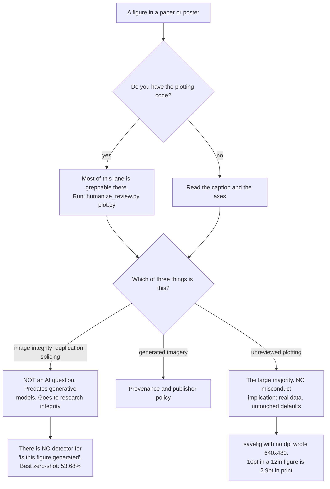

# Scientific figures — checked in the code that drew them

A figure is produced by code, and the render sits on the other side of a step the author never watched. The generator commits to `savefig(...)` without ever seeing that the legend landed on the data, that the tick labels are clipped, that 10pt became 2.9pt in an 89mm column, or that the two series print as the same grey. That is why the honest word here is UNREVIEWED rather than AI-generated — and why most of the lane is greppable in the `.py` or `.R` rather than in the pixels.

**Three things get conflated constantly and are kept apart here.** *Image integrity* (duplication, splicing) is a research-integrity matter with its own literature and process, it predates generative models entirely, and the two items covering it say so in capitals. *Generated imagery* is three items. *Unreviewed plotting* is the other twenty-four, and it carries no misconduct implication at all — the data is real and the defaults were never adjusted.

**The arithmetic that makes this structural.** Effective type size is the declared size times the ratio of printed width to figure width. Nature's single column is 89mm (3.50in) and wants 5-7pt; matplotlib's default 10pt in a `figsize=(12,8)` figure lands at 2.92pt. `savefig.dpi` defaults to `'figure'` and `figure.dpi` to 100, so the default figure is written at 640x480 — below PLOS's stated 789px minimum width outright. Neither is visible in the notebook preview.

**The canonical case, with the usual telling corrected.** The Frontiers rat figure was published on 13 February 2024 and retracted on 16 February, three days later; Midjourney was disclosed by the authors. The widely repeated claim that no reviewer looked is wrong. Frontiers stated that one of the reviewers raised valid concerns about the figures and requested revisions, and that the authors failed to respond. The failure was editorial workflow, not reviewer inattention — which changes the fix.

**There is no detector for “is this figure generated” and this file will not pretend otherwise.** Benchmarked against 72,965 real and 150,807 synthetic figures, the best zero-shot method reached 53.68% and most sat at chance, with the characteristic failure being near-100% on real images and 0-3% on synthetic. Cross-generator transfer collapses to 26.1%, and JPEG compression at q=30 takes the best method from 93.96% to 75.94% — and every figure in a PDF has been compressed.

**Four entries elsewhere in this catalog INVERT here** and have been scoped accordingly: journals want vector and reject PNG/JPEG/TIFF for main figures, they want submitted SVG to retain its editing capability rather than be optimised, and a figure's accessible description is its caption, which is required to be long.

_29 items. Generated from catalog.json — edit there, then re-run `scripts/regenerate_references.py`. Do not hand-edit this file._

_Every item carries a **False positive when** line. Read it before you act on the item: these are cues for an editor, not evidence about an author._

<!-- humanize:ignore-start
     The diagram and index below quote the tells they document, and a
     mermaid label is not a sentence. -->

## When this file applies

## What is in this file

Severity is how loudly the tell announces itself, never how sure you should be about who wrote it. **Automated** means these scripts implement the check; *no* means it is yours to ask in the judge pass.

| item | severity | family | automated |
| --- | --- | --- | --- |
| [`bar-chart-hiding-a-small-continuous-sample`](#bar-chart-hiding-a-small-continuous-sample) | HIGH | shape | **no** |
| [`colour-as-the-only-channel`](#colour-as-the-only-channel) | HIGH | defect | **no** |
| [`colourbar-or-scale-bar-missing`](#colourbar-or-scale-bar-missing) | HIGH | defect | **no** |
| [`duplicated-or-spliced-image-panel`](#duplicated-or-spliced-image-panel) | HIGH | defect | n/a |
| [`error-bars-of-undeclared-type`](#error-bars-of-undeclared-type) | HIGH | defect | yes |
| [`figsize-not-matched-to-the-column-width`](#figsize-not-matched-to-the-column-width) | HIGH | defect | yes |
| [`figure-with-no-provenance-trail`](#figure-with-no-provenance-trail) | HIGH | shape | n/a |
| [`generated-anatomical-or-mechanism-schematic`](#generated-anatomical-or-mechanism-schematic) | HIGH | defect | n/a |
| [`generated-figure-against-the-publisher-policy`](#generated-figure-against-the-publisher-policy) | HIGH | residue | **no** |
| [`no-layout-manager-so-labels-are-clipped`](#no-layout-manager-so-labels-are-clipped) | HIGH | defect | yes |
| [`savefig-at-the-default-dpi`](#savefig-at-the-default-dpi) | HIGH | residue | yes |
| [`significance-stars-with-no-test-named`](#significance-stars-with-no-test-named) | HIGH | defect | yes |
| [`truncated-or-dual-axis-without-a-declaration`](#truncated-or-dual-axis-without-a-declaration) | HIGH | defect | **no** |
| [`axis-label-is-the-dataframe-column-name`](#axis-label-is-the-dataframe-column-name) | med | residue | **no** |
| [`axis-offset-and-exponent-left-on`](#axis-offset-and-exponent-left-on) | med | residue | yes |
| [`caption-that-restates-the-axes`](#caption-that-restates-the-axes) | med | form | n/a |
| [`cropped-blot-without-an-uncropped-source`](#cropped-blot-without-an-uncropped-source) | med | defect | **no** |
| [`default-hue-palette-that-is-one-grey-in-print`](#default-hue-palette-that-is-one-grey-in-print) | med | residue | **no** |
| [`figure-never-referenced-in-the-text`](#figure-never-referenced-in-the-text) | med | defect | **no** |
| [`legend-left-in-the-default-best-position`](#legend-left-in-the-default-best-position) | med | defect | yes |
| [`line-chart-shipped-as-a-raster`](#line-chart-shipped-as-a-raster) | med | shape | **no** |
| [`no-code-or-data-link-for-a-figure`](#no-code-or-data-link-for-a-figure) | med | shape | **no** |
| [`overplotted-scatter-at-full-opacity`](#overplotted-scatter-at-full-opacity) | med | defect | yes |
| [`panel-labels-missing-or-inconsistent`](#panel-labels-missing-or-inconsistent) | med | defect | **no** |
| [`panels-compared-across-different-y-limits`](#panels-compared-across-different-y-limits) | med | defect | **no** |
| [`pie-or-three-d-chart-for-a-quantitative-comparison`](#pie-or-three-d-chart-for-a-quantitative-comparison) | med | shape | yes |
| [`rainbow-or-jet-colormap-on-continuous-data`](#rainbow-or-jet-colormap-on-continuous-data) | med | defect | yes |
| [`sample-size-absent-from-the-figure`](#sample-size-absent-from-the-figure) | med | defect | **no** |
| [`default-font-stack-left-in-the-figure`](#default-font-stack-left-in-the-figure) | low | residue | **no** |

<!-- humanize:ignore-end -->

<!-- humanize:ignore-start
     Everything below is a specimen catalog. It quotes the tells it documents,
     including literal machine residue, so reviewing it with humanize_review.py
     would flag the exhibits rather than the writing. -->

### `bar-chart-hiding-a-small-continuous-sample`  ·  high · generic-llm · scientific-figure · structural · family: shape · lane: scientific-figures

**Automated here:** no — decidable mechanically, but this bundle does not implement it. Ask it yourself in the judge pass.

Continuous measurements from a handful of samples summarised as a bar with an error bar -- the dynamite plot. Many different distributions produce the identical bar, so the reader cannot see bimodality, outliers or whether a paired change is consistent across individuals. Weissgerber and colleagues reviewed 703 original articles in the top 25% of physiology journals (Jan-Mar 2014): 85.6% contained at least one bar graph, 77.6% of those showed mean with SE, only 13.4% of articles used a univariate scatterplot, 5.3% a box plot and 8.0% a histogram. The median minimum group size was n = 3.

**Why it reads AI:** UNREVIEWED and CORPUS-INHERITED. The bar-plus-error-bar is overwhelmingly the most common shape in the biomedical training corpus, so it is what a generator produces by frequency, and it is what a person produces by habit. Neither is an authorship signal. It is in this lane because it is the highest-value figure change available in most papers and because the fix is one function call.

**Detect:** Static: plt.bar / sns.barplot / geom_bar or geom_col paired with an error bar, on a continuous response. The decisive corroborator is also static -- read n out of the data file or the code; at n below about 10 there is no reason not to plot every point.

**Fix:** Plot the data. A univariate scatter or beeswarm with a mean line for small n; a box plot with points overlaid for medium n; a violin or histogram for large n. For paired designs, connect each subject's two points so the reader sees whether the change is consistent.

**False positive when:** Bars are CORRECT for counts, proportions and other genuinely additive quantities measured on a ratio scale from zero -- a bar chart of sequencing read counts is not this finding. Very large n makes individual points unreadable and a summary is the right call. Some journals still require or prefer bars. And note the measured prevalence above is from physiology journals in one quarter of 2014; do not generalise the 85.6% to other fields or to now.

**Before**

> sns.barplot(data=df, x='group', y='response', errorbar='se')

**After**

> sns.stripplot(data=df, x='group', y='response', jitter=True); sns.pointplot(..., estimator='mean')

### `colour-as-the-only-channel`  ·  high · generic-llm · scientific-figure · structural · family: defect · lane: scientific-figures

**Automated here:** no — decidable mechanically, but this bundle does not implement it. Ask it yourself in the judge pass.

Series distinguished by colour and nothing else: no marker shape, no line style, no hatch, no direct label. The figure dies in greyscale print, in a photocopy, on a projector, and for the roughly 8% of men with red-green colour-vision deficiency. A manual and machine-learning analysis of 66,253 eLife images found 12.8% of a manually reviewed sample definitely problematic for deuteranopes; the medical-journal audit put 80% of 138 figures outside WCAG.

**Why it reads AI:** UNREVIEWED. Redundant encoding costs an extra argument per series and buys nothing a generator can see: the colours ARE distinct in the RGB the model is reasoning about. The failure only exists in a colour space the model never enters. Same class as the legend-over-data case: correct in source, wrong in delivery.

**Detect:** Static, from the code: a multi-series plot where colour varies and linestyle, marker and hatch do not; a ggplot mapping only colour or fill to the grouping variable. Also flag red-and-green used as the two poles of anything, and captions that say 'the red line' or 'green indicates'. Rendered to confirm: desaturate and re-read; run a deuteranopia simulation.

**Fix:** Vary two channels, always. Colour plus line style for lines, colour plus marker shape for points, colour plus hatch or plus direct value labels for bars. Then say the series name in the caption rather than the colour: 'the treated group (circles)' not 'the red line'.

**False positive when:** Two series with strong luminance separation (near-black against mid-grey) survive greyscale on colour alone. A heatmap, a micrograph and a photograph have no 'series' to double-encode and this rule does not apply to them. Figures that are colour-blind-safe by palette choice already pass the accessibility test even with a single channel. Journals that publish online only, in colour, at no charge weaken the greyscale argument -- though not the CVD one.

**Before**

> for g in groups: ax.plot(x, y[g], label=g)

**After**

> for g, ls, mk in zip(groups, ['-','--',':'], ['o','s','^']): ax.plot(x, y[g], ls=ls, marker=mk, label=g)

### `colourbar-or-scale-bar-missing`  ·  high · generic-llm · scientific-figure · structural · family: defect · lane: scientific-figures

**Automated here:** no — decidable mechanically, but this bundle does not implement it. Ask it yourself in the judge pass.

A heatmap, field map or image plot with no colourbar, so the colours carry no quantity; or a micrograph with no scale bar, or a scale bar drawn with no length label, or a magnification quoted in the caption instead of a bar -- which is meaningless once the figure has been scaled into a column. Crameri, Shephard and Heron state it flatly: it is imperative to ensure the colour bar is included on all figures.

**Why it reads AI:** UNREVIEWED. The colourbar is a second artist that must be explicitly created; the plot is complete and correct without it, so nothing in the code path forces the question. For micrographs the scale bar usually has to be drawn from the pixel size in the instrument metadata, which a generator writing plotting code does not have -- so the bar is omitted rather than wrong, which is the safer failure but still a failure.

**Detect:** Static: an imshow, pcolormesh, contourf, heatmap or geom_tile call with no colorbar or guide in the same figure; and a micrograph panel with no scale-bar artist and no scale-bar overlay in the assembly script. Also flag a caption containing a magnification ('40x', 'x400') with no bar in the figure. Rendered to confirm for figures you do not have the source for.

**Fix:** Add the colourbar with a labelled unit every time, and share one colourbar across panels that share a scale. Burn a scale bar into every micrograph from the instrument's pixel size, with its length written next to it, and keep it in the image so it survives cropping.

**False positive when:** A shared colourbar placed once for a whole panel grid is correct and will look missing per-axes. Binary masks, categorical maps with a legend rather than a bar, and qualitative images (a representative histology field where nobody reads a value) need no colourbar. Some fields state scale in the caption by convention. And a figure reproduced from elsewhere keeps the original's furniture.

**Before**

> ax.imshow(field, cmap='viridis')

**After**

> im = ax.imshow(field, cmap='viridis'); fig.colorbar(im, ax=ax, label='Velocity (m s-1)')

### `duplicated-or-spliced-image-panel`  ·  high · generic-llm · scientific-figure · assistive · family: defect · lane: scientific-figures

The same blot band, micrograph field, flow plot or histology region appears twice: across panels, across figures, or across papers, sometimes rotated, mirrored, contrast-shifted or overlapping itself within one image. This is a research-integrity matter with its own literature, its own tooling and its own process (COPE, the journal, the institution). It is NOT an AI-authorship question and it long predates generative models. Bik, Casadevall and Fang visually screened 20,621 papers from 40 journals published 1995-2014 and found problematic figures in 3.8%, with at least half showing features suggestive of deliberate manipulation.

**Why it reads AI:** UNREVIEWED, AND EXPLICITLY NOT AN AI TELL. Say this out loud in any report. Duplication predates generative models by decades; the measured 3.8% baseline comes from a 1995-2014 corpus. Nothing about a duplicated panel tells you a model was involved, and a report that implies otherwise is both wrong and defamatory. It is in this catalog for one reason only: people now reach for image-forensics language when they mean 'was this generated', and separating the two questions is the single most useful thing this lane can do.

**Detect:** Assistive to settle: this one is never a lint result. Run the journal's own screening tool or a duplication detector over the figure set, then hand any hit to a human and to the journal, because the difference between an honest assembly error and manipulation is a judgement about intent that no tool makes. Static, and worth doing first because it is cheap: check whether the same source image file is referenced by more than one figure in the build (same path, same hash, same panel-assembly script input). Rendered to confirm: overlay candidate regions and check for identical noise, not merely similar structure.

**Fix:** Do not accuse. Raise it with the corresponding author as a question about panel assembly, and if it is not resolved, with the journal. For your own figures: keep one canonical source file per panel, record its hash in the figure-building script, and never crop-and-paste between figure files.

**False positive when:** Deliberate, declared reuse is normal and correct: a control image legitimately repeated across panels, a representative field shown again at higher magnification, a schematic element reused by design, a figure reproduced from an earlier paper with permission. Serial sections and tiled acquisitions of adjacent fields look similar because they ARE adjacent. Low-complexity images (a blank gel lane, a uniform background) match each other trivially and mean nothing. And a tool's similarity score is not a finding.

**Before**

> fig2b.tif and fig4a.tif are byte-identical crops of the same acquisition

**After**

> each panel built by script from a named, hashed source acquisition, with the mapping recorded

### `error-bars-of-undeclared-type`  ·  high · generic-llm · scientific-figure · structural · family: defect · lane: scientific-figures

**Automated here:** yes, these scripts implement it.

The figure has error bars and nothing says whether they are standard deviation, standard error of the mean, a 95% confidence interval, an interquartile range or a range. They mean entirely different things and, for the same data, SD bars stay put as n grows while SE and CI bars shrink -- so an undeclared bar is uninterpretable. Nature requires figure legends to define error bars and to give exact n. A survey of 441 articles in three cardiovascular journals from 2012 found 64% contained at least one incorrect use of the SEM, and in 81% of those the authors had explicitly said in the Methods that they were using SEM to describe the data.

**Why it reads AI:** UNREVIEWED. The code that draws the bar and the prose that defines it live in different files, and nothing in either one forces the other to exist. A generator writing the plot call has no reason to touch the caption; a generator writing the caption has no access to the estimator argument. The defect is in the join, which is where most figure defects live.

**Detect:** Static, and pleasingly mechanical: the plotting code contains yerr=, errorbar=, geom_errorbar, ci= or capsize=, and the caption text for that figure contains none of s.d., standard deviation, s.e.m., standard error, confidence interval, CI, IQR or range. Flag the pair. The check works on the manuscript source with no image at all.

**Fix:** State it in the legend, every time, with n: 'Mean +/- s.e.m., n = 6 mice per group.' Prefer a confidence interval or the raw points over SEM, because SEM is the smallest of the three and is a statement about the precision of the mean rather than about the spread of the data.

**False positive when:** Some journals define the error-bar convention once in a Methods statistics section rather than per figure, which satisfies the requirement -- search the whole manuscript, not just the legend. Box plots carry their definition in the glyph and need no extra sentence in many fields. A single-sample plot with a shaded prediction band may define the band in the Methods. And an error bar in a purely illustrative schematic is not a statistic.

**Before**

> ax.errorbar(x, m, yerr=s); caption: 'Figure 2. Response over time.'

**After**

> caption: 'Figure 2. ... Points are group means; bars are 95% CI. n = 12 per group.'

### `figsize-not-matched-to-the-column-width`  ·  high · generic-llm · scientific-figure · structural · family: defect · lane: scientific-figures

**Automated here:** yes, these scripts implement it.

The figure is authored at a comfortable on-screen size and then scaled down into the journal column, which scales every piece of type with it. Nature's single column is 89 mm (3.50 in) and its double column 183 mm (7.20 in), with a stated text range of 5 pt minimum to 7 pt maximum. matplotlib's default 10 pt type on a 12-inch-wide figure arrives at 2.9 pt in a single column; on a 10-inch figure, 3.5 pt. PLOS caps figure width at 7.5 in and requires 8-12 pt type, so a 12-inch figure lands at 6.25 pt and fails.

**Why it reads AI:** UNREVIEWED. The mechanism is exact: a generator writes figsize and font size as independent numbers and has no model of the page the figure lands on, because the page is downstream of the render it never sees. The corroborating signature is a round, screen-shaped figsize -- (10, 6), (12, 8), (15, 10) -- which is a monitor aspect ratio, not a column.

**Detect:** Static, from the plotting code alone, and this is the arithmetic that makes the whole lane checkable: effective_pt = declared_pt * (target_column_inches / figsize_width_inches). Flag anything under the target journal's floor. Cheap proxy with no journal knowledge at all: a figsize width above about 7.5 inches on a figure headed for a paper. Rendered to confirm: print the page at 100% and read it.

**Fix:** Author at final size. Set figsize to the column width in inches (3.50 for an 89 mm single column, 7.20 for 183 mm) and never scale the figure in the document. Set font sizes to the sizes you want printed. If the figure will not fit at final size, the figure has too much in it.

**False positive when:** Landscape and full-width figures legitimately use the double-column measure, and some journals allow a full page or a fold-out. Posters and slides have entirely different measures and a 12-inch figsize may be exactly right. Vector output scaled in LaTeX with a matching fontsize adjustment is fine if the arithmetic was actually done. And a figure set in a style file that already pins figsize and font sizes to the journal's measure will look wrong to a naive grep of the plotting call.

**Before**

> fig, ax = plt.subplots(figsize=(12, 8)); ax.set_xlabel('Time', fontsize=14)

**After**

> fig, ax = plt.subplots(figsize=(3.5, 2.6)); ax.set_xlabel('Time (s)', fontsize=7)

### `figure-with-no-provenance-trail`  ·  high · generic-llm · scientific-figure · assistive · family: shape · lane: scientific-figures

A figure that cannot be traced to anything: no data file, no plotting script, no instrument metadata, no acquisition settings, no scale, no version. This is the honest replacement for pixel forensics. If you cannot tell whether a figure was generated, stop trying to tell from the picture and ask for the thing that makes the picture: the CSV and the script, or the raw acquisition and its metadata. A figure that can be regenerated is answered; a figure that cannot is the finding, whatever made it.

**Why it reads AI:** UNREVIEWED, and deliberately framed to avoid authorship claims entirely. The mechanism worth naming is that a chat-window workflow produces figures with no local artefacts at all -- no script in the repo, no data file on disk, nothing to rerun -- so absence of a trail correlates with that workflow. It also correlates with a rushed human, a lost laptop and a lab with no version control, which is exactly why it must be reported as a reproducibility gap and never as an inference about who or what drew the figure.

**Detect:** Static: for each figure, resolve a chain of figure -> script -> data file -> archived location. Flag any figure with no script in the repository, any script reading a path that is not in the deposited data, and any raster panel with no acquisition metadata. Assistive to settle: ask the author to regenerate one panel from the deposited inputs. That request is polite, standard, and decisive.

**Fix:** One script per figure, checked in, reading one deposited data file, emitting one file with a recorded hash. For acquired images, deposit the original with its instrument metadata intact. Then the question never arises again.

**False positive when:** Human-drawn conceptual schematics and study-design diagrams have no data by definition and must not be flagged for it -- the trail for those is the source vector file. Clinical and human-subjects data often cannot be deposited for genuine legal reasons, and a controlled-access statement is a complete answer. Older papers predate the expectation. Proprietary instrument formats sometimes strip metadata on export.

**Before**

> figures/fig3_final_v2_REAL.png, no script, no data, no metadata

**After**

> figures/fig3.py reading data/fig3.csv (deposited, DOI), emitting figures/fig3.pdf

### `generated-anatomical-or-mechanism-schematic`  ·  high · generic-llm · scientific-figure · llm-judge · family: defect · lane: scientific-figures

**Currency:** Fading — still seen, but vendors have patched toward it and it is weakening.

A 'schematic' of anatomy, a signalling pathway or an experimental setup that was produced by an image model rather than drawn: labels that are letter-shaped but not words, structures with no referent, arrows that connect nothing, and proportions that no organism has. The canonical public case is Guo et al., Frontiers in Cell and Developmental Biology, published 13 February 2024 and retracted 16 February 2024: Midjourney was disclosed in the paper, Figure 1 showed a rat with genitalia larger than the rest of the animal, and the labels read 'iollotte sserotgomar', 'dissilced' and 'testtomcels'. A second case followed in Lippincott's Medicine in July 2024: a ChatGPT-generated limb diagram with the wrong number of bones and labels reading 'chlsinkestead atlvs no ctivktty greuedis'.

**Why it reads AI:** Genuinely model-flavoured, and DECAYING FAST -- marked fading for exactly the reason ai-image-waxy-skin-mangled-hands is marked obsolete. Diffusion models rendered text as letter-shaped noise in 2023-24 because they had no character-level text model; that is the defect the rat figure is famous for, and it is the defect current image models have largely fixed. Anyone still leading with 'the labels are gibberish' in 2027 will produce confident wrong answers in both directions. What does NOT decay is the underlying fault, which is that nobody checked the biology, and the durable check is provenance and expert reading rather than pixels.

**Detect:** Rendered to confirm: OCR every string in the figure and check each token against a dictionary plus the paper's own terminology; flag any label that is not a word in any language and not a defined abbreviation. Static, and far more durable: check the manuscript's AI-use statement against the figure inventory, and check whether each schematic has a source file that is an editable vector with named layers rather than a flat raster. Assistive to settle: a domain expert reading the biology, because 'the anatomy is wrong' is the actual finding and no string check reaches it.

**Fix:** Draw it, or commission it, or use a domain illustration tool where every element is a labelled object. If a generator was used for a rough, redraw the final as vector with real type. Disclose the tool and version in the Methods, and have someone who knows the anatomy read the figure before submission -- which in the Frontiers case a reviewer actually did: Frontiers stated that one reviewer raised valid concerns about the figures and requested revisions, the authors did not respond, and the paper published anyway.

**False positive when:** OCR garbles small, rotated, stylised or non-Latin type routinely, so low-confidence OCR is not evidence. Legitimate labels that look like nonsense to a dictionary: gene and protein symbols, strain names, chemical formulae, mathematical symbols, and abbreviations defined only in the legend. Fields with heavy non-English terminology. And a figure that IS about generative models may legitimately contain generated images as its subject matter.

**Before**

> a raster 'schematic' whose labels OCR to 'iollotte sserotgomar' and 'dissilced'

**After**

> a vector schematic with real type, every element named, redrawn by the authors

### `generated-figure-against-the-publisher-policy`  ·  high · generic-llm · scientific-figure · structural · family: residue · lane: scientific-figures

**Automated here:** no — decidable mechanically, but this bundle does not implement it. Ask it yourself in the judge pass.

The paper contains a generated image and the target journal does not allow one, or allows one only with a disclosure the manuscript does not carry. The policies are explicit and differ: Springer Nature states that its journals are unable to permit generative-AI images and video for publication, with narrow exceptions for contractually licensed agency art and for pieces specifically about AI, reviewed case by case; Frontiers permits disclosed use but requires the content to be checked, which is precisely the step the 2024 rat paper skipped. This is a compliance check, not a forensics one.

**Why it reads AI:** Not a tell about the image at all -- it is a tell about the submission. Included because it is the one check in this whole area that is objective, cheap and has no false-accusation cost: you are comparing two documents, not judging pixels. It also reframes the question usefully. The right question is almost never 'was this generated' but 'is the provenance of this figure stated, and does the stated provenance satisfy the venue'.

**Detect:** Static: read the target journal's AI policy, then diff the manuscript's AI-use statement against the figure list. Flag any figure with no stated provenance, any AI disclosure that names a tool the policy prohibits, and any disclosure that appears in the cover letter but not in the Methods or the legend where the policy requires it. Also static: an image file whose metadata or filename names a generator is a disclosure the manuscript did not make.

**Fix:** Write the provenance of every figure down before submission: instrument, software, version, data file, and whether any part was generated. Where the policy prohibits generated imagery, replace it. Where the policy permits it with disclosure, put the disclosure in the Methods AND the legend, and archive the prompt.

**False positive when:** Policies are moving fast and differ by publisher, by journal within a publisher, and by article type -- check the current policy for the actual target venue rather than a summary. Generative tools used as the research METHOD (a model's own output as the result) are normally allowed and sometimes required to be shown. Review, opinion and news pieces often have looser rules than research articles. And an undisclosed generated image in a preprint is not yet a policy breach of anything.

**Before**

> Methods says nothing about figure provenance; Fig. 1 is Gemini_Generated_Image_xxxx.png

**After**

> Methods: 'Fig. 1 was drawn in Inkscape from the coordinates in Supplementary Data 1. No generative tools were used.'

### `no-layout-manager-so-labels-are-clipped`  ·  high · generic-llm · scientific-figure · structural · family: defect · lane: scientific-figures

**Automated here:** yes, these scripts implement it.

Rotated date ticks running off the bottom of the figure, a y-axis label cut in half at the left edge, subplot titles colliding with the axes above them, a colourbar overlapping its neighbour. matplotlib's figure.autolayout and figure.constrained_layout.use both default to False, so nothing reflows to fit; the axes keep their fractional positions and the text goes outside the canvas.

**Why it reads AI:** UNREVIEWED, and the purest case of the code-render gap. Every ingredient is visible in the source and the defect is not: the generator cannot measure a rendered text extent, so it cannot know that the 45-degree date labels it just wrote are now half an inch below the canvas. This is exactly the defect class -- clipped text, overlapping elements, overflow -- that recent visual-feedback training work was built to attack.

**Detect:** Static, and this is the highest-yield single grep in the lane: a figure with rotated tick labels, long category names, a multi-line axis label, more than one subplot, or a colourbar, AND no tight_layout(), no constrained_layout=True, no bbox_inches='tight' on savefig, no subplots_adjust. Rendered to confirm: compute each text artist's window extent and flag any that falls outside the figure bounding box or intersects another.

**Fix:** Turn on constrained layout for the figure, or call tight_layout() before saving, or save with bbox_inches='tight'. Better still, stop rotating tick labels: a horizontal bar chart reads long category names the right way up and needs no rotation at all.

**False positive when:** Deliberate manual placement with subplots_adjust or add_axes is a legitimate and often better alternative to a layout manager, and will look like an omission to a naive grep. Some composite figures are assembled panel-by-panel in a vector editor afterwards, where the layout manager is irrelevant. tight_layout can itself break colourbars and inset axes, so its absence is sometimes deliberate. And short horizontal tick labels never clip.

**Before**

> plt.xticks(rotation=45); plt.savefig('fig.png')

**After**

> fig, ax = plt.subplots(layout='constrained'); ax.barh(names, values)  # no rotation needed

### `savefig-at-the-default-dpi`  ·  high · generic-llm · scientific-figure · structural · family: residue · lane: scientific-figures

**Automated here:** yes, these scripts implement it.

plt.savefig('fig.png') with no dpi argument. matplotlib's savefig.dpi defaults to 'figure' and figure.dpi defaults to 100, so the default 6.4 x 4.8 inch figure lands as a 640 x 480 pixel PNG. Placed at Nature's 89 mm single-column width that is 183 ppi, below every journal's 300 dpi floor, and 640 px is below PLOS's stated minimum figure width of 789 px outright. The file opens fine on screen, which is the trap.

**Why it reads AI:** UNREVIEWED, with a sharp model-shaped edge. Resolution is invisible in the code and invisible on a screen; it only exists at print size, which is the one place a generator never stands. A person who has submitted to a journal before has been bounced by a production system for this and never forgets; a model has no such scar. It is the figure-lane twin of shipping an unoptimised hero image.

**Detect:** Static, and this is the cleanest greppable check in the lane: any savefig or ggsave call with no dpi argument, and no rcParams override of savefig.dpi anywhere in the file. Stronger: compute figsize_width_inches * effective_dpi and flag a pixel width under 789. Rendered to confirm: read the pixel dimensions of the submitted file and divide by the target column width in inches.

**Fix:** Emit vector for anything line-based -- PDF or EPS, which Nature explicitly prefers for main figures and PLOS accepts as EPS -- and reserve raster for panels that are genuinely pixels. Where raster is right, set dpi=300 minimum (600 for line-and-halftone combinations, per Elsevier's 500 dpi combination-art rule) and set it in rcParams once rather than per call.

**False positive when:** A figure destined for a slide, a poster at viewing distance, a web page or a README does not need 300 dpi and 640 px may be correct. Notebooks that display inline and are not the submission artefact. A build step or Makefile that re-exports at higher dpi downstream. And matplotlib's savefig.dpi can be set globally in a matplotlibrc or a style file, so check for that before flagging a bare call.

**Before**

> plt.savefig('fig3.png')

**After**

> plt.savefig('fig3.pdf')  # vector; or savefig('fig3.tif', dpi=600) for combination art

### `significance-stars-with-no-test-named`  ·  high · generic-llm · scientific-figure · structural · family: defect · lane: scientific-figures

**Automated here:** yes, these scripts implement it.

Asterisks and a bracket over two bars, and nowhere a statement of which test produced them, whether it was one- or two-tailed, what was corrected for multiple comparisons, or what the star thresholds mean. The asterisk is doing the work of a number that nobody wrote down. The 2016 ASA statement on p-values warns specifically against mechanical bright-line rules, and says the variants -- 'significantly different', 'p < 0.05', 'nonsignificant' -- should not survive 'whether expressed in words, by asterisks in a table, or in some other way'.

**Why it reads AI:** UNREVIEWED. Same join failure as the error bars: the annotation is drawn in the plotting code and justified in the prose, and neither half knows about the other. The specifically model-shaped version is an asterisk hard-coded as a string in the plot call -- ax.text(1.5, 9, '**') -- rather than computed from a test result, which means the star is not connected to any statistic at all.

**Detect:** Static: annotation text matching one to four asterisks, 'n.s.', 'ns' or 'p <' in the plotting code or the figure text, with no test name (t-test, Mann-Whitney, ANOVA, Wilcoxon, Dunnett, Tukey, chi-squared, permutation) anywhere in that figure's legend, and no multiple-comparison correction named. Also flag a star threshold key that is defined in one legend and not the others.

**Fix:** Name the test, the tails, the correction and the exact n in the legend, and prefer reporting the effect size with its interval over the star. If you keep stars, compute them from the test result in the same script, never by hand, and define the thresholds in every legend that uses them.

**False positive when:** Many journals define the star convention once in a Methods statistics section, which is sufficient -- search the whole manuscript. Fields with a rigid house convention (three stars is always p < 0.001) treat the key as understood. A figure with stars in a review article reproducing another paper's result inherits that paper's test. And note the ASA's objection is to the bright line itself, which is a broader argument than 'you forgot to name the test' -- do not conflate them.

**Before**

> ax.text(1.5, 9.2, '**')

**After**

> ax.text(1.5, 9.2, f'p = {p:.3g}')  # legend: two-sided Welch t-test, Holm-corrected, n = 8 per group

### `truncated-or-dual-axis-without-a-declaration`  ·  high · generic-llm · scientific-figure · structural · family: defect · lane: scientific-figures

**Automated here:** no — decidable mechanically, but this bundle does not implement it. Ask it yourself in the judge pass.

set_ylim clipping the baseline off a bar chart so a 2% difference fills the panel, or twinx() giving two series independent scales chosen so they appear to track each other. Pandey and colleagues measured the effect of common distortions at CHI 2015: participants shown deceptive visualisations reported interpretations 58.5% to 129.5% larger than controls, and on message-reversal conditions 97.5% of the deceptive group answered in the wrong direction.

**Why it reads AI:** UNREVIEWED. Choosing an axis range is a rhetorical act and a generator has no rhetoric -- it sets limits to make the data fill the panel, which is the default visual objective and, on a bar chart, the deceptive one. The dual axis is worse because it is usually an unprompted flourish: two quantities in different units get twinned because the alternative, two stacked panels sharing an x-axis, requires a layout decision.

**Detect:** Static: a bar or area chart with set_ylim, ylim() or coord_cartesian whose lower bound is not zero; any twinx, secondary_y or sec_axis call; any axis limit set to a literal that is not derived from the data. Then check the caption for a statement of the range and, for dual axes, for a stated reason the two scales are comparable.

**Fix:** Bars start at zero, always; if the interesting variation is small, plot the difference or the ratio instead, which is the honest version of the same emphasis. Lines may be truncated but say the range in the caption. Replace nearly every dual axis with two panels sharing an x-axis.

**False positive when:** Truncation is CORRECT and standard in many settings and the literature is not one-sided: Correll, Bertini and Franconeri push back on a blanket ban. Log axes, physiological ranges (body temperature, blood pH), index series, and any line chart of a quantity with no meaningful zero are all legitimate. A dual axis is right when the two axes are the same quantity in two units (deg C and deg F, counts and percent of total). And a declared truncation with an axis break drawn on it is not this finding.

**Before**

> ax.bar(x, y); ax.set_ylim(0.95, 1.0); ax2 = ax.twinx()

**After**

> two stacked panels sharing x, each starting at its own honest zero, range stated in the legend

### `axis-label-is-the-dataframe-column-name`  ·  medium · generic-llm · scientific-figure · structural · family: residue · lane: scientific-figures

**Automated here:** no — decidable mechanically, but this bundle does not implement it. Ask it yourself in the judge pass.

The axis reads 'temp_c_mean', 'log2FC', 'value' or 'Unnamed: 0' -- an identifier from the data file rather than a label for a reader. Often no set_xlabel call exists at all, because pandas and seaborn label axes from the column name automatically and the label is therefore never authored. The same omission usually takes the units with it, so the reader cannot tell whether the axis is seconds or samples, raw counts or normalised.

**Why it reads AI:** UNREVIEWED, with a genuinely model-shaped component. A generator that receives a DataFrame head and writes plotting code has the column names and nothing else -- no protocol, no instrument, no units -- so it either passes the identifier through or omits the label and lets the library pass it through. It is the figure equivalent of a variable name leaking into a user-facing string.

**Detect:** Static, cheap and high-yield: flag any plot call with no set_xlabel/set_ylabel/labs() and a DataFrame source, and flag any label string matching an identifier shape -- snake_case, camelCase, a trailing _mean or _n, a leading log2 or pct_, or any label with no unit in parentheses on a dimensioned quantity. Rendered to confirm only for figures you do not have the code for.

**Fix:** Write both labels, in words, with units in parentheses: 'Time (s)', 'Tumour volume (mm3)', 'log2 fold change (treated / control)'. If a quantity is dimensionless, say so. The label is read more often than the caption.

**False positive when:** Field-standard identifiers ARE the right label in places: log2FC, Ct, FDR, RPKM, pH, BMI, SNR. Exploratory and supplementary figures often keep column names deliberately so they map to the deposited data, which is a feature. Dimensionless axes correctly have no unit. Some fields put units in the caption rather than the axis by convention. And a column name that is already a sentence is fine.

**Before**

> sns.scatterplot(data=df, x='temp_c_mean', y='resp_rate')

**After**

> ax.set_xlabel('Mean temperature (deg C)'); ax.set_ylabel('Respiration rate (nmol O2 min-1 mg-1)')

### `axis-offset-and-exponent-left-on`  ·  medium · generic-llm · scientific-figure · structural · family: residue · lane: scientific-figures

**Automated here:** yes, these scripts implement it.

A small '1e6' or '+1.9995e3' floating at the corner of the axis, or tick labels reading 0.0, 0.5, 1.0 with the real magnitude hidden in that corner string. matplotlib's axes.formatter.useoffset defaults to True and axes.formatter.limits to -5, 6, so a common offset is silently factored out and scientific notation kicks in above a million. The corner string is easy to miss, frequently clipped by a tight crop, and lost entirely if the figure is cropped into a slide.

**Why it reads AI:** UNREVIEWED, and the clearest piece of literal tool residue in the lane -- the figure equivalent of a leftover placeholder. It is generated by a library default that no author chose, it is invisible in the code, and it is a one-line fix. Its presence tells you nobody looked at the rendered axis, which is the whole thesis of this lane in a single string.

**Detect:** Static: data whose magnitude exceeds 1e6 or falls below 1e-5, or whose range is small relative to its offset, with no ticklabel_format(useOffset=False), no ScalarFormatter configuration and no FuncFormatter. Rendered to confirm: OCR the axis corners and flag a standalone token matching a scientific-notation or offset pattern.

**Fix:** Turn the offset off and put the magnitude in the axis label where it cannot be cropped away: 'Signal (counts, millions)' or 'Time since onset (ms)'. Or rescale the data before plotting, which is usually cleanest.

**False positive when:** Scientific notation is CORRECT and expected in fields that work in extreme magnitudes, and a physicist reading a 1e-9 axis is not confused by it. A clearly placed, unclipped exponent on a log axis is standard. Some journals prefer the exponent on the axis to keep tick labels short. And an offset is genuinely useful when the variation is tiny relative to a large baseline -- provided the baseline is legible.

**Before**

> ax.plot(t, counts)  # y ticks read 0.0 0.5 1.0 with '1e7' in the corner

**After**

> ax.plot(t, counts / 1e6); ax.set_ylabel('Counts (millions)'); ax.ticklabel_format(useOffset=False)

### `caption-that-restates-the-axes`  ·  medium · generic-llm · scientific-figure · llm-judge · family: form · lane: scientific-figures

'Figure 3. Bar chart showing expression level by treatment group.' The caption describes the picture rather than reporting what the picture shows. A reader who cannot see the figure learns nothing, and a reader who can see it learns nothing new, because they already read the axes. The caption's job is a declarative finding plus everything needed to interpret it: what each panel is, what the error bars are, what test, what n, what every symbol and abbreviation means.

**Why it reads AI:** PARTLY MODEL-FLAVOURED, and this one has a real mechanism. A model writing a caption from a figure image can see the axes and the marks and CANNOT see the result -- the result lives in the analysis, not the picture -- so describing the picture is the only thing available to it. The signature is a caption that is fluent, complete, grammatical and contains no claim. That is different from a terse human caption, which is usually short precisely because the claim is in the text.

**Detect:** Assistive to settle, with a cheap structural pre-filter. Static: a caption whose content words are a subset of the axis labels, legend entries and panel titles, plus an opening that matches 'Figure N. (Bar|Line|Scatter|Box) (chart|plot|graph) (showing|of|depicting)'; and a caption under about 15 words on a multi-panel figure. Assistive to settle: does the caption contain a claim that could be true or false?

**Fix:** Open with the finding as a sentence: 'Treatment reduced tumour volume by 38% relative to vehicle.' Then the panel descriptions, then the statistics (test, tails, correction, n), then the abbreviations. Read the caption without the figure and check it still says something.

**False positive when:** Some journals cap caption length hard, or require the finding to live in the text and the caption to be purely descriptive -- Cell-style and Nature-style captions differ considerably here. Supplementary and quality-control figures legitimately have descriptive captions. Schematics and workflow diagrams have no finding to state. And a short caption written by an expert who put the claim in the results section is correct practice, not laziness.

**Before**

> Figure 3. Bar chart showing expression level by treatment group.

**After**

> Figure 3. Treatment reduced expression by 38% (95% CI 22-51%). Bars, group means; points, individual mice (n = 6 per group); two-sided Welch t-test.

### `cropped-blot-without-an-uncropped-source`  ·  medium · generic-llm · scientific-figure · structural · family: defect · lane: scientific-figures

**Automated here:** no — decidable mechanically, but this bundle does not implement it. Ask it yourself in the judge pass.

A western blot, gel or similar shown as tightly cropped bands with no lane markers, no molecular-weight ladder, no visible film or membrane edges, and no uncropped original in the supplement. Most journals now require the uncropped scan; its absence is a completeness failure, not an accusation. The same applies to a flow-cytometry gate shown without its parent population and a micrograph shown without the full field.

**Why it reads AI:** UNREVIEWED, AND NOT AN AI TELL. Over-cropping is a decades-old figure-preparation habit. It belongs in this lane because it is the cheapest thing to ask for and because supplying the uncropped source answers the integrity question directly, without anyone having to run a detector or make a claim about authorship.

**Detect:** Static: check the supplementary manifest for an uncropped source file per blot panel, and check the figure assembly script for a crop whose output has no corresponding archived input. Rendered to confirm: bands with no ladder, no lane labels, and a background that changes abruptly at a panel boundary.

**Fix:** Deposit the uncropped, unadjusted scan for every blot as supplementary material and reference it in the legend. Keep any contrast adjustment linear and applied to the whole image, and say so. Show the ladder.

**False positive when:** Some journals and some fields do not require uncropped sources, and some older papers predate the requirement. Space-constrained formats legitimately crop. Imaging modalities that have no meaningful 'uncropped' state (a synthetic composite, a rendered structure, a schematic) are not this finding. And a missing supplement is often an upload failure, not a decision.

**Before**

> four 20-pixel-tall band crops on a white background, no ladder, no supplement

**After**

> the same panels plus Supplementary Fig. S7 carrying the full uncropped membranes with ladders

### `default-hue-palette-that-is-one-grey-in-print`  ·  medium · generic-llm · scientific-figure · structural · family: residue · lane: scientific-figures

**Automated here:** no — decidable mechanically, but this bundle does not implement it. Ask it yourself in the judge pass.

ggplot2's default discrete colour and fill scale is scale_colour_hue, which spaces hues evenly at constant chroma 100 and constant luminance 65. Because luminance is constant by construction, every series prints as the same shade of grey, and the palette is not designed to be colour-vision-deficiency safe. matplotlib's tab10 default cycle is better but still pairs colours of similar lightness. Red-green deficiency affects about 8% of men and 0.5% of women.

**Why it reads AI:** UNREVIEWED and TOOL-DEFAULTED. Nobody chose constant luminance; it is the library's construction. The measured consequence is large: an analysis of 138 figures from nine leading medical journals found 107 (80%) failed WCAG colour-contrast and labelling requirements, with 215 of 395 sub-figures (55%) judged completely inaccessible to protan or deutan readers.

**Detect:** Static: a ggplot with a discrete colour or fill aesthetic and no scale_colour_manual, scale_colour_viridis, scale_colour_brewer or scale_colour_okabeito; or matplotlib series relying on the default prop_cycle. Rendered to confirm, and worth doing because it settles the argument: convert the figure to greyscale and try to read it, then run a deuteranopia simulation and try again.

**Fix:** Choose a palette with real luminance separation -- Okabe-Ito for categories, viridis or a scientific colour map for continuous -- and set it once in a shared theme. Then check in greyscale, which is the cheapest proxy for every colour problem at once.

**False positive when:** Two or three series with adequate luminance separation are fine whatever produced them, so measure the separation rather than counting the scale calls. Figures that also encode with linetype, marker shape or direct labels are already redundant and the colour scale matters much less. Brand or field-mandated colours (a standard atlas palette, a required taxonomy colour key) may not be negotiable. And a theme set globally will not show up in the plot call.

**Before**

> ggplot(df, aes(x, y, colour = group)) + geom_line()

**After**

> ggplot(df, aes(x, y, colour = group, linetype = group)) + geom_line() + scale_colour_okabeito()

### `figure-never-referenced-in-the-text`  ·  medium · generic-llm · scientific-figure · structural · family: defect · lane: scientific-figures

**Automated here:** no — decidable mechanically, but this bundle does not implement it. Ask it yourself in the judge pass.

The manuscript contains Figure 4 and no sentence anywhere calls it out, or calls out figures out of order, or refers to a panel letter that the figure does not have. Journals require every figure to be cited in the text in numerical order -- AIAA, Science, Springer Nature and Cambridge journals all state it -- and production systems flag uncited figures automatically, so this bounces at copyediting.

**Why it reads AI:** UNREVIEWED. Figure and text are assembled separately, and an uncited figure is the fingerprint of a figure that was made before the argument that needed it, or of text rewritten after the figures were fixed. It is also what happens when a figure is produced in one session and the prose in another, which is a very common shape for assisted writing -- but it is equally what happens to any paper with four co-authors and a deadline.

**Detect:** Static, and completely deterministic: extract every figure number from the figure environments or the figure file list, extract every in-text reference matching Fig(ure)?\.? ?N or a LaTeX ref to a figure label, and diff the two sets in both directions. Do the same for panel letters: every (a), (b) referenced must exist in that figure, and every panel in the figure should be referenced.

**Fix:** Cite every figure at the point in the argument where the reader needs it, in order, and cite panels individually. If a figure has no natural place in the argument, it belongs in the supplement or nowhere.

**False positive when:** Reference-manager macros, cleveref, subfigure packages and non-English figure words ('Abb.', 'Rys.') all defeat a naive regex, so verify a miss before reporting it. Graphical abstracts, cover art and some supplementary figures are legitimately uncited. Tables numbered in the same sequence confuse the diff. And a figure cited only in the caption of another figure is cited.

**Before**

> Figures 1-5 exist; the text mentions Fig. 1, Fig. 2, Fig. 5

**After**

> every figure cited once at first use, in order, with panel-level references

### `legend-left-in-the-default-best-position`  ·  medium · generic-llm · scientific-figure · rendered · family: defect · lane: scientific-figures

**Automated here:** yes, these scripts implement it.

legend.loc defaults to 'best', which picks a corner by testing candidate positions against the artists present in that Axes at draw time. It therefore lands somewhere different in every panel of a multi-panel figure, and it will happily sit on top of anything it does not model: annotations, inset axes, twinned axes, images, and any artist added after the legend. On a dense scatter it covers data it has not counted.

**Why it reads AI:** UNREVIEWED, and the single clearest illustration of this lane's mechanism. The placement is computed at draw time, so the code is correct, the call is idiomatic, and the result is a legend on the data. There is no way to know from the source. Recent work on code-generated visual artefacts names this failure explicitly: the model 'must commit to code before seeing the render, so syntactically valid programs often produce visibly flawed artifacts: legends overlap data, text is clipped at frame boundaries, elements collide'.

**Detect:** Static pre-filter: a legend() call with no loc argument, especially where the same figure has more than one Axes. Rendered to confirm, because this one genuinely needs the image: rasterise the panel, compute the fraction of data-bearing pixels inside the legend bounding box, and flag any overlap above zero on a publication figure; also flag legends whose position differs between panels of one figure.

**Fix:** Set loc explicitly and identically across panels, or move the legend outside the axes with bbox_to_anchor, or drop the legend entirely and label the series directly at the end of each line, which is usually better and always smaller.

**False positive when:** On a sparse plot with a genuinely empty corner, 'best' finds it and the result is correct. Single-panel figures have no consistency problem. Interactive and web charts reflow anyway. And a legend overlapping a region with no data in it is not a finding, so measure overlap with the data, not with the axes.

**Before**

> ax.legend()

**After**

> ax.legend(loc='upper left', bbox_to_anchor=(1.02, 1), frameon=False)  # same in every panel

### `line-chart-shipped-as-a-raster`  ·  medium · generic-llm · scientific-figure · structural · family: shape · lane: scientific-figures

**Automated here:** no — decidable mechanically, but this bundle does not implement it. Ask it yourself in the judge pass.

A chart made entirely of lines, text and flat fills -- which has a lossless vector representation -- delivered as a PNG or JPEG. The type is pixels, so it cannot be searched, selected, re-set at the production stage, or scaled, and it is the first thing to go soft in print. Nature asks for .ai, .eps or .pdf for main figures, explicitly rejecting .jpeg, .tiff and .png, and asks authors not to outline text; PLOS accepts TIFF or EPS.

**Why it reads AI:** UNREVIEWED, and partly an artefact of where the figure was made: a chat window or a notebook renders PNG because PNG is what a display surface shows, so the PNG is the only artefact that ever existed. A generator has no reason to write a different extension because both extensions are equally valid to it. The format question only exists at the production stage, which it never reaches.

**Detect:** Static, from the code: savefig or ggsave to .png or .jpg for a figure built only from plot, bar, line, errorbar, text and fill calls -- that is, with no imshow, no micrograph and no photograph. Static, from the artefact: run pdffonts on the figure and flag a chart with no embedded fonts, or pdfimages and flag a page that is a single full-bleed image.

**Fix:** Save PDF or EPS for anything line-based, keep text as text, and let the mixed case be mixed -- a vector figure with rasterized=True on just the dense data layer keeps the labels and axes crisp while keeping the file small. Reserve full raster for panels that really are pixels.

**False positive when:** Micrographs, photographs, heatmaps with very many cells, rendered volumes and anything acquired as pixels SHOULD be raster, and forcing them to vector is worse. Some journals and many preprint servers accept or require raster. A 300+ dpi TIFF is a perfectly acceptable submission format at many publishers. And note this lane's rule is the opposite of the web lane's: journals generally do not accept WebP or AVIF at all, so 'no modern image format' is correct here.

**Before**

> plt.savefig('figure4.png')  # a four-panel line-and-bar figure

**After**

> plt.savefig('figure4.pdf')  # vector; dense scatter layer set rasterized=True

### `no-code-or-data-link-for-a-figure`  ·  medium · generic-llm · scientific-figure · structural · family: shape · lane: scientific-figures

**Automated here:** no — decidable mechanically, but this bundle does not implement it. Ask it yourself in the judge pass.

The paper has a data-availability statement and no deposited data, or a repository link that contains the analysis but not the plotting scripts, or a figure whose numbers cannot be recovered from anything the reader can reach. The base rate for the statement being honoured is bad: Gabelica, Bojcic and Puljak found that of 1,792 manuscripts whose data-availability statement said the authors were willing to share, 1,670 (93%) either did not respond or declined, and only 122 (6.8%) actually provided the data.

**Why it reads AI:** UNREVIEWED, AND NOT AN AI TELL -- say so. The 93% number above is from 2022 and measures the whole literature's behaviour, not any subset's. It belongs in this lane for one reason: a working code-and-data link makes every other item here checkable by anyone, and its absence is the reason most of them are not. Report it as a reproducibility finding and never as evidence about who made the figure.

**Detect:** Static: resolve every link in the data- and code-availability statements and flag dead ones, private repositories and 'available on reasonable request'. Then check the repository actually contains a script per figure, not only the analysis. Cheapest version: does the repo have a figures/ directory whose outputs match the manuscript's figure list?

**Fix:** Deposit the data and the figure scripts together, in an archive with a DOI, and cite that DOI in each relevant legend. 'Available on reasonable request' should be treated as no statement at all.

**False positive when:** Human-subjects, clinical, commercially confidential and legally restricted data genuinely cannot be deposited, and a controlled-access statement naming the committee is a complete and correct answer. Some journals do not require code. Older papers predate the norm. Very large datasets legitimately live behind a request process. And a link that is embargoed until publication will read as dead during review.

**Before**

> Data availability: data are available from the corresponding author on reasonable request.

**After**

> Data availability: data and figure scripts at https://doi.org/10.5281/zenodo.XXXXXXX (figures/fig3.py -> Fig. 3).

### `overplotted-scatter-at-full-opacity`  ·  medium · generic-llm · scientific-figure · structural · family: defect · lane: scientific-figures

**Automated here:** yes, these scripts implement it.

Tens of thousands of points drawn as opaque markers at matplotlib's default markersize 6, so the plot is a solid slab and the only structure visible is its outline. The density -- the actual finding in most large scatter plots -- is destroyed, later points hide earlier ones so the plotting order silently determines what the reader sees, and the vector file carries one path per point and becomes unopenable.

**Why it reads AI:** UNREVIEWED. Occlusion is a property of the render, not of the call: the model emits a correct scatter and has no way to know whether it drew 200 points or 200,000, because the row count is in the data and the overlap is in the pixels. A person plots it once, sees a blob, and reaches for alpha.

**Detect:** Static, from the code and the data shape together: a scatter call whose input length exceeds a few thousand with no alpha, no rasterized=True, and no density alternative (hexbin, hist2d, kdeplot, datashader). The vector-file symptom is static too: a PDF over a few megabytes for one panel, or a page that takes seconds to render.

**Fix:** Above a few thousand points, switch encoding rather than tweaking it: hexbin or a 2D histogram with a colourbar, or a contour of the density with a sample of raw points on top. If you keep markers, set alpha and a smaller size, and set rasterized=True so the vector file stays sane.

**False positive when:** Genuinely sparse data is fine opaque, and so is a plot whose point is the outline or the extremes rather than the density. Small multiples of small samples. Cases where every point must be individually identifiable (a labelled QC plot, an outlier review). And rasterized=True on a dense scatter inside a vector figure is the correct professional answer and must not be flagged as 'shipped a raster'.

**Before**

> ax.scatter(x, y)  # len(x) == 240_000

**After**

> hb = ax.hexbin(x, y, gridsize=60, mincnt=1); fig.colorbar(hb, label='points per bin')

### `panel-labels-missing-or-inconsistent`  ·  medium · generic-llm · scientific-figure · structural · family: defect · lane: scientific-figures

**Automated here:** no — decidable mechanically, but this bundle does not implement it. Ask it yourself in the judge pass.

A multi-panel figure with no panel letters, or with letters that disagree with the caption -- the figure shows a, b, c and the caption says (A), (B), (C), or the caption describes a panel D that is not there. Also: panel letters in a different face, size or position in each panel, which is what happens when panels are assembled from separately generated files.

**Why it reads AI:** UNREVIEWED, and a direct artefact of assembling a figure from independently produced pieces -- which is precisely what happens when each panel comes out of its own prompt or its own notebook cell. The case mismatch between figure and caption is the cheapest single check in this lane and it fires surprisingly often.

**Detect:** Static: count the Axes the script creates against the panel letters the caption enumerates, and check letter case and bracket style for consistency across all captions in the manuscript. Rendered to confirm: OCR the panel letters and check their positions are consistent relative to each panel's bounding box.

**Fix:** Label panels in the figure-building script, not by hand, with one function that places every letter at the same offset in the same face. Pick one case and bracket style and apply it in every caption.

**False positive when:** Single-panel figures need no letters. Some journals set panel letters themselves at production and ask authors to omit them. Field conventions differ on case and brackets and on whether the letter sits inside or outside the axes. Figures where the panels are spatially self-evident (a map inset, a zoom) sometimes omit letters deliberately.

**Before**

> panels drawn as A B C; caption reads '(a) ... (b) ... (c) ... (d) ...'

**After**

> for ax, lab in zip(axes.flat, 'abcd'): ax.set_title(lab, loc='left', fontweight='bold')  # caption matches

### `panels-compared-across-different-y-limits`  ·  medium · generic-llm · scientific-figure · structural · family: defect · lane: scientific-figures

**Automated here:** no — decidable mechanically, but this bundle does not implement it. Ask it yourself in the judge pass.

A grid of small multiples that invites the reader to compare across panels, where each panel autoscaled to its own data. Every panel looks like it has the same amount of variation because every panel fills its own box, so a tenfold difference between conditions is invisible and a noise-only panel looks like a signal.

**Why it reads AI:** UNREVIEWED. Autoscaling per panel is the library default and it is the RIGHT default for exploration; it is wrong for a published small-multiple whose purpose is comparison. The generator has no way to know which of those two it just made, because the difference is the reader's intent and not anything in the data.

**Detect:** Static: plt.subplots with sharey=False (the default) or facet_wrap with scales='free_y', on panels that share a response variable. The decisive corroborator is also static: compute each panel's y-range from the data and flag a ratio between the largest and smallest above about 2. Rendered to confirm: OCR the tick labels and compare the ranges.

**Fix:** sharey=True, or scales='fixed', whenever panels are meant to be compared. If one panel genuinely needs a different scale, break it out separately and say why, or add an inset at the shared scale so the reader sees the magnitude.

**False positive when:** Free scales are CORRECT when panels show different quantities, different units, or trajectories whose SHAPE is the finding rather than the magnitude. Log axes often solve the problem without shared limits. Panels with genuinely incomparable dynamic ranges are more readable free-scaled with the ranges stated. And a free-scaled facet with the range printed in each panel strip is an honest design.

**Before**

> fig, axes = plt.subplots(2, 3)  # each panel autoscaled

**After**

> fig, axes = plt.subplots(2, 3, sharey=True, sharex=True)

### `pie-or-three-d-chart-for-a-quantitative-comparison`  ·  medium · generic-llm · scientific-figure · structural · family: shape · lane: scientific-figures

**Automated here:** yes, these scripts implement it.

A pie chart, a doughnut, or a bar chart extruded into 3D, used to support a comparison the reader is expected to make by eye. Cleveland and McGill's ranking of elementary perceptual tasks puts position along a common scale most accurate, then length, then angle and slope, then area -- and a pie asks for angle and area, the bottom of the list. Depth extrusion adds occlusion and foreshortening for no encoded information.

**Why it reads AI:** UNREVIEWED and TEMPLATE-INHERITED. The pie is the default 'show a breakdown' shape in the general corpus and in every spreadsheet's chart gallery, so it arrives by frequency. The 3D variant is a spreadsheet default nobody turned off. Neither is a model invention and neither should be reported as one.

**Detect:** Static: plt.pie, ax.pie, geom_bar with coord_polar, Axes3D, plot_surface or bar3d on categorical data, or an Excel 3-D chart type. Also flag any pie with more than about five slices, or with slices whose values are printed as labels -- if the number has to be printed, the geometry was not doing the work.

**Fix:** A bar chart sorted by value, or a dot plot, which puts everything on a common position scale. For parts of a whole across categories, a stacked bar or a slope chart. Reserve the pie for the one case it does well: roughly half versus roughly a quarter, two or three slices, no precision required.

**False positive when:** Pies are fine for two or three parts of a whole where the reader needs an impression, not a measurement, and they are conventional in some settings (budget breakdowns, survey toplines). Be honest about the size of the 3D effect: Siegrist's measured pie error was 2.7% in 2D against 3.2% in 3D, a 0.5-point difference plus a latency cost, so 'catastrophic' overstates it. And genuine 3D data -- a surface, a volume, a structure -- belongs in 3D.

**Before**

> ax.pie(counts, labels=names, autopct='%1.1f%%')

**After**

> ax.barh(names_sorted, counts_sorted); ax.set_xlabel('Share of samples (%)')

### `rainbow-or-jet-colormap-on-continuous-data`  ·  medium · generic-llm · scientific-figure · structural · family: defect · lane: scientific-figures

**Automated here:** yes, these scripts implement it.

cmap='jet', 'rainbow', 'hsv' or a home-rolled rainbow on a continuous field. The map is not perceptually uniform, so equal steps in the data are not equal steps in perceived colour: it manufactures sharp edges at the yellow and cyan bands and flattens real structure in the green. Crameri, Shephard and Heron measured the consequence: a reader's colour-driven interpretation can diverge from the objective representation by more than seven percent of the displayed data variation. It also pairs red with green and carries no monotonic lightness ramp, so it fails in greyscale.

**Why it reads AI:** UNREVIEWED and CORPUS-INHERITED rather than model-invented. jet was MATLAB's default for two decades and is therefore everywhere in the training corpus, so a generator reproduces it from frequency. Note the inverse is also true and worth saying plainly: matplotlib's own default has been viridis since 2.0, chosen for perceptual uniformity, monotonic luminance and greyscale readability, so an untouched matplotlib heatmap is actually FINE and must not be flagged.

**Detect:** Static, trivially greppable: cmap= or palette= naming jet, rainbow, hsv, gist_rainbow, nipy_spectral, or the MATLAB-era default. Also flag any continuous map built by hand from a hue sweep. Rendered to confirm for figures without code: sample the colourbar and check whether lightness is monotonic along it.

**Fix:** viridis, magma or cividis for sequential data; a proper diverging map centred on the meaningful zero for diverging data; a scientific colour map where perceptual uniformity carries the reading. And include the colour bar -- Crameri et al. call that imperative on all figures.

**False positive when:** The anti-rainbow position is not unanimous: Ware, Stone and Szafir argue rainbow maps have underappreciated advantages for reading precise values and for surfacing fine structure, so 'rainbow' alone is not a defect. Some fields have a mandated rainbow convention that readers are trained on -- meteorology, some medical imaging, seismic sections -- and breaking it costs more than it saves. Reproductions of historical figures must keep the original map. And a rainbow used as a CATEGORICAL key, not a continuous ramp, is a different question.

**Before**

> ax.imshow(field, cmap='jet')

**After**

> im = ax.imshow(field, cmap='viridis'); fig.colorbar(im, label='Temperature (K)')

### `sample-size-absent-from-the-figure`  ·  medium · generic-llm · scientific-figure · structural · family: defect · lane: scientific-figures

**Automated here:** no — decidable mechanically, but this bundle does not implement it. Ask it yourself in the judge pass.

No n anywhere on or under the figure, and no statement of what n counts -- animals, cells, wells, technical replicates, independent experiments. Without it the error bar, the star and the box plot are all unreadable, and the reader cannot tell a biological replicate from the same sample measured three times. Nature asks for exact n values, reported individually rather than as a range if n varied between experiments, and for a clear definition of what n is.

**Why it reads AI:** UNREVIEWED. n lives in the data, the legend lives in the manuscript, and the plotting code touches neither in a way that forces the other. A generator writing a caption from a figure image has no access to n at all, so it writes around it -- which is why the caption often describes the chart instead.

**Detect:** Static: the figure legend contains no 'n =' and no explicit count, while the plotting code aggregates (groupby, mean, errorbar, boxplot). Stronger and still static: read n straight out of the data the script loads and check it against the legend, which also catches an n that is stated and wrong. Flag separately any legend that says n without saying n of what.

**Fix:** Compute n in the plotting script and interpolate it into the legend text so it cannot drift, and say what it counts: 'n = 6 mice per group, one cell per mouse, three independent experiments.'

**False positive when:** n may legitimately live in a Methods table, a CONSORT diagram or a supplementary table rather than the legend -- check the whole manuscript. Figures showing a single representative trace or image have no n to report in the usual sense, though they should say 'representative of N experiments'. Simulations, schematics and theory figures have no sample. Some fields report N in the axis tick labels instead.

**Before**

> caption: 'Figure 3. Treatment increases response.'

**After**

> caption: 'Figure 3. ... n = 6 mice per group; each point is one mouse; three independent litters.'

### `default-font-stack-left-in-the-figure`  ·  low · generic-llm · scientific-figure · structural · family: residue · lane: scientific-figures

**Automated here:** no — decidable mechanically, but this bundle does not implement it. Ask it yourself in the judge pass.

The figure is set in the plotting library's fallback face rather than the one the journal asks for. matplotlib's font.sans-serif list starts with DejaVu Sans and it is the bundled fallback, so an untouched figure ships in DejaVu. Nature asks for Arial or Helvetica; PLOS permits only Arial, Times or Symbol. The secondary cost is that the figure's type does not match the paper's, so every figure reads as pasted in.

**Why it reads AI:** UNREVIEWED and TOOL-DEFAULTED rather than model-shaped. Nobody chooses DejaVu Sans; it is what you get. Its only real interest is as a corroborating signal: a figure in DejaVu at 640 px with a tab10 colour cycle and an axis label that is a column name is four untouched defaults in one artefact, and the compound is a much better signal than any single member of it.

**Detect:** Static: no font.family or font.sans-serif setting anywhere in the plotting code or style file. Static on the artefact, and better: pdffonts fig.pdf and look for DejaVuSans, or for no embedded font at all, which means the type was outlined or rasterised.

**Fix:** Set the family once in a style file shared by every figure in the paper, to the journal's permitted face, and match the paper's own type where the journal allows it. Embed fonts on export; do not outline text, which Nature explicitly asks authors not to do.

**False positive when:** Many journals do not specify a face at all and DejaVu is perfectly legible. Preprints, theses and internal reports have no such rule. Fields that set figure text in LaTeX via pgf or usetex will show Computer Modern by design and that is correct. And an outlined-text export with no embedded font is sometimes a deliberate fix for a production system that mangles fonts.

**Before**

> # no font settings anywhere; pdffonts reports DejaVuSans

**After**

> plt.style.use('paper.mplstyle')  # font.family: sans-serif / font.sans-serif: Arial

<!-- humanize:ignore-end -->
