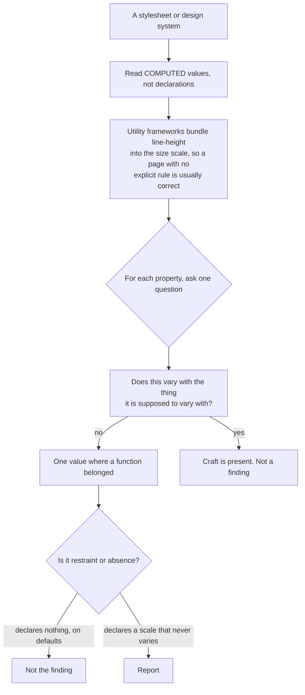

# Typographic craft and design-system structure

**The governing mechanism, and the thing to say when you report any item here.** A generator emits a stylesheet that is internally consistent and has no craft in it. Craft in typography is almost entirely per-context judgement — this heading at this size on this measure needs 1.05 leading and slightly negative tracking, and the one three sections down does not. A default is by construction context-free.

So the tell is never a WRONG VALUE. Any individual number in this file is defensible somewhere. The tell is **one value where there should have been a function of context**, and every static check here is a variant of the same computation: does this property vary with the thing it is supposed to vary with? Leading varies with size and measure, tracking with size, weight with role, contrast with theme, and colour with surface.

That framing matters for how you say it. You are not telling an author their 1.6 line-height is wrong; you are telling them that a 64px headline and 16px body copy cannot both want it.

**Two cautions that will otherwise generate noise.** Read COMPUTED values, not declaration counts — utility frameworks bundle a tightening line-height into their size scale, so a page with no explicit `line-height` anywhere is usually correct and flagging it is the error. And restraint is not absence: a deliberately single-weight, single-ratio system is a real tradition and a good one, so the tell is one value PLUS no other axis carrying the hierarchy, never a low count on its own.

The last section is the cause behind most of the rest. `value-named-tokens-no-semantic-layer` and `semantic-layer-bypassed` are where the colour and scale findings come from: a primitive ramp looks maximally systematic and encodes zero decisions, and a semantic layer that exists but is never used is one of the highest-precision structural tells available — because a person who bothered to write the token file would have used it.

_38 items. Generated from catalog.json — edit there, then re-run `scripts/regenerate_references.py`. Do not hand-edit this file._

_Every item carries a **False positive when** line. Read it before you act on the item: these are cues for an editor, not evidence about an author._

<!-- humanize:ignore-start
     The diagram and index below quote the tells they document, and a
     mermaid label is not a sentence. -->

## When this file applies

## What is in this file

Severity is how loudly the tell announces itself, never how sure you should be about who wrote it. **Automated** means these scripts implement the check; *no* means it is yours to ask in the judge pass.

| item | severity | family | automated |
| --- | --- | --- | --- |
| [`dark-mode-by-inversion`](#dark-mode-by-inversion) | HIGH | defect | yes |
| [`faux-bold-from-missing-weight`](#faux-bold-from-missing-weight) | HIGH | defect | yes |
| [`fluid-type-without-rem-component`](#fluid-type-without-rem-component) | HIGH | defect | **no** |
| [`gap-flattens-type-relationships`](#gap-flattens-type-relationships) | HIGH | defect | **no** |
| [`global-line-height-never-scaled`](#global-line-height-never-scaled) | HIGH | defect | yes |
| [`heading-space-symmetric`](#heading-space-symmetric) | HIGH | defect | yes |
| [`no-balance-on-headings`](#no-balance-on-headings) | HIGH | defect | yes |
| [`one-value-where-a-function-belonged`](#one-value-where-a-function-belonged) | HIGH | shape | **no** |
| [`opacity-as-text-hierarchy`](#opacity-as-text-hierarchy) | HIGH | defect | yes |
| [`proportional-figures-in-data-tables`](#proportional-figures-in-data-tables) | HIGH | defect | yes |
| [`root-font-size-locked-in-px`](#root-font-size-locked-in-px) | HIGH | defect | yes |
| [`semantic-layer-bypassed`](#semantic-layer-bypassed) | HIGH | residue | yes |
| [`theme-changes-hue-not-contrast`](#theme-changes-hue-not-contrast) | HIGH | defect | **no** |
| [`type-scale-with-no-ratio`](#type-scale-with-no-ratio) | HIGH | shape | yes |
| [`value-named-tokens-no-semantic-layer`](#value-named-tokens-no-semantic-layer) | HIGH | shape | **no** |
| [`apostrophe-and-prime-errors`](#apostrophe-and-prime-errors) | med | residue | **no** |
| [`body-copy-in-brand-colour`](#body-copy-in-brand-colour) | med | shape | **no** |
| [`display-type-untracked`](#display-type-untracked) | med | defect | **no** |
| [`heading-margin-collapse-swallowed`](#heading-margin-collapse-swallowed) | med | defect | **no** |
| [`hyphen-where-dash-belongs`](#hyphen-where-dash-belongs) | med | form | **no** |
| [`leading-ignores-measure`](#leading-ignores-measure) | med | defect | **no** |
| [`line-height-in-fixed-units`](#line-height-in-fixed-units) | med | defect | yes |
| [`live-numbers-without-tabular-nums`](#live-numbers-without-tabular-nums) | med | defect | yes |
| [`no-hyphenation-at-narrow-measure`](#no-hyphenation-at-narrow-measure) | med | defect | **no** |
| [`numeric-columns-left-aligned`](#numeric-columns-left-aligned) | med | defect | **no** |
| [`off-scale-one-off-sizes`](#off-scale-one-off-sizes) | med | residue | yes |
| [`opsz-axis-unused`](#opsz-axis-unused) | med | defect | yes |
| [`pure-black-on-pure-white`](#pure-black-on-pure-white) | med | shape | yes |
| [`spacing-scale-without-ratio`](#spacing-scale-without-ratio) | med | shape | **no** |
| [`text-colour-proliferation`](#text-colour-proliferation) | med | shape | yes |
| [`token-set-copied-never-pruned`](#token-set-copied-never-pruned) | med | shape | **no** |
| [`two-weights-five-jobs`](#two-weights-five-jobs) | med | shape | yes |
| [`type-scale-step-inflation`](#type-scale-step-inflation) | med | shape | yes |
| [`variant-explosion-in-components`](#variant-explosion-in-components) | med | shape | **no** |
| [`hanging-punctuation-absent`](#hanging-punctuation-absent) | low | shape | **no** |
| [`no-pretty-on-body-copy`](#no-pretty-on-body-copy) | low | defect | **no** |
| [`opentype-features-never-enabled`](#opentype-features-never-enabled) | low | shape | **no** |
| [`paragraph-separation-signal-doubled-or-absent`](#paragraph-separation-signal-doubled-or-absent) | low | shape | **no** |

<!-- humanize:ignore-end -->

<!-- humanize:ignore-start
     Everything below is a specimen catalog. It quotes the tells it documents,
     including literal machine residue, so reviewing it with humanize_review.py
     would flag the exhibits rather than the writing. -->

### `dark-mode-by-inversion`  ·  high · generic-llm · color · structural · family: defect · lane: typographic-craft

**Automated here:** yes, these scripts implement it.

Dark mode produced by FLIPPING the light mode rather than by deciding it — an invert filter, or a token map that swaps every light value for its mirror in the ramp. Photographs go negative, shadows stop expressing elevation, saturated hues vibrate, and the brand colour that was readable on white is unreadable on near-black.

**Why it reads AI:** Inversion is an ALGORITHM, which is precisely what a generator can do and a designer cannot accept. Dark mode is a second design, not a transform of the first: elevation reverses — in dark mode raised surfaces get LIGHTER, they do not get a bigger shadow — saturated colours must be desaturated and lightened, and pure black is avoided specifically because shadows become invisible against it.

**Detect:** An invert filter applied to a page or theme. Or a dark token map that is a positional mirror of the light one, with lightness changing and chroma untouched. Also flag a missing color-scheme declaration, which is a distinct standalone finding.

**Fix:** Re-decide the semantic layer for the dark theme, keeping the roles and changing the values.

**False positive when:** Reader-mode and browser-extension dark modes, which are allowed to be crude. Documentation sites with no photography, where inversion is a defensible shortcut and the author said so. Pure-greyscale brands, where a mirrored ramp IS the re-decided palette — check whether chroma changes, not just lightness. Prototypes.

**Before**

> html.dark { filter: invert(1) }

**After**

> a dark token map with its own lightness AND chroma decisions, and color-scheme declared

### `faux-bold-from-missing-weight`  ·  high · generic-llm · typography · structural · family: defect · lane: typographic-craft

**Automated here:** yes, these scripts implement it.

A bold weight used where only a regular face was loaded, or italic with no italic file. The browser silently smears the regular weight wider and shears the upright glyphs to fake a slant — letterfit widens, counters fill in, and the type looks blurry without anyone being able to say why.

**Why it reads AI:** The font loader and the stylesheet were produced by different passes and nothing reconciles them. It renders “fine” — that is the whole problem — and it is only visible to someone who knows what the real bold looks like.

**Detect:** Compare the weights the stylesheet USES against the weights the font loading declares. The web-font-URL form is extremely common in generated pages: the import lists 400 and 500 and the CSS uses 600 and 700.

**Fix:** Load the weights you use. Adding font-synthesis: none WITHOUT first loading the missing weights makes the page look worse, so fix the loading first.

**False positive when:** System font stacks, where the OS supplies real weights and no font-face rule exists — the check must skip families with no font-face. Faces genuinely shipped as one weight, where faux bold is an accepted compromise. CJK, where real italics do not exist and synthesis is normal, though turning synthesis off there is the more correct call.

**Before**

> an import listing wght@400;500, with CSS using 600 and 700

**After**

> an import listing every weight the CSS uses, and font-synthesis: none once it does

### `fluid-type-without-rem-component`  ·  high · generic-llm · typography · structural · family: defect · lane: typographic-craft

**Automated here:** no — decidable mechanically, but this bundle does not implement it. Ask it yourself in the judge pass.

Two related defects. No fluid type at all, so the headline jumps at a breakpoint. Or fluid type whose preferred value is pure viewport units, which do not respond to browser zoom.

**Why it reads AI:** The pure-viewport clamp is the most-copied CSS snippet of recent years and it is subtly wrong. It has the SHAPE of the correct answer — min, fluid, max — which is exactly why a generator reproduces it. The rem term that makes it zoomable is the part you only add if you have tested with zoom.

**Detect:** A clamp expression for font-size whose middle term contains a viewport unit and no rem addend. The safe form mixes rem into the preferred value, because the rem term is what zoom acts on. Overlaps type-sized-in-viewport-units in the accessibility lane, which covers the same bytes from the reader's side; this entry is the craft framing.

**Fix:** Always mix rem into the preferred value so zoom has something to act on.

**False positive when:** Fixed-width apps and email. A clamp whose maximum is reached well before the user's zoom ceiling, so 200% is still achievable — verify by testing rather than by regex. Non-text uses of viewport units are outside this check. And a well-built breakpoint scale with enough steps is not a defect, just an older technique.

**Before**

> clamp(2rem, 5vw, 4rem)

**After**

> clamp(2rem, 1.5rem + 2vw, 4rem)

### `gap-flattens-type-relationships`  ·  high · generic-llm · layout · structural · family: defect · lane: typographic-craft

**Automated here:** no — decidable mechanically, but this bundle does not implement it. Ask it yourself in the judge pass.

A vertical flex or grid container with a single gap holding a heading, body copy, a list and a button. One number now expresses four different semantic relationships, all of which should differ.

**Why it reads AI:** gap is genuinely the right tool for a card grid — items that are peers, equally spaced. Generated layout reaches for it for EVERYTHING because it is one declaration and never needs a last-child reset. But heading-to-paragraph, paragraph-to-paragraph and paragraph-to-CTA are three different relationships with three different correct distances, and gap can only say one thing. It produces the symmetric-heading defect by a different route, which is why you check both.

**Detect:** A column flex or grid container with one gap whose children include a heading, a paragraph and an interactive control. Tailwind form: space-y-N on a wrapper containing a heading and prose.

**Fix:** Use gap between peers and margins between unlike things. Or keep the container and re-express the relationships on the children.

**False positive when:** Grids and rows of true peers — card grids, tag lists, toolbars, nav items — where uniform gap is correct and margins would be the error. Two-element micro-stacks, where one gap is one relationship. Dense data UI where uniform rhythm is the point.

**Before**

> 
<h2/>

<button/>

**After**

> gap for the peer paragraphs; explicit margin-block on the heading and the CTA

### `global-line-height-never-scaled`  ·  high · generic-llm · typography · structural · family: defect · lane: typographic-craft

**Automated here:** yes, these scripts implement it.

One line-height set on body or :root and inherited by everything, so a 64px hero headline and 16px body copy share the same ratio. Display type gets body leading and the headline's lines float apart — the reader sees two headlines where there is one.

**Why it reads AI:** Leading is a function of typeface, size AND measure. A generator has one line-height because it made one decision. The mechanism is visible in the render: at 16px, 1.6 is the gap that lets the eye find the next line across a 68-character measure; at 64px with four words per line it is 102px of air between two halves of one sentence.

**Detect:** Strong form: exactly one line-height declaration, on body/:root/*, while an h1 exists at 32px or more with no line-height of its own. General form: compute the ratio for every text-bearing rule, take the median for body sizes (14–20px) and for display sizes (32px and up), and flag when the display ratio failed to tighten by at least 0.25. Target shape: body about 1.5–1.6, h2 about 1.2, display 1.0–1.1.

**Fix:** Tighten with size. The compact correct answer is one calc — :is(h1,h2,h3,h4) { line-height: calc(1em + 0.35rem) } — because absolute leading grows while the ratio shrinks, which is the behaviour the tradition describes and the utility frameworks already implement.

**False positive when:** Utility frameworks bundle a tightening line-height into their size scale, so a page with no explicit line-height anywhere is usually CORRECT — read computed values, not declaration counts. Same for prose plugins. Also all-display pages with single-line headings; CJK, where a uniform ratio nearer 1.7–1.8 is the norm at every size; and terminal UIs that deliberately hold one line box.

**Before**

> body { line-height: 1.6 } · h1 { font-size: 4rem; font-weight: 700 }

**After**

> body { line-height: 1.55 } · h1 { font-size: 4rem; line-height: 1.05; letter-spacing: -0.02em }

### `heading-space-symmetric`  ·  high · generic-llm · typography · structural · family: defect · lane: typographic-craft

**Automated here:** yes, these scripts implement it.

Equal space above and below a heading, so it floats between the section it ends and the section it starts, belonging to neither. The commonest spacing error in generated prose layout.

**Why it reads AI:** Proximity is the only grouping cue prose has. A heading is a LABEL FOR WHAT FOLLOWS IT, so the gap below must be visibly smaller than the gap above; the reader's eye uses that asymmetry to bind heading to body without being told. A generator emits symmetric margins because symmetry is what looks even when you are not reading, and it is what looks wrong the moment you are.

**Detect:** Flag heading rules whose margin-top and margin-bottom are within about 20% of each other, including the shorthand form margin: X 0. The correct shape is visibly more space above than below — roughly 2:1.

**Thresholds** (read by `scripts/humanize_review.py`): `tolerance` = 0.2

**Fix:** Make the space above a heading roughly twice the space below it, and set it on the heading rather than on its neighbours so it travels with the element.

**False positive when:** Standalone headings with no following body — a section label above a grid, a card title above an image — where symmetric or bottom-heavy space is correct. Centred editorial display. Headings inside flex or grid containers where gap carries the spacing, which is a DIFFERENT finding. Prose resets that already ship asymmetric defaults.

**Before**

> h2 { margin: 2rem 0 }

**After**

> h2 { margin-block: 3rem 1rem }

### `no-balance-on-headings`  ·  high · generic-llm · typography · structural · family: defect · lane: typographic-craft

**Automated here:** yes, these scripts implement it.

No text-wrap: balance anywhere, so multi-line headlines break wherever the line box runs out — one word alone on line two, an article separated from its noun — and they break somewhere different at every viewport width.

**Why it reads AI:** A headline is the one piece of type on a page a person always hand-breaks. Generated CSS never touches line breaking, because breaking is a rendered-output concern and the generator only ever produced source.

**Detect:** text-wrap: balance absent from the whole stylesheet while a heading exists at 32px or more. The rendered signature is a giant headline with a single orphaned word beneath it at some widths and not others.

**Fix:** text-wrap: balance on headings. It is one declaration, it degrades to nothing in browsers that lack it, and it is capped at a few lines by design, which is why it belongs on headings rather than paragraphs.

**False positive when:** Single-line headings at every width — balance is a no-op and its absence proves nothing. Headings inside nowrap. Pages that hand-break every headline, which is the STRONGER craft answer and must not be flagged as absence. CJK, where balance behaves differently.

**Before**

> h1, h2 { /* no wrap handling */ }

**After**

> :is(h1,h2,h3) { text-wrap: balance }

### `one-value-where-a-function-belonged`  ·  high · generic-llm · typography · structural · family: shape · lane: typographic-craft

**Automated here:** no — decidable mechanically, but this bundle does not implement it. Ask it yourself in the judge pass.

The governing finding for this lane, and the one to read first. A generator emits a stylesheet that is internally consistent and has no craft in it. Craft in typography is almost entirely per-context judgement — this heading at this size on this measure needs 1.05 leading and slightly negative tracking, and the one three sections down does not. A default is by construction context-free.

**Why it reads AI:** The tell is never a WRONG VALUE — any individual number here is defensible somewhere. The tell is ONE VALUE WHERE THERE SHOULD HAVE BEEN A FUNCTION OF CONTEXT. That framing matters for reporting too: you are not telling an author their 1.6 line-height is wrong, you are telling them that a 64px headline and 16px body copy cannot both want it.

**Detect:** Not a single check. Every static check in this file is a variant of the same computation: DOES THIS PROPERTY VARY WITH THE THING IT IS SUPPOSED TO VARY WITH? Leading with size and measure. Tracking with size. Weight with role. Contrast with theme. Colour with surface. Where the answer is one value everywhere, the decision was made once and then inherited by things it was not made for.

**Fix:** For each property this file covers, ask what it should be a function of, then make it one — in tokens if the system has them, in a calc or a media query if it does not. The compact form for leading is the model for the rest: absolute leading grows with size while the RATIO shrinks, which one calc expresses and one constant cannot.

**False positive when:** Restraint is not the same as absence. A deliberately single-weight, single-ratio system is a real tradition and a good one; the tell is one value plus no other axis doing the work, not a low count on its own. And read COMPUTED values rather than declaration counts — utility frameworks bundle a tightening line-height into their size scale, so a page with no explicit line-height anywhere is often correct.

**Before**

> body { line-height: 1.6 } and nothing else in the sheet

**After**

> body { line-height: 1.55 } plus :is(h1,h2,h3,h4) { line-height: calc(1em + 0.35rem) }

### `opacity-as-text-hierarchy`  ·  high · generic-llm · color · structural · family: defect · lane: typographic-craft

**Automated here:** yes, these scripts implement it.

Secondary and tertiary text produced by opacity or an alpha colour rather than by a colour token. Three consequences: the value means something different on every surface it lands on, contrast is uncheckable without resolving the stack, and opacity on a container fades the borders, icons and focus rings inside it too.

**Why it reads AI:** The alpha utility is one token shorter than defining a real muted colour, so a generator prefers it. It produces a stylesheet that is internally consistent and whose actual rendered contrast is a function of everything underneath it — which is to say, a stylesheet with no colour system in it. This is the structural cause behind a large share of contrast failures on generated pages, and patching them element by element never fixes it.

**Detect:** opacity on a text-bearing rule, an alpha-suffixed text utility, or an rgba text colour with an alpha below 1, in a sheet that has no muted-foreground-style token.

**Fix:** Resolve alpha at authoring time into solid role tokens, one per surface.

**False positive when:** Transitions and animations are correct and must not be flagged. Genuinely decorative overlays and scrims. Disabled states, where fading the whole control including its border is the intent — though note such a control will pass visual inspection and fail a contrast audit simultaneously. Systems that resolve alpha tokens at build time and ship opaque values: check the BUILT output. Single-surface pages where the alpha only ever lands on one background.

**Before**

> text-white/60 on three different surfaces

**After**

> --text-muted per surface, resolved to an opaque value and contrast-checked once

### `proportional-figures-in-data-tables`  ·  high · generic-llm · typography · structural · family: defect · lane: typographic-craft

**Automated here:** yes, these scripts implement it.

A data table set in a proportional-figure font with no tabular figures, so the ones are narrow and the zeros are wide and no column of numbers aligns. Columns of currency and percentages visibly wander.

**Why it reads AI:** Tabular figures are the single most consequential OpenType feature on the web and cost one declaration. A generator does not use them because it has never compared two rows. The defect is invisible in a one-row example and glaring in a twelve-row table, which is exactly the shape of a thing verified against a stub.

**Detect:** A table containing numeric cells, in a document whose CSS never sets font-variant-numeric tabular-nums and whose font stack is not monospace.

**Fix:** font-variant-numeric: tabular-nums on the table, or on a numeric-cell class.

**False positive when:** Faces with no tabular set — the declaration is then a harmless no-op and its absence is not a defect. Monospace tables, where every glyph is already tabular. Single values and inline numbers in running prose, where proportional figures are CORRECT and tabular would look gappy. Tables of one row.

**Before**

> <table> of currency amounts in a proportional face

**After**

> table { font-variant-numeric: tabular-nums }

### `root-font-size-locked-in-px`  ·  high · generic-llm · typography · structural · family: defect · lane: typographic-craft

**Automated here:** yes, these scripts implement it.

A pixel font-size on html or body cascading everywhere, which overrides the reader's browser font-size preference. Every rem on the page is now anchored to a number the author chose instead of the one the reader chose.

**Why it reads AI:** Pixel font sizes are what a generator emits because a design tool reports px and the value is unambiguous. The cost is invisible to anyone with default settings — which is everyone who builds the page, and not the substantial share of readers who have raised their browser's default.

**Detect:** html or :root with a px font-size, or body with a px font-size and no rem-based scale above it.

**Fix:** Leave the root alone and size everything in rem. If you want the 10px convenience, use a percentage, which is a proportion of the READER'S size and so preserves their preference.

**False positive when:** A percentage root size is fine, because preferences still apply. Canvas, SVG and print stylesheets. Email. Deliberately non-scaling chrome where px is a considered choice and body copy still uses rem. And note modern browsers do still ZOOM px text — this is a preference-override finding, not a zoom finding, and conflating the two is wrong.

**Before**

> html { font-size: 16px }

**After**

> html { /* no font-size */ } · body { font-size: 1rem }

### `semantic-layer-bypassed`  ·  high · generic-llm · web-ui · structural · family: residue · lane: typographic-craft

**Automated here:** yes, these scripts implement it.

A semantic token layer exists and the components ignore it. A muted-foreground token is defined while half the components reach for a raw grey utility. Two colour systems, neither authoritative, drifting apart.

**Why it reads AI:** This is the off-scale-sizes defect in colour, with the same cause: components are generated one at a time, each self-contained, each reaching for whatever utility is nearest — and the token file was generated in a different pass. A scaffold gives you the semantic layer for free, so its PRESENCE proves nothing; only its USE does. The mismatch between a well-formed token file and components that never touch it is one of the highest-precision structural tells available, because a person who bothered to write the token file would have used it.

**Detect:** Semantic tokens declared in the sheet, alongside a substantial count of primitive colour utilities in the components. The MISMATCH is the finding, not either half.

**Thresholds** (read by `scripts/humanize_review.py`): `min_primitives` = 5

**Fix:** Map every primitive utility to its role, replace, and then forbid the primitives at lint time.

**False positive when:** Deliberate one-off marketing components outside the system. Third-party component CSS. Data-visualisation and syntax-highlighting palettes, which legitimately use primitives. A migration in progress, where a partial ratio is expected — check history before calling it. Prototype and internal-tool code.

**Before**

> --muted-foreground defined in :root; cards using text-gray-500 and border-zinc-200

**After**

> cards using text-muted-foreground and border-border, with the primitives lint-banned

### `theme-changes-hue-not-contrast`  ·  high · generic-llm · color · rendered · family: defect · lane: typographic-craft

**Automated here:** no — decidable mechanically, but this bundle does not implement it. Ask it yourself in the judge pass.

Multiple themes that swap colours while leaving contrast unequalised — the light theme's secondary text passes and the dark theme's does not. The theme was designed once and recoloured.

**Why it reads AI:** Role names are portable; the PERCEPTUAL relationships they encode are not. A generator maps a mid-grey in light to a lighter grey in dark because those are mirror positions in the ramp — an operation on names, not on appearance. Contrast is a property of the PAIR, so the only way to get it right is to compute it per theme, which is the kind of per-context verification that never happens. This is why a page can have a spotless semantic layer and fail accessibility in exactly one theme.

**Detect:** For each theme, compute the contrast of every role pair the components actually combine, and compare across themes. Flag any role that passes in one theme and fails in another.

**Fix:** Treat contrast as the invariant and colour as the variable. Pick target ratios per role, solve each theme's values to hit them, and assert them in CI.

**False positive when:** Large text and non-text roles have different thresholds and must not be measured against the body-text one. Disabled states are exempt. Decorative and brand-expression surfaces. Themes deliberately offering a low-contrast dim mode alongside a compliant default. And measure the pairs the components actually combine — the full cartesian product of roles produces noise.

**Before**

> --text-secondary at 5.8:1 in light and 3.1:1 in dark

**After**

> both themes solved to the same target ratio per role, asserted in CI

### `type-scale-with-no-ratio`  ·  high · generic-llm · typography · structural · family: shape · lane: typographic-craft

**Automated here:** yes, these scripts implement it.

The set of font sizes has no generator behind it — 14, 16, 18, 20, 22, 28, 32, 36, 48, 52. Adjacent steps differ by different amounts, so there is no consistent sense of one step up and no visual grammar for hierarchy.

**Why it reads AI:** A type scale is a RULE; what a generator produces is a LIST. Each size was chosen to make one component look right, so the set encodes no relationship and hierarchy degrades into bigger and biggest.

**Detect:** Collect the page's own declared font sizes, sort them, and compute successive ratios. Flag when the ratios vary widely, which means no single multiplier generates the set. Evaluate fluid scales at their bounds, and analyse a dense UI scale and an editorial display scale separately.

**Thresholds** (read by `scripts/humanize_review.py`): `max_ratio_spread` = 1.4, `min_sizes` = 4

**Fix:** Pick a base and a ratio, generate the scale, emit it as tokens, and forbid off-scale sizes.

**False positive when:** Deliberate two-tier systems — a dense UI scale plus a separate editorial display scale — must be analysed as two families or the mixed set fails a check it should pass. Fluid scales, where px values differ per viewport. Small pages with four or fewer sizes, where any set trivially fits some ratio.

**Before**

> 14, 16, 18, 20, 22, 28, 32, 36, 48, 52

**After**

> 16, 20, 25, 31, 39, 49 — one base, one ratio, emitted as tokens

### `value-named-tokens-no-semantic-layer`  ·  high · generic-llm · web-ui · structural · family: shape · lane: typographic-craft

**Automated here:** no — decidable mechanically, but this bundle does not implement it. Ask it yourself in the judge pass.

Every token is named for what it IS — a ramp position — and nothing is named for what it is FOR. There is no semantic layer, so components reach straight into the primitive ramp and every design decision is spelled as a hex ramp position.

**Why it reads AI:** A primitive ramp looks maximally systematic and encodes zero decisions. The moment a value token becomes the NAME OF A DECISION the system is stuck: links, buttons and focus rings all pick the same mid-blue because it is there, and a rebrand that should move buttons and leave links alone cannot be expressed. Dark mode is worse, because the same ramp position is not “the same blue” at all on a dark surface. The generator produced the ramp because ramps are what training data is full of, and no semantic layer because a semantic layer is a list of decisions somebody made.

**Detect:** A token file of value-named entries with no role-named entries alongside them. The role names to look for are the ones a semantic layer has: background, foreground, muted, border, ring, destructive, and their kin.

**Fix:** Insert the layer. Primitives stay, but nothing outside the token file may reference them.

**False positive when:** Utility-framework palettes are INTENTIONALLY primitive ramps, and component libraries built on them often ship a real semantic layer, so such a page passes this check trivially — the finding there is the layer being BYPASSED. Small single-theme sites with under about ten tokens, where the layer is overhead. Icon and chart series palettes, which are legitimately value-named.

**Before**

> --gray-400, --blue-500, --space-16 — and components using them directly

**After**

> --text-muted: var(--gray-500) · --border: var(--gray-200) · --ring: var(--blue-500) — and components using only those

### `apostrophe-and-prime-errors`  ·  medium · generic-llm · typography · structural · family: residue · lane: typographic-craft

**Automated here:** no — decidable mechanically, but this bundle does not implement it. Ask it yourself in the judge pass.

Below the straight-versus-curly question: the errors that survive a naive smart-quotes pass. A left single quote where an elided apostrophe belongs, curly quotes standing in for prime and double-prime in feet and inches, and nested quotation levels set with the same mark.

**Why it reads AI:** Autocorrect and every naive smart-quote implementation open a quote after whitespace, so an elided year becomes an unclosed quotation. It is the exact residue of a rule applied without reading the sentence, which is this lane's signature.

**Detect:** A left single quotation mark immediately before a digit or before til, n, em, cause and the other common elisions. A right single or double quotation mark used as a unit mark after a number. Identical marks at two nesting levels.

**Fix:** Fix quotes first, then apostrophes — that ordering matters. Elided apostrophes are always the right single quotation mark. Feet and inches, minutes and seconds, are prime and double prime, never any quotation mark. Nested quotes alternate double, single, double.

**False positive when:** Code blocks, preformatted text, JSON and YAML samples, shell transcripts, file paths and regexes — straight marks are correct there and this check must exclude those subtrees entirely. Also user-generated content, quoted source material reproduced verbatim, and languages using guillemets or low-9 quotes, where the nesting expectations are wrong.

**Before**

> ‘90s · 5’10” · “she said “no””

**After**

> ’90s · 5′10″ · “she said ‘no’”

### `body-copy-in-brand-colour`  ·  medium · generic-llm · color · structural · family: shape · lane: typographic-craft

**Automated here:** no — decidable mechanically, but this bundle does not implement it. Ask it yourself in the judge pass.

Paragraph text set in the brand hue rather than a near-neutral. It reads as tinted rather than as text, fights every other coloured element for attention, and usually costs contrast.

**Why it reads AI:** A generator told the brand colour is X applies X to every colour slot it can find. Brand colour belongs on the things that carry the brand's ACTION — the primary button, the link, the focus ring — not on the substrate. Body copy in the brand hue is the visual equivalent of saying the company's name in every sentence.

**Detect:** A body-copy selector whose colour has meaningful chroma and matches a declared brand or primary token.

**Fix:** Neutral body copy; brand on action. If you want the brand present in the text colour, do it at the level of a tint too small to name, so the page feels warm or cool without the reader being able to say why.

**False positive when:** Short display copy, pull quotes and callouts set in the brand colour deliberately. Single-colour designs where the brand IS the ink. Editorial spreads. Dark navy body text is a long-standing and perfectly good publishing convention — check contrast and chroma, not hue alone.

**Before**

> p { color: var(--brand-navy) }

**After**

> p { color: var(--text-primary) } with the brand on links and the primary button

### `display-type-untracked`  ·  medium · generic-llm · typography · structural · family: defect · lane: typographic-craft

**Automated here:** no — decidable mechanically, but this bundle does not implement it. Ask it yourself in the judge pass.

A 64px headline set at the typeface's default tracking, which was drawn for text sizes. At display sizes the sidebearings are proportionally too wide and the headline reads loose and unset. The inverse — positive tracking on body copy — appears in the same stylesheets.

**Why it reads AI:** Same mechanism as global line-height: tracking is a function of size, of weight, and of whether the setting is caps, and a generator has one value or none. A headline at default tracking is the most visible unforced error on a generated page after the font choice itself, because it is 64px tall.

**Detect:** A heading at 40px or more with no letter-spacing, in a sheet that sets letter-spacing somewhere else (so the property is known to the author). Also flag positive letter-spacing on body-sized text that is not all-caps.

**Fix:** Tighten display type slightly — around -0.02em at 48px and up, less for light weights — and leave body copy alone.

**False positive when:** Typefaces already drawn for display use need no negative tracking and are harmed by it. Variable fonts with a live optical-size axis — the axis is doing the job and manual tracking double-corrects. Monospace. All-caps settings, where POSITIVE tracking is correct. Very light weights at large size often need less negative tracking than bold at the same size.

**Before**

> h1 { font-size: 4rem }

**After**

> h1 { font-size: 4rem; letter-spacing: -0.02em }

### `heading-margin-collapse-swallowed`  ·  medium · generic-llm · layout · structural · family: defect · lane: typographic-craft

**Automated here:** no — decidable mechanically, but this bundle does not implement it. Ask it yourself in the judge pass.

A heading's top margin is eaten by margin collapsing — the wrapper has no padding, border or formatting context, so the margin collapses out through the parent and pushes the SECTION down instead of separating the heading from the text above. Or the reverse: display flex silently disables collapsing a reset was relying on, and adjacent margins that used to merge now stack to double.

**Why it reads AI:** Margin collapsing is invisible in the source and only shows in the render, which is exactly the class of bug a generator cannot see.

**Detect:** A section wrapper with no padding, border, overflow or flow-root whose first child is a heading carrying a top margin. Corroborating symptom set: a hero with mysteriously too much space above it, sections whose first heading sits flush to the top edge, and scattered !important resets on first-child headings.

**Fix:** Give the container a formatting context — display: flow-root, or grid — or stop relying on collapse and set the space on one side only.

**False positive when:** Deliberate use of collapsing to produce consistent inter-section space is a legitimate, if old-fashioned, technique. Any page already on a grid or flow-root layout where collapsing is off by construction. First-child resets are a normal part of prose resets and are not on their own evidence of a bug.

**Before**

> section > h2 { margin-top: 3rem } inside a bare <section> with no padding

**After**

> section { display: flow-root } · or set the separation as padding on the section

### `hyphen-where-dash-belongs`  ·  medium · generic-llm · typography · structural · family: form · lane: typographic-craft

**Automated here:** no — decidable mechanically, but this bundle does not implement it. Ask it yourself in the judge pass.

A hyphen doing an en dash's or em dash's job: a year range, a page range, a compound of two proper nouns, or a spaced hyphen standing in for an em dash in an aside.

**Why it reads AI:** Three characters that look nearly identical at 16px do three different grammatical jobs, and the hyphen is the one on the keyboard. A generator emits the keyboard character because the distinction lives in meaning rather than in shape — and a reader who knows the difference reads a spaced hyphen between clauses as someone who has never set type.

**Detect:** A hyphen between two four-digit years or two page numbers in prose. A spaced hyphen between clauses. A double hyphen standing in for an em dash. Must run on prose only.

**Fix:** En dash for ranges and for connection between two things of equal weight. Em dash when a comma is too weak and a colon too strong. Hyphen only for compounds and phrasal adjectives. Pick spaced or unspaced em dashes and never mix.

**False positive when:** Code, CLI documentation, ISO dates (which are correct with hyphens), version strings, identifiers, URLs, SKUs, kebab-case anything. And note the em dash is itself a contested tell in prose, so the fix here is USE THE RIGHT MARK, not use more em dashes — in body copy the right answer is often a comma or a full stop.

**Before**

> 2019-2024 · pages 330-39 · the New York-London flight

**After**

> 2019–2024 · pages 330–39 · the New York–London flight

### `leading-ignores-measure`  ·  medium · generic-llm · typography · rendered · family: defect · lane: typographic-craft

**Automated here:** no — decidable mechanically, but this bundle does not implement it. Ask it yourself in the judge pass.

The same line-height at a 68-character desktop measure and a 32-character phone measure. Long lines need more leading to help the eye return; short lines need less or they fall apart into a stack.

**Why it reads AI:** Responsive CSS in generated pages adjusts SIZE and LAYOUT and never adjusts RHYTHM, because rhythm is the part you only notice by reading the page on a phone. The generator never read the page on a phone.

**Detect:** Rendered: at 1280px and at 390px, measure characters-per-line on the primary body block and the computed ratio. Flag when the character count drops by 35% or more while the ratio moves less than 0.05. Static partial: no line-height inside any media or container query.

**Fix:** Mobile-first: a tighter ratio by default, loosened once the measure widens. Container queries are the better instrument, since leading depends on the column and not the viewport.

**False positive when:** Pages with a hard max-width on body copy whose measure never varies much. Single-viewport apps. Anything where the delta is small because one comfortable middle value was chosen deliberately — this is a mild cue and never a strong signal alone.

**Before**

> p { line-height: 1.6 } and nothing else

**After**

> p { line-height: 1.4 } plus @container (min-width: 34rem) { p { line-height: 1.6 } }

### `line-height-in-fixed-units`  ·  medium · generic-llm · typography · structural · family: defect · lane: typographic-craft

**Automated here:** yes, these scripts implement it.

line-height set as a length rather than a unitless multiplier. The value is inherited as a computed LENGTH, so every descendant with a different font-size inherits the parent's absolute leading instead of a proportional one.

**Why it reads AI:** Fixed leading is what you get when a generator transcribes a design tool's inspect panel, which reports line-height in px. It looks identical on the one screen it was generated against and silently breaks everywhere the font-size differs — 12px small print inside a card inherits 24px leading, a ratio of 2.0.

**Detect:** Flag line-height with px, rem, em, pt or % units on any selector that has descendants with a different font-size — body, :root, *, container and card classes. Severity rises when it is on body or :root, which inherits sitewide. Note % and em compute at the declaring element and inherit as a length too, so they carry the same bug; only unitless inherits as a ratio.

**Fix:** Unitless. Use lengths only where you are deliberately pinning to a baseline grid and have set font-size on the same rule.

**False positive when:** A genuine baseline-grid system where every rule declares font-size and line-height together and nothing inherits — that is a legitimate and rather good technique. Also single-purpose components with exactly one text size.

**Before**

> body { font-size: 16px; line-height: 24px } · .card small { font-size: 12px }

**After**

> body { font-size: 1rem; line-height: 1.5 } · .card small { font-size: .75rem; line-height: 1.4 }

### `live-numbers-without-tabular-nums`  ·  medium · generic-llm · typography · structural · family: defect · lane: typographic-craft

**Automated here:** yes, these scripts implement it.

A counter, timer, clock, updating price or animated stat that visibly jitters left and right as digits change width. The most physically obvious typographic defect on a page, and nobody notices it in a screenshot.

**Why it reads AI:** It only manifests in MOTION. Everything a generator verifies is static, so the entire class of motion-visible typographic defects survives to production. Finding one predicts the rest of the class.

**Detect:** An identifier or class matching counter, timer, clock, countdown, elapsed, price or stat, updated on an interval, with no tabular figures and no monospace on the element.

**Fix:** font-variant-numeric: tabular-nums on the element, or a monospace face for the digits.

**False positive when:** Monospace faces. Values right-aligned in a fixed-width box, where the jitter is absorbed. Deliberate odometer components that already fix digit width. Numbers that change at most once per page view.

**Before**

> a live clock in a proportional face, shifting a pixel every second

**After**

> .clock { font-variant-numeric: tabular-nums }

### `no-hyphenation-at-narrow-measure`  ·  medium · generic-llm · typography · structural · family: defect · lane: typographic-craft

**Automated here:** no — decidable mechanically, but this bundle does not implement it. Ask it yourself in the judge pass.

No hyphens: auto on a column that goes below about 40 characters on a phone, so long words produce a violently ragged edge — or, with justification, rivers of white running down the paragraph. The related defect: hyphens: auto set with no lang attribute, so it silently does nothing.

**Why it reads AI:** One declaration that costs nothing, absent because the generator was never looking at a 360px column. Flag B is the better tell: a page that HAS the declaration and LACKS the condition that makes it work has been given the shape of the fix without the thing that makes it a fix.

**Detect:** Two flags. A: text-align: justify or a narrow column with no hyphens: auto. B, the sharper one: hyphens: auto present and no lang attribute on the document.

**Fix:** hyphens: auto on prose containers, with lang set on the document. Never on code, URLs, identifiers or tables.

**False positive when:** Wide-measure-only layouts. Languages with no hyphenation dictionary in the target browsers. Brand pages where a hard rag is the intended texture. And hyphenation genuinely reduces readability for some dyslexic readers, so a considered hyphens: manual with soft hyphens in the few long words is a BETTER answer, not a worse one.

**Before**

> p { text-align: justify } with no hyphenation and no lang

**After**

> <html lang="en"> · p { hyphens: auto; text-align: left }

### `numeric-columns-left-aligned`  ·  medium · generic-llm · typography · structural · family: defect · lane: typographic-craft

**Automated here:** no — decidable mechanically, but this bundle does not implement it. Ask it yourself in the judge pass.

Numbers left-aligned in a table, or currency aligned on the symbol rather than the decimal, or a column with inconsistent significant figures so the decimals do not line up even when the alignment is right.

**Why it reads AI:** Left alignment is the browser default and the generator did not override it. The consequence is specific: you compare numbers FROM THE RIGHT, so a left-aligned numeric column defeats the only reason to put numbers in a column at all.

**Detect:** A table with numeric cells and no right alignment anywhere on the numeric columns.

**Fix:** Right-align numeric columns, align on the decimal, and pad to consistent significant figures.

**False positive when:** Identifiers that happen to be numeric — order numbers, postal codes, phone numbers, years, version strings, IDs — are TEXT and are correctly left-aligned. Single-column lists. Card-per-row mobile transforms, where the column no longer exists. Right-to-left locales invert the rule.

**Before**

> <td>3.5</td><td>12</td><td>7.25</td> left-aligned

**After**

> the same column right-aligned with tabular figures and two decimal places throughout

### `off-scale-one-off-sizes`  ·  medium · generic-llm · typography · structural · family: residue · lane: typographic-craft

**Automated here:** yes, these scripts implement it.

Font sizes chosen per component and written as arbitrary values, coexisting with a token set or utility scale that already has a nearby step.

**Why it reads AI:** This is the CAUSE behind the no-ratio finding, made visible in the source. The generator builds each component as a self-contained unit and sizes its text by eye against that unit, so the scale exists in the stylesheet and is not what the page is actually using. Same shape as a semantic token layer being bypassed.

**Detect:** Arbitrary-value font-size utilities, or px font sizes that are not members of the declared token set, in a file that also declares a scale. The CO-OCCURRENCE is the diagnostic pair.

**Fix:** Delete every arbitrary size and snap to the nearest step. If a component genuinely needs a size between two steps, that is evidence THE SCALE IS WRONG — fix the scale once, not the component.

**False positive when:** One-off editorial or campaign pages deliberately outside the system. Third-party embeds. Optical corrections for a specific face — legitimate, and the right fix there is to change the token, not to scatter the value. Icon sizes and hairlines are not font sizes.

**Before**

> text-[13px] and text-[1.375rem] beside a declared --text-sm and --text-lg

**After**

> text-sm and text-lg, with the scale adjusted once if neither fits

### `opsz-axis-unused`  ·  medium · generic-llm · typography · structural · family: defect · lane: typographic-craft

**Automated here:** yes, these scripts implement it.

A variable font with an optical-size axis is loaded and the axis is never engaged, so the 14px caption and the 96px hero are drawn with identical stem weights, apertures and contrast — the one thing variable fonts are uniquely good at, unused.

**Why it reads AI:** That is the precise failure: a generator sets weight through the wrong property and silently disables optical sizing as a side effect.

**Detect:** An unusually crisp static check: font-optical-sizing: auto is the INITIAL value, so the axis usually works by default. The flag is font-variation-settings setting weight, which is the low-level property and RESETS optical sizing to have no effect.

**Fix:** Set weight with font-weight, not font-variation-settings, and leave optical sizing on. Reach for the low-level property only for axes that have no high-level equivalent.

**False positive when:** Static fonts, and variable fonts with no optical-size axis — most of the popular ones have only a weight axis, so the absence proves nothing. Single-size pages. A deliberately fixed optical size for brand consistency across sizes is a legitimate choice.

**Before**

> font-variation-settings: 'wght' 700

**After**

> font-weight: 700 · font-optical-sizing: auto

### `pure-black-on-pure-white`  ·  medium · generic-llm · color · structural · family: shape · lane: typographic-craft

**Automated here:** yes, these scripts implement it.

Pure black on pure white for body copy, or the dark-mode mirror. Maximum contrast, which is not the same as maximum readability — the halation makes the type appear to glow and long-form reading is measurably harder.

**Why it reads AI:** These are the two values you reach for when you have not thought about colour at all — and they are also what a contrast checker rewards, so the defect survives an automated accessibility pass with a perfect score. That is the shape of this whole lane: a check passed, a judgement skipped.

**Detect:** A black text colour on a white background, or white on black, on a body-copy selector.

**Fix:** Back off a little at both ends — a very dark grey on a very slightly warm white — keeping well above the contrast minimum.

**False positive when:** High-contrast modes, forced colors, and any UI explicitly serving low-vision users, where pure black and white are correct and required. E-ink. Print stylesheets. Short UI labels and icons, where halation is not a factor. Brands whose identity is literally maximum contrast. This is a TASTE finding, not an accessibility one — never report it as a contrast failure.

**Before**

> color: #000 on background: #fff

**After**

> color: #1a1a1a on background: #fdfdfc

### `spacing-scale-without-ratio`  ·  medium · generic-llm · layout · structural · family: shape · lane: typographic-craft

**Automated here:** no — decidable mechanically, but this bundle does not implement it. Ask it yourself in the judge pass.

A spacing set with no generator behind it — 4, 8, 12, 15, 20, 25, 32, 45, 60 — or one mixing a 4px base with 5px and 6px steps. Also its cousin: dozens of distinct arbitrary values.

**Why it reads AI:** A spacing scale is a GENERATOR — a base and a rule. Generated CSS produces spacing OUTCOMES: each value was picked to make one screenshot look right, and the set has no rule you can state. The tell is not any value; it is that you cannot write down the function that produced the set.

**Detect:** Collect every spacing value the page's own CSS declares, including arbitrary utility values. Flag when they do not fit a stated base and progression, or when the count of distinct arbitrary values exceeds a handful.

**Fix:** Pick a base (4px inside a component, 8px between components) and a progression, and emit the scale as tokens. Linear at the bottom and ratio at the top is the standard shape.

**False positive when:** A framework's own scale is usually linear at the low end and coarsens above, which is intentional and correct, so a page using only stock utilities passes. Optical corrections — a 15px pad because the icon's own bearing eats a pixel — are legitimate craft and are exactly what this check cannot tell from sloppiness: look for a comment, and for whether the odd values cluster near icons. Hairlines and half-steps are fine.

**Before**

> 4, 8, 12, 15, 20, 25, 32, 45, 60

**After**

> 4, 8, 12, 16, 24, 32, 48, 64, 96 — emitted as tokens, with off-scale values forbidden

### `text-colour-proliferation`  ·  medium · generic-llm · color · structural · family: shape · lane: typographic-craft

**Automated here:** yes, these scripts implement it.

Eight to fifteen distinct text colours on one page, several within a few perceptual units of each other — the grey ramps of four different neutral families, mixed.

**Why it reads AI:** Each component chose its own grey, and the greys came from whichever example the generator had nearest to hand. A designed page has three or four text colours and can say what each is FOR. The near-duplicate pairs are the signature — nobody picks two greys that close for two different things on purpose.

**Detect:** Count distinct text colours the page's own CSS declares, excluding code and chart subtrees. Flag above roughly seven, and flag near-duplicate pairs specifically.

**Thresholds** (read by `scripts/humanize_review.py`): `max_colors` = 8

**Fix:** Three or four roles on one ramp: primary, secondary, muted, and one for links.

**False positive when:** Syntax-highlighted code blocks legitimately need eight to twelve colours — exclude those subtrees. Data-visualisation labels coloured by series. Status colours are ROLES, not proliferation — count them separately. Editorial pages with per-section brand colours. Dark mode doubles the count if you measure both themes together: measure per theme.

**Before**

> #6b7280, #64748b, #71717a, #737373, all “grey, a bit lighter”

**After**

> --text-primary, --text-secondary, --text-muted — one family, three decisions

### `token-set-copied-never-pruned`  ·  medium · generic-llm · web-ui · structural · family: shape · lane: typographic-craft

**Automated here:** no — decidable mechanically, but this bundle does not implement it. Ask it yourself in the judge pass.

A full default token set pasted in wholesale — every ramp at eleven stops, every spacing step, every radius, every shadow — of which the page uses perhaps fifteen percent. The rest is a list of options nobody chose.

**Why it reads AI:** Completeness is cheap and curation is not. A generator emits the whole ramp because emitting the whole ramp is one paste, and pruning requires knowing which decisions the design actually made. The result reads as a system to a scanner and as a warehouse to a maintainer — and the practical harm is that the next component picks an unused stop and the page acquires a colour no one designed.

**Detect:** Count declared tokens against tokens actually referenced. Flag a low reference ratio. Grep the JS too, because tokens consumed by a chart library never appear in a CSS var() call.

**Fix:** Delete unreferenced tokens. Anything you genuinely might need lives in the primitive file components cannot import. A token set should be small enough to read.

**False positive when:** A shared design-system package whose tokens are consumed by many apps — coverage on any one app will be low by design, so measure at the consumer set. Themeable products where unused tokens back an inactive theme. Build-time-pruned setups where the declared set is the source and the output is already pruned.

**Before**

> a 200-entry token file with 30 references

**After**

> a 30-entry token file, every entry used

### `two-weights-five-jobs`  ·  medium · generic-llm · typography · structural · family: shape · lane: typographic-craft

**Automated here:** yes, these scripts implement it.

The whole page runs on two weights, carrying display headings, section headings, card titles, button labels, table headers, eyebrows and emphasis. Nothing is distinguishable from anything else except by size.

**Why it reads AI:** The semibold utility is the default “this is important” and a generator applies it to everything important, which means nothing is. Weight is one of the four axes of hierarchy — size, weight, colour, space — and a page using two values of it has thrown away most of an axis, then compensates with size, which is why step inflation usually travels with this.

**Detect:** Count distinct font-weight values the page's own CSS declares, and read font-variation-settings too. Flag two or fewer across a page with many text roles.

**Thresholds** (read by `scripts/humanize_review.py`): `min_roles` = 5

**Fix:** Assign weights to roles and skip a step so the contrast reads as intentional.

**False positive when:** Deliberately restrained single-weight systems are a real tradition and get hierarchy from size and space alone — the tell is two weights PLUS no other axis doing the work, not a low count on its own. Faces that ship only two weights. Variable-font pages using continuous variation settings, where the declared weight set looks small.

**Before**

> 400 and 600, everywhere

**After**

> 400 body · 500 UI labels · 700 section headings · 800 display

### `type-scale-step-inflation`  ·  medium · generic-llm · typography · structural · family: shape · lane: typographic-craft

**Automated here:** yes, these scripts implement it.

Eleven to fifteen distinct font sizes on one page, several within a pixel or two of each other, so half the scale is invisible as a distinction and the whole scale is unmemorable.

**Why it reads AI:** Each component was sized in isolation, so the page ACCUMULATES sizes rather than choosing them. Two sizes a pixel apart carry no information and cost the reader a comparison. A designed page usually runs five to seven sizes and can name what each is FOR.

**Detect:** Count distinct font sizes declared by the page's own CSS. Flag above roughly nine, and flag any pair closer than about 1.5px.

**Thresholds** (read by `scripts/humanize_review.py`): `max_sizes` = 9

**Fix:** Collapse to five to seven steps and give each a role rather than a number.

**False positive when:** Large multi-product systems with genuinely distinct density modes. Pages embedding a chart library, a code block and a data grid, each with an internal scale — measure the page's own CSS, not vendor CSS. Fluid scales, where one token yields many computed values: evaluate tokens, not computed values.

**Before**

> 12, 13, 14, 15, 16, 18, 20, 22, 24, 28, 32, 36, 48

**After**

> caption 13, body 16, lead 20, section 25, page 39, display 49

### `variant-explosion-in-components`  ·  medium · generic-llm · web-ui · structural · family: shape · lane: typographic-craft

**Automated here:** no — decidable mechanically, but this bundle does not implement it. Ask it yourself in the judge pass.

A component whose API is a cartesian product — variant by size by tone by icon by loading by width by radius — most of whose cells have never been rendered, several of which are visually identical, and some of which are contradictory.

**Why it reads AI:** Adding a variant is cheap; deciding that a variant should not exist is expensive and requires knowing the product. A generator asked for a flexible component ENUMERATES the space, because enumeration is what it can do. The result carries no point of view — and downstream it is the mechanism by which colour proliferation and scale inflation happen, because every extra cell is a new place for an off-scale value to live.

**Detect:** Count the boolean and enum props on a single presentational component and multiply out the space. Flag when the product is large and the rendered coverage is not.

**Fix:** Compose instead of configure. Keep variants for genuine semantic categories and make everything else a child.

**False positive when:** Genuinely general-purpose primitives in a large shared library, where breadth is the job. Components whose props are pass-throughs to a native element. Systems that generate the matrix and test it exhaustively with visual regression — coverage is the real metric, not cell count. Early-stage code where the surface is being explored.

**Before**

> <Button variant size tone iconLeft iconRight loading fullWidth rounded elevated />

**After**

> <Button variant="primary" size="md"><Spinner/>Save</Button>

### `hanging-punctuation-absent`  ·  low · generic-llm · typography · structural · family: shape · lane: typographic-craft

**Automated here:** no — decidable mechanically, but this bundle does not implement it. Ask it yourself in the judge pass.

Quotation marks, opening parentheses and bullets sitting inside the text block's left edge, so a pull quote has a visibly indented first line while every other line is flush. Optical alignment never considered.

**Why it reads AI:** The deepest-buried item in the lane and therefore among the most reliable: hanging punctuation is something you only do if you have LOOKED AT THE LEFT EDGE of a block of type.

**Detect:** hanging-punctuation absent, and no negative text-indent on blockquotes that begin with a quotation mark. Low severity and meaningful only in aggregate with the rest of this file.

**Fix:** hanging-punctuation: first on the block, with a negative text-indent fallback where support is missing.

**False positive when:** Centred or right-aligned quotes, where there is no left edge to align. Designs that deliberately set the quote mark as a large decorative element outside the flow. This is a “what good looks like” item and its absence is normal on most of the web.

**Before**

> blockquote starting with a quotation mark, flush to the same edge as the body

**After**

> blockquote { hanging-punctuation: first; text-indent: -0.4em }

### `no-pretty-on-body-copy`  ·  low · generic-llm · typography · structural · family: defect · lane: typographic-craft

**Automated here:** no — decidable mechanically, but this bundle does not implement it. Ask it yourself in the judge pass.

Orphans — a single word alone on a paragraph's last line — left everywhere, because text-wrap: pretty is never set and nobody read the rendered page.

**Why it reads AI:** Same mechanism as the heading case, one level quieter. Orphans are the thing a typesetter fixes last and a generator never fixes, because fixing requires seeing the render.

**Detect:** text-wrap: pretty absent while substantial prose is present. Weak on its own; it corroborates the balance finding.

**Fix:** text-wrap: pretty on body copy. Note it handles orphans and NOT widows, so a line stranded at the top of a column afterwards is not a failure of the fix.

**False positive when:** Short paragraphs of one or two lines, which cannot orphan. Fixed-width single-line labels. Where a CMS already inserts a non-breaking space before final words, which is a valid older fix.

**Before**

> p { /* nothing */ }

**After**

> p { text-wrap: pretty }

### `opentype-features-never-enabled`  ·  low · generic-llm · typography · structural · family: shape · lane: typographic-craft

**Automated here:** no — decidable mechanically, but this bundle does not implement it. Ask it yourself in the judge pass.

The page loads a professional typeface with a dozen OpenType features — small caps, contextual alternates, fractions, slashed zero — and touches none of them. Where a feature IS set, it is set through the low-level property rather than the high-level one, which breaks inheritance.

**Why it reads AI:** Features are per-context decisions with no default answer — you enable small caps HERE because this is an abbreviation in running text, and a slashed zero THERE because this is an API key. A generator has no per-context judgement, so the count is zero. The low-level-property form is the more interesting tell: the shape of the fix applied through the property a snippet used rather than the one the spec recommends.

**Detect:** The font-variant family appears zero times while a font-face rule loads a face known to ship features. Or font-feature-settings used where a font-variant equivalent exists.

**Fix:** Prefer the high-level font-variant properties; reach for font-feature-settings only for features with no equivalent.

**False positive when:** System stacks and most free web fonts ship few or no discretionary features, so their absence costs nothing. Performance-tuned subsets that strip feature tables. Standard ligatures are on by default in every browser, so their absence from the stylesheet is not a defect. Low severity: strongest as corroboration.

**Before**

> font-feature-settings: 'ss01' 1, 'tnum' 1

**After**

> font-variant-numeric: tabular-nums · font-feature-settings: 'ss01' 1

### `paragraph-separation-signal-doubled-or-absent`  ·  low · generic-llm · typography · structural · family: shape · lane: typographic-craft

**Automated here:** no — decidable mechanically, but this bundle does not implement it. Ask it yourself in the judge pass.

Both a first-line indent and inter-paragraph space — two signals for one boundary — or neither, or an inter-paragraph space so large the paragraphs stop reading as one argument.

**Why it reads AI:** The third form is the common generated one: a generous vertical-space utility on a prose wrapper puts a section-sized gap between paragraphs, so the page reads as a list of statements rather than as prose — which is also how the copy usually reads, so the two defects reinforce each other.

**Detect:** Flag paragraphs carrying both text-indent and a bottom margin; paragraphs with neither; and inter-paragraph space above roughly 1.2em, which is a SECTION break being used as a PARAGRAPH break.

**Fix:** One signal, not two. Indent or space, and if space, keep it under about one line.

**False positive when:** Marketing pages where each paragraph is one line and is meant to read as a beat. Documentation, where generous paragraph space aids scanning. Editorial designs that deliberately run indented AND spaced for a specific texture. Low severity: a cue, not a defect.

**Before**

> space-y-6 on a prose wrapper of 16px paragraphs

**After**

> p + p { margin-block-start: 0.75em } — or a first-line indent with no space at all

<!-- humanize:ignore-end -->
