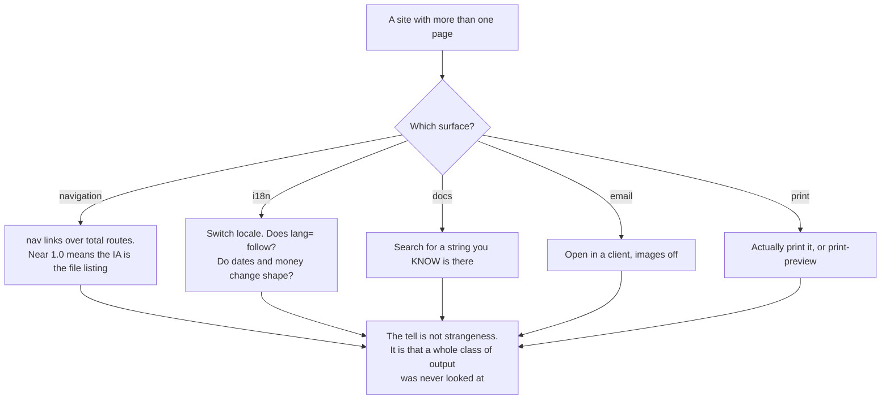

# Unopened surfaces — navigation, i18n, docs, commerce, email, print

Everything in this file is about a surface that was never opened. The model has no printer, no Outlook, no German tester, no screen reader, and no second page to navigate to — so the tell is rarely that it wrote something strange. The tell is that a whole class of output was never looked at, and the defect sat there because looking is the only thing that would have found it.

That makes this file read UNREVIEWED rather than AI, and the distinction matters when you report a finding: you are telling an author what they have not yet checked, not making a claim about who wrote it. The handful of genuinely model-flavoured entries say so in their own **Why it reads AI** line.

One structural finding runs through the navigation entries and is worth reading first: `ia-is-a-projection-of-the-filesystem`. The flat nav, the fat footer, the empty mega-menu and the four-deep docs sidebar are four symptoms of one cause — the information architecture is a rendering of the directory listing, because enumeration is free and prioritisation needs knowledge the generator does not have.

Two entries here share a fix, which is unusual enough to name: switching a PDF export from `screenshot()` to `page.pdf()` makes the invoice text-selectable AND makes it honour a print stylesheet, so twelve lines of `@media print` repair browser printing and turn a dead raster receipt into a real document at the same time.

_36 items. Generated from catalog.json — edit there, then re-run `scripts/regenerate_references.py`. Do not hand-edit this file._

_Every item carries a **False positive when** line. Read it before you act on the item: these are cues for an editor, not evidence about an author._

<!-- humanize:ignore-start
     The diagram and index below quote the tells they document, and a
     mermaid label is not a sentence. -->

## When this file applies



## What is in this file

Severity is how loudly the tell announces itself, never how sure you should be about who wrote it. **Automated** means these scripts implement the check; *no* means it is yours to ask in the judge pass.

| item | severity | family | automated |
| --- | --- | --- | --- |
| [`checkout-without-guest-option`](#checkout-without-guest-option) | HIGH | defect | yes |
| [`decorative-site-search`](#decorative-site-search) | HIGH | defect | yes |
| [`docs-search-indexes-nothing`](#docs-search-indexes-nothing) | HIGH | defect | yes |
| [`email-built-with-web-css`](#email-built-with-web-css) | HIGH | defect | yes |
| [`email-unreadable-with-images-off`](#email-unreadable-with-images-off) | HIGH | defect | **no** |
| [`hamburger-at-desktop-width`](#hamburger-at-desktop-width) | HIGH | defect | yes |
| [`lang-frozen-on-locale-switch`](#lang-frozen-on-locale-switch) | HIGH | defect | yes |
| [`nav-without-active-state`](#nav-without-active-state) | HIGH | defect | yes |
| [`receipt-generated-as-screenshot`](#receipt-generated-as-screenshot) | HIGH | defect | yes |
| [`rtl-unsupported-physical-properties`](#rtl-unsupported-physical-properties) | HIGH | defect | yes |
| [`unsubscribe-absent-or-buried`](#unsubscribe-absent-or-buried) | HIGH | defect | **no** |
| [`breadcrumb-without-real-hierarchy`](#breadcrumb-without-real-hierarchy) | med | defect | **no** |
| [`chrome-sized-to-english`](#chrome-sized-to-english) | med | defect | **no** |
| [`code-sample-not-runnable`](#code-sample-not-runnable) | med | defect | yes |
| [`dark-mode-inverts-the-logo-away`](#dark-mode-inverts-the-logo-away) | med | defect | **no** |
| [`docs-generator-defaults-unmodified`](#docs-generator-defaults-unmodified) | med | residue | yes |
| [`every-page-opens-with-in-this-guide`](#every-page-opens-with-in-this-guide) | med | form | yes |
| [`flat-nav-every-route`](#flat-nav-every-route) | med | shape | **no** |
| [`footer-sitemap-dump`](#footer-sitemap-dump) | med | shape | yes |
| [`hardcoded-locale-formats`](#hardcoded-locale-formats) | med | defect | yes |
| [`ia-is-a-projection-of-the-filesystem`](#ia-is-a-projection-of-the-filesystem) | med | shape | **no** |
| [`mega-menu-on-a-small-site`](#mega-menu-on-a-small-site) | med | shape | **no** |
| [`name-and-address-shape-assumed`](#name-and-address-shape-assumed) | med | defect | yes |
| [`no-plain-text-part`](#no-plain-text-part) | med | defect | yes |
| [`no-print-stylesheet`](#no-print-stylesheet) | med | defect | yes |
| [`no-real-product-photography`](#no-real-product-photography) | med | visual | n/a |
| [`reviews-without-filtering-or-distribution`](#reviews-without-filtering-or-distribution) | med | defect | **no** |
| [`sentence-assembled-from-fragments`](#sentence-assembled-from-fragments) | med | defect | yes |
| [`sidebar-nested-past-three-levels`](#sidebar-nested-past-three-levels) | med | shape | **no** |
| [`spec-table-as-prose`](#spec-table-as-prose) | med | shape | **no** |
| [`text-baked-into-image`](#text-baked-into-image) | med | defect | yes |
| [`api-reference-restates-the-type`](#api-reference-restates-the-type) | low | shape | n/a |
| [`flag-as-language-selector`](#flag-as-language-selector) | low | shape | yes |
| [`home-link-live-on-the-homepage`](#home-link-live-on-the-homepage) | low | defect | **no** |
| [`no-version-selector`](#no-version-selector) | low | shape | **no** |
| [`preheader-never-set`](#preheader-never-set) | low | defect | yes |

<!-- humanize:ignore-end -->

<!-- humanize:ignore-start
     Everything below is a specimen catalog. It quotes the tells it documents,
     including literal machine residue, so reviewing it with humanize_review.py
     would flag the exhibits rather than the writing. -->

<a id="checkout-without-guest-option"></a>
### `checkout-without-guest-option`  ·  high · generic-llm · web-ui · structural · family: defect · lane: commerce

**Automated here:** yes, these scripts implement it.

Checkout requires an account. The visitor with a full cart hits a login wall and a "create password" field before they can give you money.

**Why it reads AI:** Auth-gating a route is the default generated pattern for anything involving an order record, and guest checkout is an explicit exception someone has to ask for. The model optimises for a clean data model; Baymard measures the cost at roughly a fifth to a quarter of buyers.

**Detect:** The checkout route is behind auth — middleware matcher including /checkout, or an if (!session) redirect('/login') in the checkout loader or handler — with no guest branch, no guestCheckout flag and no email-only path. Rendered: load the cart in a fresh session and attempt checkout.

**Fix:** Email-only guest checkout as the default path, with account creation offered AFTER the order is placed and pre-filled from it. If you need an account for order history, create it silently and send a set-password link with the receipt.

**False positive when:** Subscriptions, licensed software, regulated goods and B2B portals where an account is structurally required. Marketplaces needing buyer identity for dispute handling. Digital goods delivered to an account. Re-order flows for existing customers.

**Before**

> /checkout in the auth middleware matcher, no exception

**After**

> a guest path collecting email and address; post-purchase "Create an account to track this order" with the fields already filled

<a id="decorative-site-search"></a>
### `decorative-site-search`  ·  high · generic-llm · web-ui · structural · family: defect · lane: navigation-and-ia

**Automated here:** yes, these scripts implement it.

A search input in the header that submits nowhere, or submits to a page with no index behind it, so every query returns no results — including queries for text visible on the current page.

**Why it reads AI:** Same family as form-without-destination. Search is a visual component the model can render convincingly and a backend it was not asked to build. It is worse than absent search: the control makes a promise and then tells the visitor their content does not exist.

**Detect:** Rendered (definitive): submit a query taken verbatim from the page's own h1; flag if the result set is empty or the input does not navigate. Static proxy: an input[type=search] or [role=searchbox] with no enclosing form[action], no submit handler, no /search route, and no client-index dependency (fuse.js, lunr, flexsearch, minisearch, pagefind, docsearch, algoliasearch, typesense) in the manifest.

**Fix:** Either wire it — Pagefind and Fuse.js both index a static build in minutes — or delete the input. On a site under about a dozen pages, deleting it and fixing the menu is the right answer.

**False positive when:** Search wired through a framework directive or an event delegated at the document level that a static scan cannot see — verify by typing. Command-palette patterns where the visible input is a trigger for a real modal search. Search intentionally scoped to one section.

**Before**

> <input type="search" placeholder="Search…"> with no form, no handler, no index

**After**

> delete it, or <form action="/search"><input type="search" name="q"></form> backed by a Pagefind index

<a id="docs-search-indexes-nothing"></a>
### `docs-search-indexes-nothing`  ·  high · generic-llm · docs · structural · family: defect · lane: docs

**Automated here:** yes, these scripts implement it.

The docs site has a search box in the navbar and no index behind it — either no search plugin is configured at all, or the Algolia block still contains placeholder credentials.

**Why it reads AI:** Same family as decorative-site-search, and specific to docs because the theme ships the search UI whether or not you supply an index — so the generator gets a search box for free and never discovers it is hollow. Search is the primary navigation mode for docs; a hollow one is worse than none.

**Detect:** A docs site whose theme renders a search UI where none of docusaurus-search-local, docusaurus-lunr-search, theme-search-algolia (with real appId/apiKey/indexName), pagefind or typesense is configured; OR an algolia config containing YOUR_APP_ID, YOUR_SEARCH_API_KEY, YOUR_INDEX_NAME or an xxx placeholder. Rendered: search a string from the current page's h1 and get zero results.

**Fix:** Wire a local index — docusaurus-search-local or Pagefind: no external service, works offline, indexes at build. Apply for DocSearch only if you want hosted. Then search for a string you know exists and confirm.

**False positive when:** Search wired through a platform feature invisible to a repo scan — Mintlify, GitBook and ReadMe index server-side. Sites under about fifteen pages where the sidebar is the whole IA and search was deliberately removed. Search delegated to a parent-domain site search.

**Before**

> algolia: { appId: 'YOUR_APP_ID', apiKey: 'YOUR_SEARCH_API_KEY', indexName: 'YOUR_INDEX_NAME' }

**After**

> themes: [['@easyops-cn/docusaurus-search-local', { hashed: true, indexBlog: false }]]

<a id="email-built-with-web-css"></a>
### `email-built-with-web-css`  ·  high · generic-llm · email · structural · family: defect · lane: email

**Automated here:** yes, these scripts implement it.

The HTML email is built like a web page — display:flex, CSS grid, div columns, padding on div and p, a style block rather than inline styles, border-radius, position — and collapses in Outlook's Word rendering engine.

**Why it reads AI:** The corpus of HTML is overwhelmingly WEB HTML; email HTML is a tiny, weird dialect frozen around 2003. The model writes the majority dialect. It renders perfectly in the preview pane the author checks and breaks in the client a third of recipients use.

**Detect:** On the template: display:flex or display:grid; position:absolute or fixed; float layout; max-width on a structural div with no mso conditional fallback; padding on div or p used for layout; a stylesheet link or a style block carrying layout rules with no inliner in the pipeline (juice, premailer, mjml, maizzle); layout tables without role="presentation"; no mso- conditional block anywhere.

**Fix:** Use MJML or Maizzle and let them emit the table soup and the MSO conditionals. If hand-writing: nested tables with role="presentation" for layout, padding on td only, every style inlined, ghost tables for Outlook, mso conditionals for anything with a corner radius or a background image. Then test in a rendering service, not in Gmail alone.

**False positive when:** Internal tools and dev-only notifications where the audience's client is known. Plain-text-style emails with minimal markup, which are MORE robust, not less. Teams that have measured their audience and confirmed no Word-engine Outlook.

**Evidence:** Microsoft has said it will end Word-engine desktop Outlook support in October 2026, so this decays — slowly, and not at all for enterprise fleets on frozen builds.

**Before**

> <div style="display:flex;gap:24px">…</div>

**After**

> <table role="presentation" width="100%"><tr><td style="padding:0 12px">…</td><td style="padding:0 12px">…</td></tr></table>

<a id="email-unreadable-with-images-off"></a>
### `email-unreadable-with-images-off`  ·  high · generic-llm · email · structural · family: defect · lane: email

**Automated here:** no — decidable mechanically, but this bundle does not implement it. Ask it yourself in the judge pass.

The headline, the offer, the price and the CTA are all inside images. With images blocked — the default in several clients and common in corporate environments — the email is a stack of empty boxes.

**Why it reads AI:** Compounds with text-baked-into-image: the same instinct in a harsher medium, because email clients block images by default far more often than browsers do.

**Detect:** Compute the live-text-to-image ratio on the rendered template and flag when the only rendering of the primary heading or the primary CTA is an img or a background-image. Corroborating: images with missing or empty alt in a marketing template; a CTA implemented as an image with no text fallback and no bulletproof-button table.

**Fix:** Live text for every heading, price and CTA. Bulletproof buttons — a td with a background colour, padding and an anchor — rather than button images. Meaningful alt on every informative image, empty alt on decoration. Then preview with images disabled; it should still sell.

**False positive when:** Purely visual sends where the image IS the product — a photographer's portfolio drop, an art print announcement — which still need alt text and a text CTA, but where the ratio flag is the wrong instrument. Emails where a single decorative header image sits above substantial live text.

**Before**

> a single 600x900 hero-offer.png containing the entire email

**After**

> live h1, live price, a bulletproof button td; images carry atmosphere only, all with alt

<a id="hamburger-at-desktop-width"></a>
### `hamburger-at-desktop-width`  ·  high · generic-llm · layout · structural · family: defect · lane: navigation-and-ia

**Automated here:** yes, these scripts implement it.

The full nav is collapsed behind a toggle at 1280px and above — either the reveal breakpoint was set too high, or only the mobile nav was ever built.

**Why it reads AI:** The generator writes the responsive nav pattern from memory, gets the breakpoint direction or the utility pair wrong, and never opens a desktop viewport. NN/g measured the cost: discoverability roughly halves, task time rises, perceived difficulty rises.

**Detect:** Rendered (reliable): at 1280x800 the primary nav exposes at most one link plus a button matching /menu|navigation/i. Static proxy: a header containing a nav toggle button (aria-label or aria-expanded marks it) whose sibling link list carries `hidden` with no md:/lg:/xl: reveal utility, or carries md:hidden — hiding it at every width the toggle also exists at.

**Fix:** Show the nav inline from md or lg up: `hidden md:flex` on the list, `md:hidden` on the toggle. Then actually load the page at 1280 and 1440.

**False positive when:** App shells and dashboards with a deliberate collapsible sidebar, where the nav is a workspace tool rather than wayfinding. Sites with a genuinely tiny nav where the toggle is a design choice.

**Before**

> <ul class="hidden">…</ul><button class="md:hidden" aria-label="Menu">

**After**

> <ul class="hidden md:flex gap-6">…</ul><button class="md:hidden" aria-label="Menu" aria-expanded="false">

<a id="lang-frozen-on-locale-switch"></a>
### `lang-frozen-on-locale-switch`  ·  high · generic-llm · web-ui · structural · family: defect · lane: i18n

**Automated here:** yes, these scripts implement it.

The site has a working language switcher, the content changes, and <html lang> stays "en" forever. Screen readers read Spanish with an English voice; the browser offers to translate Spanish into Spanish.

**Why it reads AI:** Distinct from missing-html-lang: here the attribute is PRESENT AND WRONG, which no "is it there" check catches. The generator wires the visible half of i18n — the switcher, the strings — and not the half only assistive technology observes.

**Detect:** Trigger first: the site must claim more than one locale (a switcher in the DOM, two or more entries in an i18n locales config, hreflang alternates, an /es/ route). Then: rendered — switch locale and assert document.documentElement.lang changed. Static — a literal <html lang="en"> in the root layout with no binding (lang={locale}, :lang, <Html lang={…}>). Also flag inline foreign-language passages with no lang on the wrapper (WCAG 3.1.2).

**Fix:** Bind lang to the active locale in the root layout and set dir from the same source. Wrap inline other-language passages in <span lang="…">.

**False positive when:** Single-locale sites — no trigger, do not flag. Machine-translation overlays that rewrite lang at runtime after the static check. Sites setting language on <body> or a wrapper rather than <html>.

**Before**

> <html lang="en"> on /es/precios

**After**

> <html lang="es" dir="ltr">

<a id="nav-without-active-state"></a>
### `nav-without-active-state`  ·  high · generic-llm · web-ui · structural · family: defect · lane: navigation-and-ia

**Automated here:** yes, these scripts implement it.

No current-page indicator anywhere: no aria-current, no active class, no visual difference between the page you are on and the nine you are not.

**Why it reads AI:** The nav is authored once as a stateless component and the generator never renders page two, so there is no moment at which the missing state is visible. NN/g calls this the single most common menu mistake. It is also a WCAG 1.3.1 failure when location is conveyed visually only — and here it is not conveyed at all.

**Detect:** Flag when BOTH hold: aria-current="page" appears nowhere in the build, AND the nav has no conditional active styling (no usePathname/useRouter comparison in a Next Link list, no active class, no [data-active], no [aria-selected] on any nav anchor). Requires both; either alone is normal.

**Fix:** Set aria-current="page" on the matching link and style [aria-current="page"]. Do both: the attribute is what assistive technology reads, the style is what everyone else reads. Do not use colour alone — add weight or a rule.

**False positive when:** Single-page sites whose nav items are in-page anchors with a scroll-spy. Nav items that are actions (Sign in, Book a demo) are never current and correctly have no state. Design systems that mark current state on a wrapper li rather than the anchor — check the parent before flagging.

**Before**

> <a href="/pricing">Pricing</a>  — identical markup on /pricing and everywhere else

**After**

> <a href="/pricing" aria-current="page">Pricing</a> + nav a[aria-current="page"]{font-weight:600;border-bottom:2px solid currentColor}

<a id="receipt-generated-as-screenshot"></a>
### `receipt-generated-as-screenshot`  ·  high · generic-llm · print · structural · family: defect · lane: print

**Automated here:** yes, these scripts implement it.

The invoice, receipt, ticket or report PDF is a rasterised screenshot of a web page. No selectable text, no search, no copyable amount or reference number, unreadable to a screen reader, and two megabytes.

**Why it reads AI:** "Generate a PDF of this page" retrieves a Puppeteer snippet, and screenshot() is the more prominent method. The output looks right in a viewer and is functionally dead — it cannot be pasted into accounting software, searched for an invoice number, or read aloud.

**Detect:** In any invoice, receipt or export code path, a rasterising call — page.screenshot(, html2canvas(, domtoimage., sharp(…).png() feeding a PDF writer, or jsPDF.addImage( with a canvas source — instead of page.pdf( or a PDF library (pdfkit, pdfmake, react-pdf, wkhtmltopdf, weasyprint). Artifact check: the produced PDF has no /Font objects, or pdftotext returns empty, or each page is a single image XObject.

**Fix:** page.pdf({format:'A4', printBackground:true}) — Chromium's PDF output preserves real text AND honours your print stylesheet, so this and no-print-stylesheet are fixed by the same work. For structured documents, generate the PDF from data with a PDF library and tag it so amounts and totals are machine-readable.

**False positive when:** Deliberate image exports — an OG card, a share graphic, a chart thumbnail — that were never meant to be documents. Snapshot and visual-regression test paths. Systems where a rasterised, watermarked artefact is a deliberate anti-tamper decision.

**Before**

> const png = await page.screenshot(); doc.addImage(png,'PNG',0,0,w,h);

**After**

> const pdf = await page.pdf({ format:'A4', printBackground:true, margin:{top:'15mm'} });

<a id="rtl-unsupported-physical-properties"></a>
### `rtl-unsupported-physical-properties`  ·  high · generic-llm · layout · structural · family: defect · lane: i18n

**Automated here:** yes, these scripts implement it.

Arabic, Hebrew, Persian or Urdu is offered and the layout does not mirror: dir is never set, every spacing rule is physical (margin-left, padding-right, left:, text-align:left), and directional icons point the wrong way.

**Why it reads AI:** Physical properties are what the training corpus is made of, so they are what gets generated; logical properties require someone to have thought about a reader who is not the author. A generator will produce an Arabic locale file and a left-to-right layout in the same commit.

**Detect:** Trigger: the locale list intersects {ar, he, fa, ur, yi, dv, ps, ckb}. Then flag when no dir attribute is bound to a value AND physical properties outnumber logical ones by phys_ratio or more. Count margin-left|margin-right|padding-left|padding-right|left:|right:|text-align:left|right|border-left|border-right against margin-inline|padding-inline|inset-inline|text-align:start|end|border-inline. Tailwind form: ml/mr/pl/pr/left/right/text-left/text-right/rounded-l/rounded-r/border-l/border-r against ms/me/ps/pe/start/end/text-start/text-end/rounded-s/rounded-e/border-s/border-e.

**Thresholds** (read by `scripts/humanize_review.py`): `phys_ratio` = 5.0

**Fix:** Set dir on <html> from the locale. Convert spacing and alignment to logical properties — they have had full browser support for years. Mirror directional icons with [dir="rtl"] .chevron{transform:scaleX(-1)}, and do NOT mirror icons depicting real-world objects: a clock, a play button, a logo.

**False positive when:** No RTL locale offered or planned — do not flag. Physical properties are correct where the direction is genuinely physical (an element pinned to the viewport's left, a chart axis). Codebases running rtlcss or postcss-logical at build time — check the PostCSS config first.

**Before**

> .card{margin-left:1rem;text-align:left;border-left:2px solid}

**After**

> .card{margin-inline-start:1rem;text-align:start;border-inline-start:2px solid}

<a id="unsubscribe-absent-or-buried"></a>
### `unsubscribe-absent-or-buried`  ·  high · generic-llm · email · structural · family: defect · lane: email

**Automated here:** no — decidable mechanically, but this bundle does not implement it. Ask it yourself in the judge pass.

A bulk or marketing send with no List-Unsubscribe header, or no in-body unsubscribe link, or one rendered at 8px in the same colour as the background under three paragraphs of legal text.

**Why it reads AI:** Headers are a layer above the template that nothing in a visual loop touches, and provider quickstarts do not include them. Since June 2024 this is a deliverability failure as much as a legal one — Gmail and Yahoo made one-click unsubscribe a condition of bulk delivery.

**Detect:** For any send classified as bulk or marketing: headers set with no List-Unsubscribe AND no List-Unsubscribe-Post: List-Unsubscribe=One-Click; no body anchor matching /unsubscribe|opt[- ]out|manage (your )?preferences/i; that anchor styled below min_font_px or at a contrast under 3:1 against its background; or the unsubscribe URL routing to a login page.

**Thresholds** (read by `scripts/humanize_review.py`): `min_font_px` = 10

**Fix:** Set both headers, honour the POST within two days, and keep a plainly visible in-body link in normal body colour at normal size. Never require a login to unsubscribe. Keep the link live at least 30 days after the send.

**False positive when:** Genuinely transactional mail — receipts, password resets, security alerts, order status — which is exempt and should NOT carry one. Double-opt-in confirmations. Internal or system mail. The boundary is the message's purpose, not its list.

**Before**

> resend.emails.send({from,to,subject,html}) with a 9px grey "unsubscribe" in a legal block

**After**

> headers: { 'List-Unsubscribe': '<https://…/u/{token}>, <mailto:unsub@…>', 'List-Unsubscribe-Post': 'List-Unsubscribe=One-Click' } plus a normal-weight footer link

<a id="breadcrumb-without-real-hierarchy"></a>
### `breadcrumb-without-real-hierarchy`  ·  medium · generic-llm · web-ui · structural · family: defect · lane: navigation-and-ia

**Automated here:** no — decidable mechanically, but this bundle does not implement it. Ask it yourself in the judge pass.

A breadcrumb trail that does not describe the site's structure: Home > Page on a flat site, or a fabricated Home > Products > Category > Item where the URL is /p/sku-1234 and no category page exists.

**Why it reads AI:** Breadcrumbs are a recognisable professional-site component, and the generator emits the component plus plausible-looking ancestors without a hierarchy to read them from. Fabricating a middle crumb that resolves to nothing is the same failure as a fabricated citation.

**Detect:** Parse nav[aria-label*=breadcrumb] and BreadcrumbList JSON-LD. Flag when trail length is 2 and the site has no nesting; or any intermediate item's URL is not a path-prefix of the current URL; or an intermediate URL 404s or is absent from the route table.

**Fix:** Derive the trail from the real route tree — each page gets exactly one primary parent. If the site is flat, remove breadcrumbs; they are for depth. Keep BreadcrumbList schema in sync with the visible trail and the URL.

**False positive when:** Faceted commerce legitimately shows a path-based trail reflecting how the user arrived rather than URL nesting. Attribute trails (brand > type) rather than location trails. Single-level nesting where a two-item trail is honest.

**Before**

> Home > Products > Outerwear > Rain Jacket  at /products/rain-jacket, where /products/outerwear does not exist

**After**

> Home > Products > Rain Jacket  at /products/rain-jacket, with /products a real page

<a id="chrome-sized-to-english"></a>
### `chrome-sized-to-english`  ·  medium · generic-llm · layout · structural · family: defect · lane: i18n

**Automated here:** no — decidable mechanically, but this bundle does not implement it. Ask it yourself in the judge pass.

Nav items, buttons, table headers, form labels and card titles sized for the English string. German (30–40% longer), Finnish or Russian arrives and the text clips, wraps into the element below, or triggers an ellipsis that eats the meaning.

**Why it reads AI:** Every layout is tuned against exactly one string set. This is also a WCAG 1.4.10 Reflow risk independent of translation, because 400% zoom produces the same overflow — so it fails for a monolingual low-vision user too.

**Detect:** Rendered (definitive): pseudo-localise — expand every UI string to about 1.4x with accented characters, re-render, and detect scrollWidth > clientWidth or overlapping bounding boxes on nav, button, label and th nodes. Static proxy: white-space:nowrap or a fixed width on nav items, buttons or labels combined with overflow:hidden and text-overflow:ellipsis, plus no overflow-wrap:break-word or hyphens:auto on prose containers.

**Fix:** Let containers size to content; use min-width rather than width. Allow two-line buttons. Add overflow-wrap:break-word (and hyphens:auto with lang set) to prose. Test with pseudo-localisation in CI rather than waiting for the translation.

**False positive when:** Single-locale products. Data tables where truncation with a tooltip is a deliberate density decision. Fixed-width chrome in a native-feel app shell with controlled strings. Marketing headlines art-directed per locale anyway.

**Before**

> .nav a{width:96px;white-space:nowrap;overflow:hidden;text-overflow:ellipsis} → "Einstellu…"

**After**

> .nav a{min-width:96px;white-space:normal;overflow-wrap:break-word}

<a id="code-sample-not-runnable"></a>
### `code-sample-not-runnable`  ·  medium · generic-llm · docs · structural · family: defect · lane: docs

**Automated here:** yes, these scripts implement it.

Code blocks the reader cannot use: no language tag, elisions like "// ... rest of your code", unexplained <YOUR_API_KEY>, shell blocks with a leading $ on every line that the copy button then copies, and no complete example anywhere.

**Why it reads AI:** The model writes illustrative fragments because fragments are what documentation prose looks like in the corpus; it never pastes one into a terminal. The $-prefix case is a specific, nasty one — it LOOKS like a terminal transcript and silently breaks paste.

**Detect:** Across .md and .mdx: fenced blocks with an empty info string as a share of all blocks; blocks containing /\.\.\.|\/\/ ?(rest of|your code here|implementation|etc)/; shell blocks where most lines start with $; placeholders /<(YOUR|MY)_[A-Z_]+>|YOUR_API_KEY|xxxx+/ with no adjacent instruction on where to obtain the value; and no block in the page set that is a complete runnable file.

**Thresholds** (read by `scripts/humanize_review.py`): `min_blocks` = 4, `untagged_share` = 0.5, `dollar_share` = 0.8

**Fix:** Tag every fence with a language. Strip $ prompts from copyable shell blocks. Ship at least one complete, copy-paste-and-run example per page, and run it in CI so it cannot rot.

**False positive when:** Conceptual documentation where a fragment is the point. Output blocks — a terminal transcript deliberately showing prompt and response — which correctly include $ and are not meant to be copied. Blocks tagged text or console on purpose.

**Before**

> ```\n$ npm install foo\n$ foo init --key <YOUR_API_KEY>\n```

**After**

> ```bash\nnpm install foo\nfoo init --key "$FOO_API_KEY"\n```  — plus a line saying where FOO_API_KEY comes from

<a id="dark-mode-inverts-the-logo-away"></a>
### `dark-mode-inverts-the-logo-away`  ·  medium · generic-llm · email · structural · family: defect · lane: email

**Automated here:** no — decidable mechanically, but this bundle does not implement it. Ask it yourself in the judge pass.

A dark, transparent-background logo on a #ffffff email body. The client inverts the background to near-black, the logo does not invert, and the brand mark disappears — or a dark-mode override turns the whole template into an unreadable mid-grey.

**Why it reads AI:** Dark mode in email is client-specific, partially undocumented and impossible to observe without opening the message in each client. It is the most "you had to be there" defect in this lane.

**Detect:** A logo img with a transparent-background PNG or SVG whose dominant ink is dark, where the template has none of: a prefers-color-scheme dark block, [data-ogsc] or [data-ogsb] selectors, a color-scheme plus supported-color-schemes meta pair, an mso conditional locking colours, or a light plate baked behind the mark. Corroborating: background-color:#ffffff on the outer table, which Outlook inverts most aggressively.

**Fix:** Give the logo a baked-in light plate or outline so it survives either ground. Ship a dark variant via prefers-color-scheme where supported, with [data-ogsc] overrides for Outlook.com. Declare color-scheme and supported-color-schemes. Avoid pure #ffffff — #f7f7f7 inverts more gracefully. Then open it in Outlook Windows, Apple Mail and Gmail iOS in dark mode.

**False positive when:** Logos already light-on-transparent, which survive inversion. Templates that are dark-first by design. Audiences on clients with no forced inversion. Teams that have consciously accepted the trade-off after testing.

**Before**

>  on bgcolor="#ffffff", no color-scheme metadata

**After**

> logo with a light plate + color-scheme meta + a prefers-color-scheme block + [data-ogsc] overrides

<a id="docs-generator-defaults-unmodified"></a>
### `docs-generator-defaults-unmodified`  ·  medium · generic-llm · docs · structural · family: residue · lane: docs

**Automated here:** yes, these scripts implement it.

The docs site is a create-docusaurus, Mintlify or Nextra starter with the content swapped and nothing else: scaffold primary colour, scaffold logo and favicon, scaffold footer columns, scaffold sidebar labels, and the generator's own name still in the footer.

**Why it reads AI:** "Set up a docs site" resolves to running the scaffolder, and the scaffolder's output is already a complete, good-looking site — so the loop terminates. The tell is not ugliness; it is that the site is indistinguishable from the starter, which the Docusaurus team themselves called out: "the sample sites above use different colors, but still look quite the same".

**Detect:** Docusaurus: src/css/custom.css still carrying the scaffold green --ifm-color-primary: #2e8555 and its six generated shades; static/img/logo.svg or favicon.ico byte-identical to the template; docusaurus.config footer.links still Docs/Community/More with Stack Overflow, Discord and X entries; tagline still "Dinosaurs are cool"; docs/intro.md still present. Mintlify: starter colors.primary and the starter Quickstart/Development nav intact. Flag at min_markers co-occurring markers.

**Thresholds** (read by `scripts/humanize_review.py`): `min_markers` = 3

**Fix:** Change four things at minimum: the primary colour token set, the logo and favicon, the footer link groups, and the landing page. Delete every scaffold page — intro.md, tutorial-basics/, the blog with Welcome and MDX Blog Post.

**False positive when:** A day-one docs site where shipping content matters more than theming — real and defensible. Teams deliberately standardising on an unmodified theme to cut maintenance. Internal docs where branding is pointless. One marker alone is never enough.

**Before**

> --ifm-color-primary:#2e8555; + the Docusaurus dinosaur logo + footer Stack Overflow / Discord / X

**After**

> brand token set, real logo and favicon, footer linking to the repo, status page, changelog and support

<a id="every-page-opens-with-in-this-guide"></a>
### `every-page-opens-with-in-this-guide`  ·  medium · generic-llm · docs · structural · family: form · lane: docs

**Automated here:** yes, these scripts implement it.

Page after page opens with the same throat-clearing: "In this guide, we will…", "By the end of this article, you'll…", "Let's dive in." The reader scrolls past a paragraph of table-of-contents-in-prose on every page.

**Why it reads AI:** A human writing twenty pages varies the opening, because writing the same sentence twenty times is unbearable. A generator writing twenty pages independently produces the highest-probability opening twenty times.

**Detect:** Share of docs pages whose first body sentence (after the H1 and frontmatter) matches /^(in this (guide|article|tutorial|section|post|chapter)|this (guide|article|tutorial|document) (will|covers|explains|walks)|by the end of this|let'?s (dive|get started|take a look)|we'?ll (walk|cover|explore|take a look))/i. Flag at page_share of pages, or min_consecutive consecutive pages. The uniformity is the signal; one instance is not.

**Thresholds** (read by `scripts/humanize_review.py`): `page_share` = 0.3, `min_consecutive` = 3

**Fix:** Delete the opening paragraph and start with the first real sentence. If the page needs orientation, state the outcome in one line and let the H1 and the sidebar TOC do the structural work.

**False positive when:** Long-form tutorials where one framing paragraph genuinely orients the reader — the tell is repetition across pages, never a single instance. House styles mandating a "What you'll learn" block, which should then be a structured component rather than prose. Translated docs where the construction is idiomatic in the source language.

**Before**

> In this guide, we will walk through the process of configuring authentication. By the end of this article, you'll have a working setup. Let's dive in.

**After**

> Configure SSO with Okta in about ten minutes. You need admin access to both accounts.

<a id="flat-nav-every-route"></a>
### `flat-nav-every-route`  ·  medium · generic-llm · web-ui · structural · family: shape · lane: navigation-and-ia

**Automated here:** no — decidable mechanically, but this bundle does not implement it. Ask it yourself in the judge pass.

The primary nav lists every routable page at one level, ordered by file-system order, with no grouping and no submenu. Six to twelve items, all equal weight.

**Why it reads AI:** Humans build navigation by dropping things. The generator's default move is to expose everything it created. NN/g treats flat versus deep as a researched trade-off with real costs on both sides; a nav that reflects no choice at all is the tell, not the depth.

**Detect:** Count anchors inside the primary nav (header nav, nav[aria-label*=main], nav[role=navigation]). Flag when nav_links >= min_links AND the nav contains no nested list, no [role=menu] and no disclosure button AND nav_links / total_routes >= route_ratio, with routes read from app/**/page.tsx, pages/**, sitemap.xml or a routes config. The ratio is the signal; the raw count alone is not.

**Thresholds** (read by `scripts/humanize_review.py`): `min_links` = 6, `route_ratio` = 0.8

**Fix:** Pick the three to five destinations that matter and cut the rest to the footer or into groups. If you cannot cut anything, you have not yet decided what the site is for.

**False positive when:** Docs, wikis and reference sites. Sites with genuinely five or six equal-weight sections. A deliberately flat IA validated by tree testing.

**Before**

> nav: Home, About, Services, Pricing, Blog, Case Studies, Team, Careers, FAQ, Contact (10 links, 10 routes)

**After**

> nav: Services, Pricing, Work, About

<a id="footer-sitemap-dump"></a>
### `footer-sitemap-dump`  ·  medium · generic-llm · web-ui · structural · family: shape · lane: navigation-and-ia

**Automated here:** yes, these scripts implement it.

A four-column footer headed Company / Product / Resources / Legal containing every page on the site plus links that do not resolve — Careers, Press, Status, Changelog — several of them duplicating nav items under a different label.

**Why it reads AI:** The footer is where the generator puts the IDEA of a company: a real company has a Press page, so the link appears. The dead href itself is caught mechanically by dead-anchor-href; this entry is about the SHAPE — the four-column corporate footer on a site with one product and no company.

**Detect:** footer anchors >= min_links on a site with fewer real routes than that; OR at least dead_share of footer anchors resolving to #, javascript:void(0), or a route absent from the route table. Secondary: two anchors with the same href and different text across nav and footer (About and Our Story both to /about).

**Thresholds** (read by `scripts/humanize_review.py`): `min_links` = 12, `dead_share` = 0.3

**Fix:** List only what exists. Legally required links stay; everything else goes when the page does. If two labels point at one page, pick one and use it in both places, so visited-link state and recall work.

**False positive when:** Large organisations where a fat footer is a genuine secondary IA and every link resolves — a footer sitemap makes deep pages reachable in two hops. Pre-launch sites with placeholder legal links tracked on a checklist. An image and its caption both linking to one destination is one link, not a duplicate.

**Before**

> 4 columns, 22 links, 9 of them #

**After**

> 1–2 columns, 6 links, all resolving; legal row on its own line

<a id="hardcoded-locale-formats"></a>
### `hardcoded-locale-formats`  ·  medium · generic-llm · code · structural · family: defect · lane: i18n

**Automated here:** yes, these scripts implement it.

Dates, currency and numbers written for one locale and one currency in code: '$' + n.toFixed(2), MM/DD/YYYY, comma thousands separators, two decimal places assumed for every currency.

**Why it reads AI:** toFixed(2) is the single commonest price-rendering idiom in the training data. It is not wrong so much as monolingual: JPY has zero decimals, KWD has three, Germany writes 1.234,56 € with the symbol trailing.

**Detect:** Any of: a currency symbol adjacent to .toFixed(2); toLocaleDateString('en-US') or toLocaleString('en-US'); a literal 'MM/DD/YYYY' format string; the hand-rolled thousands regex /\B(?=(\d{3})+(?!\d))/g — combined with the ABSENCE of Intl.NumberFormat, Intl.DateTimeFormat and Intl.RelativeTimeFormat anywhere in the build. Also: <time> elements with no datetime attribute.

**Fix:** new Intl.NumberFormat(locale, {style:'currency', currency}).format(amount) and new Intl.DateTimeFormat(locale, {dateStyle:'medium'}).format(d). Take locale from the user's stored preference, not from navigator.language alone. Store money as integer minor units; never float.

**False positive when:** Single-locale, single-currency products where the format is a deliberate decision. Internal tools with one office. Fixed-format outputs required by a downstream system — an export written to a spec, an invoice line a tax authority defines. ISO-8601 dates are locale-neutral by design and are never this finding.

**Before**

> <span>${(price/100).toFixed(2)}</span>

**After**

> <span>{new Intl.NumberFormat(locale,{style:'currency',currency}).format(price/100)}</span>

<a id="ia-is-a-projection-of-the-filesystem"></a>
### `ia-is-a-projection-of-the-filesystem`  ·  medium · generic-llm · web-ui · structural · family: shape · lane: navigation-and-ia

**Automated here:** no — decidable mechanically, but this bundle does not implement it. Ask it yourself in the judge pass.

The umbrella finding for this lane, and the one worth reading first. Generated navigation is rarely WRONG; it is unfiltered. The nav lists every route, the footer lists every page, the mega-menu has nothing in it, the docs sidebar is four deep because it mirrors the source tree. Four separate symptoms, one cause: nobody decided what mattered, so the information architecture became a rendering of the directory listing.

**Why it reads AI:** Enumeration is free and prioritisation is not. Deciding that Careers does not belong in the primary nav requires knowing what the business wants a visitor to do, which is exactly the input a generator does not have. So it ships the complete list, which is the only answer available without that knowledge.

**Detect:** Not a single regex. Look for two or more of: nav link count over total route count near 1.0; a footer with more links than the site has pages; a dropdown panel with fewer real destinations than columns; a sidebar whose nesting depth equals the content directory's depth. Each has its own catalog entry; the cluster is the diagnosis.

**Fix:** Do the subtraction pass a person would do. Name the three to five things a visitor is here for; those are the nav. Everything else moves to the footer, into a group, or off the site. If two items would sit in the same group, make the group. The test is whether any item was removed: an IA with no deletions in it is not an IA.

**False positive when:** Documentation, wikis and reference sites legitimately expose a wide flat top level, and search carries the load there. A site with genuinely five equal-weight sections (Menu, Hours, Location, Book) is correct as-is. A flat IA chosen after tree testing is a decision, not a default.

**Before**

> Home · About · Services · Pricing · Blog · Case Studies · Team · Careers · FAQ · Contact

**After**

> Services · Pricing · Work · About  (Blog, FAQ, Careers, Team move to the footer; Contact becomes the button)

<a id="mega-menu-on-a-small-site"></a>
### `mega-menu-on-a-small-site`  ·  medium · generic-llm · web-ui · structural · family: shape · lane: navigation-and-ia

**Automated here:** no — decidable mechanically, but this bundle does not implement it. Ask it yourself in the judge pass.

A multi-column dropdown panel with section headers and descriptions, on a site with under fifteen pages. The panel is mostly whitespace and duplicate links.

**Why it reads AI:** A mega-menu is a strong visual signal of "serious company" and costs nothing to generate, so it gets produced for sites with nothing to put in it. The mismatch between the menu apparatus and the site's size is the tell. NN/g endorses mega menus specifically for large, deep sites.

**Detect:** A nav dropdown or panel containing two or more column groups, or ten or more links, while the site's total routable pages is under min_site_routes. Tailwind shape: an absolutely positioned panel with grid-cols-2/3 inside a group-hover or data-[state=open] trigger.

**Thresholds** (read by `scripts/humanize_review.py`): `min_site_routes` = 15

**Fix:** Delete it. A flat dropdown, or no dropdown, for anything under about thirty pages across two levels. Spend the effort on the four labels instead.

**False positive when:** Sites with a real product catalogue, or e-commerce with genuine category depth. A menu that is actually full is doing its job.

**Before**

> Products ▾ opens a three-column panel: Overview / Features / Integrations / Changelog, where Overview and Features are the same page

**After**

> Product · Pricing · Docs · About

<a id="name-and-address-shape-assumed"></a>
### `name-and-address-shape-assumed`  ·  medium · generic-llm · web-ui · structural · family: defect · lane: i18n

**Automated here:** yes, these scripts implement it.

A form requiring First name plus Last name, a State dropdown of US states, a five-digit ZIP with pattern="\d{5}", and a phone mask of (###) ###-#### — none of which describes most of the world, and several of which describe nobody in Ireland, Hong Kong or Iceland.

**Why it reads AI:** The US address form is the overwhelming majority shape in the training data, so it is the default produced — including for a product whose stated market is the EU. The W3C's position is stronger than "support more formats": ask whether the split is needed at all.

**Detect:** In any address or registration form: required firstName/lastName with no full-name field; a required select[name=state] of 50 US states; pattern="^\d{5}(-\d{4})?$" or maxlength=5 on a postal field; a phone pattern containing a literal \(\d{3}\); a country select whose change handler does not alter the subsequent field set.

**Fix:** One Full name field (autocomplete="name") unless you have a concrete reason to split; add a separate "What should we call you?" if you need a greeting. Make the address field set depend on the selected country, and make state and postcode optional where the country does not use them. Never validate phone numbers with a country-specific regex — use libphonenumber or accept free text.

**False positive when:** Domestic-only services legally restricted to one country. Systems integrating with a payment processor or carrier whose API requires the split — flag the form, not the transport. KYC flows with a statutory field set. A service that genuinely only ships to one country is correct to assume it -- and should say so before the address step rather than at validation.

**Before**

> <input name="firstName" required><input name="lastName" required><select name="state" required>…<input name="zip" pattern="\d{5}" required>

**After**

> <input name="name" autocomplete="name" required> + a country-driven address block where state and postalCode are required only for countries that use them

<a id="no-plain-text-part"></a>
### `no-plain-text-part`  ·  medium · generic-llm · email · structural · family: defect · lane: email

**Automated here:** yes, these scripts implement it.

The send call supplies html only. No text/plain alternative, so text-only clients, accessibility tooling, smart-watch previews and several spam filters get nothing or an auto-generated mangle.

**Why it reads AI:** html: is the documented minimum in every provider's quickstart, so it is what gets generated; the multipart alternative is the step the quickstart omits.

**Detect:** Find the send call — resend.emails.send, sgMail.send, transporter.sendMail, ses.sendEmail, postmark.sendEmail, mailgun.messages.create — and flag any invocation whose options object sets html (or Body.Html) with no text, Body.Text or TextPart sibling in the same call.

**Fix:** Always send both parts, and write the text version deliberately — do not let the ESP auto-strip tags, which produces link soup. Keep the same links and the same unsubscribe.

**False positive when:** Templates managed inside an ESP where the text part is authored in the ESP UI rather than in code. Providers that genuinely generate a good text part, where the team has verified it. Transactional sends to a known machine consumer.

**Before**

> await resend.emails.send({ from, to, subject, html })

**After**

> await resend.emails.send({ from, to, subject, html, text })

<a id="no-print-stylesheet"></a>
### `no-print-stylesheet`  ·  medium · generic-llm · print · structural · family: defect · lane: print

**Automated here:** yes, these scripts implement it.

The page prints as a fixed header, a hamburger button, a cookie banner and three blank sheets, with link destinations invisible and content broken mid-element. Nobody ever pressed Ctrl-P.

**Why it reads AI:** Print is not in the generation loop at all — the least-visited surface in this lane. It is also among the cheapest to fix: a twelve-line @media print block covers most of it.

**Detect:** No @media print rule anywhere and no <link media="print">. Aggravating signals in the same build: position:fixed or sticky on header or nav; height:100vh or min-h-screen sections; overflow:hidden on a scroll container holding content; dark backgrounds with light text; no break-inside:avoid on cards, tables or figures. Severity rises to high where the page is an invoice, receipt, ticket, itinerary or legal document. Rendered: print to PDF at A4 and count blank pages.

**Fix:** Add a print block that hides chrome, unpins fixed positioning, resets viewport-height sections, avoids breaking inside headings, tables and figures, prints link destinations after external anchors, and sets a page margin. Then actually print it.

**False positive when:** Web applications and dashboards with no sensible print form, where a dedicated export is the right answer. Sites shipping a "Download PDF" or print-specific route a CSS scan will not see. Pages inside a print-aware framework such as Paged.js. Purely interactive experiences.

**Before**

> no print rules; page 1 is the nav, pages 2–4 are blank

**After**

> @media print { header, nav, footer, [role="dialog"] { display:none !important } * { position:static !important } h2, table, figure { break-inside:avoid } a[href^="http"]::after { content:" (" attr(href) ")" } @page { margin:15mm } }

<a id="no-real-product-photography"></a>
### `no-real-product-photography`  ·  medium · generic-llm · listing · llm-judge · family: visual · lane: commerce

Every product has exactly one image, all images share a single stock host or a single generated aesthetic, and there are no alternate angles, no scale reference, no variant-specific photos and no user-submitted images.

**Why it reads AI:** A different measurement from the image-forensics tells: this is about COVERAGE, not pixels. A real catalogue accumulates photographic inconsistency — different days, different lights, a hand in one shot. Perfect visual uniformity across a catalogue is the tell, and it is exactly what a generated store produces.

**Detect:** Flag when: median images per product is one; all product image hosts resolve to one stock CDN or one generation pipeline; filenames follow product-\d+\.(jpg|png|webp); variant selectors exist but do not change the image; no zoom, lightbox or gallery component in the build. Judge on the set: do these images share one lighting setup and one background such that they cannot be photographs of different real objects?

**Fix:** Photograph the actual product from at least three angles plus one in-use or scale shot. If you are reselling, use supplier imagery and say so. Make variant selection change the image. Never present a generated image as a photograph of a physical good.

**False positive when:** Digital goods, services and software — there is nothing to photograph. Pre-launch catalogues with placeholder imagery tracked on a checklist. Brands with a deliberate, disclosed 3D-render pipeline, which is legitimate when the render is accurate and labelled. Marketplaces early in seller onboarding.

**Before**

> one stock-CDN image per SKU, identical studio background across unrelated categories

**After**

> 4–6 real images per SKU including scale and detail; a variant-linked gallery

<a id="reviews-without-filtering-or-distribution"></a>
### `reviews-without-filtering-or-distribution`  ·  medium · generic-llm · listing · structural · family: defect · lane: commerce

**Automated here:** no — decidable mechanically, but this bundle does not implement it. Ask it yourself in the judge pass.

A star average and a list of review cards, with no rating histogram, no filter by star or attribute, no sort, no verified-purchase marker, and no way to find the one-star reviews — which is what the reader came for.

**Why it reads AI:** The average and the card list are the visible parts; the filtering apparatus is what makes reviews USABLE and is invisible in a screenshot. This is the apparatus, not the text — synthetic-review-shape covers fabricated review copy, and the two co-occur often enough to be worth checking together.

**Detect:** A reviews component rendering an average plus items, with none of: a distribution bar chart per star value, a filter control, a sort control, or a verified field on the review model. Corroborating: every displayed rating is four or five stars while the claimed average is 4.9.

**Fix:** Ship the histogram — it is the single highest-value element, telling the reader the shape of opinion in one glance — plus filter-by-star, sort by recency and helpfulness, and a verified-purchase badge that means something. Show the negative reviews; hiding them is what makes the positive ones unbelievable.

**False positive when:** Products with under about ten reviews, where filtering is pointless and the full list fits. Reviews delegated to an embedded third-party widget that provides the controls inside an iframe a static scan cannot see. B2B where reviews are curated case studies, clearly labelled as such.

**Before**

> ★★★★★ 4.9 (127 reviews) + six 5-star cards

**After**

> average + a 5→1 distribution bar chart + star filter + sort + verified badges

<a id="sentence-assembled-from-fragments"></a>
### `sentence-assembled-from-fragments`  ·  medium · generic-llm · code · structural · family: defect · lane: i18n

**Automated here:** yes, these scripts implement it.

A user-facing sentence built by concatenating translated pieces — t('you_have') + count + t('items_in_cart') — so translators receive word-order-locked fragments they cannot reorder, and no language with grammatical gender, case or non-binary plurals can be rendered correctly.

**Why it reads AI:** Fragment assembly reads perfectly in English, which is the only language the generator renders. It is invisible until a translator opens the string file and finds three words with no sentence around them.

**Detect:** A translation call in a concatenation (t('…') followed by +, or + followed by t(); two separate t() calls interpolated into one JSX sentence); key names ending _part1, _part2, _prefix, _suffix, _start, _end; plurals handled by a ternary on === 1 rather than an ICU plural rule or Intl.PluralRules.

**Fix:** One message per sentence, with named placeholders and ICU plurals. Give translators context comments.

**False positive when:** Concatenating a translated label with a non-linguistic token (an order ID, a filename, a code) is fine. Log messages and developer-facing strings are not translated. Design systems that compose a value with a separately-translated unit symbol.

**Before**

> t('you_have') + ' ' + n + ' ' + (n===1 ? t('item') : t('items'))

**After**

> t('cart.count', { count: n })  →  "{count, plural, one {# item} other {# items}}"

<a id="sidebar-nested-past-three-levels"></a>
### `sidebar-nested-past-three-levels`  ·  medium · generic-llm · docs · structural · family: shape · lane: docs

**Automated here:** no — decidable mechanically, but this bundle does not implement it. Ask it yourself in the judge pass.

A left sidebar with four or more levels of collapsible nesting, so finding a page requires guessing three parent categories correctly, and the whole tree is collapsed on arrival.

**Why it reads AI:** Deep nesting is what you get when a category is created for every noun rather than for a reader's task. Generators mirror the source-file tree, which is organised for authors.

**Detect:** Parse the sidebar config — Docusaurus sidebars.js category nesting, Mintlify navigation groups, Nextra _meta.json, MkDocs nav — and flag maximum depth at or beyond max_depth. Corroborating: most leaf pages sitting at depth three or deeper.

**Thresholds** (read by `scripts/humanize_review.py`): `max_depth` = 4

**Fix:** Three levels maximum: section → group → page. Flatten by merging categories with fewer than three children. Expand the current section by default. Make the top level answer "what am I trying to do", not "what module is this".

**False positive when:** Very large reference corpora — cloud provider APIs, standards documents — where depth reflects the domain and search carries the load. Auto-generated SDK references mirroring namespaces, navigated by search rather than browsing.

**Before**

> API → Reference → Resources → Users → Methods → createUser

**After**

> API reference → Users → createUser

<a id="spec-table-as-prose"></a>
### `spec-table-as-prose`  ·  medium · generic-llm · listing · structural · family: shape · lane: commerce

**Automated here:** no — decidable mechanically, but this bundle does not implement it. Ask it yourself in the judge pass.

Dimensions, materials, compatibility and sizing written as a paragraph instead of a table the reader can scan or compare.

**Why it reads AI:** Generators write prose by default; a table requires deciding the schema. The prose reads fluently and destroys the one thing the reader came for, which is comparison. Baymard finds half of sites get spec-sheet scannability wrong.

**Detect:** A section whose heading matches /specification|specs|dimensions|size (guide|chart)|materials|technical details|what'?s included/i rendered as paragraphs or a bullet list rather than a table or definition list, containing min_pairs or more extractable label–value or number–unit pairs. Also flag a multi-column spec table, which readers misread as a comparison sheet, and a size chart rendered as an image.

**Thresholds** (read by `scripts/humanize_review.py`): `min_pairs` = 4

**Fix:** One-column table or definition list, grouped into semantic sections, with labels consistent across every product in the category so cross-product comparison works. Size charts as real tables with both metric and imperial, not as a JPEG.

**False positive when:** Products with genuinely few specs, where a two-row table is worse than a sentence. Narrative product descriptions that accompany a real spec table elsewhere on the page. Apparel where fit is described qualitatively alongside a real measurements table.

**Before**

> <p>Measures 42cm wide by 30cm deep by 18cm tall, made from powder-coated steel…</p>

**After**

> a table with rows: Width 42 cm / Depth 30 cm / Height 18 cm / Material powder-coated steel, oak veneer / Max load 25 kg

<a id="text-baked-into-image"></a>
### `text-baked-into-image`  ·  medium · generic-llm · web-ui · structural · family: defect · lane: i18n

**Automated here:** yes, these scripts implement it.

Headlines, CTAs, pricing tables, diagram labels or feature comparisons rendered as pixels inside a PNG, JPEG or WebP, so they cannot be translated, selected, searched, resized, restyled for high contrast, or reflowed.

**Why it reads AI:** Mixed, and worth stating plainly. Generated hero imagery increasingly CONTAINS generated text, so this now appears for a model-specific reason as well as the old designer-hands-over-a-PNG one. Either way the words exist nowhere a translator, a screen reader or a search index can reach. WCAG 1.4.5.

**Detect:** OCR over served raster assets: flag any non-photograph yielding four or more words, especially where src or filename matches /hero|banner|cta|pricing|compare|feature|infographic/i. Static proxies: an  whose alt is a full marketing sentence (the copy was moved into alt because it left the DOM); an inline SVG with zero <text> elements and many <path> elements in a text-shaped bounding box (text converted to outlines on export).

**Fix:** Live text over the image, positioned with CSS. If the graphic is genuinely typographic — a logo, a stylised mark — keep it and supply real alt text. For diagrams, inline SVG with real <text> nodes so labels stay translatable and selectable.

**False positive when:** Screenshots of software, where the text is part of the subject. Photographs containing signage. Logos and wordmarks. Charts exported as images where an accessible data table is provided alongside.

**Before**

> 

**After**

>  + an <h2> and <p> positioned over it

<a id="api-reference-restates-the-type"></a>
### `api-reference-restates-the-type`  ·  low · generic-llm · docs · llm-judge · family: shape · lane: docs

Generated reference where every description is the identifier re-spelled in English: "userId: string — The user ID." No units, no ranges, no defaults, no errors, no relationship to any other field.

**Why it reads AI:** Mixed, and worth stating plainly: this is the oldest failure in technical writing, now cheaper to mass-produce. TypeDoc, JSDoc and godoc have emitted this shape for twenty years; a model asked to document a set of types produces it at scale and at speed. Read it as UNREVIEWED-at-volume rather than distinctively machine-written.

**Detect:** Judge primarily. Static heuristic: for each documented parameter, split the identifier on camel and snake boundaries and compare with the description; flag when token overlap is at or above overlap after stopword removal, or the description matches /^(The|A|An) <identifier words>\.?$/i, or is five tokens or fewer. Flag a PAGE when most of its entries qualify.

**Thresholds** (read by `scripts/humanize_review.py`): `overlap` = 0.8, `page_share` = 0.6

**Fix:** For each parameter add at least one thing the signature does not contain: unit, range, default, what happens when it is omitted, what it interacts with, or an example value. If you cannot add anything, delete the description — an empty one is more honest than a tautological one.

**False positive when:** Genuinely self-describing fields in a large uniform schema, where boilerplate would add noise. Reference pages that exist to be searched and are paired with real prose guides elsewhere — reference is MEANT to be terse. Machine-readable specs consumed by tooling rather than read.

**Before**

> timeout: number — "The timeout."

**After**

> timeout: number — "Milliseconds to wait for a response before aborting. Default 30000. Values under 1000 are clamped. Aborting raises TimeoutError, which is retryable."

<a id="flag-as-language-selector"></a>
### `flag-as-language-selector`  ·  low · generic-llm · web-ui · structural · family: shape · lane: i18n

**Automated here:** yes, these scripts implement it.

Languages chosen by national flag: a UK flag for English, a Spanish flag for Spanish, a Saudi flag for Arabic. Languages are not countries; the mapping is many-to-many and politically loaded.

**Why it reads AI:** Flags are the most visually available representation of "language" in the corpus and are cheap to emit as emoji. The compounding failure is the second one: the control is often labelled only in the CURRENT language, so a visitor who landed on the wrong locale cannot read the way out.

**Detect:** A locale-switching control whose only child content is a flag — a pair of Regional Indicator codepoints, img[src*="/flags/"], [class*="flag-icon"], fi fi-xx, country-flag — with no sibling text node giving the language name. Severity rises to medium when the flag is the only affordance.

**Fix:** Label each option with its endonym — English, Español, Deutsch, العربية, 日本語 — plus the BCP-47 tag in lang and hreflang. Never use a flag as the sole cue. Put the switcher somewhere findable, and never auto-switch on IP alone without an obvious override.

**False positive when:** The selector genuinely picks a market or region — shipping destination, tax jurisdiction, store — where a flag is correct. Flags used decoratively alongside endonyms. Products whose audience is explicitly national.

**Before**

> <button>🇩🇪</button> <button>🇬🇧</button>

**After**

> <a href="/de" lang="de" hreflang="de">Deutsch</a> · <a href="/en" lang="en" hreflang="en">English</a>

<a id="home-link-live-on-the-homepage"></a>
### `home-link-live-on-the-homepage`  ·  low · generic-llm · web-ui · structural · family: defect · lane: navigation-and-ia

**Automated here:** no — decidable mechanically, but this bundle does not implement it. Ask it yourself in the judge pass.

"Home" is the first nav item and, on the homepage itself, is still a live link to / with no current-page marking — a control that does nothing, in the most valuable slot in the nav.

**Why it reads AI:** The nav is one array rendered on every route, so "Home" cannot know it is home. NN/g found this among the ten most-violated homepage guidelines, at 41% compliance. The guideline is narrow — NN/g elsewhere defends HAVING a homepage link; the defect is the live self-link.

**Detect:** On the / route's rendered output, a nav anchor with href="/" (or "#" or "index.html") whose text matches /^home$/i, carrying neither aria-current="page" nor an active class. Secondary signal: the site also has a clickable logo linking to /, making the item a duplicate.

**Fix:** Mark it aria-current="page" and disable it on /, or drop the item and rely on the logo, which almost every visitor already treats as the home link.

**False positive when:** Sites where the logo is deliberately not a link. Deep app routes where Home means dashboard root and is never the current page. Small sites where removing it leaves an unbalanced bar.

**Before**

> <a href="/">Home</a> rendered identically on / and on /pricing

**After**

> on /: <span aria-current="page">Home</span> — or delete the item and keep the logo

<a id="no-version-selector"></a>
### `no-version-selector`  ·  low · generic-llm · docs · structural · family: shape · lane: docs

**Automated here:** no — decidable mechanically, but this bundle does not implement it. Ask it yourself in the judge pass.

Documentation for software that has shipped breaking changes, with only the current version published and no way to read the docs for the version the reader is actually running.

**Why it reads AI:** UNREVIEWED, and genuinely contested. Versioning is an ongoing maintenance commitment and experienced maintainers argue both sides — which is why this is low. The narrow, uncontested case is: breaking changes shipped, old majors still supported, no way to read their docs.

**Detect:** The project's published latest version is 2.0.0 or higher (or the repo has two or more major tags), and the docs build has no versioning: no versions.json or versioned_docs/, no mike config, no version dropdown in the navbar config, no /v1/ route.

**Fix:** Cut a version snapshot at each major. If you will not, say so prominently, keep a changelog with migration notes, and make sure every page states which version it describes.

**False positive when:** Projects with strong backward compatibility where one tree is honestly correct — Redis's maintainer makes exactly this argument. Hosted SaaS with no user-visible versions. Pre-1.0 projects. Products where a changelog plus per-page "since v2.3" annotations do the job.

**Before**

> one docs tree; the reader is on v1 and every example is v3

**After**

> a version dropdown — v3 (current) / v2 / v1 — or a banner naming the version these docs describe

<a id="preheader-never-set"></a>
### `preheader-never-set`  ·  low · generic-llm · email · structural · family: defect · lane: email

**Automated here:** yes, these scripts implement it.

No preheader was authored, so the inbox preview shows whatever text comes first in the HTML — "View this email in your browser", an unsubscribe line, or a mailing address. Prime inbox real estate spent on boilerplate.

**Why it reads AI:** The preheader is invisible in every preview the author looks at — it exists only in the inbox list view — so nothing in the loop surfaces its absence.

**Detect:** The template's body does not begin with a hidden preheader element — canonically a div or span with display:none, font-size:1px, max-height:0, overflow:hidden, mso-hide:all, usually followed by zero-width-non-joiner padding. Flag when that element is absent AND the first visible text node matches /view (this )?(email|message) (in|on)|having trouble|can'?t see this|unsubscribe|update your preferences/i. Also flag a preheader that is a verbatim copy of the subject line.

**Fix:** First child of body: a hidden div with 40–100 characters that CONTINUE the subject rather than repeating it, followed by zero-width padding so no boilerplate leaks in behind it. Move "View in browser" below the preheader or into the footer.

**False positive when:** Plain-text or text-first emails whose first line is already good preview copy — that IS the preheader. Transactional sends where the opening line is deliberately the most important sentence. ESPs that inject the preheader at send time from a campaign field invisible to a template scan.

**Before**

> <body><table>…<a>View this email in your browser</a>  → inbox shows "View this email in your browser"

**After**

> <body><div style="display:none;max-height:0;overflow:hidden;mso-hide:all">Your October invoice is ready — £248.00, due 14 Nov.</div>

<!-- humanize:ignore-end -->
