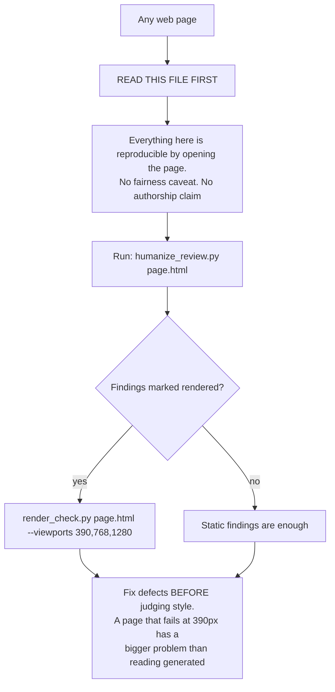

# Web build defects — the half you can reproduce

A different KIND of finding from the rest of this catalog. Everything here is a defect you can reproduce by opening the page: it scrolls sideways at 390px, the button is not a button, the grey text fails contrast. So none of it is an inference about who built the page, none of it carries the fairness caveat the rest of the skill insists on, and all of it can be acted on with full confidence — the same standing as a dead citation. Act on this file FIRST: a page that does not work on a phone has a bigger problem than a page that reads a bit generated.

Most of these are decidable from source and run in the normal structural pass. The ones marked `rendered` need `scripts/render_check.py`, the one optional script in this bundle, which opens the page at real viewports and names the elements at fault.

_36 items. Generated from catalog.json — edit there, then re-run `scripts/regenerate_references.py`. Do not hand-edit this file._

_Every item carries a **False positive when** line. Read it before you act on the item: these are cues for an editor, not evidence about an author._

<!-- humanize:ignore-start
     The diagram and index below quote the tells they document, and a
     mermaid label is not a sentence. -->

## When this file applies

## What is in this file

Severity is how loudly the tell announces itself, never how sure you should be about who wrote it. **Automated** means these scripts implement the check; *no* means it is yours to ask in the judge pass.

| item | severity | family | automated |
| --- | --- | --- | --- |
| [`clickable-div-not-button`](#clickable-div-not-button) | HIGH | defect | yes |
| [`focus-outline-removed`](#focus-outline-removed) | HIGH | defect | yes |
| [`form-without-destination`](#form-without-destination) | HIGH | defect | yes |
| [`framework-look-without-responsive`](#framework-look-without-responsive) | HIGH | defect | yes |
| [`hand-rolled-div-dialog`](#hand-rolled-div-dialog) | HIGH | defect | yes |
| [`horizontal-overflow-at-mobile`](#horizontal-overflow-at-mobile) | HIGH | defect | yes |
| [`hundred-vw-overflow`](#hundred-vw-overflow) | HIGH | defect | yes |
| [`missing-viewport-meta`](#missing-viewport-meta) | HIGH | defect | yes |
| [`placeholder-copy-residue`](#placeholder-copy-residue) | HIGH | residue | yes |
| [`scaffold-title-residue`](#scaffold-title-residue) | HIGH | residue | yes |
| [`unbacked-social-proof`](#unbacked-social-proof) | HIGH | defect | n/a |
| [`wcag-fail-from-generated-palette`](#wcag-fail-from-generated-palette) | HIGH | defect | yes |
| [`barrel-icon-import`](#barrel-icon-import) | med | defect | yes |
| [`body-text-below-readable`](#body-text-below-readable) | med | defect | yes |
| [`dead-anchor-href`](#dead-anchor-href) | med | defect | yes |
| [`div-soup-no-semantics`](#div-soup-no-semantics) | med | defect | yes |
| [`escape-and-focus-declared-not-wired`](#escape-and-focus-declared-not-wired) | med | defect | yes |
| [`h1-absent-or-competing`](#h1-absent-or-competing) | med | defect | yes |
| [`image-without-dimensions`](#image-without-dimensions) | med | defect | yes |
| [`input-without-label`](#input-without-label) | med | defect | yes |
| [`kpi-card-without-comparison`](#kpi-card-without-comparison) | med | defect | n/a |
| [`missing-html-lang`](#missing-html-lang) | med | defect | yes |
| [`missing-interaction-states`](#missing-interaction-states) | med | defect | n/a |
| [`missing-or-placeholder-alt`](#missing-or-placeholder-alt) | med | defect | yes |
| [`no-reduced-motion-guard`](#no-reduced-motion-guard) | med | defect | yes |
| [`settings-flat-toggle-wall`](#settings-flat-toggle-wall) | med | defect | yes |
| [`sort-header-not-button-no-aria-sort`](#sort-header-not-button-no-aria-sort) | med | defect | yes |
| [`table-without-sort-filter-paging`](#table-without-sort-filter-paging) | med | defect | yes |
| [`tailwind-play-cdn-in-production`](#tailwind-play-cdn-in-production) | med | defect | yes |
| [`tap-target-too-small`](#tap-target-too-small) | med | defect | yes |
| [`unbounded-spinner-no-error-path`](#unbounded-spinner-no-error-path) | med | defect | yes |
| [`duplicated-component-markup`](#duplicated-component-markup) | low | defect | n/a |
| [`important-escalation`](#important-escalation) | low | defect | yes |
| [`no-meta-description-or-og-image`](#no-meta-description-or-og-image) | low | defect | yes |
| [`static-vh-full-height`](#static-vh-full-height) | low | defect | yes |
| [`z-index-escalation`](#z-index-escalation) | low | defect | yes |

<!-- humanize:ignore-end -->

<!-- humanize:ignore-start
     Everything below is a specimen catalog. It quotes the tells it documents,
     including literal machine residue, so reviewing it with humanize_review.py
     would flag the exhibits rather than the writing. -->

### `clickable-div-not-button`  ·  high · generic-llm · web-ui · structural · family: defect

**Automated here:** yes, these scripts implement it.

A div or span with a click handler and no button role, so it is unreachable by keyboard and unannounced by assistive tech.

**Why it reads AI:** It looks identical on screen and works for a subset of people, which is exactly the class of defect that survives a visual review.

**Detect:** Elements matching div/span with an onClick attribute and no role=button, tabindex or key handler. Static, near-zero false positive.

**Thresholds** (read by `scripts/humanize_review.py`): `min_count` = 1

**Fix:** Use <button type="button">. Strip its default styling with `all: unset` plus your own if you need it to look like a div. If it genuinely must stay a div it needs role="button", tabIndex={0}, and onKeyDown handling Enter AND Space — which is the argument for using a button.

**False positive when:** A click handler on a container for event delegation, or for dismissing a modal by backdrop click, is not a control and needs no role.

**Before**

> 
Get started

**After**

> <button type="button" onClick={open} className="cta">Get started</button>

### `focus-outline-removed`  ·  high · generic-llm · web-ui · structural · family: defect

**Automated here:** yes, these scripts implement it.

outline:none or outline:0 with no :focus-visible replacement anywhere.

**Why it reads AI:** The ring is ugly in a screenshot and invisible in the generation loop, so it gets removed. Keyboard users then cannot see where they are.

**Detect:** Presence of an outline-removal rule with no :focus-visible selector in the same stylesheet. Static.

**Thresholds** (read by `scripts/humanize_review.py`): `min_count` = 1

**Fix:** Replace it, do not remove it: `:focus-visible { outline: 2px solid var(--accent); outline-offset: 2px }`. :focus-visible only shows for keyboard focus, so you get the clean mouse appearance you wanted. Then tab the whole page and confirm you can always see where you are.

**False positive when:** Removing the outline while supplying a different visible focus treatment (a ring, a border, a background shift) is fine — the detector looks for :focus-visible specifically, so a box-shadow-based ring under a different selector may read as a false positive.

**Before**

> button { outline: none }

**After**

> button { outline: none }
> button:focus-visible { outline: 2px solid var(--accent); outline-offset: 2px }

### `form-without-destination`  ·  high · generic-llm · web-ui · structural · family: defect

**Automated here:** yes, these scripts implement it.

A form with no action and no submit handler. It looks complete and goes nowhere.

**Why it reads AI:** This one is genuinely model-flavoured rather than merely unreviewed. A generator produces a complete, convincing front end for a back end nobody asked for, and the failure is invisible until a real person types into it and presses send.

**Detect:** Form elements carrying neither an action attribute nor a submit handler.

**Thresholds** (read by `scripts/humanize_review.py`): `min_count` = 1

**Fix:** Wire it to something, then submit it yourself and confirm the message arrives. If there is no destination yet, replace the form with a mailto link so the page makes an honest promise instead of a broken one.

**False positive when:** Forms whose handler is attached later in JavaScript, or bound by a framework directive the detector does not recognise. Verify by submitting it.

**Before**

> <form><input name='email'><button>Notify me</button></form>

**After**

> <form action="/api/subscribe" method="post">...</form>

### `framework-look-without-responsive`  ·  high · generic-llm · layout · structural · family: defect

**Automated here:** yes, these scripts implement it.

The page wears the visual idiom of a modern utility-CSS framework — flex rows, rounded cards, spacing scale, shadows — and contains not one responsive variant or width media query.

**Why it reads AI:** The look was copied; the part that does work was not. A generator produces the class names that make a screenshot look right, and responsive behaviour only shows up if someone resizes the window, which nothing in the generation loop does.

**Detect:** Count utility-class tokens against responsive prefixes (sm:/md:/lg:/xl:) and width-based @media rules. A high idiom count with zero of either is the signal. Purely static, decidable from source.

**Thresholds** (read by `scripts/humanize_review.py`): `min_idiom` = 25

**Fix:** Pick the three widths that matter — roughly 390, 768 and 1200 — and make the page correct at each. Concretely: every multi-column grid needs a single-column form below the first breakpoint (grid-template-columns: 1fr by default, columns added at min-width); every fixed pixel width becomes max-width plus width:100%; horizontal padding lives on one container rather than on each child; and replace repeat(3, 360px) with repeat(auto-fit, minmax(280px, 1fr)), which needs no breakpoint at all. Then open it at 390px before you believe any of it.

**False positive when:** Embedded widgets, email templates, print stylesheets, and admin tools with a documented desktop-only support policy. Also a fragment that inherits its responsive behaviour from a parent layout — check whether the file is a whole page.

**Before**

> 

**After**

> 

### `hand-rolled-div-dialog`  ·  high · generic-llm · web-ui · structural · family: defect

**Automated here:** yes, these scripts implement it.

A modal built as a div wearing role=dialog with a hand-written overlay, instead of the native dialog element or a maintained primitive.

**Why it reads AI:** The most empirically model-flavoured tell available. In a 720-trial baseline, 673 generated modals hand-rolled role=dialog on a div and about 2% used native <dialog>, with native use essentially confined to one model family. The mechanism is training distribution: the web's modal corpus is overwhelmingly pre-<dialog> overlays. The consequence is measurable, because native dialogs closed on Escape 98% of the time against 31% for hand-rolled ones.

**Detect:** Flag role="dialog" or role="alertdialog" in a file containing no <dialog> tag and no dialog primitive import. The highest-confidence static check in the app-interior lane.

**Thresholds** (read by `scripts/humanize_review.py`): `min_count` = 1

**Fix:** Use native <dialog> opened with showModal(), or a maintained primitive such as Radix Dialog or React Aria. Both supply focus trap, Escape, top-layer stacking and background inertness with no hand-written code, so delete the overlay, the keydown listener and the tab-cycling logic. With native <dialog> you should NOT hand-trap focus: absent trap code there is correct, not a finding.

**False positive when:** Rare. This is a defect you can reproduce by opening the page, not an inference about who built it — but check whether the file is a fragment, a template, or a generated artifact before filing it against an author.

**Evidence:** Featherstone, ~720-trial markup baseline and ~3,000-trial operability study, six-model panel.

**Before**

> 

...

**After**

> <dialog ref={ref}>...</dialog>  // opened with ref.current.showModal()

### `horizontal-overflow-at-mobile`  ·  high · generic-llm · layout · rendered · family: defect

**Automated here:** yes, these scripts implement it.

The page scrolls sideways at phone width. Content is literally off screen.

**Why it reads AI:** This is the lived form of the previous entry. It is also the single most common failure of a site styled to look like a framework without being built with one.

**Detect:** Rendered check only: load at 390px and compare documentElement.scrollWidth against innerWidth, then walk the DOM for the outermost elements extending past the right edge. scripts/render_check.py does this and names the culprits.

**Fix:** Fix the named elements outermost-first; a wide child inside a wide parent is one bug. The usual four causes, in order of frequency: a fixed pixel width that wants max-width:100%; a grid with a hardcoded column count that needs a single-column form below the breakpoint; 100vw where 100% was meant, which overflows by the scrollbar width; and a long unbroken string (a URL, a token, a code sample) that needs overflow-wrap:anywhere. Add `html { overflow-x: clip }` only after you have fixed the cause — as a first move it hides the bug rather than solving it.

**False positive when:** Deliberate horizontal scrollers (a carousel, a wide data table in its own overflow container) are correct. The finding is about the PAGE scrolling, not a component.

**Before**

> .wrap { width: 1180px; margin: 0 auto }

**After**

> .wrap { max-width: 1180px; margin-inline: auto; padding-inline: 1.5rem }

### `hundred-vw-overflow`  ·  high · generic-llm · layout · structural · family: defect

**Automated here:** yes, these scripts implement it.

100vw or w-screen used for width, often with the -50vw full-bleed hack.

**Why it reads AI:** 100vw is the viewport INCLUDING its scrollbar; 100% is the space actually available. On any browser that reserves scrollbar space the element is wider than its container, and paired with the -50vw trick it overflows twice. It is the most common single cause of a page scrolling sideways.

**Detect:** Regex for 100vw width declarations, w-screen utilities, and margin-left:calc(-50vw...) full-bleed patterns.

**Thresholds** (read by `scripts/humanize_review.py`): `min_count` = 1

**Fix:** Use width:100% and let the element fill its container, or 100dvw where you genuinely mean the dynamic viewport. For a full-bleed section inside a padded container the modern form is `margin-inline: calc(50% - 50vw)` with `overflow-x: clip` on a wrapper — and verify at 390px either way.

**False positive when:** 100vw on a position:fixed overlay does not participate in document flow and cannot cause page overflow.

**Before**

> .hero { width: 100vw }

**After**

> .hero { width: 100% }

### `missing-viewport-meta`  ·  high · generic-llm · web-ui · structural · family: defect

**Automated here:** yes, these scripts implement it.

No viewport meta tag, so a phone renders the page at desktop width and scales the whole thing down.

**Why it reads AI:** It is one line that every framework scaffold includes and that only goes missing in hand-assembled markup. Its absence is close to proof nobody opened the page on a phone.

**Detect:** Absence of a meta viewport tag in a document that has a head. Binary and static.

**Thresholds** (read by `scripts/humanize_review.py`): `min_count` = 1

**Fix:** Add <meta name="viewport" content="width=device-width, initial-scale=1"> to the head. Do not add maximum-scale or user-scalable=no with it — that blocks pinch zoom, which people rely on.

**False positive when:** HTML fragments, partials and email templates have no head and should not have one.

**Before**

> <head><title>Product</title></head>

**After**

> <head><meta name="viewport" content="width=device-width, initial-scale=1"><title>Product</title></head>

### `placeholder-copy-residue`  ·  high · generic-llm · marketing-copy · structural · family: residue

**Automated here:** yes, these scripts implement it.

Template filler reaching a reader: lorem ipsum, "Your Company", "Acme Inc", "Product Name", "Your logo here".

**Why it reads AI:** Nobody read the page end to end. This is the visual-design sibling of the unfilled merge tag.

**Detect:** Closed-set literal match. Static, and proof rather than inference.

**Thresholds** (read by `scripts/humanize_review.py`): `min_count` = 1

**Fix:** Replace with real copy, or delete the section until you have some. An honest three-section page beats a seven-section one with two sections of filler.

**False positive when:** Design-system documentation, component galleries and Storybook stories use lorem deliberately to avoid implying real content.

**Before**

> 
Lorem ipsum dolor sit amet, consectetur adipiscing elit.

**After**

> 
Northwind matches bank lines to invoices and flags the 2% that need a human.

### `scaffold-title-residue`  ·  high · generic-llm · web-ui · structural · family: residue

**Automated here:** yes, these scripts implement it.

The framework's default document title shipped: "Create Next App", "Vite + React", "Untitled", "Document".

**Why it reads AI:** Proof rather than inference, like an unfilled merge tag. It is what the browser tab, the search result and every shared link will say.

**Detect:** Match the title text against the closed set of scaffold defaults. Static, near-zero false positive.

**Thresholds** (read by `scripts/humanize_review.py`): `min_count` = 1

**Fix:** Write the title: product name, then what it is, under about 60 characters so search does not truncate it. Set a distinct one per route, and while you are in the head add a meta description and an og:image — they are missing for the same reason.

**False positive when:** A scaffold that genuinely has not shipped yet. That is a reason to fix it before it does, not to ignore it.

**Before**

> <title>Create Next App</title>

**After**

> <title>Northwind — invoice reconciliation for finance teams</title>

### `unbacked-social-proof`  ·  high · generic-llm · marketing-copy · llm-judge · family: defect

Trust signals with nothing behind them: 'join 10,000+ teams', star ratings with no reviews, a 'Trusted by' bar of logos belonging to companies that are not customers, badges for certifications not held.

**Why it reads AI:** The template has a social-proof slot and the generator fills it, because an empty slot looks unfinished and a populated one looks successful. It is the visual-design sibling of the fabricated statistic.

**Detect:** Judge: for each trust signal, can you name the thing it counts? A number with no source, a logo with no relationship, a rating with no reviews.

**Fix:** Delete anything you cannot substantiate. Real specificity beats invented scale: 'the four finance teams at Northwind run their month-end on this' is worth more than '10,000+ users' and has the advantage of being true. An empty section is better than a false one, and using a company's logo without permission is its own problem.

**False positive when:** Real numbers and real customers, obviously. The tell is a claim the site's own operator could not source if asked.

**Before**

> Trusted by 10,000+ teams  [six logos]

**After**

> Used daily by the AP teams at Northwind and Calder. (Both agreed to be named.)

### `wcag-fail-from-generated-palette`  ·  high · generic-llm · color · rendered · family: defect

**Automated here:** yes, these scripts implement it.

Text below WCAG AA contrast: 4.5:1 for body, 3:1 for large text. Usually muted grey on white or on a tinted ground.

**Why it reads AI:** A palette chosen for how it photographed in a hero mock rather than for whether anyone can read it. Muted grey secondary text is the default because it looks calm in a screenshot.

**Detect:** Rendered: compute relative luminance of computed foreground against the nearest opaque ancestor background. scripts/render_check.py reports ratios per element. Partial static detection is possible for known low-contrast utility tokens on a known ground.

**Fix:** Darken the foreground token until it passes rather than patching each element — there is almost always one --muted token behind every failure. On white, grey needs to reach about #595959 for body text. Check the states too: placeholder, disabled and hover are where this recurs after the fix.

**False positive when:** Genuinely decorative text, disabled controls (exempt from AA), and text over an image where the real background is a scrim the checker cannot resolve. Verify the computed background before filing.

**Before**

> color: #9ca3af on #ffffff  (2.54:1)

**After**

> color: #595959 on #ffffff  (7.0:1)

### `barrel-icon-import`  ·  medium · generic-llm · web-ui · structural · family: defect

**Automated here:** yes, these scripts implement it.

An entire icon library imported as a namespace for the handful of icons actually used.

**Why it reads AI:** The import that makes every icon available is the one a generator reaches for, because it cannot know in advance which icons the page will end up using.

**Detect:** Namespace imports from the common icon packages.

**Thresholds** (read by `scripts/humanize_review.py`): `min_count` = 1

**Fix:** Import by name: `import { Check, X } from 'lucide-react'`. Then confirm the bundle actually shrank — some of these packages need a per-icon path import before they tree-shake at all.

**False positive when:** A dynamic icon picker that genuinely needs the whole set at runtime.

**Before**

> import * as Icons from 'lucide-react'

**After**

> import { Check, X } from 'lucide-react'

### `body-text-below-readable`  ·  medium · generic-llm · typography · rendered · family: defect

**Automated here:** yes, these scripts implement it.

Text rendering under about 12px.

**Why it reads AI:** Small type reads as refined in a zoomed-out mock and is unreadable at arm's length. Generated pages inherit the look of a design shot rather than of a page someone reads.

**Detect:** Rendered: computed font-size on elements with direct text content.

**Fix:** Floor body text at 16px and secondary text at 14px. Note iOS zooms the page when a form input under 16px receives focus, so inputs specifically must be 16px or larger. If the layout only works at 11px, the layout is too dense — cut content rather than shrinking type.

**False positive when:** Legal footnotes, chart axis labels and dense tabular data have long-standing conventions below 12px.

**Before**

> .eyebrow { font-size: 11px }

**After**

> .eyebrow { font-size: 14px }

### `dead-anchor-href`  ·  medium · generic-llm · web-ui · structural · family: defect

**Automated here:** yes, these scripts implement it.

Navigation links pointing at href="#" or nothing.

**Why it reads AI:** The generator produced the SHAPE of a nav without destinations, because the template has slots and the site has no pages.

**Detect:** Count anchors with an empty or hash-only href. Static.

**Thresholds** (read by `scripts/humanize_review.py`): `min_count` = 3

**Fix:** Point each link at a real destination or delete it. A nav with three real links beats one with eight dead ones, and the dead ones are the first thing a visitor clicks.

**False positive when:** href="#" on a control that JavaScript intercepts is a long-standing (if dated) pattern, and a skip-link legitimately targets a fragment. Check whether a handler is attached.

**Before**

> <a href="#">Docs</a>

**After**

> <a href="/docs">Docs</a>

### `div-soup-no-semantics`  ·  medium · generic-llm · web-ui · structural · family: defect

**Automated here:** yes, these scripts implement it.

Everything is a div. No main, nav, header, footer, section or article anywhere.

**Why it reads AI:** A generator emits the box it needs to style. Semantic elements pay off only for people using a screen reader or reader mode, and nothing in the loop represents them.

**Detect:** Ratio of div elements to semantic landmark elements. Static.

**Thresholds** (read by `scripts/humanize_review.py`): `min_divs` = 20, `max_semantic_share` = 0.08

**Fix:** It is a rename, not a rewrite, and usually twenty minutes: one <main> around the page content, <nav> for the nav, <header> and <footer>, and <section> wherever a heading introduces a region. Then tab through the page and use the browser's accessibility tree to check the landmarks read sensibly.

**False positive when:** Component fragments, design-system primitives and rendered subtrees legitimately return divs; the landmark lives in the layout that composes them. Judge whole pages.

**Before**

> 
...
 
...

**After**

> <nav>...</nav> <main>...</main>

### `escape-and-focus-declared-not-wired`  ·  medium · generic-llm · web-ui · rendered · family: defect

**Automated here:** yes, these scripts implement it.

Escape handling, a focus trap or focus restoration written in source and not working at runtime.

**Why it reads AI:** The canonical model signature, with the cleanest numbers anywhere in this catalog. Escape handlers were present in 79% of generated modals and worked in 59%, and 1,031 of 1,032 failures threw no console error, so the failure is invisible to every non-interactive check. Focus containment was worse: only 12% held focus on a bare prompt.

**Detect:** Static detection can only find the DECLARATION and say so. Settling it needs a browser: open by keyboard, press Escape, assert closed; reopen, Tab past the last control, assert focus never leaves the dialog; close, assert focus returned to the trigger.

**Thresholds** (read by `scripts/humanize_review.py`): `min_count` = 1

**Fix:** Stop hand-writing it: native <dialog> with showModal(), or Radix or React Aria with their defaults left alone. If custom code must stay, the required set is focus in on open, Tab and Shift+Tab contained, Escape closes, focus restored to the trigger, background scroll locked and background content inert. Then drive it in a browser, because this is the one entry where source review provably does not suffice. Note that asking a model for accessibility can reduce basic function: 'make it accessible using <dialog>' scored 80% working opens against 98% for the plainer instruction.

**False positive when:** Non-modal dialogs and popovers have a different keyboard contract, and stacked dialogs move focus to the topmost layer on purpose. Crucially: with native <dialog> you do not need to hand-trap focus, so ABSENCE of trap code there is correct. Only ever flag on driven behaviour, never on missing trap code.

**Evidence:** Featherstone operability study: handlers present 79% / working 59%; 1,031 of 1,032 failures silent; focus fully held 12% bare, 64% guided.

**Before**

> a useEffect adding keydown on document, registered on the wrong element or shadowed by a stopPropagation in the overlay

**After**

> native <dialog>, plus the Playwright assertions above running in CI

### `h1-absent-or-competing`  ·  medium · generic-llm · web-ui · structural · family: defect

**Automated here:** yes, these scripts implement it.

A page with no h1, or with several competing for the role.

**Why it reads AI:** Headings get chosen for size rather than structure, because in the generation loop a heading is a type scale. The h1 is what a screen reader announces first and what search results lean on.

**Detect:** Count h1 elements in a document that has a body. Anything other than exactly one is the signal.

**Thresholds** (read by `scripts/humanize_review.py`): `min_count` = 1

**Fix:** Exactly one h1 per page, naming the page rather than the brand. Everything below steps down one level at a time without skipping. If you needed a second h1 for its size, style the h2 instead.

**False positive when:** Some documented design systems permit an h1 per landmark section; and a fragment legitimately has none.

**Before**

> <h1>Flowstate</h1> ... <h1>Ship faster</h1>

**After**

> <h1>Flowstate: invoice reconciliation for finance teams</h1> ... <h2>Ship faster</h2>

### `image-without-dimensions`  ·  medium · generic-llm · web-ui · rendered · family: defect

**Automated here:** yes, these scripts implement it.

Images with no width and height attributes, so the layout shifts as they load. Raised from low to medium: it is the single most-cited cause of layout shift and the fix is one attribute pair.

**Why it reads AI:** The attributes matter only while the page is loading, which nothing in the generation loop observes.

**Detect:** Rendered or static: images over about 40px in either dimension with no width/height attributes.

**Fix:** Set width and height to the real intrinsic pixel dimensions and let CSS scale with `height: auto`. The browser then reserves the space from the aspect ratio before the bytes arrive. Add loading="lazy" to anything below the fold and fetchpriority="high" to the hero image.

**False positive when:** Images in a fixed aspect-ratio container, or with an explicit aspect-ratio CSS property, already reserve their space.

**Before**

> 

**After**

> 

### `input-without-label`  ·  medium · generic-llm · web-ui · structural · family: defect

**Automated here:** yes, these scripts implement it.

Form inputs with no label element and no aria-label, relying on a placeholder to say what the field is.

**Why it reads AI:** A placeholder looks like a label in a screenshot, which is the only view the generation loop has. It disappears the moment someone types, and screen readers do not reliably announce it.

**Detect:** Count real inputs (excluding hidden, submit, button, reset) against labels and aria-label attributes.

**Thresholds** (read by `scripts/humanize_review.py`): `min_count` = 1

**Fix:** Give every input a <label for> pointing at its id, or an aria-label where a visible label genuinely does not fit. Keep the placeholder for an example of the format rather than the field name. Then fill the form out with a keyboard only.

**False positive when:** A single search field with an adjacent icon and an accessible name supplied elsewhere, and inputs whose labels are composed by a wrapping component the detector cannot see.

**Before**

> <input type="email" placeholder="Email">

**After**

> <label for="email">Email</label><input id="email" type="email" placeholder="you@company.com">

### `kpi-card-without-comparison`  ·  medium · generic-llm · chart · llm-judge · family: defect

A KPI tile rendering one number and a label, with no delta, no prior period, no target and no unit context. 'Revenue $48,291' answers no question, because the reader cannot tell whether it is good.

**Why it reads AI:** A number is renderable from a single query; a comparison requires deciding what it should be compared against, which is a judgment about the business rather than the data. The generated dashboard shows what is easy to fetch.

**Detect:** Judge, or count: a stat card whose content is exactly one interpolated value plus a static label, with no comparison affordance. Ratio form: comparison-carrying cards over total cards in a KPI row.

**Fix:** Every metric needs a comparand: the prior period, the target, or the distribution. If you cannot say what good looks like for a number, it does not belong on a dashboard, because nobody can act on it.

**False positive when:** A live counter or a status readout where the current value genuinely is the whole answer, and dashboards whose comparison lives in an adjacent chart.

**Before**

> Revenue  $48,291

**After**

> Revenue  $48,291   +12% vs last month   target $52,000

### `missing-html-lang`  ·  medium · generic-llm · web-ui · structural · family: defect

**Automated here:** yes, these scripts implement it.

The root html element has no lang attribute.

**Why it reads AI:** Screen readers choose a voice and pronunciation model from it; without one they guess, and often read the page in the wrong phonology. One attribute, always in the scaffold, only missing in hand-assembled markup.

**Detect:** Absence of a lang attribute with a value on the html element. Binary and static.

**Thresholds** (read by `scripts/humanize_review.py`): `min_count` = 1

**Fix:** Set it on the root: <html lang="en">. Use the real language, and a region subtag only where it changes pronunciation or formatting.

**False positive when:** Fragments, partials and component files have no html element to carry the attribute, and a template-bound value such as lang={locale} is correct even though it does not look like a language tag. Only flag a complete document whose root element has no lang at all.

**Before**

> <html>

**After**

> <html lang="en">

### `missing-interaction-states`  ·  medium · generic-llm · web-ui · llm-judge · family: defect

The happy path only: no empty state, no error state, no loading state, no 404.

**Why it reads AI:** Generation optimises the screenshot, and the screenshot is always the full, successful, populated view. The other four states never appear in a design shot so nothing in the loop produces them.

**Detect:** Judge, or probe: request a bad route, submit an invalid form, throttle the network, and view a list with no items. Four states, four checks.

**Fix:** Build the four: an empty state that says what to do next, an error state that says what went wrong and what to try, a loading state that reserves the final layout, and a 404 that offers a route back. The empty state is the highest-value one, because every user sees it on day one.

**False positive when:** Static marketing pages have no states to miss. This applies to anything that loads or submits.

**Before**

> A dashboard that renders a table. With no rows it renders headers over blank space.

**After**

> With no rows it says what data goes here and links to the import flow.

### `missing-or-placeholder-alt`  ·  medium · generic-llm · web-ui · structural · family: defect

**Automated here:** yes, these scripts implement it.

Images with no alt attribute, or alt text that describes the file rather than its job: "image of a laptop", "screenshot.png".

**Why it reads AI:** Generated alt text describes the picture because that is what the model can see. Useful alt text describes what a reader would lose, which requires knowing why the image is on the page.

**Detect:** Images missing alt, or whose alt starts with image/photo/picture/screenshot, or is a filename. Static.

**Thresholds** (read by `scripts/humanize_review.py`): `min_count` = 2

**Fix:** For each image ask what a reader loses if it does not load, and write that. If the answer is nothing, use alt="" so screen readers skip it rather than announcing a filename. A product screenshot's alt should carry the thing the screenshot proves.

**False positive when:** Decorative images correctly carry alt="", and an adjacent caption can legitimately carry the description instead (with the image marked decorative).

**Before**

> 

**After**

> 

### `no-reduced-motion-guard`  ·  medium · generic-llm · layout · structural · family: defect

**Automated here:** yes, these scripts implement it.

An animated page with no prefers-reduced-motion media query.

**Why it reads AI:** The motion was added as a finish. Honouring the OS-level preference requires knowing the preference exists.

**Detect:** Count animation, transition and motion-library declarations; flag when several exist and no prefers-reduced-motion block does. Static.

**Thresholds** (read by `scripts/humanize_review.py`): `min_animations` = 6

**Fix:** Add the guard, which is four lines: @media (prefers-reduced-motion: reduce) { *, *::before, *::after { animation-duration: .01ms !important; animation-iteration-count: 1 !important; transition-duration: .01ms !important; scroll-behavior: auto !important } }. For a motion library, read the preference and pass a zero-duration variant.

**False positive when:** A page whose only transitions are sub-100ms colour or opacity changes on hover does not trigger vestibular symptoms and is not what the preference is for.

**Before**

> (twelve scroll-triggered fade-ups, no guard)

**After**

> (the same, wrapped so reduced-motion users get instant state changes)

### `settings-flat-toggle-wall`  ·  medium · generic-llm · web-ui · structural · family: defect

**Automated here:** yes, these scripts implement it.

Every configuration key rendered as a switch, in schema order, with no grouping and no indication of which values are defaults.

**Why it reads AI:** The screen is a faithful rendering of the data model rather than a designed view, which is what you get when the model is the only thing available to design from. One of the three recurring app-interior signatures, alongside declared-but-unwired and content whose cardinality matches a layout constant.

**Detect:** Toggle count against the presence of fieldset, legend or group roles.

**Thresholds** (read by `scripts/humanize_review.py`): `min_toggles` = 8

**Fix:** Group by what a person came to change, label each group with a legend, and mark defaults. Most settings screens halve once you ask which of these anyone has ever needed to touch, and the ones that survive deserve an explanation of what changes when they do.

**False positive when:** Advanced or developer settings panels are legitimately exhaustive and flat, and power users often prefer them that way.

**Before**

> Nine switches in a column, in the order the config object declares them.

**After**

> Three labelled groups, defaults marked, the four nobody uses removed.

### `sort-header-not-button-no-aria-sort`  ·  medium · generic-llm · web-ui · structural · family: defect

**Automated here:** yes, these scripts implement it.

A sort affordance announced with aria-sort but not operable from a keyboard, or a sort caret with no aria-sort at all.

**Why it reads AI:** A pure declared-but-unwired case: the visible and announced half of the pattern shipped and the interactive half did not.

**Detect:** aria-sort present on a header containing no button element.

**Thresholds** (read by `scripts/humanize_review.py`): `min_count` = 1

**Fix:** Put a real button inside the th and keep aria-sort on the th itself, updating it between ascending, descending and none as the state changes. Announce the change in a live region if the sort happens without a page transition.

**False positive when:** Header cells made interactive by a table library that injects the control at runtime rather than in source.

**Before**

> <th aria-sort="none">Name</th>

**After**

> <th aria-sort="none"><button type="button" onClick={sortByName}>Name</button></th>

### `table-without-sort-filter-paging`  ·  medium · generic-llm · web-ui · structural · family: defect

**Automated here:** yes, these scripts implement it.

A multi-column table with no sort, no filter and no pagination.

**Why it reads AI:** A table's usefulness depends almost entirely on behaviour, and a generated one arrives with the markup and none of it. It renders correctly with the eight rows in the mock and becomes unusable at eight hundred, which is a state no mock contains.

**Detect:** Column count against the presence of sort, filter or pagination affordances.

**Thresholds** (read by `scripts/humanize_review.py`): `min_columns` = 4

**Fix:** Decide what a user does with this table and build that: sort on the columns people order by, a filter for the field they scan, and pagination or virtualisation past a few hundred rows. Show the row count so people know what they are looking at, and keep the sort control a real button.

**False positive when:** Small fixed tables (a pricing comparison, a spec sheet) neither need nor want controls. This keys on column count as a proxy for a data table; a four-column spec table is a false positive worth ignoring.

**Before**

> <table> with eight columns and no controls

**After**

> sortable headers as buttons with aria-sort, a filter on the one field people scan, a row count, and pagination

### `tailwind-play-cdn-in-production`  ·  medium · generic-llm · web-ui · structural · family: defect

**Automated here:** yes, these scripts implement it.

A runtime-compiled CSS or JS CDN on a shipped page: the Tailwind Play CDN, babel-standalone, and their relatives. The measured cost: over 350 KB of JavaScript plus an in-browser compiler running on a DOM mutation observer, all of it before first paint.

**Why it reads AI:** The Play CDN compiles your stylesheet in the visitor's browser on every page load, and its own documentation says it is for prototyping. Shipping it means the build step was never set up — the page was assembled to be looked at rather than deployed.

**Detect:** Script src matching the known runtime-compiler CDNs.

**Thresholds** (read by `scripts/humanize_review.py`): `min_count` = 1

**Fix:** Install the framework as a build dependency and ship a compiled stylesheet. For Tailwind that is the CLI or the Vite/PostCSS plugin; output is typically a few kilobytes against the CDN's several hundred, and it removes the flash of unstyled content.

**False positive when:** Genuine prototypes, CodePen-style demos, and documentation examples, where it is the correct tool.

**Before**

> 

**After**

> <link rel="stylesheet" href="/assets/app.css">

### `tap-target-too-small`  ·  medium · generic-llm · layout · rendered · family: defect

**Automated here:** yes, these scripts implement it.

Interactive controls smaller than about 44x44 CSS pixels at phone width.

**Why it reads AI:** Desktop-first styling that was never checked with a thumb. Padding tuned for a cursor is too small for a finger.

**Detect:** Rendered at 390px: measure bounding boxes of anchors, buttons and form controls.

**Fix:** Give controls a minimum 44x44 hit area with min-height and min-width, or put the padding on the control rather than on its container. Nav links set to display:inline with tiny padding are the usual offender — make them inline-block or flex items with real vertical padding. Inline links inside a paragraph are exempt.

**False positive when:** Inline text links within prose, and dense data tables on desktop, are legitimate exceptions the guideline itself carves out.

**Before**

> .nav a { padding: 2px 6px; font-size: 11px }

**After**

> .nav a { display: inline-flex; align-items: center; min-height: 44px; padding-inline: 12px; font-size: 15px }

### `unbounded-spinner-no-error-path`  ·  medium · generic-llm · web-ui · structural · family: defect

**Automated here:** yes, these scripts implement it.

A loading state with no corresponding error state, so a request that never returns spins forever.

**Why it reads AI:** The request that never returns is the commonest real-world failure and the one a mock never shows. The generated component has a state for waiting and none for having waited too long.

**Detect:** Presence of loading indicators with no error handling in the same component.

**Thresholds** (read by `scripts/humanize_review.py`): `min_count` = 1

**Fix:** Give every async surface three states rather than two: loading, loaded, and failed with a message naming what failed and a control to retry. Add a timeout so the failed state is reachable without needing a server error to produce it.

**False positive when:** Error handling supplied by a parent boundary, a framework-level error route, or a data library's global handler.

**Before**

> if (isLoading) return <Spinner />

**After**

> if (error) return <Failed onRetry={refetch} reason={error.message} />; if (isLoading) return <Spinner />

### `duplicated-component-markup`  ·  low · generic-llm · web-ui · llm-judge · family: defect

Three near-identical card or row blocks written out longhand instead of mapped over data.

**Why it reads AI:** A generator emits what the page looks like. Extracting a component requires deciding what varies, which is a modelling step the visual output does not require.

**Detect:** Judge, or diff sibling blocks for near-identity. Static detection is possible by normalising whitespace and text and comparing structural hashes of siblings.

**Fix:** Move the varying parts into an array and map over it. The test is whether adding a fourth item is one line of data or twenty of markup.

**False positive when:** Static HTML with no templating available, and blocks that only look similar while differing in ways a shared component would have to special-case.

**Before**

> Three 
 blocks differing only in their heading and body text.

**After**

> features.map(f => <Card key={f.id} {...f} />)

### `important-escalation`  ·  low · generic-llm · web-ui · structural · family: defect

**Automated here:** yes, these scripts implement it.

Heavy use of !important.

**Why it reads AI:** Specificity fought rather than designed — what happens when rules are added without reading the ones already there.

**Detect:** Count occurrences. Static.

**Thresholds** (read by `scripts/humanize_review.py`): `min_count` = 8

**Fix:** Find the rule being overridden and change it. Where you genuinely need to win, raise specificity deliberately or use a cascade layer (@layer) rather than the nuclear option. Keep !important for utility overrides, print styles and the reduced-motion guard, where it is correct.

**False positive when:** Utility-first frameworks and the reduced-motion guard use !important by design; a generated utility stylesheet will have many legitimately.

**Before**

> .card p { color: #333 !important }

**After**

> (the base rule corrected, so nothing needs to win)

### `no-meta-description-or-og-image`  ·  low · generic-llm · web-ui · structural · family: defect

**Automated here:** yes, these scripts implement it.

No meta description, no og:image, or both.

**Why it reads AI:** What the page looks like when shared or found, which is never visible while building it. Without an og:image a link unfurls as a grey box, which reads as abandoned.

**Detect:** Absence of the meta tags in a document head.

**Thresholds** (read by `scripts/humanize_review.py`): `min_count` = 1

**Fix:** Write a meta description that says what the page offers in about 150 characters, and set an og:image at 1200x630 showing the actual product rather than the logo on a gradient. Check it with a link-preview debugger rather than assuming.

**False positive when:** Pages deliberately excluded from sharing and indexing, and documents whose meta tags are injected by a framework at build time rather than present in source.

**Before**

> (no description, no og:image)

**After**

> <meta name="description" content="..."> <meta property="og:image" content="...">

### `static-vh-full-height`  ·  low · generic-llm · layout · structural · family: defect

**Automated here:** yes, these scripts implement it.

100vh or h-screen used for a full-height section.

**Why it reads AI:** On mobile browsers 100vh is the viewport with the URL bar hidden, so a 100vh hero is taller than the screen until you scroll and its bottom is cut off on first paint. Visible instantly on a phone, invisible in a desktop screenshot.

**Detect:** Regex for 100vh height declarations and h-screen utilities.

**Thresholds** (read by `scripts/humanize_review.py`): `min_count` = 1

**Fix:** Use 100dvh with a 100vh fallback: `min-height: 100vh; min-height: 100dvh`. Better still, stop pinning the hero to the viewport — let the content decide the height.

**False positive when:** Desktop-only applications, and any layout already using dvh/svh/lvh units alongside it.

**Before**

> .hero { min-height: 100vh }

**After**

> .hero { min-height: 100vh; min-height: 100dvh }

### `z-index-escalation`  ·  low · generic-llm · web-ui · structural · family: defect

**Automated here:** yes, these scripts implement it.

z-index values in the hundreds or thousands.

**Why it reads AI:** Stacking resolved by bidding. A z-index of 9999 means nobody knows what it is competing with.

**Detect:** Maximum z-index value in the stylesheet or utility classes. Static.

**Thresholds** (read by `scripts/humanize_review.py`): `max_z` = 100

**Fix:** Define a small named scale and use only it: base 0, sticky 10, dropdown 20, overlay 30, modal 40, toast 50. Put them in CSS custom properties so the scale is visible in one place. Most stacking bugs are actually stacking-context bugs — a transform or filter on an ancestor — which a bigger number will never fix.

**False positive when:** Third-party widgets sometimes require a high value to sit above host content, and a documented single high value is not escalation.

**Before**

> z-index: 9999

**After**

> z-index: var(--z-modal)  /* 40 */

<!-- humanize:ignore-end -->
