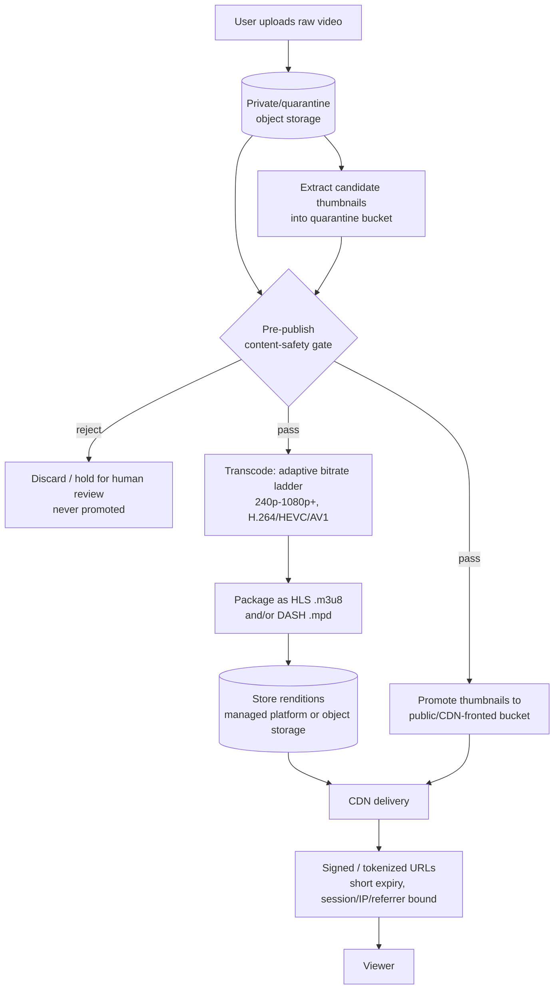
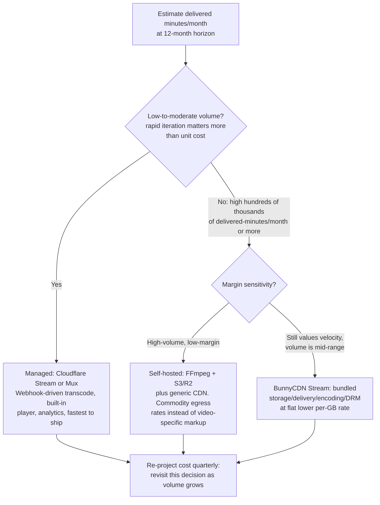

# Managed Video Streaming Pipeline

Architect the path from a user's raw video upload to an efficiently delivered,
access-controlled stream — on a managed platform or a self-hosted stack —
without racing moderation or misjudging unit economics.

## When to Use

✅ **Use for**:
- Designing an ingest → transcode → package → deliver pipeline for
  user-generated or on-demand video
- Choosing between Cloudflare Stream, Mux, BunnyCDN Stream, or a self-hosted
  FFmpeg + S3/R2 + CDN stack
- Projecting hosting cost as delivered-minutes/GB scale grows
- Designing a safe thumbnail/preview generation flow that respects a
  content-safety moderation gate
- Deciding between DRM, forensic watermarking, or both for leak protection
- Designing signed/tokenized URL delivery for private or paywalled video

❌ **NOT for**:
- Live/real-time video calls, WebRTC signaling, or peer-to-peer media —
  see `webrtc-adhoc-video-chat`
- General CDN cache-header/cache-key tuning for static assets (JS, CSS,
  images) unrelated to video — see `cdn-setup-and-delivery`
- Building the actual content-safety classifier model — this skill assumes a
  classification gate exists (human review queue, ML classifier, or vendor
  API) and designs the pipeline *around* it
- Video editing UI/UX, timeline editors, or client-side player skinning

---

## Core Process



**The one rule that matters most**: nothing reachable by a viewer — video
renditions or thumbnails — is written to a public/CDN-fronted bucket
synchronously in the upload response. Everything lands in private/quarantine
storage first and is only promoted after the content-safety gate passes. See
`references/safe-thumbnail-and-moderation-gate.md` for the full pattern and a
sequence diagram of the race condition this prevents.

---

## Decision 1: Managed Platform vs. Self-Hosted



**Pricing models differ in *shape*, not just rate** — comparing them by a
single "$/month" number without modeling your own stored + delivered minutes
is the most common mistake here:

| Platform | Billing dimensions | Shape |
|---|---|---|
| Cloudflare Stream | minutes stored + minutes delivered | ~$5/1000 min stored/mo + ~$1/1000 min delivered — flat regardless of resolution |
| Mux | storage + delivery + encoding + analytics, billed separately | multi-dimensional; analytics/encoding line items are easy to underestimate |
| BunnyCDN Stream | bundled storage/delivery/encoding/DRM | flat per-GB, lower absolute rate, better at high volume |
| Self-hosted (FFmpeg + S3/R2 + generic CDN) | storage $/GB + egress $/GB, no video-specific markup | commodity CDN egress (~$0.085/GB CloudFront on-demand) vs. specialist video CDNs (~$0.002-$0.01/GB at volume) — a 10-40x spread |

Full pricing tables, worked cost projections, and the breakeven math live in
`references/provider-economics.md`. Run `scripts/cost_projector.py` (stdlib
only, no deps) to project your own numbers instead of eyeballing it:

```bash
python3 scripts/cost_projector.py --stored-minutes 50000 --delivered-minutes 400000 --avg-bitrate-mbps 3
```

---

## Decision 2: DRM vs. Watermarking vs. Both

DRM and forensic watermarking solve **different threats** — treat them as
complementary layers, not alternatives:

| Threat | DRM (Widevine/FairPlay/PlayReady) | Forensic/session watermarking |
|---|---|---|
| Casual redistribution (copy the file, re-upload) | Stops it — encrypted stream needs a licensed player | Does not stop it |
| Screen recording ("analog hole") | Does not stop it | N/A — not a blocking control |
| Tracing a leaked file to its source | Not designed for this | Embeds a per-session/per-account ID in decoded frames — traces the leak |
| Implementation cost | High — multi-DRM service, licensed player SDKs | Lower — invisible watermark encoder in the delivery path |

For UGC platforms where **leak-tracing matters more than blocking casual
capture**, per-session watermarking without full DRM is usually the better
cost/complexity tradeoff. Reserve full multi-DRM for high-value licensed or
paid content where blocking casual downloads is itself the requirement. See
`references/drm-and-watermarking.md` for implementation patterns.

---

## Decision 3: Signed/Tokenized Delivery

Expire delivery URLs in **minutes, not hours**, and bind them to
session/IP/referrer where the CDN supports it. This is a lighter-weight
control than DRM that stops hotlinking and casual link-sharing of "private"
video without the cost of a full DRM integration. See
`references/signed-url-and-token-delivery.md` for provider-specific signing
patterns (Cloudflare Signed URLs, S3 presigned URLs, Mux signed playback IDs).

---

## Anti-Patterns

### Anti-Pattern: Synchronous Public Thumbnail Generation

**Novice**: "Extract a thumbnail right after upload and write it straight to
the CDN-fronted bucket so the UI has something to show immediately — users
hate blank thumbnails."

**Expert**: This optimizes upload-response latency by racing ahead of
moderation. The thumbnail (and the source frames it's drawn from) becomes
publicly reachable before the content-safety gate has run. For any platform
accepting UGC, this is a real production bug, not a hypothetical — a
prohibited frame can be visible, indexed, or screenshotted before it's caught.
Extract candidate thumbnails asynchronously into a private/quarantine bucket,
run the gate, and only promote to public storage on a pass. Show a
placeholder/spinner in the UI until promotion completes; do not shortcut this
for perceived speed.

**Detection**: Any code path where a thumbnail-extraction or upload handler
writes directly to the same bucket/prefix the CDN or public API serves from,
with no intervening moderation check.

### Anti-Pattern: Picking a Minutes-Billed Platform Without a Volume Projection

**Novice**: "Cloudflare Stream's pricing page shows $5/1000 min stored + $1/
1000 min delivered — that's obviously cheap, let's build on it."

**Expert**: Minutes-billed managed platforms are priced for developer
velocity, not for volume. A single popular video re-delivered heavily turns
"$1/1000 min delivered" into a materially higher effective $/TB than a
volume-priced CDN once it scales — the same content served through a generic
CDN at commodity egress rates (or a purpose-built video CDN charging
$0.002-$0.01/GB at volume) can be 10-40x cheaper per GB delivered. This is a
first-order unit-economics decision, not a minor optimization to revisit
later — run the projection *before* committing to the managed platform's
transcode/webhook/player integration, because migrating off it later means
re-encoding and re-plumbing delivery.

**Detection**: A platform choice justified by the per-unit rate on the
pricing page with no `stored_minutes x delivered_minutes x projected_growth`
calculation attached. Run `scripts/cost_projector.py` before deciding.

### Anti-Pattern: Treating DRM as a Substitute for Watermarking (or Vice Versa)

**Novice**: "We added Widevine DRM, so leaked clips aren't our problem
anymore" — or the inverse — "we watermark every session, so we don't need
DRM."

**Expert**: DRM stops casual redistribution of the encrypted file but does
nothing against someone recording their screen; watermarking does nothing to
*prevent* capture but lets you trace a leaked file back to the session that
captured it. A platform that only ships DRM will still see leaked screen
recordings circulate untraceably. A platform that only ships watermarking
will still see the raw stream trivially re-hosted by anyone willing to skip
the licensed player. Pick based on which threat matters more for the content
tier, and know that "we have anti-piracy" is not a single checkbox.

**Detection**: A security/compliance doc that says "DRM: yes" or
"watermarking: yes" without stating which threat (redistribution vs.
leak-tracing) it's mitigating.

---

## References

Consult these for deep dives — they are NOT loaded by default:

| File | Consult when |
|------|-------------|
| `references/provider-economics.md` | Comparing Cloudflare Stream, Mux, BunnyCDN, and self-hosted cost structures, or building a cost projection |
| `references/safe-thumbnail-and-moderation-gate.md` | Designing the quarantine → classify → promote flow for thumbnails or clips |
| `references/drm-and-watermarking.md` | Deciding on DRM, watermarking, or both, and picking a multi-DRM vendor |
| `references/signed-url-and-token-delivery.md` | Implementing expiring, session/IP-bound delivery URLs on a specific provider |
| `references/adaptive-bitrate-and-packaging.md` | Designing the ABR rendition ladder, choosing HLS vs. DASH, or picking segment duration/codec |
| `scripts/cost_projector.py` | Running a concrete stored/delivered-minutes cost comparison across platforms |
