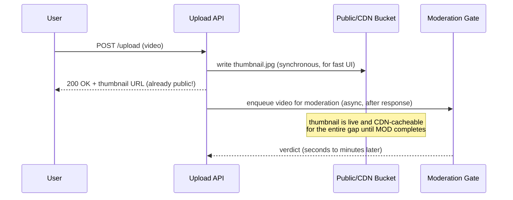
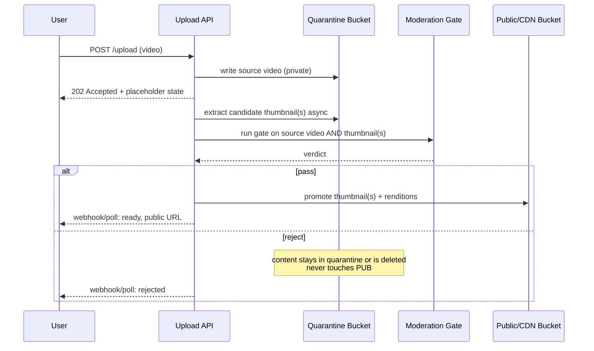

# Safe Thumbnail and Moderation Gate Pattern

Read this when designing how thumbnails, preview clips, or first-frame
images get from an uploaded video to a public-facing UI without racing ahead
of content moderation. This pattern applies to **any** platform accepting
UGC video, not just adult-content platforms — a cooking app, a game clip
site, and a corporate training portal all have the same race condition risk
whenever "show a thumbnail fast" is treated as more urgent than "never show
an un-reviewed thumbnail."

## The bug this prevents

The common production mistake: optimize the upload API response for
perceived speed by extracting a thumbnail synchronously and writing it
directly to the bucket the CDN/public API serves from, so the client can
render it immediately after upload completes. This looks like good UX
engineering. It is actually a moderation bypass — the thumbnail (and by
extension, a frame of the source video) is now publicly reachable before any
content-safety check has run against it. If the source video violates policy,
that frame can be visible, cached by the CDN, indexed by a crawler, or
screenshotted by another user in the window between upload and moderation
completing — even if that window is only seconds long.

## Sequence: what goes wrong

By the time the moderation verdict arrives, the thumbnail has already been
public for however long the queue took — and a CDN may have cached it, which
means a purge is required even after rejection.

## Sequence: the correct pattern

The client shows a placeholder or spinner state until the promotion step
completes. This is a UX tradeoff — slightly slower perceived availability —
in exchange for a moderation guarantee that has no exceptions.

## Design requirements

1. **Two buckets, two IAM boundaries.** The quarantine bucket must not be
   readable by the CDN or any public API path. Enforce this with bucket
   policy, not just application logic — application bugs should not be able
   to make quarantined content public.
2. **Gate runs on the thumbnail AND the source.** A classifier tuned on full
   video may miss things a static extracted frame reveals differently (or
   vice versa) — run the check against whatever will actually become public.
3. **Promotion is the only path to public.** No code path writes to the
   public bucket except the post-gate promotion step. Grep your codebase for
   any handler that writes to the public/CDN bucket and verify it's
   downstream of a moderation check, not the upload handler itself.
4. **Rejection leaves no trace in public storage.** If a CDN already cached
   something before you close this gap (e.g., during a migration), purge is
   mandatory as part of the rejection path.
5. **Handle multiple candidate thumbnails the same way.** If you extract
   several candidate frames and let the uploader (or an algorithm) pick the
   best one, *all* candidates sit in quarantine — the gate must clear before
   any candidate is shown, not just the one ultimately chosen.
6. **Time budget for the gate is a product decision, not just an engineering
   one.** A fast automated classifier (sub-second) makes "pending" states
   nearly invisible to users. A human review queue can take minutes to hours
   — decide explicitly whether that's acceptable for your product surface
   (e.g., dating app profile video vs. internal team-standup recording) and
   communicate the pending state accordingly.

## Related

See `references/drm-and-watermarking.md` if the same content also needs
leak-tracing after it's promoted, and the main `SKILL.md` Core Process
diagram for how this gate sits inside the full ingest-to-delivery pipeline.
