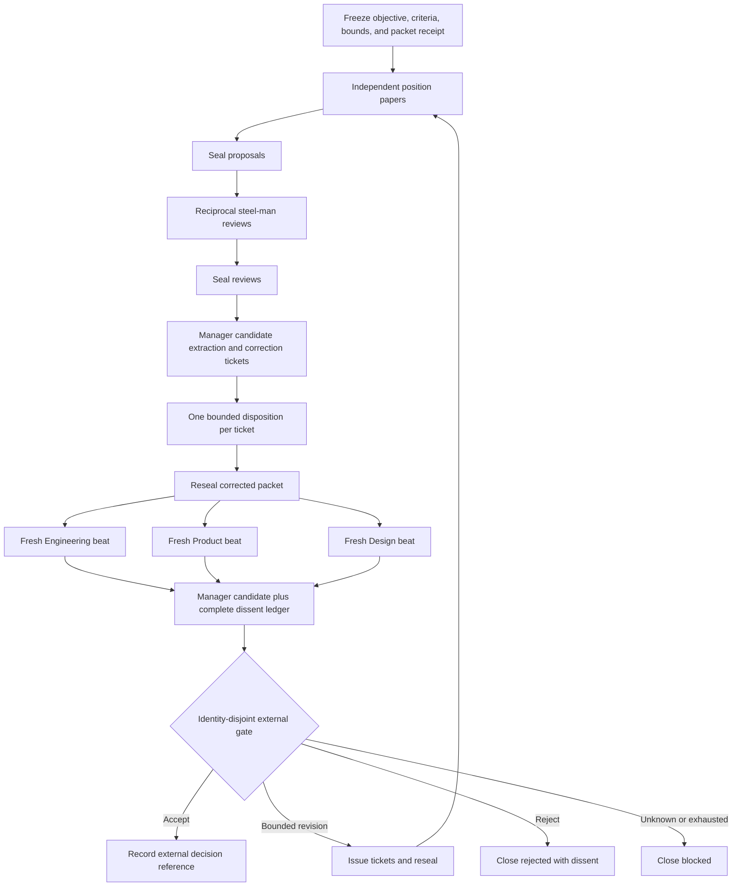

# Manager-Driven Team Orchestrator

The manager organizes a finite epistemic process. It does not run a fleet, admit a participant, reserve capacity, approve its own synthesis, or certify shipment. Its strongest terminal is **candidate submitted for independent review**.

Use [Independent review boundary](references/independent-review-boundary.md) for packet-digest and external-gate limits.

## Activate when

- a consequential constitution, charter, or architecture settlement needs independent positions;
- inputs can be frozen and digest-bound before review;
- reciprocal steelmans and durable dissent are mandatory;
- correction rounds need hard bounds;
- fresh Engineering, Product, and Design beats must challenge the corrected packet.

## Do not activate for

- launching agents, invoking a fleet, or choosing runtime topology;
- incident response, personnel management, or ordinary project tracking;
- one writer plus one reviewer;
- any process where the manager defines criteria after seeing evidence;
- any request for manager sign-off as the final authority.

## Frozen-packet rule

Every artifact binds one supplied receipt: packet ID, repository anchor, packet digest, digest algorithm, file count, truth state, runtime authority, included classes, exclusions, and optional superseded digest.

- Late evidence invalidates the active round. Reseal and restart every affected downstream phase.
- Corrections are overlays; they never mutate sealed originals.
- A supplied packet receipt names static bytes; verifying the digest against an available canonical encoding can bind those bytes. The bundled auditor compares supplied digest strings without reading the packet files. It grants no execution, review, merge, settlement, or spawn authority.
- Packet sealing and external acceptance are inputs to this skill, not powers it owns.

## Bounded lifecycle



## Role separation

| Role | May do | Must not do |
|---|---|---|
| Position author | State proposal, invariants, evidence, falsifiers | edit another position; accept itself |
| Reciprocal reviewer | steelman, tension, critique, concession, amendment, dissent | rewrite source; issue terminal verdict |
| Manager | candidate consensus, conflict map, correction tickets, submission | author orthodoxy; spawn; admit; approve |
| Correction author | one ticket disposition and exact claim delta | add role, authority, runtime action, or second correction |
| Fresh EM beat | buildability, dependencies, owners, tests, impossibilities | upgrade static evidence to runtime proof |
| Fresh PM beat | first safe job, exclusions, hypotheses, user harms | invent demand, law, custody, or labor conclusions |
| Fresh Design beat | journeys, authority distinctions, accessibility, comprehension | treat mockups as operability or enforcement |
| External gate | return a separately supplied decision | be impersonated by the manager |

## Bounds fixed before round one

- `maxRounds`
- `maxConcurrentContributors`
- `maxTotalBirths`
- `maxSpawnDepth` (must be `0` for manager-originated spawning)
- `maxAttemptsPerArtifact`
- `maxCorrectionAttemptsPerTicket` (must be `1`)
- `deadline`
- native capacity ceilings

Birth ceilings are accounting limits, not admission. Real participants require externally supplied admission evidence. Capacity stays in native units; do not invent conversions among tokens, subscription allowance, cash, people, attention, and wall time.

The bundled auditor is a static semantic checker. Its fixture harness supplies a fixed evaluation clock and verifies that the fixture deadline is strictly after it; this is reproducible test evidence, never trusted current-time or runtime authority. A runtime policy must supply a trusted fresh clock and separately prove enforcement. The record has no historical round, birth, concurrency, or artifact-attempt ledger, so the auditor checks declared bounds, not their enforcement. It also cannot authenticate an external decision or verify who withdrew dissent from the current fields.

## Review contract

Each reciprocal review includes:

1. the opposing thesis and mechanism;
2. its evidence and falsifier;
3. the outcome it is trying to protect;
4. unresolved tension;
5. critique plus a falsifier for the critique;
6. one narrow amendment;
7. the reviewer's own concession;
8. retained dissent.

No critique is eligible before the three-field steelman is complete.

## Correction contract

Each ticket gets exactly one of `ACCEPT`, `REJECT_WITH_EVIDENCE`, or `CLARIFY`. It records exact claim delta, preserved invariants, evidence, truth labels, and surviving dissent. It cannot create a participant, role, authority, runtime action, or second correction round.

## Terminals

Manager status is one of `SUBMIT_FOR_INDEPENDENT_REVIEW`, `REWORK_REQUIRED`, or `BLOCKED`. External status may later be `ACCEPTED`, `REJECTED`, or `REVISION_REQUESTED`, but only with a supplied external decision reference.

Exhausted rounds, attempts, deadline, or capacity close `BLOCKED` with dissent intact. There is no “loop until agreement” transition.

## Anti-patterns

### Sovereign Manager

**Wrong:** the manager sets criteria, summarizes evidence, and approves shipment.

**Right:** criteria are frozen first; the manager submits a candidate to an identity-disjoint gate.

### Birth by prose

**Wrong:** “add another reviewer” activates a worker.

**Right:** it creates only a bounded role proposal awaiting external admission and capacity evidence.

### Consensus erases dissent

**Wrong:** repeated rounds make disagreement disappear.

**Right:** terminate at bounds and preserve every retained dissent record.

### Static green becomes runtime proof

**Wrong:** valid packet and schema imply governed execution.

**Right:** dynamic claims remain `BLOCKED_BY_HALT` until independent runtime evidence exists.

## Output and validation

- [`schemas/bounded-synthesis-v2.schema.json`](schemas/bounded-synthesis-v2.schema.json) — closed record contract.
- [`examples/valid-static-cycle.json`](examples/valid-static-cycle.json) — complete proposal-to-submission fixture.
- [`scripts/audit-bounded-synthesis.mjs`](scripts/audit-bounded-synthesis.mjs) — pure semantic auditor.
- [`scripts/test-bundle.mjs`](scripts/test-bundle.mjs) — adversarial mutations.
- [`references/protocol-and-authority.md`](references/protocol-and-authority.md) — packet, role, dissent, and external-gate semantics.
- [`tests/activation.md`](tests/activation.md) — activation corpus.

```bash
node skills/manager-driven-team-orchestrator/scripts/audit-bounded-synthesis.mjs \
  skills/manager-driven-team-orchestrator/examples/valid-static-cycle.json
node skills/manager-driven-team-orchestrator/scripts/test-bundle.mjs
```

Static success never authorizes birth, execution, merge, settlement, or shipment.

## Evidence and Book candidate

The reference uses W3C PROV-O at vocabulary-only access depth. It supports provenance terminology, not independent review, participant admission, or runtime enforcement. **Book candidate, not Book prose:** a manager can synthesize a bounded, dissent-preserving candidate without becoming its acceptance authority. Compare with `ASTRA-BOOK-REVIEW.md` and `BOOK-PLACEMENT-REVIEW.md` before asserting novelty or placement.
