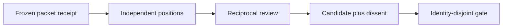
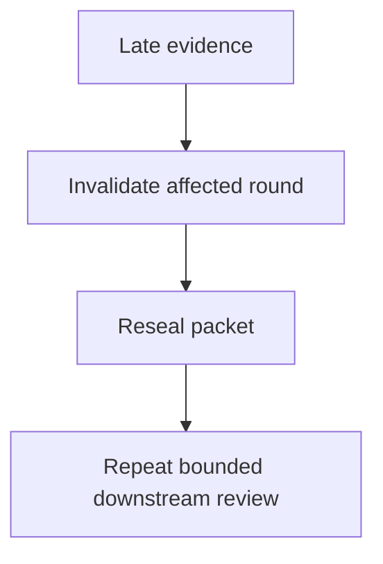

# Independent review boundary

[W3C PROV-O Recommendation (30 April 2013)](https://www.w3.org/TR/prov-o/) was inspected as provenance vocabulary. **Accessed:** 2026-09-24. **Access depth:** vocabulary only. A packet digest binds included named bytes; it does not establish that described activities occurred or that a claim is true, and does not confer admission, execution, acceptance, or shipment authority.

