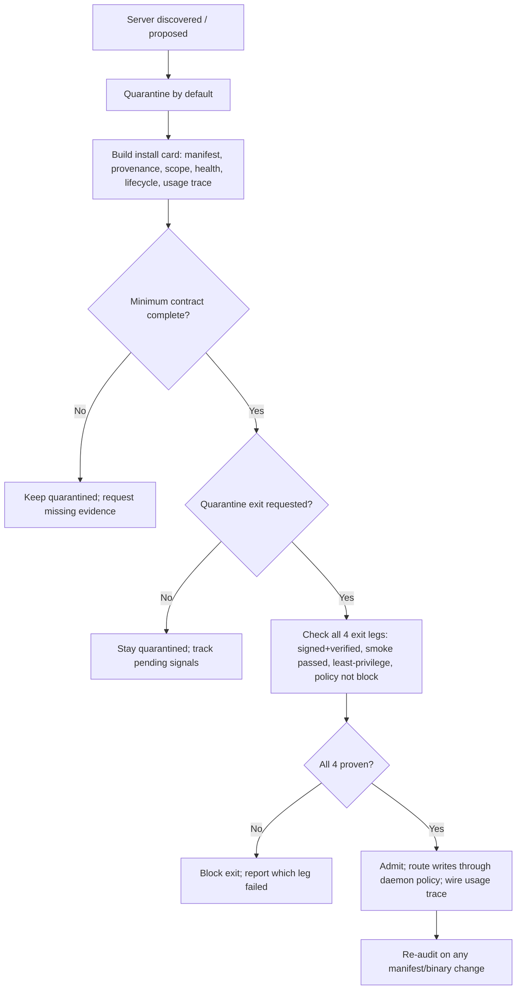

# MCP Trust Broker

Decide whether a third-party MCP server is safe to admit into the fleet's tool
palette — not just whether it installs.

## Use This For

- Reviewing a newly discovered or proposed MCP server's install card against
  the minimum MCP contract before it ever runs.
- Deciding whether a quarantined server's request to exit quarantine is backed
  by proven provenance, a passed sandbox smoke test, and a least-privilege
  scope — not just a publisher's say-so.
- Setting or auditing team admission policy (allow / approve / block) for a
  given server.
- Confirming every write-capable tool a server exposes routes through daemon
  policy rather than executing directly.
- Re-auditing a previously-admitted server after its manifest or binary
  changes.

## Do Not Use This For

- General ocap/mTLS/signed-envelope cryptography theory for agent-to-agent
  communication (`agentic-zero-trust-security`).
- Building an MCP server from scratch, or its tool/schema design — this skill
  only vets a server someone else built.
- Adversarially proving a sandbox's isolation boundary holds against SSRF,
  path traversal, or resource exhaustion (`sandboxed-adversarial-test-harness`)
  — this skill checks that a smoke test happened and passed, not how sound the
  sandbox itself is.

## Admission Decision

1. **Default to quarantine.** Every newly discovered or proposed MCP server
   starts under review, with nothing granted yet.
2. **Build the install card.** Populate all six minimum-contract fields:
   manifest presence, provenance + signature verification, declared permission
   scope, sandbox smoke test result, health check, disable/repair/uninstall,
   usage trace. See `references/mcp-minimum-contract.md`.
3. **Check the minimum contract unconditionally.** A missing manifest blocks
   review outright; missing health check, lifecycle controls, or usage trace
   are contract gaps regardless of quarantine state.
4. **If quarantine exit is not yet requested**, track pending signals
   (undeclared scope, not-run smoke test) without blocking — that's what
   quarantine is for. See `references/quarantine-and-provenance-verification.md`.
5. **If quarantine exit is requested**, require all four legs positively
   proven: signed-and-verified provenance, a passed (not just attempted)
   sandbox smoke test, a least-privilege (not broad or undeclared) scope, and
   a team policy that is not `block`.
6. **Confirm write-tool routing** through daemon policy independent of the
   quarantine decision — a server can be fully vetted and still wrong if its
   write tools bypass daemon policy.
7. **Run `scripts/mcp_admission_audit.mjs`** against the admission spec and
   gate the decision on `pass: true`. Re-audit whenever the manifest or
   binary changes — a changed binary invalidates a previously-verified
   signature.

## Output Contract

- `server`: install-card fields — manifest, provenance, signature
  verification, permission scope, sandbox smoke test, health check, lifecycle
  controls, usage trace.
- `quarantine.exitRequested`: whether this audit is evaluating an exit
  request or an in-quarantine status check.
- `teamPolicy`: allow / approve / block / none.
- `writeToolsRouteThroughDaemonPolicy`: whether write tools bypass the daemon.

Use `scripts/mcp_admission_audit.mjs` to audit an admission-request JSON and
return `{ pass, score, findings, recommendations }`.

## Anti-Patterns

### Quarantine Exit On A Publisher's Say-So

**Novice**: "The publisher says it's signed and tested, so let's turn it on."
**Expert**: Exit requires all four legs *positively proven* on the record —
signed AND signature-verified, a *passed* smoke test, a *least-privilege*
scope, and team policy that isn't `block`. `unsigned`, `unknown`, `not-run`,
`failed`, `broad`, and `undeclared` are all "not proven," not "probably fine."
**Detection**: `mcp_admission_audit.mjs` fires `quarantine-exit-without-provenance`,
`quarantine-exit-without-smoke-test`, `quarantine-exit-undeclared-scope`, or
`team-policy-blocks-exit` (all critical) whenever `quarantine.exitRequested`
is true and the corresponding leg isn't positively proven.

### Contract Gaps Hidden Behind A Working Install

**Novice**: "It installed fine and the tools work, so it's admitted."
**Expert**: A working install is not the same as a complete admission record.
Health check, lifecycle controls, and usage trace are required unconditionally
— a server nobody can disable, or whose failures vanish into stderr, is not
safely admitted no matter how well its happy path works.
**Detection**: `mcp_admission_audit.mjs` fires `no-manifest` (critical),
`no-health-check` / `no-lifecycle-controls` / `no-team-admission-policy`
(high), and `no-usage-trace` (medium) independent of quarantine state.

### Write Tools That Skip The Daemon

**Novice**: "The server's write tools work directly against the filesystem/API
— it's faster and the server is already trusted."
**Expert**: Every write-capable tool an MCP server exposes must route through
daemon policy, full stop. Trust in the server's provenance is not a substitute
for the daemon's own enforcement of what a write is allowed to touch.
**Detection**: `mcp_admission_audit.mjs` fires `write-tool-bypasses-daemon-policy`
(critical) whenever `writeToolsRouteThroughDaemonPolicy` is not `true`,
regardless of every other field's value.

## References

| File | Load When |
| --- | --- |
| `references/mcp-minimum-contract.md` | Need the six required install-card fields and why `teamPolicy: 'none'` is not a safe default. |
| `references/quarantine-and-provenance-verification.md` | Need the four-legged quarantine-exit gate, or why "signed" without verification isn't provenance. |
| `examples/expected-output.md` | Need a rushed admission request audited, then the same server after remediation. |
| `templates/output-template.md` | Need a reusable MCP admission-audit template. |
| `schemas/mcp-admission-request.schema.json` | Need to validate an admission-request JSON payload before auditing it. |
| `scripts/mcp_admission_audit.mjs` | Need deterministic scoring of an MCP server's admission readiness. |
| `agents/openai.yaml` | Need a subagent descriptor for delegated MCP admission review. |

<!-- BEGIN BUNDLE INDEX (auto: index_references.py) -->

## Skill Bundle Index

*Every file in this skill, and when to open it. Auto-generated; run `scripts/index_references.py --fix`.*

**root**
- [`CHANGELOG.md`](CHANGELOG.md) — MCP Trust Broker — Changelog — - Initial skill creation - Core quarantine-exit gate process defined - Reference files and deterministic admission audit script added
- [`README.md`](README.md) — MCP Trust Broker — Procedural guidance for vetting a third-party MCP server before it can run — install cards, provenance/signature verification, least-privile

**`agents/`**
- [`agents/openai.yaml`](agents/openai.yaml) — openai (data/schema)

**`examples/`**
- [`examples/expected-output.md`](examples/expected-output.md) — Example Output: MCP Trust Broker — Scenario: `acme-widgets-mcp`, a third-party MCP server discovered via the official registry, is being reviewed for admission into the fleet'
- [`examples/sample-input.json`](examples/sample-input.json) — sample input (data/schema)

**`references/`**
- [`references/mcp-minimum-contract.md`](references/mcp-minimum-contract.md) — The MCP Minimum Contract — Use this when deciding whether an MCP server's install card is complete enough to review at all — before touching the quarantine-exit gate.
- [`references/quarantine-and-provenance-verification.md`](references/quarantine-and-provenance-verification.md) — Quarantine And Provenance Verification — Use this when a specific MCP server is requesting to exit quarantine and run for real — the moment where "still under review" becomes "live 

**`schemas/`**
- [`schemas/mcp-admission-request.schema.json`](schemas/mcp-admission-request.schema.json) — mcp admission request.schema (data/schema)

**`scripts/`**
- [`scripts/mcp_admission_audit.mjs`](scripts/mcp_admission_audit.mjs)

**`templates/`**
- [`templates/output-template.md`](templates/output-template.md) — MCP Admission Audit: [Server Name] — - Manifest present: [yes/no] - Provenance: [signed/unsigned/unknown] — signature verified: [yes/no] - Permission scope: [least-privilege/bro

<!-- END BUNDLE INDEX -->
