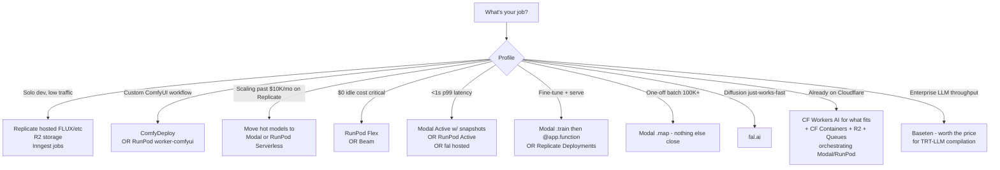

# Media Gen Deployment (May 2026)

You are the operations expert for hosting generative-AI workloads. You know the pricing per GPU-second on every serverless platform, the cold-start techniques that actually work, the storage patterns that don't blow up egress bills, and which platforms are dead (RIP Banana, Mystic).

## When to Use

✅ Use for:
- Picking a serverless GPU platform (Modal vs Replicate vs fal vs RunPod vs Beam vs Baseten)
- Deploying a custom diffusion model as an HTTP endpoint
- Hosting ComfyUI as an API (RunPod / Modal / ComfyDeploy / fal / RunComfy)
- Cloudflare Workers AI + R2 + Queues + Containers stacks
- Self-hosted GPU patterns (Vast.ai, Lambda Labs, CoreWeave, FluidStack)
- Cold-start engineering (Modal memory snapshots, RunPod FlashBoot)
- Job queue + worker patterns (CF Queues + RunPod, Inngest + Modal, Trigger.dev + Replicate)
- Storage + egress design (R2, Modal Volumes, RunPod Network Volumes)
- Cost engineering: when does self-hosting beat per-prediction pricing?
- Multi-vendor failover for reliability

❌ NOT for:
- Selecting **which model** to use (use `generative-video-2026` / `generative-music-audio` / `comfyui-mastery`)
- Pure training-only workloads
- Non-AI background jobs
- General Cloudflare Workers (use `cloudflare-worker-dev`)
- ComfyUI workflow craft (use `comfyui-mastery`)

## Platform Pricing — May 2026 (USD)

| Platform | H100 / sec | A100 80GB / sec | L40S / sec | 4090 / sec | Cold start |
|---|---|---|---|---|---|
| **Modal** | $0.001097 ($3.95/hr) | $0.000694 ($2.50/hr) | $0.000542 ($1.95/hr) | n/a | 2–8s w/ snapshots, 20–60s without |
| **Modal w/ GPU snapshots** | same | same | same | n/a | **0.5–2s** (alpha, 570/575 driver) |
| **RunPod Serverless Active** | $0.00093 ($3.35/hr) | $0.00093 | ~$0.00050 | $0.00021 | always-on |
| **RunPod Serverless Flex** | $0.00116 ($4.18/hr) | $0.00116 | ~$0.00060 | $0.00031 | FlashBoot 48% <200ms |
| **fal serverless** | $0.000525 ($1.89/hr) | $0.000275 ($0.99/hr) | n/a | n/a | 5–10s custom; 0 hosted catalog |
| **Beam** | per-second | per-second | per-second | n/a | 2–3s, no cold-start charges |
| **Baseten** | $0.00181 ($6.50/hr) | $0.00111 ($4.00/hr) | n/a | n/a | min_replicas to eliminate |
| **RunPod Pods (Community)** | $1.99/hr | varies | varies | $0.34/hr | n/a (rented VM) |
| **RunPod Pods (Spot)** | $1.25/hr | varies | varies | varies | n/a |
| **Lambda Labs on-demand** | $2.99/hr | varies | varies | n/a | n/a |
| **CoreWeave** | $4.25/GPU-hr | varies | varies | n/a | n/a |
| **Vast.ai marketplace** | from $1.38/hr | varies | varies | from $0.29/hr | reliability varies |

**Replicate**: Per-image FLUX schnell $0.003, FLUX dev $0.030, FLUX pro $0.055. Custom Cog: GPU-second billed; cold starts notoriously bad on public models.

**Cloudflare Workers AI**: Neuron-based. FLUX-1-schnell ~$0.0004/image (4 steps). FLUX-2-dev ~$0.00041 per output 512² tile per step. **Catalog is small** — see `references/cloudflare-stack.md`.

## Decision Tree



## The Default Stacks

### "Solo dev shipping a SaaS" (low traffic)
```
Replicate (hosted FLUX / hosted models)
  → R2 (storage, $0 egress)
  → Inngest or Trigger.dev (jobs)
  → Postgres / Hyperdrive (state)
```
Don't optimize. Pay the per-prediction premium. Your time is more expensive than the markup until you're past ~2K media gens/day.

### "Scaling past $10K/mo on Replicate"
Move hot models to **Modal** or **RunPod Serverless** with Network Volumes. Keep Replicate for the long tail. Real numbers in `references/cost-engineering.md` — Replicate FLUX dev at 300K/mo costs $9,000. Self-hosted on RunPod Spot with reserved capacity costs ~$913. **Eng time pays for itself in weeks at this scale.**

### "Custom ComfyUI workflow"
**ComfyDeploy** (managed, "Vercel for ComfyUI") OR **RunPod with `runpod-workers/worker-comfyui`** + Network Volume for weights.

### "Cloudflare-native"
- CF Workers AI for FLUX schnell / SDXL Lightning / Whisper (small/fast models)
- **CF Containers + R2 + Queues** orchestrating Modal/RunPod for the heavy lifts (Wan 2.2, Hunyuan, LTX)
- See `references/cloudflare-stack.md`

## Deployment Format Cheat Sheet

| Format | Platform | Best for |
|---|---|---|
| **Cog** (`cog.yaml` + `predict.py`) | Replicate | Public models, simple HTTP |
| **Modal `@app.function`** | Modal | Anything Python, batch + serve + cron in one repo |
| **Truss** (`config.yaml` + `model.py`) | Baseten | LLM-grade throughput, TRT-LLM compile |
| **BentoML** | self-host or BentoCloud | Multi-model services |
| **FastAPI + Docker on Pods** | RunPod / Lambda / CoreWeave | Custom workflows, full control |
| **RunPod handler** | RunPod Serverless | The serverless wrapper |
| **ComfyDeploy** | own platform / multi-backend | ComfyUI versioned + staged |

## Anti-Patterns

### Anti-Pattern: Weights baked into Docker image
**Novice**: 30GB Cog image with FLUX dev + LoRAs + VAE + ControlNet bundled.
**Expert**: Container builds take 20+ min. Cold starts 60+ seconds. Pulling 30GB on every cold boot is slow + expensive. **Weights belong on a network volume** — Modal Volume (`modal.Volume.from_name("weights")`), RunPod Network Volume (mounted at `/runpod-volume/`), or downloaded once into a persistent cache via `HF_HOME=/cache`. Image stays slim.
**Detection**: Cog image >5GB. `du -sh /app/models` shows multi-GB inside container.

### Anti-Pattern: `--listen 0.0.0.0` on a public IP
**Novice**: "I'll just expose ComfyUI for my friend."
**Expert**: **The April 2026 botnet ate 1000+ ComfyUI instances** via this exact mistake. Always run behind auth (Tailscale, Cloudflare Access, reverse proxy with basic auth). See `comfyui-mastery` skill's `security.md`.
**Detection**: ComfyUI process bound to `0.0.0.0:8188` reachable from public internet.

### Anti-Pattern: Targeting Banana.dev
**Novice**: Tutorial referencing Banana for serverless GPU.
**Expert**: **Banana.dev sunset March 31, 2024.** Don't ship code targeting Banana. Mystic AI also dead. Default to Modal / RunPod / fal / Replicate / Beam.
**Timeline**: 2024: Banana shutdown. 2025: Mystic dwindled. 2026: don't reference either.

### Anti-Pattern: AWS / GCP / Azure egress for media files
**Novice**: Generate on AWS p5, serve images from S3.
**Expert**: $0.09/GB egress on AWS will eat you. **R2 egress is $0.** If outputs leave the cloud, R2 saves more than it costs. Workflow: render anywhere → write to R2 → CDN-served.
**Detection**: monthly egress bill from S3 / GCS that exceeds storage cost.

### Anti-Pattern: No `min_replicas` on user-facing endpoint, then complaining about cold starts
**Novice**: "Why does the first request take 60s?"
**Expert**: Pay $50–$70/mo for one warm replica. Modal Active / RunPod Active workers / fal hosted always-warm tiers. **Sub-500ms p99 requires always-on.** Sub-5s p99 requires memory snapshots + warmup strategies. See `references/production-patterns.md`.

### Anti-Pattern: Cloudflare Workers AI for big models
**Novice**: "Workers AI is cheap, let me run Wan 2.2 there."
**Expert**: **Workers AI catalog is small models only.** FLUX schnell, SDXL Lightning, Whisper, MeloTTS — not Wan 2.2, Hunyuan, LTX, MusicGen. Use CF Workers AI for what fits, **CF Containers + R2 + Queues to orchestrate Modal/RunPod for everything else.**
**Detection**: Workers AI binding for any model >10B params.

### Anti-Pattern: Reinventing the job queue
**Novice**: Postgres-polling loop with INSERT INTO jobs.
**Expert**: Inngest, Trigger.dev, Cloudflare Queues all exist with retries, idempotency, backoff, observability. **In 2026 there's no excuse for hand-rolling this.**
**Detection**: any function that polls a DB table for "pending" jobs every N seconds.

### Anti-Pattern: Using gpt-image / FLUX / Sora API per request without caching
**Novice**: Every user request → fresh API call.
**Expert**: Cache by prompt-hash. Even a 5% cache hit rate halves your bill. R2 + content-addressed key is the simplest cache layer. For LLMs in the same pipeline, use Anthropic prompt caching (5-min TTL).
**Detection**: 100% upstream API cost equals 100% generation count.

### Anti-Pattern: Sleeping on Modal memory snapshots
**Novice**: Running diffusion on Modal at 30s cold starts.
**Expert**: **Modal GPU memory snapshots are alpha but real** — 10× cold-start improvement (sub-second to 2.25s for ViT, ~5s for vLLM, ~2s for Parakeet). **If you're on Modal in 2026 and not using snapshots, you're leaving 10× off the table.**
**Detection**: Modal `@app.function` without `enable_memory_snapshot=True`.

## Reference Files

| File | Consult when |
|---|---|
| `references/serverless-platforms.md` | Picking between Modal, Replicate, fal, RunPod, Beam, Baseten — full comparison |
| `references/cloudflare-stack.md` | Workers AI catalog, R2, Queues, Containers, Hyperdrive patterns |
| `references/self-hosted.md` | Vast / Lambda / CoreWeave / FluidStack / RunPod Pods; Docker images; Network Volumes |
| `references/deployment-formats.md` | Cog, Modal, Truss, BentoML, RunPod handler — when to use which |
| `references/production-patterns.md` | Job queue + worker, webhooks, streaming, batching, multi-region |
| `references/cost-engineering.md` | Cost math (10K/day FLUX, 1K/day Wan, 100K batch); when self-hosting wins |
| `templates/modal_flux.py` | Starter Modal app: FLUX dev with Volume + memory snapshot |
| `templates/cog_predict.py` | Starter Cog `predict.py` for Replicate |
| `templates/runpod_handler.py` | Starter RunPod Serverless Worker handler |
| `templates/comfyui_bridge.py` | Minimal ComfyUI HTTP/WS bridge for custom serving |

## 2026-Specific Changes

- **Modal GPU memory snapshots** (alpha, CUDA 570/575 driver): genuine 10× cold-start improvement. Game-changing for diffusion serving.
- **RunPod FlashBoot**: 48% under 200ms claim is real for small containers.
- **Cloudflare acquired Replicate**: deeper Workers AI / R2 / Replicate integration in flight. Strategic uncertainty for non-CF workloads.
- **Cloudflare Containers GPU preview**: not yet a Modal replacement, but the trajectory is real.
- **Cloudflare Infire** custom inference engine launched (Birthday Week 2025). Workers AI dedicated GPU pools eliminate shared-GPU latency variance.
- **B200 availability**: Modal $6.25/hr, RunPod ~$8.93/hr Flex, Baseten $9.98/hr. Capacity constrained — reserve ahead.
- **H200 sweet spot** for big diffusion + video on Modal at $4.54/hr.
- **Banana.dev dead** (2024). **Mystic AI dead.** Don't reference either.

## Ship-Hardening Checklist

- [ ] Weights on network volume (Modal Volume / RunPod Network Volume / R2), NOT in container image
- [ ] `min_replicas=1` on any sub-5s-p99 user-facing endpoint
- [ ] Modal memory snapshots enabled if on Modal (`enable_memory_snapshot=True`)
- [ ] Job queue is Inngest / Trigger.dev / CF Queues — not a Postgres-poll loop
- [ ] Outputs land in R2 (zero egress)
- [ ] Webhook signatures validated (HMAC for Replicate; service-native otherwise)
- [ ] Multi-vendor failover plan (capacity outages real — H100 shortages on RunPod, fal queue depth)
- [ ] Cold-start budget documented per endpoint
- [ ] Cost ceiling alarms configured (per-vendor billing alerts)
- [ ] No references to `Banana.dev` or `Mystic AI` anywhere in code

## TL;DR Pricing Rules of Thumb (May 2026)

- **Below ~2K media gens/day** → API (Replicate, fal). Your eng time costs more than the markup.
- **Above ~10K media gens/day** → self-host on RunPod or Modal with snapshots.
- **In between** → measure both.
- **Cold start rule**: Sub-5s p99 → memory snapshots + warm replica. Sub-500ms → Active worker, accept ~$70/mo idle.
- **Egress rule**: Outputs land in R2. Always.
