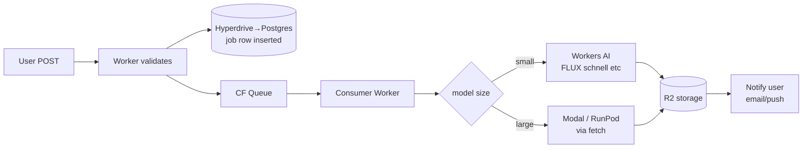

# Cloudflare Stack for Media Gen (May 2026)

Workers AI + R2 + Queues + Containers + Hyperdrive. What CF actually does well, what it doesn't, when to mix it with Modal/RunPod.

---

## Workers AI Catalog (May 2026)

### Image
- `@cf/black-forest-labs/flux-1-schnell` (12B params)
- `@cf/black-forest-labs/flux-2-klein` (9B distilled)
- `@cf/black-forest-labs/flux-2-dev`
- `@cf/bytedance/stable-diffusion-xl-lightning`
- `@cf/runwayml/stable-diffusion-v1-5-img2img`
- **FLUX.1 [pro] is NOT on Workers AI.**

### Audio
- `@cf/openai/whisper-large-v3-turbo`
- `@cf/openai/whisper`
- MeloTTS
- **Bark is not in the catalog.**

### What's missing
**Wan 2.x, LTX, Hunyuan, AudioLDM, MusicGen, Stable Audio.** Anything 20B+ params in general.

---

## Pricing (Neuron-based)

- **FLUX-1-schnell**: $0.0001056 per step per 512×512 tile (4 steps default ≈ **$0.0004/image**)
- **FLUX-2-dev**: $0.00041 per output 512×512 tile per step
- Daily free allocation included on Workers Free plan (~10K neurons/day, varies)

---

## R2 — the storage default

- **$0.015/GB/month** storage
- **$0/GB egress** (the killer feature)
- ~$4.50/M Class A ops (writes, lists)
- ~$0.36/M Class B ops (reads)
- **Event notifications → Workers** (auto-trigger workflows on R2 PUT)

This is where generated media should live. **Always.**

---

## Cloudflare Queues

- Guaranteed delivery
- No CPU time limit (wall time only) for queue handlers
- Pattern: user POST → worker validates → enqueue → consumer worker calls upstream GPU → R2 → notify
- Dead-letter queues, retries, batch consumption

---

## Cloudflare Containers (GPU preview)

- Push your own container, run on CF's network.
- **GPU support in production preview** as of 2026.
- Roadmap includes GPU snapshotting and customer-facing wrangler push commands.
- **Not yet a Modal/RunPod replacement for big diffusion models** — but the direction is real.

---

## Hyperdrive + Workers AI Pattern

Standard production architecture:



---

## Honest Assessment

### Use Workers AI when
- ✅ FLUX.1 schnell, SDXL Lightning, or another small/fast model.
- ✅ Edge latency.
- ✅ Sub-cent per image at low volumes.
- ✅ Already on Cloudflare and want one platform.
- ✅ Generating thumbnails / avatars / decorative imagery (not customer-final renders).

### Don't use Workers AI when
- ❌ You want Wan 2.2, Hunyuan, LTX, or any model not in their catalog.
- ❌ You need ComfyUI workflows, custom LoRAs, or model swapping.
- ❌ You want FP16/FP8 control or custom samplers.
- ❌ You're running anything 20B+ params with custom logic.

The gap fills via **CF Containers + R2 + Queues** orchestrating to **Modal / RunPod / fal** for the heavy lifts.

---

## Worker Example — FLUX schnell + R2

```typescript
// wrangler.toml binds: AI (Workers AI), BUCKET (R2), QUEUE (Queue)

export default {
  async fetch(req: Request, env: Env): Promise<Response> {
    const { prompt } = await req.json();
    const jobId = crypto.randomUUID();
    await env.QUEUE.send({ jobId, prompt });
    return Response.json({ jobId });
  },

  async queue(batch: MessageBatch, env: Env) {
    for (const msg of batch.messages) {
      const { jobId, prompt } = msg.body;
      const result = await env.AI.run(
        '@cf/black-forest-labs/flux-1-schnell',
        { prompt, num_steps: 4 }
      );
      // result.image is base64; decode and store
      const buf = Uint8Array.from(atob(result.image), c => c.charCodeAt(0));
      await env.BUCKET.put(`outputs/${jobId}.png`, buf, {
        httpMetadata: { contentType: 'image/png' }
      });
      msg.ack();
    }
  }
};
```

---

## Cloudflare Infire (custom inference engine)

Launched **Birthday Week 2025**. Workers AI dedicated GPU pools eliminate the shared-GPU latency variance that plagued the platform pre-2025. Most Workers AI users see meaningfully better p99 latency in 2026 than they did in 2024.

---

## Replicate × Cloudflare (the 2026 acquisition)

- **Cloudflare acquired Replicate in 2026.** Deeper Workers AI / R2 / Replicate integration in flight.
- R8 hardware integration with CF being announced.
- Strategic uncertainty for non-CF workloads — if you depend on Replicate, watch for changes.
- **For now**: Replicate API still works as documented; long-term it likely converges with CF stack.

---

## Anti-Pattern: "Use Workers AI for Wan 2.2"

It's not in the catalog. It won't be — Wan 2.2 is 14B params at FP16 (28GB+) and Workers AI runs on shared inference pools with size constraints. **Use CF Containers + R2 + Queues to orchestrate Modal / RunPod / fal for these workloads.** Don't try to force-fit big models onto Workers AI.

---

## Quick-Pick

| Need | Pick |
|---|---|
| FLUX schnell at edge | Workers AI directly |
| SDXL Lightning thumbnails | Workers AI directly |
| Whisper transcription | Workers AI (`whisper-large-v3-turbo`) |
| Wan 2.2 / Hunyuan / LTX video | CF Containers + R2 + Queues → Modal / RunPod backend |
| FLUX dev / Kontext (open) | CF Containers + R2 + Queues → fal (cheap H100) or Modal |
| Custom ComfyUI workflow | CF Containers + Queues → RunPod with `worker-comfyui` |
| Storage for any output | **R2, always.** $0 egress. |
| Job queue | **CF Queues** if already on CF; Inngest / Trigger.dev otherwise |

For broader serverless platforms, see `serverless-platforms.md`. For deployment formats, see `deployment-formats.md`.
