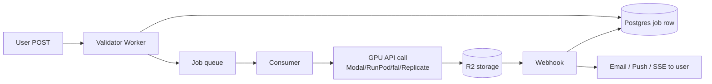

# Production Patterns (May 2026)

The architectures that actually survive contact with real traffic. Job queues, webhooks, streaming, batching, multi-region.

---

## The Job Queue + Worker Pattern (the workhorse)



### Cloudflare Queues + RunPod Serverless
1. User POST → Worker validates, writes job row to Postgres (via Hyperdrive), enqueues to CF Queue.
2. Queue consumer Worker calls RunPod serverless endpoint with webhook URL.
3. RunPod worker generates, uploads to R2, hits webhook.
4. Webhook Worker updates Postgres, sends email/push/SSE.

### Inngest + Modal
```python
@inngest.create_function(fn_id="generate-image", trigger=inngest.TriggerEvent(event="user.generate"))
async def generate(ctx: inngest.Context, step: inngest.Step):
    job = await step.run("decompose", lambda: decompose_prompt(ctx.event.data))
    result = await step.run("generate", lambda: modal_app.spawn(job))
    final = await step.wait_for_event("modal.complete",
                                       timeout="5m",
                                       if_=f"data.job_id == '{job.id}'")
    return final
```
Inngest's automatic retries + step memoization mean a Modal failure only re-runs that step. **Best DX in this list.**

### Trigger.dev + Replicate
```typescript
export const generate = task({
  id: "generate-image",
  run: async ({ prompt }) => {
    const prediction = await replicate.predictions.create({
      version: "black-forest-labs/flux-dev",
      input: { prompt },
      webhook: `${process.env.WEBHOOK_URL}/replicate`,
    });
    return { predictionId: prediction.id };
  }
});
```
Trigger.dev's task dashboard is the cleanest observability story among these three.

---

## Webhook-Driven (Replicate / fal pattern)

Always:
- `predictions.create` with `webhook_completed` URL.
- Store `prediction_id` in DB row.
- **Validate HMAC signature on webhook** (Replicate uses `webhook-id` + `webhook-signature` Svix-format headers).
- Idempotent handler keyed by `prediction_id` (webhooks can fire twice).
- Persist intermediate state — don't lose jobs on webhook delivery failure.

```typescript
// Replicate webhook handler (Cloudflare Worker)
export default {
  async fetch(req: Request, env: Env) {
    if (!await verifySvixSignature(req, env.WEBHOOK_SECRET)) {
      return new Response("Invalid signature", { status: 401 });
    }
    const event = await req.json();
    const { id, status, output } = event;

    // Idempotent: SELECT ... FOR UPDATE then INSERT/UPDATE
    if (status === "succeeded") {
      // Download output, upload to R2, update job row
      const buf = await fetch(output[0]).then(r => r.arrayBuffer());
      await env.BUCKET.put(`outputs/${id}.png`, buf);
      await env.DB.exec("UPDATE jobs SET status=?, output_url=? WHERE id=?",
                       ["completed", `r2://${id}.png`, id]);
    } else if (status === "failed") {
      await env.DB.exec("UPDATE jobs SET status='failed', error=? WHERE id=?",
                       [event.error, id]);
    }
    return new Response("OK");
  }
};
```

---

## Streaming Generation

### Modal
`@web_endpoint(method="POST")` with `fastapi.responses.StreamingResponse` or `WebSocket`. Frame-by-frame for progressive image gen, token-by-token for LLM.

```python
from fastapi.responses import StreamingResponse

@app.function(gpu="H100")
@modal.fastapi_endpoint(method="POST")
def generate(prompt: str):
    def stream():
        for step in pipe.iter_steps(prompt):
            yield f"data: {json.dumps(step)}\n\n"
    return StreamingResponse(stream(), media_type="text/event-stream")
```

### RunPod
- `/runsync` for blocking.
- `/run` + `/stream/{id}` for SSE polling.
- Native streaming on serverless is awkward — RunPod's stream endpoint polls every ~250ms.

### fal
`fal.subscribe()` JS SDK gives queue position + intermediate updates. Best UX of the three.

```typescript
import * as fal from "@fal-ai/serverless-client";

const result = await fal.subscribe("fal-ai/flux/dev", {
  input: { prompt: "..." },
  pollInterval: 1000,
  onQueueUpdate: (update) => console.log(update.status, update.position),
});
```

---

## Batching

Real benefit when GPU isn't saturated by one request.

| Model | Batch helps? |
|---|---|
| FLUX dev on H100 | Saturates at batch=1. Batching doesn't help. |
| SDXL Lightning at 4 steps | Can batch 4–8 with linear throughput improvement. |
| Whisper | Helps a lot — vLLM-style continuous batching. |
| Wan 2.2 14B video | Saturates at batch=1; don't try. |

Modal `.map()` is the right tool for embarrassingly-parallel batches **across requests** (different prompts in parallel) regardless of whether per-request batching helps.

---

## Multi-Region

### For images
- Render close to the GPU (US-west or EU).
- Serve from R2 / CF cache (global edge).
- **Latency for the render doesn't dominate; delivery does.** Cache aggressively.

### For real-time avatars / voice
- Pin GPU and edge to same region.
- Modal regions: us-east, us-west, eu.
- fal: us, eu.
- RunPod: many regions but capacity asymmetric.

### Multi-vendor failover
H100 capacity is regional and spiky. Implement at queue-consumer level: timeout primary at 60s → retry secondary.

```python
async def render(prompt: str) -> str:
    try:
        return await asyncio.wait_for(
            modal_render(prompt), timeout=60)
    except (TimeoutError, ModalCapacityError):
        try:
            return await asyncio.wait_for(
                runpod_render(prompt), timeout=120)
        except (TimeoutError, RunPodError):
            return await fal_render(prompt)  # last-resort premium
```

---

## Cold Start Engineering

| Latency target | Strategy |
|---|---|
| **<500ms p99** | `min_replicas=1` everywhere. Pay always-on. Modal Active / RunPod Active / fal warm pool. |
| **<5s p99** | Modal GPU memory snapshots, RunPod FlashBoot, weights on network volume, container slim. |
| **<30s p99** | Standard serverless, weights in volume. Acceptable for async jobs. |
| **Async only** | Whatever's cheapest. Cold starts irrelevant. |

### Modal memory snapshots
```python
@app.function(gpu="H100", enable_memory_snapshot=True, min_containers=1)
def generate(prompt: str): ...
```
**If you're on Modal in 2026 and not using snapshots, you're leaving 10× off the table.**

### RunPod FlashBoot
- 48% of cold starts under 200ms (small containers).
- Larger containers 6–12s.
- Active workers eliminate cold start entirely.

### fal hosted
"No cold starts" for hosted catalog (always-on warm pools paid for in the per-output markup).

---

## Observability

| Platform | Logs | Metrics | Tracing |
|---|---|---|---|
| Modal | Structured logs in dashboard, OpenTelemetry export, per-function metrics. **Decent.** | Yes | Via OTel |
| Replicate | Per-prediction logs only. **Aggregate metrics weak.** | Limited | No |
| RunPod | Logs per worker, **no aggregate dashboards** worth using. | Ship to Datadog / Better Stack | Ship to Datadog |
| fal | Decent dashboard for hosted catalog, weak for custom endpoints. | Limited | No |

**What's missing across all of them**: end-to-end trace correlation. You're stitching Inngest/Trigger spans + GPU vendor logs + R2 access logs yourself.

Recommendation: ship structured logs with a `trace_id` field to Datadog / Honeycomb / Better Stack from your queue consumer.

---

## Idempotency

Generation requests should be idempotent:
- Hash `(prompt, seed, model_version, params)` → `request_hash`.
- Check cache by hash before generating.
- Even a 5% cache hit halves your bill.
- R2 + content-addressed key is the simplest cache layer.

```typescript
const hash = await sha256(JSON.stringify({ prompt, seed, model, steps }));
const cached = await env.BUCKET.head(`cache/${hash}.png`);
if (cached) return Response.json({ url: `/cache/${hash}.png` });
// ... generate, then await env.BUCKET.put(`cache/${hash}.png`, buf)
```

---

## Security at the Edge

- **Auth on the user-facing endpoint** (Cloudflare Access, basic auth in front of self-hosted, OIDC for SaaS).
- **Webhook signature verification** (Replicate Svix, service-native HMAC).
- **Output URL signing** (R2 presigned URLs, expire in minutes for sensitive content).
- **NSFW / content filtering** at the gateway, not in the worker — filter early to avoid GPU spend on rejected content.
- **Rate limiting per user / per IP** at the Cloudflare edge.

---

## Failure Modes to Plan For

1. **GPU vendor outage** — multi-vendor failover.
2. **Webhook delivery failure** — idempotent handler + reconciliation cron.
3. **Storage write failure post-render** — retry with exponential backoff to R2; fall back to S3.
4. **Slow cold start blowing user's request timeout** — `min_replicas=1` for sub-5s endpoints; async pattern for batch.
5. **Stuck jobs (no completion event after N min)** — reconciliation cron polls vendor APIs for orphans.
6. **Cost runaway** — vendor billing alerts + per-user rate limits + max-spend kill switch.

For cost engineering math (when self-hosting beats per-prediction), see `cost-engineering.md`.
