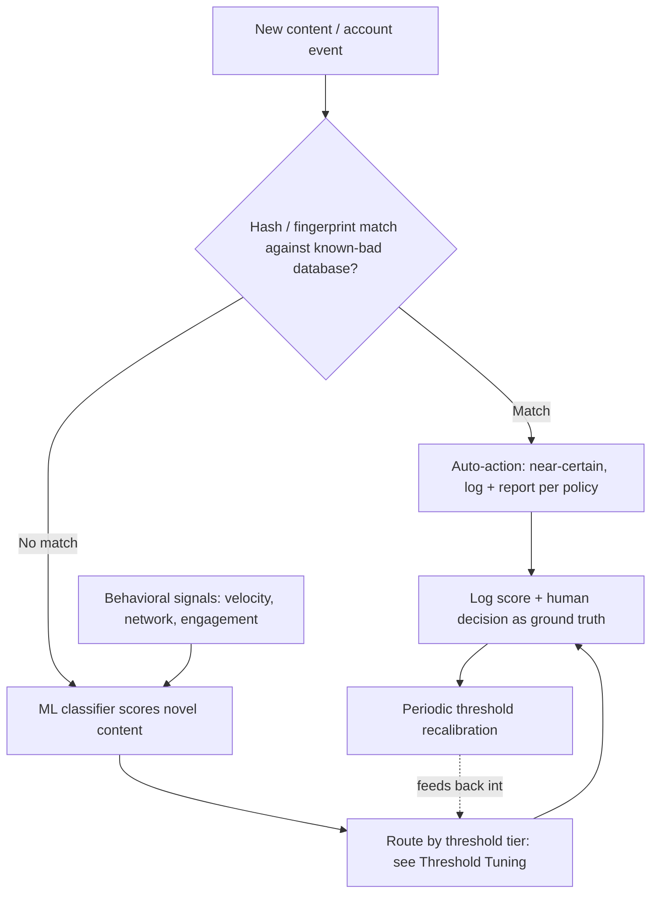
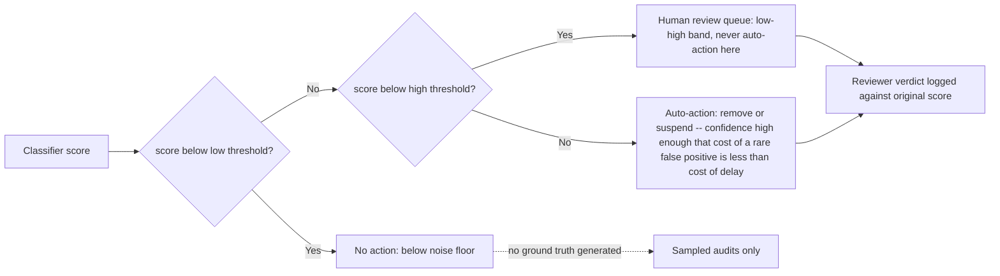

# ML Trust & Safety Signal Detection

Design the automated layer that turns raw content and behavior into
actionable trust & safety signals -- what to flag, how confident to be, and
what happens next.

## When to Use

Use for:
- Integrating a classifier/scoring model (in-house or vendor API) to detect spam, abuse, or policy violations
- Deciding score thresholds for no-action / human-review / auto-action tiers
- Combining hash-matching (known-bad) with ML scoring (novel/unseen) into one detection pipeline
- Adding behavioral signals (velocity, network, engagement anomalies) alongside content classifiers
- Designing the feedback loop that logs reviewer decisions and re-tunes thresholds over time
- Auditing an existing auto-moderation system for false-positive/false-negative imbalance

NOT for:
- Building the review queue UI, case assignment, or reviewer workflow -- see `moderation-triage-routing`
- Writing platform content policy, community guidelines, or legal takedown process
- Training or architecting the underlying ML model (feature engineering, model selection) -- see `mlops-engineer` / `nlp-engineer`
- General code review of a classifier's implementation

---

## Core Process

Every piece of content or account activity should pass through hash-matching
before it ever reaches a probabilistic classifier -- hash matches are cheap,
fast, and near-zero-false-positive, so they short-circuit the expensive,
uncertain step.

### Two Classifier Types (you need both)

| | Hash-matching | ML classifier / scoring |
|---|---|---|
| **Detects** | Previously-identified content (perceptual/fuzzy hash -- survives recompression, cropping, minor edits) | Novel/unseen content via learned patterns |
| **Output** | Match / no match | Probability score (0.0-1.0) |
| **False positive rate** | Near-zero | Inherent, non-zero -- must be designed for, not assumed away |
| **Blind spot** | Anything not already in the hash database | Nothing inherent -- but confidence varies |
| **Treat output as** | Ground truth | A probability, never a verdict |

**Reference architecture (worst case, generalizes down):** for the most
severe content category -- CSAM -- the 2026 state of the art is hash-match
first (Microsoft PhotoDNA against known-bad hashes) then ML classifier
scoring for anything that doesn't hash-match (Thorn Safer or Hive AI's
combined API), feeding a mandatory reporting pipeline (e.g., NCMEC
CyberTipline). The same two-stage shape generalizes to lower-severity
categories: a known-spam-template fingerprint/hash check, plus an ML
toxicity/spam score for novel messages. See
`references/classifier-architecture.md` for the full pipeline breakdown and
how to adapt it to spam/abuse severity levels.

---

## Threshold Tuning Is a Product Decision

A classifier score is a probability, not a verdict. Collapsing it to a
single binary threshold either under-reacts (threshold too high) or
over-reacts (threshold too low) -- there is no single value that avoids both
failure modes, because false positives and false negatives trade off against
each other along the whole curve. The standard pattern is three tiers, not
one:

- **Below low threshold**: no action. Acting here generates far more false
  positives than true positives relative to their cost.
- **Between low and high threshold**: route to a human reviewer. Do NOT
  auto-action this band -- the model isn't confident enough to justify the
  cost of a wrong call at scale.
- **Above high threshold**: auto-action. Confidence is high enough that
  delaying action on the likely-true-positives (letting abuse continue while
  a human reviews) costs more than the rare false positive.

Setting the low/high cutoff values is a business tradeoff, not a modeling
exercise: it balances false-positive cost (erodes trust, generates appeals
and support burden, wrongly actions legitimate users) against false-negative
cost (violating content/behavior gets through, delayed harm). See
`references/threshold-tuning.md` for how to set initial values, size the
review-queue band, and read appeal-rate/precision-recall data to move the
cutoffs.

---

## Behavioral Signals Complement Content Classifiers

Content-based classifiers are not the only -- or always the best -- signal.
Account and behavior-based signals are often stronger and cheaper to
compute, and they catch bad actors *before* enough content exists for a
content classifier to score:

- **Velocity signals** -- many actions in a short window (mass messaging,
  mass account creation from similar device fingerprints/IPs)
- **Network signals** -- accounts sharing device fingerprints, payment
  instruments, or IP ranges
- **Engagement-pattern anomalies** -- a brand-new account immediately
  messaging hundreds of other users

Don't rely solely on content classifiers when a cheap behavioral signal
would catch the same bad actor earlier. See `references/behavioral-signals.md`
for concrete signal definitions, computation cost notes, and how to combine
behavioral scores with content scores in the same routing decision.

---

## Feedback Loop Requirement

Log every human reviewer decision (confirmed violation vs. false positive)
against the classifier score that triggered the review. Periodically re-tune
thresholds against that ground-truth data -- a threshold set once at launch
drifts out of calibration as content patterns evolve and adversarial actors
adapt specifically to known thresholds. Treat this as a recurring operational
task, not a one-time launch step. See `references/threshold-tuning.md` for
recalibration cadence and drift-detection signals.

---

## Anti-Patterns

### Anti-Pattern: Single-Threshold Auto-Action

**Novice**: "We'll auto-remove anything the classifier scores above 0.7 and
leave everything else alone. Simple binary rule."
**Expert**: This guarantees a steady stream of false-positive appeals with
no efficient resolution path, because the single cutoff has no band for
"probably violating but not certain enough to act unilaterally." It also
either under-reacts (0.7 too high, real violations sit unactioned) or
over-reacts (0.7 too low relative to your content mix, legitimate users get
suspended) -- you cannot pick one number that serves both goals. The fix is
the three-tier design: no-action / human-review / auto-action, with the
review band absorbing the ambiguous middle.
**Detection**: Grep the moderation pipeline for a single `if score > X`
branch with only two outcomes (act / ignore) and no human-review path.

### Anti-Pattern: Trusting the Vendor's Default Threshold

**Novice**: "The moderation API docs recommend 0.85 as the action threshold,
so we set our system to 0.85 and shipped."
**Expert**: A vendor's default threshold is calibrated on the vendor's
training distribution and their aggregate customer base -- it is not
validated against your platform's actual content mix, user base, or abuse
patterns. A dating app's message content, a marketplace's listing text, and
a forum's comments produce very different score distributions for the
"same" classifier. Treat the vendor default as a starting point only;
validate against your own labeled data (sample real content, get human
verdicts, plot precision/recall at several cutoffs) before trusting it in
production.
**Detection**: Check whether the threshold value in config has ever been
changed from the API/library default, and whether any labeled validation
data exists to justify the current value.

### Anti-Pattern: Content-Classifier Tunnel Vision

**Novice**: "We only need a better toxicity/spam classifier -- content
analysis is the whole solution."
**Expert**: Behavioral signals (velocity, shared fingerprints/payment
instruments, anomalous engagement patterns) are frequently stronger and
cheaper indicators of coordinated abuse or spam than any per-item content
score, and they trigger before enough content volume exists for a content
model to be confident. Systems that skip behavioral signals catch each bad
actor later and at higher compute cost per catch.
**Detection**: The detection pipeline has a content classifier but no
velocity/network features feeding the same routing decision.

---

## References

Consult these for deep dives -- they are NOT loaded by default:

| File | Consult When |
|------|-------------|
| `references/classifier-architecture.md` | Designing the hash-match + ML-scoring pipeline shape, or adapting the CSAM reference architecture (PhotoDNA + Safer/Hive) to a different severity category |
| `references/threshold-tuning.md` | Setting initial low/high threshold values, sizing the review-queue band, or building the recalibration/drift-detection cadence |
| `references/behavioral-signals.md` | Defining velocity, network, or engagement-anomaly signals and combining them with content classifier scores |
