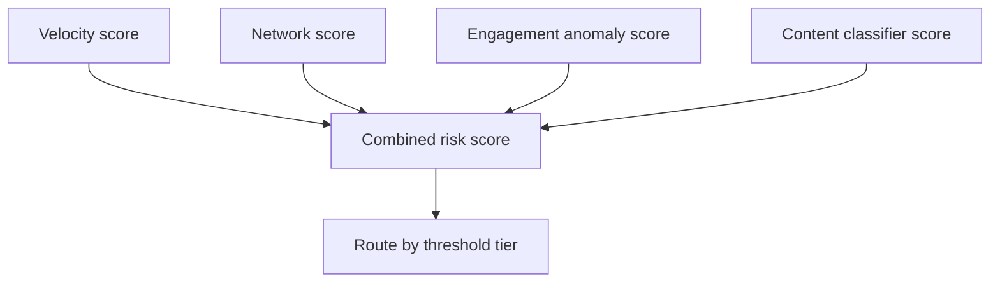

# Behavioral and Account-Based Signals

Read this when defining velocity, network, or engagement-anomaly signals
and combining them with content classifier scores in the same routing
decision.

## Why Behavioral Signals Matter

Content classifiers score *what was said or posted*. Behavioral signals
score *how the account is acting* -- and they are frequently both stronger
and cheaper than content analysis for catching spam and coordinated abuse,
because:

- They often fire **before** enough content volume exists for a content
  classifier to be confident (a brand-new account's first five messages may
  not individually score high on toxicity, but the *pattern* of sending
  five near-identical messages in ten seconds is a strong signal on its
  own).
- They are typically **cheaper to compute** than running an ML model per
  item -- most are counting/aggregation queries over existing event data,
  not inference calls.
- They catch classes of abuse that don't have "bad content" at all (account
  farming, fake engagement, payment fraud rings) where every individual
  message or listing might read as perfectly legitimate in isolation.

## Signal Categories

### Velocity Signals

Many actions in a short window relative to baseline.

- Mass messaging: one account sending messages to N distinct recipients
  within a short time window
- Mass account creation from similar device fingerprints or IP ranges
  within a short window
- Rapid listing/posting creation (marketplace spam, forum flooding)
- Rapid follow/connection-request bursts (social platform spam)

Implementation note: these are typically sliding-window counts (e.g.,
"messages sent to unique recipients in the last 10 minutes") compared
against a per-account baseline or a global threshold tuned from historical
abuse cases.

### Network Signals

Accounts that share infrastructure or identity fragments with each other or
with previously-actioned accounts.

- Shared device fingerprint across multiple accounts
- Shared payment instrument (same card/wallet used across accounts that
  shouldn't be related)
- Shared or narrowly-clustered IP ranges, especially combined with rapid
  account creation
- Graph proximity to already-banned accounts (shared contacts, shared
  device, shared payment method)

Implementation note: this is the domain where a lightweight graph/clustering
approach (connected components over shared-attribute edges) outperforms
per-account scoring -- a single bad actor rarely operates one isolated
account.

### Engagement-Pattern Anomalies

Behavior that deviates from the typical lifecycle of a legitimate account.

- A brand-new account immediately messaging hundreds of other users before
  any other normal activity (browsing, profile completion, etc.)
- An account with no prior activity suddenly performing an action at a rate
  far above the platform's normal distribution for that account age
- Engagement concentrated in a narrow time window followed by dormancy
  (bot/farm pattern) rather than the diurnal pattern typical of human usage

## Combining Behavioral and Content Signals

Behavioral and content signals should feed the **same** threshold-routing
decision (see `threshold-tuning.md`), not run as two separate,
uncoordinated systems:

Two common combination strategies:

1. **Score fusion** -- combine behavioral and content scores into a single
   composite risk score (weighted sum, max, or a small secondary model
   trained on both feature sets) before applying the three-tier threshold.
2. **Independent escalation** -- let either signal type independently push
   an item/account into the review or auto-action tier (an "OR" gate), which
   is simpler to reason about and audit, at the cost of not capturing
   interaction effects between signal types.

Prefer independent escalation when starting out -- it's auditable and each
signal's contribution is traceable in the feedback log. Move to score fusion
only once you have enough labeled data to validate that the fused score
outperforms either signal type alone.

## Cost Note

Behavioral signals are usually implemented as aggregation queries over
existing event/activity tables (counts, distinct counts, time-windowed
joins) rather than model inference calls, which makes them substantially
cheaper to run at scale than a content classifier. This is a reason to
compute and check them *before* invoking an expensive content classifier,
not just alongside it -- a velocity signal alone can sometimes justify
routing to auto-action or review without ever scoring the content itself.
