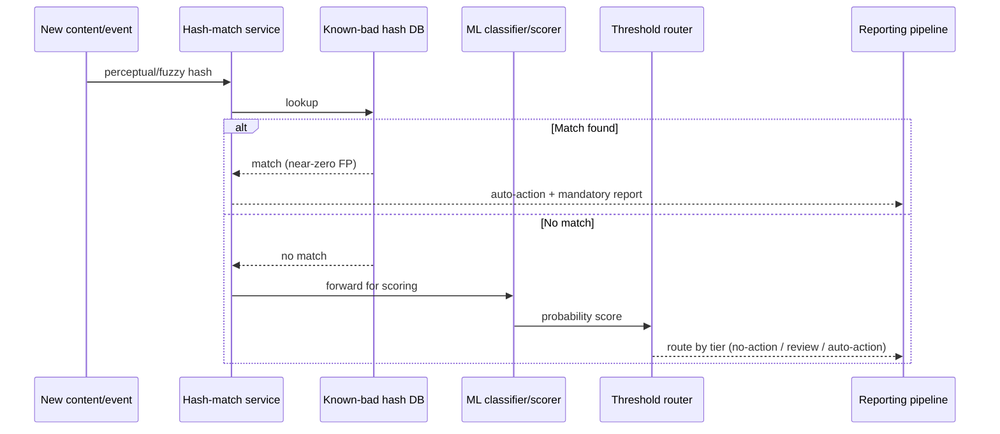

# Classifier Architecture Patterns

Read this when designing the hash-match + ML-scoring pipeline shape, or
adapting the CSAM reference architecture to a different severity category
(spam, harassment, fraud, fake accounts).

## The Two-Stage Pipeline

Why hash first: hash-matching is orders of magnitude cheaper to compute than
running a full ML classifier, and it has near-zero false positives against
content that's already been confirmed as violating. Running the expensive,
probabilistic classifier only on content the hash layer didn't already
resolve keeps both cost and false-positive volume down.

## Why Perceptual/Fuzzy Hashing, Not Exact Hashing

Exact cryptographic hashes (SHA-256, MD5) break on any byte-level change --
a single re-save, recompression, or crop produces a completely different
hash and the match is lost. Perceptual hashing (and audio/video fuzzy
hashing equivalents) is designed to tolerate minor transformations while
still matching the same underlying content. This is why hash-matching
systems for abuse content use perceptual hash families rather than exact
byte hashes -- bad actors routinely re-encode, crop, or lightly edit known
content specifically to evade exact-match detection.

## The CSAM Reference Architecture (worst case, generalizes down)

For the single most severe UGC content category, the 2026 reference
architecture combines, in order:

1. **Hash-matching against a known-bad database** -- Microsoft's PhotoDNA is
   the widely-deployed perceptual hashing system for this category, matching
   uploaded media against hash sets of previously-confirmed content.
2. **ML classifier scoring for anything that doesn't hash-match** -- Thorn's
   Safer or Hive AI's moderation API provide the classifier layer that scores
   *novel*, previously-unseen content the hash layer cannot catch.
3. **Mandatory reporting pipeline** -- confirmed matches and high-confidence
   classifier hits feed a legally-required reporting flow (e.g., to NCMEC's
   CyberTipline in the US), not just an internal moderation queue.

This is cited here as the reference shape for hash+classifier+reporting
integration, not as CSAM-specific guidance -- treat it as the architecture
pattern to adapt, not the compliance content itself. If your platform
handles this content category, involve legal/compliance directly; this
skill covers the general engineering pattern only.

## Generalizing the Pattern to Spam and Abuse

The same two-stage shape applies at lower severity, with proportionally
lighter tooling:

| Layer | CSAM (reference) | Spam / abuse (generalized) |
|---|---|---|
| Known-bad match | PhotoDNA hash database | Fingerprint/hash of known spam templates, phishing kits, or previously-banned message text |
| Novel-content scoring | Thorn Safer / Hive AI classifier | In-house or vendor toxicity/spam/fraud classifier (e.g., Perspective API, a fine-tuned in-house model, or a vendor moderation API) |
| Downstream action | Mandatory external report | Internal three-tier routing (see `threshold-tuning.md`); reporting only where legally required for the category |

Do not skip the hash-matching layer just because your category is lower
severity than CSAM -- it is still the cheapest, most reliable detector for
anything that has already been seen and confirmed, and it reduces classifier
load and false-positive volume regardless of category.

## Where This Fits in the Larger System

This pipeline produces a **signal** (a match or a score) and routes it to an
action tier. It does not decide *what the reviewer sees* or *how cases are
queued and assigned* -- that is the job of `moderation-triage-routing`. Keep
the boundary clean: this skill's output is "flag this, at this confidence,
for this reason"; the triage skill's input is that flag.
