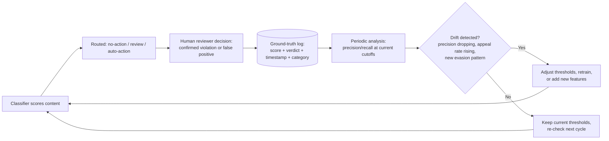

# Threshold Tuning and the Feedback Loop

Read this when setting initial low/high threshold values, sizing the
human-review band, or building the recalibration/drift-detection cadence.

## The Core Tradeoff

A classifier emits a probability, not a fact. Every threshold choice trades
two costs against each other:

- **False-positive cost**: a legitimate user or piece of content gets
  actioned. This erodes user trust, generates a support/appeals burden, and
  -- at scale -- becomes a PR and retention risk if it happens often enough.
- **False-negative cost**: violating content or behavior is missed or
  delayed. This is the harm the whole system exists to prevent, and delay
  compounds it (an abusive account keeps operating while under review).

There is no threshold value that minimizes both costs simultaneously. The
three-tier design (no-action / human-review / auto-action) exists precisely
because a single cutoff forces you to accept one cost or the other at every
point on the curve; splitting the score range into three bands lets you
apply the *cheapest sufficient response* to each confidence level.

## Setting Initial Thresholds

1. **Start from labeled data, not intuition or vendor defaults.** Sample a
   statistically meaningful set of real content/events from your platform,
   get human ground-truth labels (violation / not violation), and run them
   through the classifier to get a score distribution.
2. **Plot precision and recall at candidate cutoffs.** Pick the high
   threshold where precision is high enough that auto-action's false-positive
   rate is acceptable given your appeals/support capacity and trust cost.
   Pick the low threshold where recall in the "worth a human look" range is
   high enough that you aren't silently dropping too many true positives
   into the no-action bucket.
3. **Size the review band deliberately.** Too narrow (low and high close
   together) pushes most volume into auto-action or no-action, defeating the
   purpose of the middle tier. Too wide overwhelms the human review queue.
   Size it against actual reviewer throughput capacity, not just statistical
   ideals -- this is a joint decision with whoever owns the review
   queue/staffing (see `moderation-triage-routing`).
4. **Different categories need different thresholds.** A false positive on
   "borderline spam" costs less than a false positive on "account
   suspension for severe abuse" -- higher-stakes actions should generally
   sit behind a higher high-threshold (more confidence required) or route
   through review even at otherwise "auto-action" confidence.

## The Feedback Loop (Non-Negotiable)

Log the classifier score and category alongside every human verdict,
including verdicts from the no-action tier if you sample-audit it. Without
this log, you have no way to measure whether your thresholds are still
correctly calibrated -- you are flying blind on exactly the metric (real
precision/recall against real content) that justified the initial cutoffs.

### Why Thresholds Drift

- **Content pattern evolution**: what "spam" or "abuse" looks like changes
  as products, features, and user behavior change.
- **Adversarial adaptation**: bad actors that get caught learn the boundary
  and adjust content specifically to stay just under the high threshold, or
  flood the review band to overwhelm reviewer capacity.
- **Model drift**: if the classifier itself is retrained or updated (new
  vendor model version, in-house retrain), its score distribution can shift
  even for the same underlying content mix.

Treat threshold recalibration as a recurring operational cadence (e.g.,
monthly or triggered by an appeal-rate/precision alert), not a one-time
launch configuration.

## Reading the Signals That Say "Recalibrate Now"

- Appeal/overturn rate on auto-actioned items rising over a rolling window
- Human reviewers overturning classifier-driven flags at a rate above
  baseline in the review band
- A new evasion pattern reported by reviewers that the classifier
  consistently under-scores
- A vendor classifier version upgrade (score distributions may have shifted
  even if the API contract looks unchanged)
