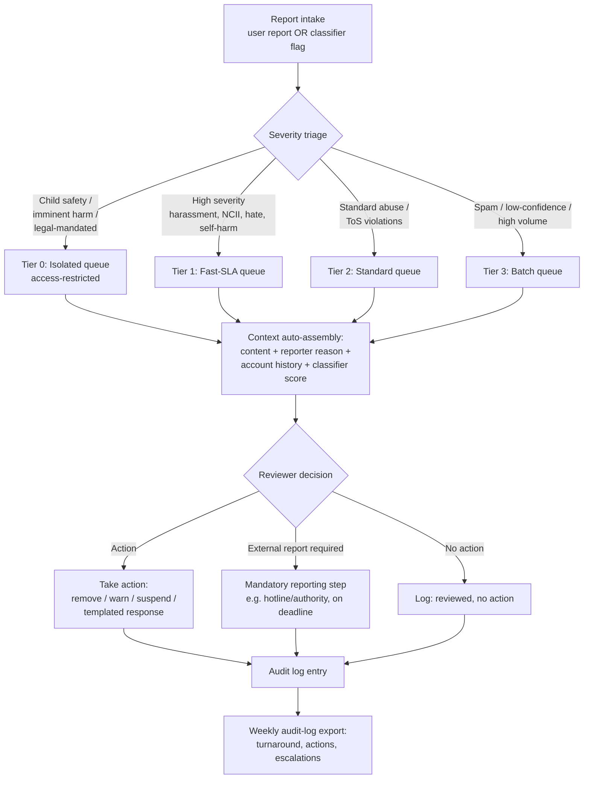

# Moderation Triage & Routing

Design how flagged content and accounts move from a report (user-submitted or
classifier-flagged) to a human decision to a logged action — for any UGC
platform, from a solo-operator side project to a small trust & safety team.

## When to Use

✅ **Use for**:
- Designing or auditing a moderation report queue (severity tiers, routing rules)
- Isolating child-safety/imminent-harm content into a restricted queue with its own handling
- Deciding what context (content, reporter reason, account history, classifier score) should be assembled automatically for reviewers
- Choosing review-UI tooling for a small/solo team (Directus vs. Retool vs. Refine vs. self-built)
- Defining moderation ops metrics (turnaround time, false-positive rate, time-per-report) and an audit-log export

❌ **NOT for**:
- Building the ML/heuristic classifiers that generate flags — see `ml-trust-safety-signal-detection`
- Writing community guidelines, content policy, or legal terms of service
- Real-time chat/video moderation infrastructure or live-stream moderation tooling
- General-purpose admin dashboard design unrelated to moderation (see generic admin-dashboard skills)

---

## Core Process

### Step 1: Route by severity, not by arrival order

Never put everything in one FIFO queue. Classify each report into a tier at
intake — automatically wherever a classifier confidence score or report
category makes it possible, manually only as a fallback or escalation path.
Tier 0 (child safety, imminent physical harm, other content triggering
mandatory legal reporting) must be a **separate, access-restricted queue**,
never merged into general triage. Read `references/queue-architecture.md`
before finalizing tier boundaries or isolation mechanics.

### Step 2: Assemble reviewer context automatically

Every report that reaches a human should already carry: the flagged
content/message itself, the reporter's stated reason, the account's prior
violation history, and the classifier's confidence score (if any). Building
this as a single joined view — not four manual lookups — is what separates an
efficient one-person operation from one that burns hours per report. Read
`references/report-triage-context.md` for the data-modeling approach and
templated-response pattern.

### Step 3: Pick review tooling proportional to your scale

For a small or solo team, the review UI is a CRUD/kanban layer over a handful
of tables. Match the tool to what you actually have and need:

| You have... | Reach for... |
|---|---|
| An existing relational schema, want a working UI fast | **Directus** (introspects your schema, free at solo scale, row/field permissions map to Tier 0 isolation) |
| No schema, need something today, budget isn't the constraint | **Retool** (fastest, but the app lives inside Retool — have an exit plan) |
| Want a fast-generated app you actually own and can redeploy | **Refine** (AI-assisted scaffold of a real React/TS app) |
| Generic tools' friction is *measurably* costing more reviewer-hours than a build would | **Self-built** (e.g., Next.js + shadcn/ui data table) |

Read `references/tooling-comparison.md` before committing to a tool as the
*permanent* system, not just a prototype.

### Step 4: Act, then log — always

Every reviewer decision (action taken, external report filed, or "reviewed,
no action") writes an audit-log entry. This is not optional bookkeeping: it
feeds turnaround-time measurement, appeal/reversal tracking, and the
compliance evidence trail described below.

### Step 5: Track the three metrics that matter, and export weekly

Track report turnaround time (median + p95 — many notice-and-action legal
regimes require "expeditious" action, not a fixed number, so knowing your
actual numbers matters for compliance posture), false-positive rate on
auto-actioned content (via appeal/reversal rate), and reviewer time-per-report
(a rising trend means context assembly needs tooling investment, not more
reviewer effort). Set up a scheduled weekly audit-log export summarizing
these — it's simultaneously your ops dashboard and your compliance evidence
trail if a regulator or platform partner asks for proof of a functioning
program. Read `references/metrics-and-audit.md` for the full rationale.

---

## Anti-Patterns

### Anti-Pattern: The Undifferentiated Queue

**Novice**: "One queue, sorted by report time, is simpler to build and simpler
for a solo operator to keep in their head."

**Expert**: A single FIFO queue guarantees one of two failures: either the
worst content (CSAM, imminent-harm threats) sits mixed in with routine spam —
exposing whoever triages it to severe, unwarned harm — or a legally
time-sensitive item gets buried under a backlog of routine reports and misses
its reporting deadline. Severity tiering with an isolated, access-restricted
Tier 0 queue is not over-engineering; it is the minimum viable safety design,
even for a team of one. "Simpler to build" is not the same axis as "safe to
operate."

**Timeline**: This is not a new-technology issue — the tiering requirement
has been true since the first UGC report queue existed. What has changed is
tooling cost: a decade ago, tiered queues meant custom-built T&S platforms;
today, Directus/Refine/a lightweight self-built view make severity separation
achievable in an afternoon, removing the "we can't afford to do this
properly" excuse for small teams.

**Detection**: One `reports` table, one status column, no `severity_tier` or
equivalent field, and/or a single view that shows all report types to every
reviewer role.

### Anti-Pattern: The Vendor-Locked Core System

**Novice**: "Retool got us a working moderation tool in a day — we'll just
keep building on it as we grow."

**Expert**: Retool (and similar fully-hosted no-code platforms) is an
excellent choice for a prototype, precisely because it's fast and disposable.
The problem is treating it as the *permanent, sole* operational system without
weighing what happens if the subscription lapses, pricing changes at scale,
or the platform's limits are hit as report volume grows. The app has no
"eject" — there is no owned artifact to fall back to. A growing platform's
core trust & safety operation should not be single-point-of-failure-dependent
on a recurring payment to a third party with no migration path. Directus and
Refine both avoid this trap by leaving you with either your own schema
(Directus) or your own deployable codebase (Refine).

**Timeline**: The risk hasn't changed over time — it's structural to the
hosted-platform model — but the *alternative* has gotten better: schema-
introspecting tools like Directus and AI-scaffolded owned-codebase tools like
Refine matured enough by the mid-2020s to make "fast AND owned" a real choice,
removing the old excuse that hosted no-code was the only fast option.

**Detection**: The moderation review tool is the *only* interface to the
report/action data, there's no documented plan for exporting or rebuilding it
outside the vendor's platform, and no one has actually calculated what a
sudden vendor price increase or outage would cost operationally.

---

## References

Consult these for deep dives — they are NOT loaded by default:

| File | Consult When |
|------|-------------|
| `references/queue-architecture.md` | Designing tier boundaries, deciding what "isolated/restricted" means mechanically, or handling mandatory external reporting obligations |
| `references/tooling-comparison.md` | Choosing between Directus, Retool, Refine, and self-built — especially weighing vendor lock-in for a permanent system |
| `references/report-triage-context.md` | Designing what context (content, reason, history, confidence) a reviewer sees, and building templated action responses |
| `references/metrics-and-audit.md` | Defining turnaround/false-positive/time-per-report metrics and setting up the weekly audit-log export |
