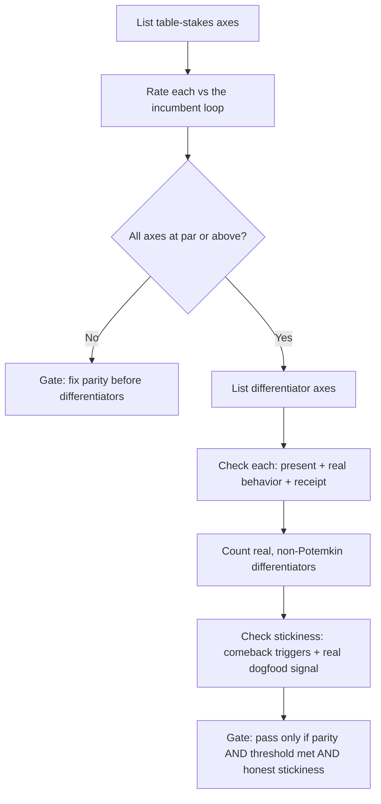

# Multi-Agent Authoring Product Bar

Measure whether a multi-agent authoring product is good enough that its own makers reach for it instead of Claude Code or Codex — honestly, not by vibes.

## Use This For

- Deciding whether Harbor, `pd-console`, or Agent Harbor is ready to replace Claude Code/Codex for real daily work, not just to demo well.
- Auditing a multi-agent feature launch for a Potemkin swarm button: agents launched, but no claims, ownership, merge point, or receipts behind it.
- Sequencing roadmap priority between single-agent inner-loop parity work and coordination-plane (swarm) work.
- Reviewing a "we dogfood our own tool" claim for vanity metrics (agents-launched, demos-run) instead of a real comeback signal.
- Writing the go/no-go gate for shipping a coordination-plane feature (worktree isolation, claims, transcripts/salvage, receipts, spend visibility).

## Do Not Use This For

- Gathering market evidence, competitor traces, or user stories for agentic coding products (`agentic-coding-product-research`).
- Designing the individual prompt-to-diff, console, or swarm-board screens (`agentic-coding-ux-designer`).
- Specifying how a swarm is invoked, sharded, or communicates hot-path vs durable-path (`swarm-invocation-designer`).

## Process

1. Enumerate table stakes: single-agent loop quality, latency, context attach, recoverable edits. Rate each against the incumbent the makers actually use today for real work — not an aspirational competitor, not the internal roadmap's self-image.
2. Gate hard on table stakes: any axis rated `below-par` fails the whole audit. Multi-agent does not matter if the single-agent loop makes people bounce back to the incumbent before they ever try the swarm feature.
3. Enumerate differentiators: isolation/claims, swarm visibility with ownership and a merge point, transcripts/salvage, artifact-backed receipts, spend visibility. These are the axes incumbents don't expose at all.
4. For each differentiator, check three things independently: is it `present`, does it have real behavior (a real state machine, not a UI affordance with nothing wired behind it), and does it `leavesReceipt`. All three must hold for it to count — a "launch 5 agents" button with no claims, ownership, or merge point is Potemkin, not a differentiator, and collides in practice.
5. Require a minimum count of real differentiators (default 3 of 5). A couple of real ones, done well, beats five fake ones.
6. Measure stickiness honestly: does someone on the team actually reach for this tool over Claude Code/Codex for real work, evidenced by concrete comeback triggers — not vanity counts like agents-launched or demos-run.
7. Gate `pass` on all three conditions together: table-stakes parity, differentiator threshold met, and an honest (non-vanity) stickiness signal. When one fails, the roadmap priority is obvious: fix that one before adding more surface area.

## Output Contract

Produce a JSON audit with:

- `pass`: boolean, true only when table-stakes parity holds, the differentiator threshold is met, and stickiness is honest.
- `tableStakesParity` / `tableStakesBreakdown`: per-axis rating and whether every axis clears `par`.
- `differentiatorScore` / `differentiatorBreakdown`: per-axis `real`/`potemkin`/not-built status against the threshold.
- `honestStickiness` / `recognizedTriggerCount`: whether the dogfood signal is evidenced, not asserted.
- `findings[]`: severity-ranked gaps, each naming exactly which axis and why.
- `recommendations[]`: the specific next fix, sequenced by what's actually gating `pass`.

Use `scripts/dogfood_bar.mjs` to audit a product self-assessment and derive this JSON deterministically.

## Anti-Patterns

### Multi-Agent Hype Over A Weaker Core

**Novice**: "Ship the swarm feature now — the single-agent loop can catch up later."
**Expert**: Users spend the overwhelming majority of their time in the single-agent loop; if it's slower or clunkier than the incumbent, they bounce back to it before ever trying the swarm feature.
**Detection**: A table-stakes axis is rated `below-par` while the pitch or demo emphasizes multi-agent capability.

### Potemkin Swarm

**Novice**: "We added a 'launch 5 agents' button."
**Expert**: Multi-agent only works when file ownership (claims), a visible board, a merge point, and receipts all exist; without them it's a confetti cannon that looks like coordination and collides like chaos.
**Detection**: A differentiator is marked `present: true` but `hasRealBehavior: false` or `leavesReceipt: false` — `dogfood_bar.mjs` flags it `potemkin-differentiator-<axis>` at `high` severity and refuses to count it toward the threshold.

### Vanity Dogfood Metric

**Novice**: "We launched 40 agents this week" as proof the dogfood thesis is working.
**Expert**: The only honest signal is whether the makers reach for this tool over Claude Code/Codex for real, recurring work and keep coming back — agents-launched counts activity, not preference.
**Detection**: `usesOverIncumbentForRealWork` is `false` or `comebackTriggers` is empty while `metricsHonest` reports only launch/demo counts; `dogfood_bar.mjs` returns `no-real-dogfood-signal` or `vanity-metrics-admitted` and forces `pass: false`.

## References

| File | Load When |
| --- | --- |
| `references/table-stakes-and-differentiators.md` | Need the par rubric for table-stakes axes or what "real" means per differentiator axis. |
| `references/dogfood-stickiness-signals.md` | Need the comeback-trigger vocabulary or how to collect an honest stickiness signal. |
| `examples/expected-output.md` | Need a worked Potemkin-fails-then-earns-the-bar-and-passes example. |
| `templates/output-template.md` | Need a reusable self-assessment template to fill in. |
| `schemas/product-bar-spec.schema.json` | Need to validate a self-assessment's structure programmatically. |
| `scripts/dogfood_bar.mjs` | Need deterministic scoring of a product self-assessment against the bar. |
| `agents/openai.yaml` | Need a subagent descriptor for delegated product-bar auditing. |

<!-- BEGIN BUNDLE INDEX (auto: index_references.py) -->

## Skill Bundle Index

*Every file in this skill, and when to open it. Auto-generated; run `scripts/index_references.py --fix`.*

**root**
- [`CHANGELOG.md`](CHANGELOG.md) — Multi-Agent Authoring Product Bar — Changelog — - Initial skill creation - Core process defined - Reference files and deterministic dogfood_bar script added
- [`README.md`](README.md) — Multi-Agent Authoring Product Bar — Define and measure the product-quality bar a multi-agent authoring tool must clear before its own makers reach for it over Claude Code or Co

**`agents/`**
- [`agents/openai.yaml`](agents/openai.yaml) — openai (data/schema)

**`examples/`**
- [`examples/expected-output.md`](examples/expected-output.md) — Example Output: Multi-Agent Authoring Product Bar — Scenario: a Fleet Console team ships a "Summon 5 agents" button, then — after this audit fails it — spends a cycle earning table-stakes pari
- [`examples/sample-input.json`](examples/sample-input.json) — sample input (data/schema)

**`references/`**
- [`references/dogfood-stickiness-signals.md`](references/dogfood-stickiness-signals.md) — Dogfood Stickiness Signals — Use this when deciding whether a "we dogfood our own tool" claim is honest, or when filling in `stickiness` for `scripts/dogfood_bar.mjs`.
- [`references/table-stakes-and-differentiators.md`](references/table-stakes-and-differentiators.md) — Table Stakes And Differentiators — Use this when rating a multi-agent authoring product's axes or deciding whether a claimed differentiator is real or Potemkin.

**`schemas/`**
- [`schemas/product-bar-spec.schema.json`](schemas/product-bar-spec.schema.json) — product bar spec.schema (data/schema)

**`scripts/`**
- [`scripts/dogfood_bar.mjs`](scripts/dogfood_bar.mjs)

**`templates/`**
- [`templates/output-template.md`](templates/output-template.md) — Multi-Agent Authoring Product Bar Self-Assessment — [One-sentence description of the product/version being assessed and why now.] Fill every `differentiators.*` object honestly and independent

<!-- END BUNDLE INDEX -->
