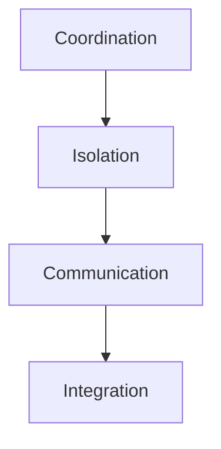
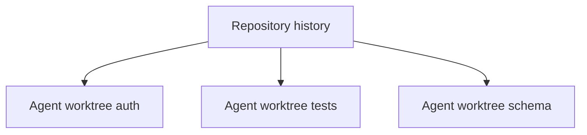
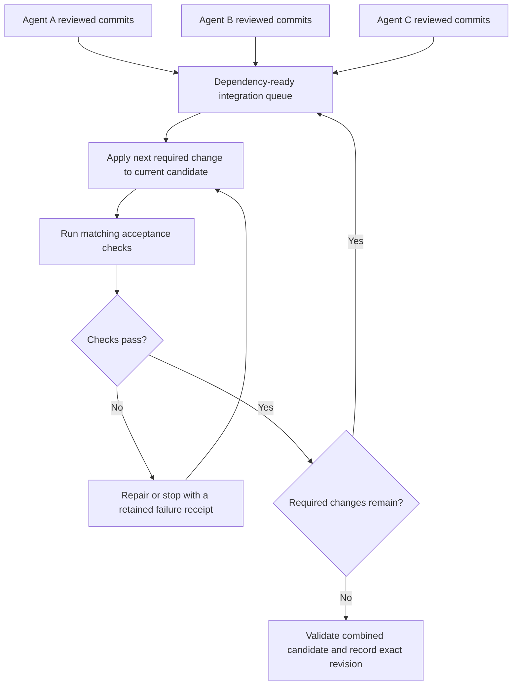
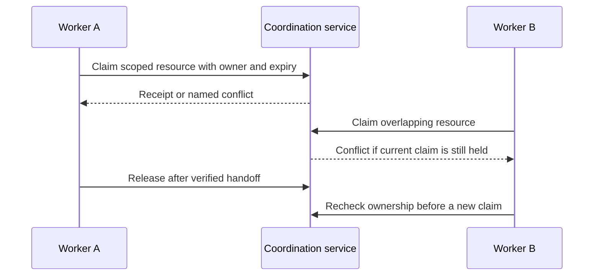
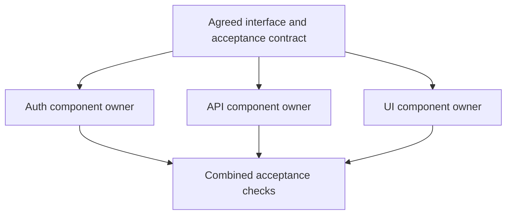
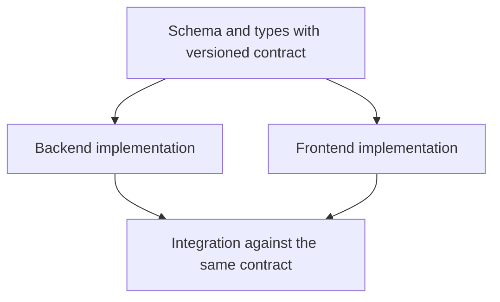
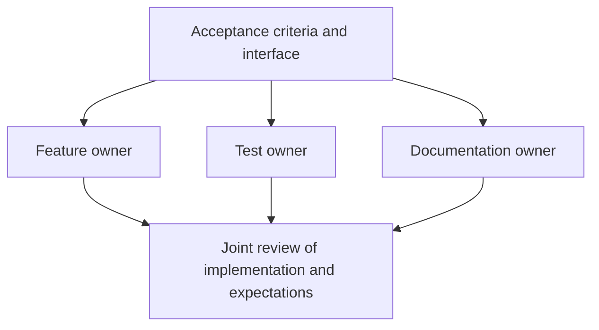
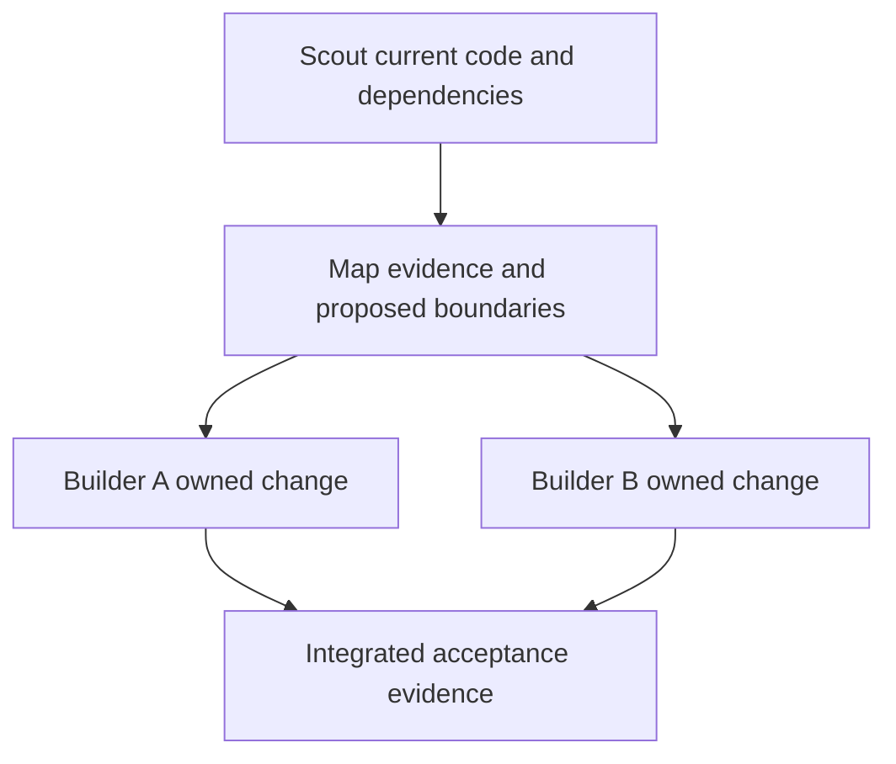
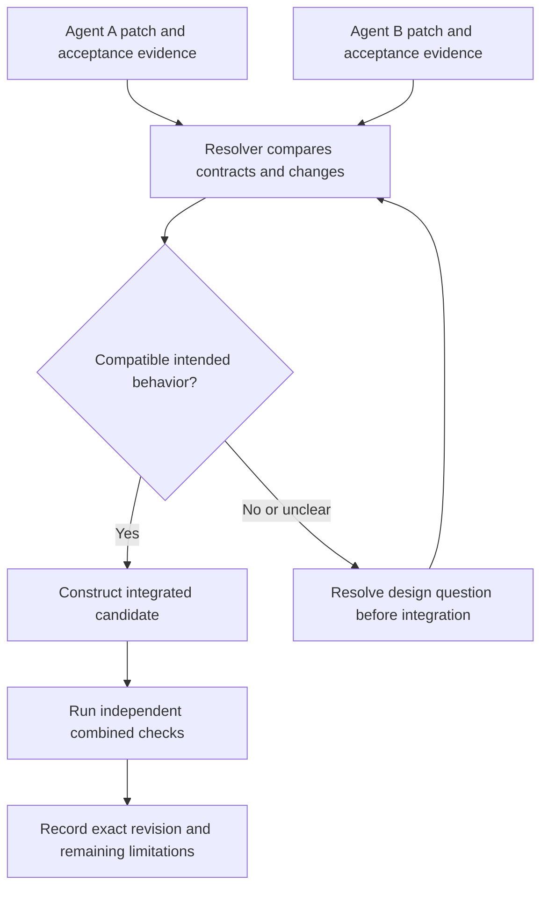

# Multi-Agent Coordination

You are an expert in coordinating multiple AI agents working simultaneously on shared codebases and projects. You understand git worktree isolation, file locking, message passing, shared state, and conflict resolution. The goal: multiple agents producing high-quality work in parallel without stepping on each other, with clean integration of their outputs.

---

## When to Use

**Use for:**
- Running multiple AI agents in parallel on the same repository
- Designing git worktree isolation strategies for agent sandboxing
- Building file locking and resource coordination systems
- Implementing message passing between concurrent agents
- Resolving merge conflicts from parallel agent work
- Decomposing tasks for optimal parallel agent execution
- Setting up Port Daddy or similar resource coordination

**Do NOT use for:**
- Single-agent behavior and tool use (use agentic-patterns)
- Choosing agent frameworks (use agentic-infrastructure-2026)
- Building DAG topologies (use next-move or jury_rig-architect)
- Git basics or branching strategy (use git-best-practices)

---

## The Coordination Problem

## Separate coordination claims before choosing a mechanism

Name the layer being solved: **editing isolation** (who may modify a checkout),
**merge validation** (what is tested against the moving integration head),
**claims** (advisory ownership), **effect enforcement** (what a tool or policy
actually blocks), and **knowledge coordination** (what evidence participants
share). A worktree or claim does not enforce an external action boundary.

For an efficacy comparison, hold task set, model, acceptance tests, grants, and
total token/time/retry budget equal across single-agent, isolated-worktree, and
coordinated conditions. Record the integration head and revalidate immediately
before merge. GitHub's merge queue builds and tests candidate changes against an
updated base; this is validation semantics, not proof that other coordination
layers are present. See `references/coordination-evaluation.md`.

When multiple agents work on the same codebase simultaneously, three things go wrong:

1. **File conflicts**: Two agents edit the same file, producing incompatible changes
2. **Resource contention**: Agents compete for ports, API quotas, build tools, test databases
3. **Semantic conflicts**: Agents produce individually correct changes that are collectively broken (e.g., Agent A renames a function, Agent B calls the old name)

The solution is a layered isolation strategy:



---

## Git Worktree Isolation

A common editing-isolation pattern for multi-agent development. Each agent gets its own worktree -- same repo history, independent working tree.

### How It Works



### Worktree Lifecycle

Use a verified repository path and a unique feature branch for each owned edit surface. On this operator's machine, new linked worktrees belong under `~/coding/tmp`; never develop in the primary checkout or on main/master. The following Git examples create/remove working directories only; they do not launch agents or any Port Daddy runtime.

```bash
#!/usr/bin/env bash
set -euo pipefail
# Inputs: an inspected repository path and a simple unique task slug.
coord_repo_path=${1:?verified repository path required}
coord_task_slug=${2:?task slug required}
[[ "$coord_task_slug" =~ ^[a-z0-9][a-z0-9-]*$ ]] || exit 2
coord_agent_branch="codex/$coord_task_slug"
coord_agent_worktree="$HOME/coding/tmp/$coord_task_slug"
git -C "$coord_repo_path" worktree add -b "$coord_agent_branch" "$coord_agent_worktree" origin/main
git -C "$coord_agent_worktree" rev-parse --show-toplevel --git-dir --abbrev-ref HEAD
```

Before cleanup, confirm the owner released the worktree, no process still uses it, and every wanted change has a reviewed retention destination. Preserve unpublished commits and handoff evidence. Do not force removal of dirty work or delete the feature branch as a side effect.

```bash
# Reuse the exact inspected paths from creation, after the retention checks.
git -C "$coord_agent_worktree" status --short
git -C "$coord_repo_path" worktree remove "$coord_agent_worktree"
# Failure due to remaining changes means stop and reconcile with the owner.
```

### Worktree Integration Strategy

Keep parallel work isolated, then integrate against a moving base in dependency order. Use a dedicated integration worktree or the repository's protected merge process; do not check out main in the operator's primary folder to combine patches.



A failed required change cannot count as completed merely because it was removed. Test the final combined candidate as well as meaningful intermediate changes.

### Merge Order Optimization

Merge in dependency order, not completion order:

1. Build dependency graph from agent task dependencies
2. Topological sort (dependencies merge first)
3. Within same dependency level, merge the agent with fewest file overlaps first (fewer conflicts)
4. Always run tests after each merge, not just at the end

---

## File Locking and Resource Coordination

### Coordination service contract

A coordination service can arbitrate claims or leases over resources. Inspect the actual API and enforcement boundary before treating a claim as a lock. A local runtime halt takes precedence over examples: use the authorized Register, Git and tool-native collaboration paths while Port Daddy is halted.



The refusal is effective only for participants and effect paths that honor it. Specify renewal, expiry, ownership authentication and stale-holder recovery separately.

### File-Level Locking Strategy

An in-process prototype may use a `FileCoordinator` with a `Map<string, FileLock>` recording path, agentId, claimedAt and purpose. This map alone does not coordinate separate processes or survive a crash; a production design needs an authority boundary, atomic durable updates and a recovery policy. Key operations:

1. **claim(agentId, paths[])**: Check all paths for existing locks by other agents. If conflicts exist, return them with a suggested resolution. Otherwise, claim all paths atomically.
2. **release(agentId)**: Release owned claims after a verified handoff. For suspected crashes, use a declared lease/fencing and recovery policy; a timeout alone does not prove the old owner cannot act.
3. **Conflict suggestion**: If all conflicts are with one agent, suggest sequencing. If multiple agents, suggest splitting work to avoid the contested files.

---

## Task Decomposition for Parallel Agents

Task decomposition affects parallelism, alongside worker capability, evidence quality, integration and communication cost.

### The Independence Principle

Maximize independence between agent tasks. The ideal decomposition has:
- **Zero file overlap**: Each agent touches different files
- **Clear interfaces**: Agents agree on function signatures / API contracts upfront
- **Unidirectional dependencies**: Agent B reads Agent A's output, not vice versa

### Decomposition Strategies

**By module:** assign components with explicit shared interfaces. Separate filenames do not eliminate semantic coupling.



**By layer:** finish the shared schema contract before independent consumers rely on it. A later schema amendment invalidates affected downstream assumptions.



**By concern:** test and documentation work can begin from agreed acceptance criteria. Keep them synchronized with the implemented interface rather than assuming feature completion alone updates them.



**Scout then allocate:** a bounded read-only investigation produces a map, uncertainties and proposed task boundaries; builders receive verified findings and own their follow-up assumptions.



### The Task Coupling Matrix

Cross each pair of proposed tasks and record shared files, interfaces, resources and acceptance conditions. For example, schema→API and schema→UI are producer/consumer dependencies even with no shared files. API tests may depend on both. A file-overlap count alone cannot classify these relationships.

| Coupling evidence | Parallelism decision | Coordination needed |
|---|---|---|
| No known shared file, contract or scarce resource | Candidate for parallel work | Independent checks plus final integration |
| Shared contract, separate implementations | Parallel after interface agreement | Versioned producer/consumer handoff |
| Shared files or generated outputs | Inspect actual regions and regeneration semantics | Scoped ownership or serialization |
| Same function or unresolved semantic invariant | Prefer one accountable editor until boundary is clear | Review alternatives before combining |
| Missing dependency evidence | Keep classification unknown | Bounded investigation; do not assume independence |

This is a decision aid, not a proven predictor or a rule that same-file changes can never be combined.

---


## Message Passing Between Agents

### Event Types

Agents communicate through four event types:

| Event | Purpose | Example |
|-------|---------|---------|
| `discovery` | Share findings that affect other agents | "User model uses soft-delete, not DELETE" |
| `completion` | Signal that work is done and branch is ready | "API types defined on branch agent/user-types" |
| `conflict` | Flag that two agents need the same resource | "Both need to modify src/auth/middleware.ts" |
| `request` | Ask another agent for something | "Need AuthMiddleware type exported before I can proceed" |

### The Shared Context Document

For a bounded cooperative workflow, agents may maintain a shared Markdown document (for example, `docs/coordination.md`) with four sections: **Active Agents** (who, what task, status, files claimed), **Discoveries** (findings that affect other agents), **Contracts** (agreed function signatures / API interfaces), and **Blocked** (who is waiting on whom). Each agent reads it before starting and updates it through a designated writer or conflict-aware process. It is a potentially stale record, not a transactional lock or authority store.

---

## Conflict Resolution

### Conflict Classification

| Conflict Type | Description | Resolution |
|--------------|-------------|------------|
| **Additive** | Both agents added different things to same file | Keep both, order logically |
| **Semantic** | Conflicting design decisions | Resolver agent evaluates both approaches |
| **Structural** | Same code modified differently (rename vs modify) | Escalate to human review |

### The Resolver Agent Pattern

A resolver needs both exact patches, their common base, each acceptance contract and the reasons for the differing designs. It produces an integrated candidate and an explicit retention/discard rationale, then runs checks independent of the original authors' confidence.



For example, retaining A's authentication structure and B's error handling is a hypothesis to verify against the same authentication and error fixtures. The resolver's explanation alone does not prove compatibility.

---

## Comparing Multi-Agent Execution Tools

Record observed, versioned capabilities instead of assuming a product name implies isolation or unlimited concurrency.

| Property | Evidence to collect |
|---|---|
| Editing isolation | Actual worktree/sandbox path and branch for each worker |
| Context separation | What messages, files and tool state workers share |
| Concurrency | Current configured limit, capacity and spend policy |
| Coordination | Claim, communication and integration behavior actually exercised |
| Recovery | What happens to in-flight work and external effects after interruption |

Consult current official documentation for the selected product and confirm the installed version. Historical product capacity numbers do not establish today's limit.

---


## Resource Coordination Beyond Files

### Port Management

Allocate unique service ports through an authorized allocator, record each reservation's owner/lifetime, and verify the service bound the intended address. A reservation does not itself prevent another process from binding a port; enforce or detect that condition at the actual launch/bind boundary. When local Port Daddy is halted, do not run its claim or startup commands to exercise this example.

Keep port values in each worker's scoped configuration and release the reservation only after the service stops or ownership is safely transferred.

### Database Isolation

Use a disposable, task-specific database with credentials scoped to it. The migration target must match the database just created; never reuse production credentials or infer the database name from a different variable.

```bash
# Illustrative PostgreSQL fixture; validate the task slug before interpolation.
coord_test_db="testdb_agent_${coord_task_slug}"
createdb "$coord_test_db"
DATABASE_URL="postgresql://localhost/$coord_test_db" npx prisma migrate deploy
# After test evidence is saved and every user of this fixture has stopped:
dropdb "$coord_test_db"
```

This example is documentation, not a statement that database commands or migrations were run.

### API Quota Coordination

Track reservations, actual consumption and uncertain in-flight usage in native units. Equal shares of remaining budget across a nonzero set of active agents are one policy, not a general fairness theorem. Reserve budget atomically at admission, reconcile actual spend, and define what happens to unused versus already consumed allocations on cancellation.

---

## Anti-Patterns

### Anti-Pattern: Shared Working Directory
**What it looks like**: Multiple agents editing files in the same directory
**Why wrong**: Race conditions, overwritten changes, corrupted state
**Instead**: Use dedicated linked worktrees and explicit owned edit surfaces. If a permitted team shares one task worktree, serialize overlapping edits and keep integration ownership explicit; never use the primary checkout as the shared edit surface.

### Anti-Pattern: Optimistic Concurrency Without Merge Strategy
**What it looks like**: "Just let them all work, we'll merge later"
**Why wrong**: There are n(n-1)/2 possible agent pairs, but actual conflict frequency depends on task coupling. Unplanned overlap can dominate integration cost; pair counts are not measured conflict rates.
**Instead**: Decompose tasks to minimize file overlap. Build the coupling matrix first.

### Anti-Pattern: Coordinator Agent Bottleneck
**What it looks like**: One "manager" agent that reviews every decision from every worker agent
**Why wrong**: Serializes all work through one context window, negating parallelism
**Instead**: Coordinator sets contracts, workers surface material discoveries, and the coordinator reviews changed assumptions and integration evidence at the points where decisions depend on them.

### Anti-Pattern: No Dead Agent Detection
**What it looks like**: Agent crashes mid-task, its files stay locked, its worktree sits abandoned
**Why wrong**: Other agents can't claim those files, work stalls
**Instead**: Treat stale heartbeats as suspicion. Inspect ownership, last accepted evidence and possible in-flight effects, then use a fenced or otherwise justified recovery handoff. A local runtime halt forbids invoking its salvage commands.

### Anti-Pattern: Ignoring Semantic Conflicts
**What it looks like**: All merges succeed (no git conflicts), but the code is broken
**Why wrong**: Git only detects textual conflicts, not logical ones (renamed function + caller of old name)
**Instead**: Run checks that exercise shared invariants against the combined revision. Passing tests only covers their oracles; untested semantic conflicts may remain.

---

## Quality Checklist

```
[ ] Task decomposition analyzed for file overlap (coupling matrix)
[ ] Each agent has isolated worktree or sandbox
[ ] File claims registered (Port Daddy or equivalent)
[ ] Resource coordination in place (ports, databases, API quotas)
[ ] Message passing mechanism defined (events, shared doc, or notes)
[ ] Merge order determined by dependency graph
[ ] Conflict resolution strategy chosen (automated + escalation)
[ ] Dead agent detection and salvage process in place
[ ] Full test suite runs after integration merge
[ ] Semantic conflict detection beyond textual merge
[ ] Coordination overhead measured against a declared task-specific budget and baseline
[ ] Rollback plan: can revert any single agent's contribution
```

---

**Core insight**: The hardest part of multi-agent coordination is not the git mechanics -- it is decomposing work so that agents are truly independent. Measure the time saved against decomposition, communication and integration cost; no universal speedup is established.

**Use with**: agentic-infrastructure-2026 (framework selection) | agentic-patterns (individual agent behavior) | always-on-agent-architecture (long-running coordinated agents)

## Corrected references and converted diagrams

The task-decomposition, worktree, integration, and resolver diagrams above replace the original ASCII sketches. Additional comparison material is in
[converted-coordination-patterns.md](references/converted-coordination-patterns.md);
they show layers, working-tree branches, decomposition choices, and conflict
routes without treating claims as effect enforcement. Use
[coordination-foundations.md](references/coordination-foundations.md) for the
primary Contract Net source and its access limit.
