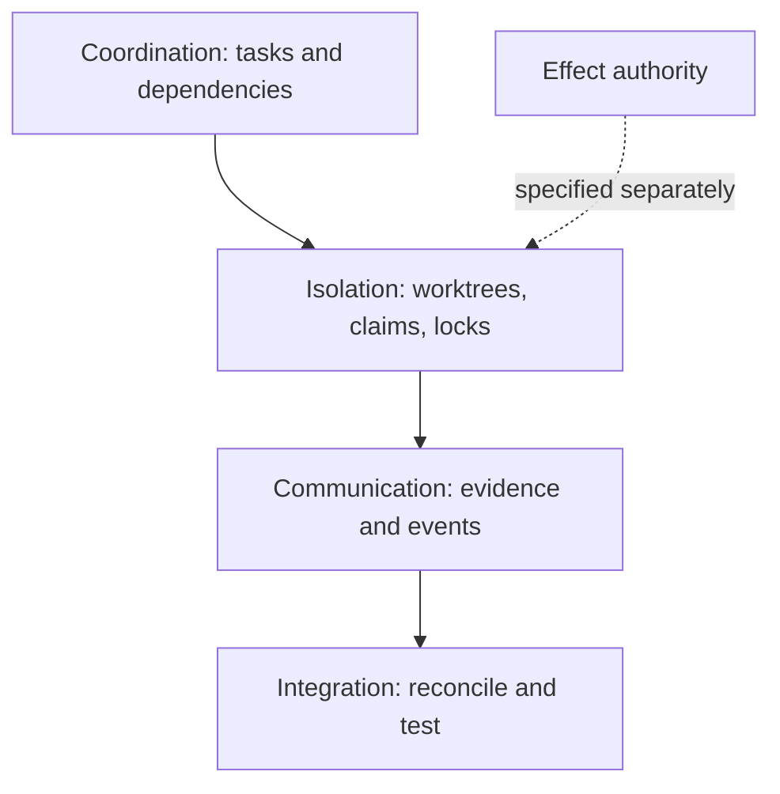
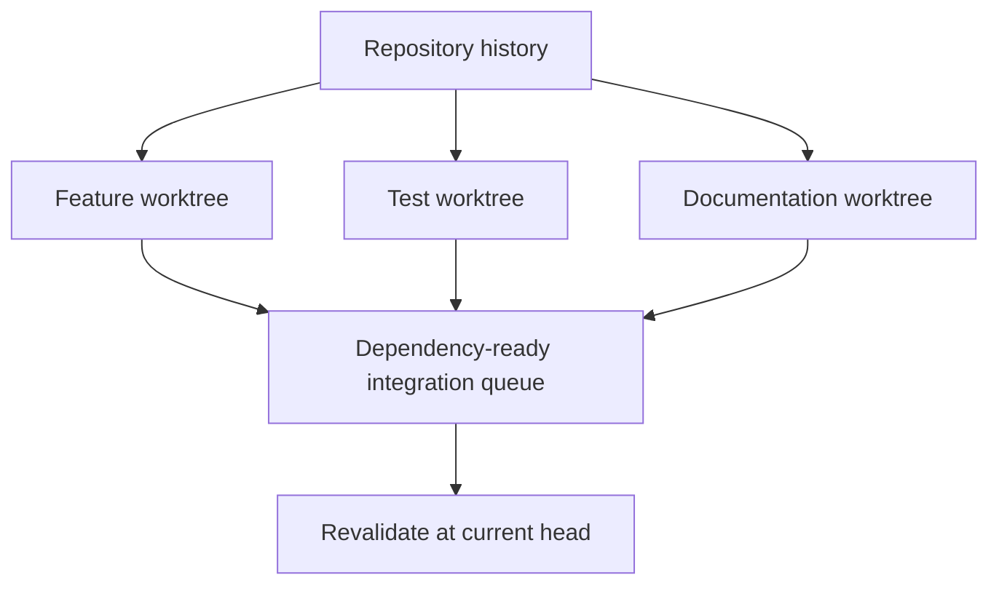
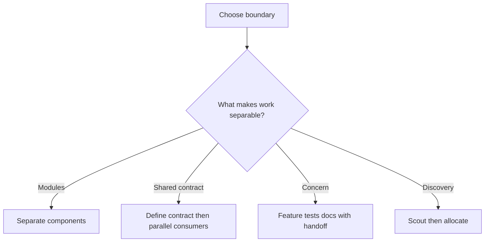
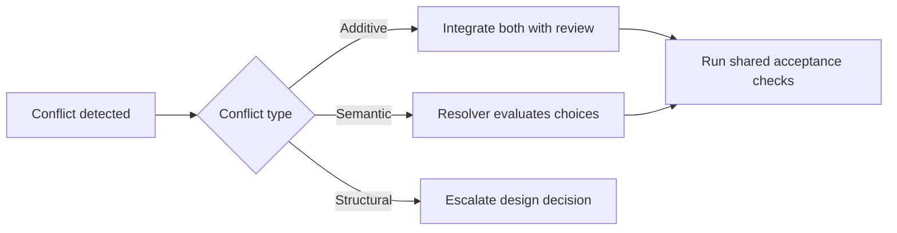

# Converted Coordination Patterns

Worktrees isolate working directories; they do not automatically serialize external effects or resolve semantic conflicts.

Compare single-agent, isolated, and coordinated treatments at equal task, model, authority, tests, and resource budget. Measure correctness, regressions, duplicate work, contention, integration time, retries, and coordination cost.
