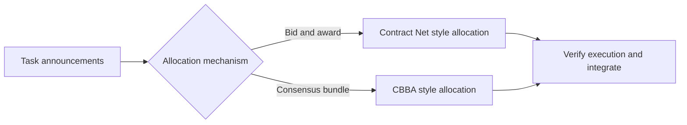
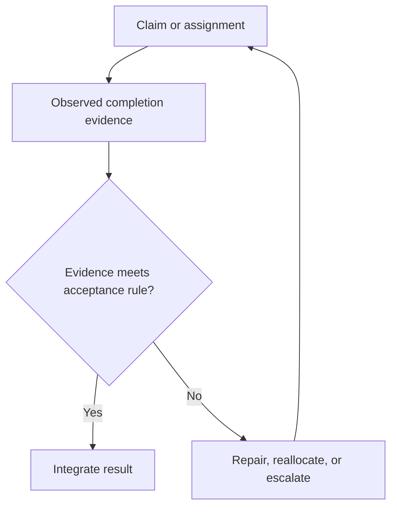

# Coordination Foundations

Contract Net is a distributed task-allocation protocol; it does not itself establish truthful bids or successful execution. See [Smith, 1980, IEEE Transactions on Computers](https://www.reidgsmith.com/The_Contract_Net_Protocol_Dec-1980.pdf). Choi, Brunet, and How describe CBAA and CBBA as market-based task selection with local-communication consensus for resolving winning bids; the paper states convergence and performance results under assumptions on the scoring scheme. This is prior art for decentralized allocation, not evidence about an agent runtime. See [Choi, Brunet, and How, 2009, IEEE Transactions on Robotics](https://doi.org/10.1109/TRO.2009.2022423).

These sources describe allocation mechanisms and their assumptions. They do not prove the usefulness, availability, safety, or observed performance of any specific multi-agent system.
