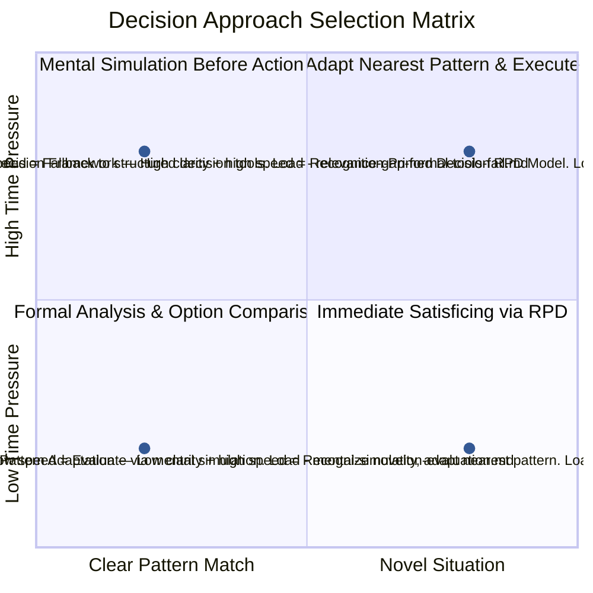

# Decision Approach Selection Matrix

```mermaid
quadrantChart
%%{init: {"themeVariables": {"quadrantPointFill": "#345995"}}}%%
    title Decision Approach Selection Matrix
    x-axis Clear Pattern Match --> Novel Situation
    y-axis Low Time Pressure --> High Time Pressure
    quadrant-1 Adapt Nearest Pattern & Execute
    quadrant-2 Mental Simulation Before Action
    quadrant-3 Formal Analysis & Option Comparison
    quadrant-4 Immediate Satisficing via RPD
    
    Decision Framework — High clarity + high speed = Recognition-Primed Decision RPD Model. Load - pattern-matching-as-primary-decision-mechanism.md: [0.8, 0.8]
    Mental Simulation — High clarity + low speed = Evaluate via mental simulation. Load - mental-simulation-evaluation.md: [0.2, 0.2]
    Pattern Adaptation — Low clarity + high speed = Recognize novelty, adapt nearest pattern. Load - training-for-decision-requirements-not-procedures.md: [0.8, 0.2]
    Formal Analysis — Low clarity + low speed = Fallback to structured decision tools. Load - relevance-gap-formal-tools-fail.md: [0.2, 0.8]
```
