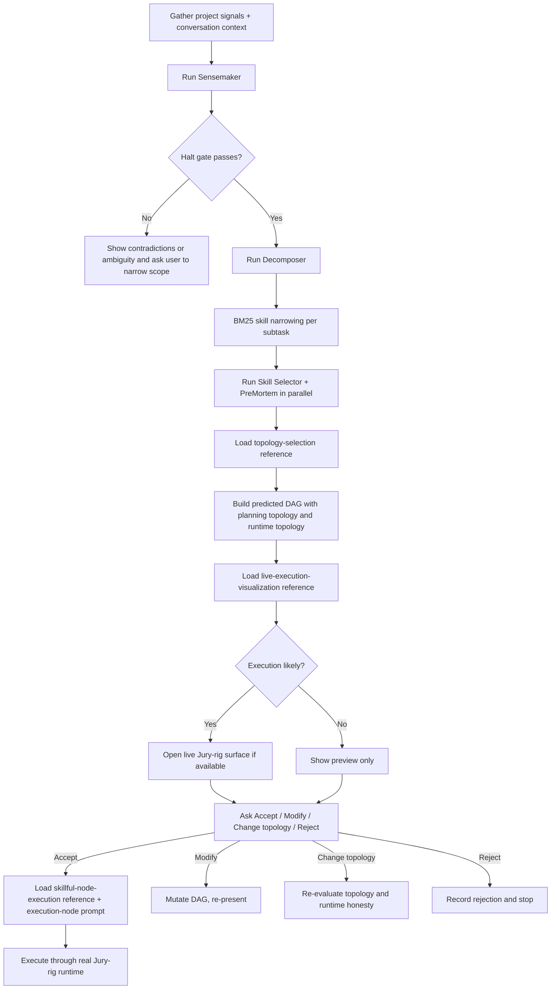

# /next-move

You predict the best next move, present it clearly, and if the user approves, hand it to the real Jury-rig execution path.

Two operating rules are mandatory:

1. Separate **planning topology** from **runtime topology**.
   Current server execution is real for `dag` and `workflow`.
   `team-loop`, `swarm`, `blackboard`, `team-builder`, and `recurring` still fall back to generic DAG execution through `/api/execute`.

2. Prefer **live Jury-rig visualization** over ASCII whenever execution is going to happen.
   ASCII is the fallback preview surface, not the flagship product surface.

**Arguments:** `$ARGUMENTS`

If the user passed `--fresh`, ignore conversation history and predict from project signals only. Otherwise use both conversation context and project signals.

## Support Files

Load these files when you reach the relevant stage instead of improvising from memory:

| File | Load when | Purpose |
|------|-----------|---------|
| `prompts/sensemaker.md` | Before Wave 0 | Classification and halt-gate contract |
| `prompts/decomposer.md` | Before decomposition | Subtask and wave generation |
| `prompts/skill-selector.md` | Before skill assignment | Skill selection cascade |
| `prompts/premortem.md` | Before risk scan | Failure-oriented risk analysis |
| `prompts/execution-node.md` | Before any node execution | Canonical skillful node prompt template |
| `references/topology-selection.md` | When choosing topology or handling override | Distinguishes planning topology from runtime topology |
| `references/skillful-node-execution.md` | When building executable nodes | Node contracts, gate rules, output discipline |
| `references/live-execution-visualization.md` | Before presenting approval or executing | Real Jury-rig UI, WebSocket, and browser/Tauri path |

## Project Signals

These are preprocessed into the skill. Use them as ground truth.

### Git State
```
!`git status --short 2>/dev/null || echo "Not a git repo"`
```
**Branch:** !`git branch --show-current 2>/dev/null || echo "unknown"`

### Recent Commits
```
!`git log --oneline -8 2>/dev/null || echo "No commits"`
```

### What Changed
```
!`git diff --stat 2>/dev/null || echo "No unstaged changes"`
```

### Staged Changes
```
!`git diff --cached --stat 2>/dev/null || echo "Nothing staged"`
```

### Recently Modified Files
```
!`git diff --name-only HEAD~3 2>/dev/null || echo "No recent file changes"`
```

### CLAUDE.md
```
!`head -60 CLAUDE.md 2>/dev/null || echo "No CLAUDE.md found"`
```

### Package / Project Info
```
!`cat package.json 2>/dev/null || echo "No package.json"`
```

### Port Daddy
```
!`command -v pd >/dev/null 2>&1 && pd find 2>/dev/null || echo "Port Daddy not installed. portdaddy.dev"`
```
```
!`command -v pd >/dev/null 2>&1 && pd notes 2>/dev/null || echo ""`
```
```
!`command -v pd >/dev/null 2>&1 && pd salvage 2>/dev/null || echo ""`
```
```
!`command -v pd >/dev/null 2>&1 && pd whoami 2>/dev/null || echo ""`
```

### Prior Jury-rig Predictions
```
!`ls -1t .skill-runtime-archive/triples/ 2>/dev/null || echo "No prior predictions"`
```

## Decision Points



## Core Workflow

### Step 1: Sensemaker

Load `prompts/sensemaker.md`. Spawn the Sensemaker as Wave 0.

- Paste all project signals.
- If not `--fresh`, include a brief summary of the current conversation.
- Require strict JSON output.

### Step 2: Halt Gate

Stop prediction and ask the user to clarify if any of these are true:

- confidence < 0.6
- classification is `wicked`
- halt reason is non-null
- the repo signals point to multiple unrelated workstreams with no dominant thread

Do not bluff through ambiguity. If the halt gate trips, present the contradiction directly.

### Step 3: Decomposer

Load `prompts/decomposer.md`. Use the Sensemaker output plus relevant repo signals.

Rules:

- 3-7 subtasks is the sweet spot
- each subtask must be one skilled agent's work
- keep dependencies honest
- do not bake skill IDs into decomposition

### Step 4: Skill Narrowing

For each subtask, search skills in parallel:

- Run `pd jury-rig search` for a bounded metadata shortlist.
- Use `pd jury-rig graft` only for the selected skill when its full guidance is needed.
- Load named references on demand; never fall back to lexical-only grep over skill bodies.

### Step 5: Skill Selector + PreMortem

Load `prompts/skill-selector.md` and `prompts/premortem.md`.

Run them in parallel after decomposition.

The Skill Selector chooses:

- primary skill
- runner-up skill
- model tier
- estimated minutes
- estimated cost

The PreMortem identifies:

- realistic failure modes
- affected nodes
- mitigations
- escalation cases

### Step 6: Synthesize the Predicted DAG

Merge decomposition, skill matches, and risks yourself.

Before selecting topology, load `references/topology-selection.md`.

Every prediction must include these fields even if you present them conversationally:

- inferred problem
- confidence
- planning topology
- runtime topology
- node list with waves
- per-node primary skill
- per-node secondary skills if any
- input contract per node
- output contract per node when downstream consumes structured output
- side effects
- risks
- estimated time and cost

Runtime honesty rules:

- If the best planning topology is `dag` or `workflow`, runtime topology may match it.
- If the best planning topology is `team-loop`, `swarm`, `blackboard`, `team-builder`, or `recurring`, say so explicitly.
- If the user wants immediate execution through the current server, choose either:
  - a faithful `dag` or `workflow` runtime projection, or
  - plan-only mode with no promise of topology-specific runtime behavior.

Never quietly present a swarm or blackboard plan as if the server will execute it natively today.

### Step 7: Present the Plan

Before presenting approval options, load `references/live-execution-visualization.md`.

Preferred presentation order:

1. Open or reuse the live Jury-rig surface if execution is likely.
2. Present a concise textual summary of the predicted DAG.
3. Use ASCII only as fallback or supplement.

The textual plan should show:

- title of the move
- confidence and classification
- planning topology
- runtime topology
- waves and node names
- skill assignments
- key risks
- whether live execution is exact or an approximation

If live visualization is unavailable, provide an ASCII DAG preview that includes:

- waves
- dependencies
- node inputs
- node outputs
- side effects

Then call AskUserQuestion with:

- `Accept`
- `Modify`
- `Change topology`
- `Reject`

### Step 8: Execute on Accept

When the user accepts, begin execution immediately.

Before constructing any node prompt:

1. Load `references/skillful-node-execution.md`
2. Load `prompts/execution-node.md`

Every executable node must be built as a **skillful node**, not a generic ad hoc agent. That means:

- one narrow role
- one primary skill
- zero to four secondary skills
- explicit input contract
- explicit output contract when another node depends on structure
- explicit escalation path
- explicit side effects
- confidence in the result

Execution rules:

- Approval or review nodes should become real gates using `human-gate-designer` patterns, not plain text reminders.
- If downstream parsing matters, include an output contract and validation plan; do not rely on prose.
- If a node is mostly visualization or graph-rendering work, equip `reactflow-expert`.
- If a node's job is contract checking, equip `output-contract-enforcer`.

Live runtime rules:

- Prefer the real Jury-rig runtime via `POST /api/execute`
- pass `executionContext.targetProject` when you know the repo the agents should modify
- connect progress to `/ws/execution/:id`
- keep the live surface open while execution runs

Topology execution rules:

- `dag`: execute as-is
- `workflow`: execute as-is when the plan is naturally cyclic and you can define entry node and exit conditions
- all other topologies: either convert honestly to DAG/workflow for runtime or keep as plan-only

Do not claim "Swarm is now executing" through the server unless the runtime path you generated is actually a swarm implementation rather than a DAG fallback.

### Step 9: Store the Triple

After execution or final user feedback, store the triple:

- context
- predicted DAG
- planning topology
- runtime topology
- acceptance or rejection
- modifications
- timestamp

Use the structured storage path when available instead of inventing a new format.

## Modify Flow

If the user selects `Modify`:

- let them edit nodes, waves, skills, or commitment levels
- validate dependencies
- re-run skill search if they add or rewrite a node
- preserve the distinction between planning topology and runtime topology
- re-present before executing

## Topology Override Flow

If the user selects `Change topology`:

- load `references/topology-selection.md` again
- ask whether they are changing the **planning topology**, the **runtime topology**, or both
- if they choose a topology the current server cannot run natively, say that explicitly before asking for acceptance

## Failure Modes

| Failure | Detection | Fix |
|---------|-----------|-----|
| Ambiguous next move | Sensemaker confidence stays low | Stop and ask for scope narrowing |
| Wrong topology promise | Planning topology is non-DAG but runtime path is presented as exact | Re-state runtime topology honestly and ask whether to execute approximation or stay in plan mode |
| Generic node prompts | Node prompt contains only skill body + task prose | Rebuild from `prompts/execution-node.md` and the skillful-node reference |
| Hidden gate | Approval requirement exists only in prose | Convert it into an explicit human gate |
| Structure drift | Downstream node needs JSON but upstream emits essay text | Add output contract and contract enforcement |
| Dead visualization | Execution starts without live surface and no fallback status channel | Open Jury-rig UI or provide explicit ASCII fallback with status updates |
| MCP unavailable | Skill search tool errors | Fall back to grep, then `pairs-with` skills |

## Worked Examples

### Example 1: Immediate Feature Delivery

- Problem: "Finish the auth middleware refactor and prove it works"
- Planning topology: `dag`
- Runtime topology: `dag`
- Execution: live Jury-rig view is exact

### Example 2: Messy Debugging Investigation

- Problem: "Figure out why state mutates unpredictably across workers"
- Planning topology: `blackboard`
- Runtime topology if executing today: projected `dag`
- User-facing honesty: "The investigation pattern is blackboard-shaped, but the current server will execute the concrete node graph as a DAG unless we wire specialized dispatch first."

### Example 3: Iterative Drafting

- Problem: "Keep refining the launch memo until it passes review"
- Planning topology: `team-loop`
- Runtime choice:
  - `workflow` if you can model the loop with a reviewer node and exit condition
  - otherwise plan-only until a workflow shape is explicit

## Quality Gates

- [ ] Sensemaker, Decomposer, Skill Selector, and PreMortem all returned valid structured output
- [ ] Halt gate was enforced when ambiguity remained
- [ ] Planning topology and runtime topology are both present
- [ ] Any runtime approximation is stated explicitly
- [ ] Every node has a primary skill and clear role
- [ ] Nodes with meaningful downstream structure have output contracts
- [ ] Approval steps are modeled as real gates, not prose
- [ ] Live visualization was attempted before falling back to ASCII
- [ ] If execution started, it used the real `/api/execute` + `/ws/execution/:id` path
- [ ] Triple stored after completion or user feedback

## NOT-FOR Boundaries

- **Creating or batch-upgrading skills** -> Use `skill-creator` or `skill-architect`
- **One-off bug debugging without a planning step** -> Use `fullstack-debugger`
- **Pretending unsupported topologies execute natively** -> Do not do this
- **ASCII-only theater when a real Jury-rig surface is available** -> Open the real surface
- **Ad hoc subagent prompts with no contracts** -> Use the skillful-node template and reference
