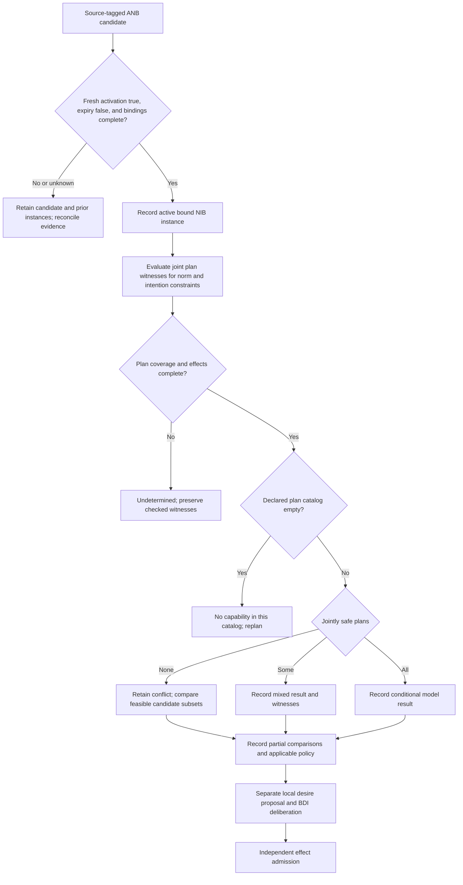

# Normative BDI Agent Architecture

Use this skill to model a proposed normative-BDI deliberation loop: record a candidate
norm, test its applicability, choose whether to internalize it, and explain a local
policy decision. The primary bodies read for this bundle are Tufiș and Ganascia, “Normative rational agents – A BDI approach” (RDA2 2012, printed pp. 37–43) and “Grafting Norms onto the BDI Agent Model” (2015, DOI 10.1007/978-3-319-21548-8_7, §§7.2–7.7), accessed 2026-09-24. “A Normative Extension for the BDI Agent Model” is distinct 2014 CLAWAR work (DOI 10.1142/9789814623353_0080); only its metadata was accessed. These sources model normative deliberation, not ethical/legal correctness or authority for an external effect. A norm's source, scope, freshness, activation, and effect authority remain separate checks.

## When to Use

- Multiple rules, obligations, prohibitions, or stakeholder demands cannot all be satisfied together.
- An agent must distinguish knowing that a norm exists from actually choosing to follow it.
- A system needs to justify why it violated one rule to satisfy another higher-stakes commitment.
- You need a consequence-based alternative to brittle hard-coded priority lists.
- A BDI architecture needs a principled way to integrate normative reasoning without turning norms into absolute overrides.

## NOT for Boundaries

This skill is not the primary tool for:
- A verified hard constraint or fixed priority whose source, scope, and applicability already determine precedence; record it directly rather than relitigating it as a soft trade-off.
- Pure constraint satisfaction where any satisfying solution is good enough and norm violation is out of scope.
- Regulatory or ethical environments that require literal non-violation regardless of consequences.
- Toy rule engines that do not maintain beliefs, commitments, or explanations of deliberate violations.

## Core Mental Models

### Recognition Is Not Internalization

Keep the **Abstract Norm Base (ANB)** separate from the **Norm Instance Base (NIB)**. ANB records a recognized candidate norm and its claimed source; it is neither truth nor authority. After activation and variable binding, NIB holds active norm instances. A separate local deliberation may internalize a consistent obligation/prohibition by updating desires; neither NIB nor a desire update authorizes an external effect.

### Three Consistency States

- **Complete nonempty enumeration, all safe**: operational strong consistency.
- **Complete nonempty enumeration, mixed safe/unsafe**: operational weak consistency.
- **Complete nonempty enumeration, none safe**: operational strong inconsistency.
- **Empty complete plan set**: no capability; incomplete search or unknown effects: undetermined. These are local disambiguations of the source predicates, whose universal and existential forms overlap.

Evaluate the same plan against both norm and intention constraints: a witness for each separately need not be a joint witness. Preserve a checked joint witness even when search coverage is incomplete.

### Consequence Ranking

When norms conflict, compare modeled outcomes of coherent bundles of commitments, retaining all maximal adverse outcomes when the relation has no single greatest element. The source relation orders consequences only partially. Preserve incomparability; a “least-bad” choice needs a separately declared, applicable tie policy and is not supplied by the source model.

### Norms as Hypothetical Desires

An applicable local policy can represent an obligation or prohibition as a desire proposal inside BDI deliberation. This does not make every norm defeasible: verified hard constraints still bound feasible plans, and effect enforcement remains independent.

## Decision Points

See the adoption and conflict flow in [diagrams/01_flowchart_decision-points.md](diagrams/01_flowchart_decision-points.md).

### 1. Decide Whether to Adopt a Norm

- If a complete search finds no safe plan, retain the conflict and alternatives; do not force a winner.
- If results are mixed, record the safe and unsafe plan effects, then ask local policy whether to propose a desire update.
- If all enumerated plans are safe, record a conditional model result. In every case, check source, scope, activation, hard constraints, capability reality, and separately authorize any external effect.

### 2. Decide How to Resolve a Conflict

- Generate maximal non-conflicting subsets rather than comparing norms one-by-one in isolation.
- Build feasible joint plans for each subset and record modeled outcomes. Retain multiple maximal adverse outcomes when no single greatest consequence exists.
- Compare consequence sets only where the partial relation establishes an order. Preserve incomparable alternatives; a choice requires a separately declared, applicable tie policy, and does not itself authorize a violation or effect.

### 3. Decide When to Instantiate an Abstract Norm

- Instantiate only when current beliefs bind the variables, activation is confirmed true, and expiry is confirmed false under the declared reconciliation policy.
- Keep unresolved norms visible when knowledge is incomplete instead of pretending they do not apply.
- Re-evaluate pending abstract norms after meaningful belief updates.

## Failure Modes

### 1. Over-Adoption Deadlock

**Symptoms:** the agent keeps internalizing norms until no feasible action remains.  
**Detection rule:** the active action space shrinks faster than conflicts are resolved.  
**Recovery:** require activation, binding, and evidence checks before a new NIB instance; run consistency only before a separate desire proposal, not as a gate on active-instance recording.

### 2. Hidden Violation

**Symptoms:** the agent violates a norm but cannot state that it chose to do so.  
**Detection rule:** post-hoc explanations omit the rejected norm or treat the violation as if it never existed.  
**Recovery:** preserve recognized source norms and active instances; record deliberate choices, accidental execution failures, unknown comparisons, and the actual policy disposition distinctly.

### 3. Binary Consistency Collapse

**Symptoms:** adoption logic treats every norm as either fully compatible or impossible.  
**Detection rule:** weak consistency never appears in the architecture or logs.  
**Recovery:** add an explicit weak-consistency branch and model flexibility loss directly.

### 4. Fixed-Priority Brittleness

**Symptoms:** a priority is applied outside its stated scope or without verifying the hard constraint that gives it precedence.  
**Detection rule:** the log cannot name the priority source, applicability, or exception rule.  
**Recovery:** preserve verified hard priorities; use partial-order comparison only for conflicts that policy leaves unresolved.

### 5. Norm Side-Channel Architecture

**Symptoms:** internal norm deliberation is confused with effect enforcement, so either one silently overrides the other.  
**Detection rule:** the record cannot show ANB/NIB state, local desire policy, and a separate effect-admission decision.  
**Recovery:** keep deliberative proposals in BDI records and keep independent effect enforcement explicit; connect them with receipts rather than collapsing either boundary.

## Worked Examples

### Example 1: Privacy vs. Personalization

A service design exercise receives a purported policy prohibiting direct use of
customer-level data and a goal to improve user experience. It first records the policy
issuer, scope, version, and effective time; until those checks pass it is a candidate
norm, not a compliance conclusion. A local design comparison can show that aggregate
summaries preserve some personalization while limiting exposure, but a separate privacy
authority must approve any use.

### Example 2: R781 and Baby Travis (source toy model)

The source’s science-fiction scenario supplies a **toy plan base**: `feed(R781, Travis)` requires `love(R781, Travis)`, and only the feeding plan has the modeled `healed(Travis)` effect. R781 has a prohibition and receives an obligation over the same `love` literal. This is not medical evidence, a claim that love heals children, or a real-world ethics rule. The agent may expose the two modeled alternatives and their partial-order relation; if the consequences are incomparable or authority is absent, it retains them for local policy rather than selecting or executing one.

## Quality Gates

- [ ] The architecture distinguishes recognized ANB candidates, active NIB instances, and separate desire internalization.
- [ ] Consistency checks distinguish complete empty catalogs, complete nonempty classifications, and incomplete/unknown results; norm and intention constraints use joint witnesses.
- [ ] Conflict resolution compares coherent subsets, not isolated norms only.
- [ ] Deliberate violations, accidental failures, unknown outcomes, and any applicable policy decision are recorded distinctly.
- [ ] Abstract norms can remain pending when belief grounding is incomplete.

## Reference Files

- `diagrams/01_flowchart_decision-points.md` — Mermaid flowchart routing norm detection through grounding, consistency checks, and conflict resolution by consequence comparison. **Read when** designing or debugging the agent's norm adoption decision tree.

- `references/separation-of-norm-recognition-and-norm-internalization.md` — Defines the Abstract Norm Base vs. Norm Instance Base distinction; explains why detecting a norm is not the same as committing to follow it. **Read when** implementing the agent's mental model or explaining why it knows but rejects a norm.

- `references/norm-instantiation-through-belief-grounding.md` — Shows how abstract norms (with variables and conditions) become concrete obligations by grounding them in the agent's current beliefs. **Read when** converting environment norms into actionable commitments.

- `references/three-types-of-consistency-for-norm-adoption.md` — Describes strong consistency, weak consistency, and flexibility cost; defines conditional model results, no-capability, and undetermined search states. **Read when** evaluating whether a new norm can coexist with existing commitments.

- `references/maximal-non-conflicting-subsets-for-action-selection.md` — Algorithm for finding all maximal sets of compatible goals and norms; foundation for consequence ranking. **Read when** implementing conflict resolution or generating candidate action sets.

- `references/normative-conflict-resolution-through-consequence-ranking.md` — Core principle: compare worst-case outcomes of conflicting norm bundles to preserve partial-order comparisons and escalation paths. **Read when** justifying a deliberate norm violation or ranking competing obligations.

- `references/desire-internalization-as-norm-adoption-mechanism.md` — Explains the source desire-set integration point and a local policy interface that preserves source beliefs and active instances while proposing goals for BDI deliberation. **Read when** integrating normative reasoning into a BDI agent's goal management.

- `references/source-boundary-and-authority-trace.md` — Records source access limits and separates a candidate norm, applicability evidence, local deliberation, and independent effect authorization. **Read when** a design is at risk of treating a norm label as ethical, legal, or runtime authority.

## Anti-Patterns

- Treating a verified hard priority as a soft trade-off, or treating an unverified priority as universally binding.
- Auto-adopting every detected norm and discovering contradictions only at execution time.
- Treating weak consistency as if it were the same as strong consistency.
- Comparing violations by average utility while ignoring catastrophic worst cases.
