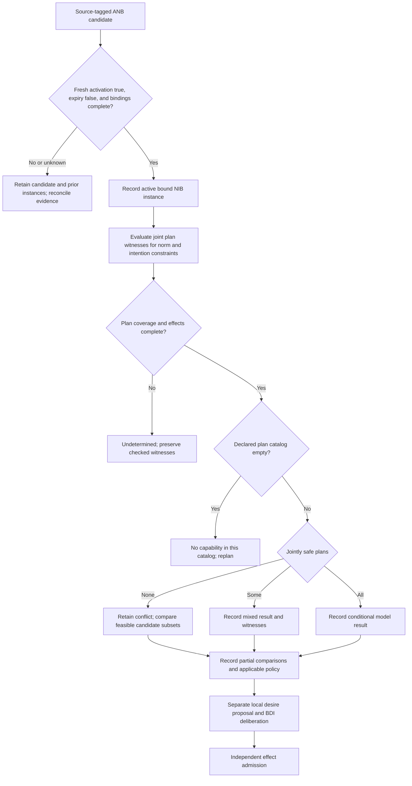

# Norm adoption and conflict routing

The flow summarizes a local operational completion of the source model. NIB activation precedes desire deliberation; complete-plan classifications require joint witnesses. Separate effect admission does not imply that an effect was executed.
