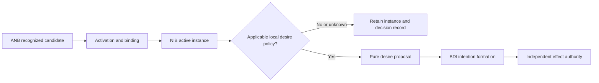

# Desire proposals from active norm instances

## Source boundary

The primary bodies read are Tufiș and Ganascia, *Normative rational agents – A BDI approach* (RDA2 2012, pp. 37–43) and *Grafting Norms onto the BDI Agent Model* (2015, §§7.2–7.7), accessed 2026-09-24. The distinct 2014 CLAWAR publication was metadata-only. These sources model deliberation, not legal/ethical correctness or authority for an external effect.

ANB holds recognized source claims; NIB holds activated, bound instances. Neither step updates desires. A separate local policy may propose a desire update from a particular active instance; intention formation and effect admission remain separate.



## Keep the BDI records distinct

| Record | What it represents | What updating it does not establish |
| --- | --- | --- |
| belief | a sourced observation or a modeled fact | the truth of every reported norm or authority to execute it |
| ANB | recognized abstract norm, issuer, version, conditions | activation or adherence |
| NIB | activated, grounded instance with evidence | acceptance as a desire |
| desire proposal | policy-selected objective to consider | feasibility or a committed plan |
| intention | a selected commitment and associated planning state | successful execution or external admission |

Recording `reported(issuer, O(review(asset)))` is a belief about a report. It is not a belief that `review(asset)` has happened, and it is not an intention to execute a particular review plan. This distinction lets an agent retain a norm it has not adopted and explain why.

## Pure proposal interface

The source locates norm adoption in desire-set deliberation. It does not supply numeric modality weights or a universal priority ordering. The following **local policy** maps obligations to `ACHIEVE`, prohibitions to `AVOID`, and permissions to a recorded non-goal. `AVOID` is a structured objective, not a string negation or an implementation of temporal non-occurrence. A planner must define its time horizon and effect semantics.

The input instance is a validated `NormInstance` from [the grounding example](norm-instantiation-through-belief-grounding.md). A policy applies to its exact instance identity and source version. This is a pure example; the boolean applicability field is a caller's evaluated model input, not authentication or authority.

```python
from dataclasses import dataclass

@dataclass(frozen=True)
class DesirePolicy:
    policy_id: str
    version: str
    instance_identity: tuple
    source_version: str
    applies: bool | None

@dataclass(frozen=True)
class DesireProposal:
    status: str
    objective_kind: str | None
    content: tuple
    modality: str
    source_instance: tuple
    policy_identity: tuple[str, str]

def propose_desire(active_instance, policy):
    if not policy.policy_id or not policy.version:
        raise ValueError("policy identity and version are required")
    if type(policy.applies) not in (bool, type(None)):
        raise ValueError("applicability must be true, false, or unknown")
    if active_instance.modality not in {"O", "F", "P"}:
        raise ValueError("unmodeled norm modality")
    applicable = (policy.applies is True
                  and policy.instance_identity == active_instance.identity
                  and policy.source_version == active_instance.source_version)
    kind = {"O": "ACHIEVE", "F": "AVOID", "P": None}[active_instance.modality]
    status = ("PROPOSED" if kind else "PERMISSION_RECORDED") if applicable else "POLICY_REQUIRED"
    return DesireProposal(status, kind if applicable else None,
                          active_instance.content, active_instance.modality,
                          active_instance.identity, (policy.policy_id, policy.version))
```

## Constructed integration trace

1. `review-policy@3` activates `F(publish(asset_a))`; NIB records the bound instance independently of any desire decision.
2. `publication-goals@1` applies to that exact instance and proposes `AVOID(publish(asset_a))`. The code preserves the `F` modality, source identity, and local policy identity. It never returns an achievement goal to publish.
3. A separate delivery desire proposes publishing. BDI deliberation now has an explicit conflict to analyze against feasible plans, modeled effects, and hard constraints. A policy-required result leaves both the NIB record and existing desires intact.
4. A fresh expiry may retire the NIB instance. A controller must separately reconsider any previously adopted desire/intention; this pure function neither retracts commitments nor executes plans.
5. A `P(publish(asset_a))` instance records permission in the normative model. It creates no desire and proves no account, credential, resource, or execution capability.

A Java/Jadex adapter can first snapshot active instances, produce immutable proposals, and then submit one version-bound deliberation input. Do not mutate the desire set while iterating NIB. If beliefs or source versions change before adoption, re-evaluate the snapshot. Missing policy, conflicting proposals, and resource overload require an explicit disposition; an arbitrary numeric weight cannot silently authorize violating a hard requirement.

## Failure recovery

| Condition | Result and next decision |
| --- | --- |
| no applicable policy, unknown applicability, or identity/version mismatch | `POLICY_REQUIRED`; retain the instance and investigate policy applicability |
| obligation/prohibition conflict | compare feasible joint plans; preserve source and policy provenance |
| permission | `PERMISSION_RECORDED`; no goal or operational capability implied |
| expired instance but live intention | reconsider commitment under the declared controller policy |
| effect requested | independent authority permits, denies, or escalates |

These examples retain the desire-set integration method without claiming that all norms are soft, tradeable, or automatically enacted.
