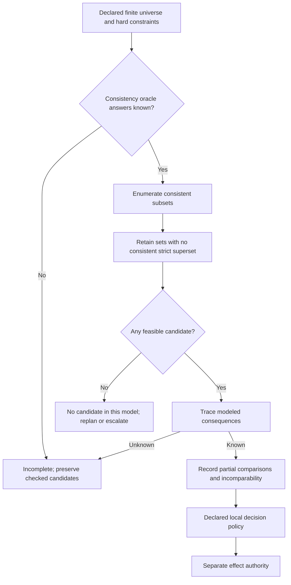

# Maximal non-conflicting candidate subsets

## Source boundary

The primary bodies read are Tufiș and Ganascia, *Normative rational agents – A BDI approach* (RDA2 2012, pp. 37–43) and *Grafting Norms onto the BDI Agent Model* (2015, §§7.2–7.7), accessed 2026-09-24. The distinct 2014 CLAWAR publication was metadata-only. These sources model deliberation, not legal/ethical correctness or authority for an external effect.

A subset is **inclusion-maximal** when it is consistent and has no consistent strict superset in the declared universe. It is not necessarily maximum-size or highest utility. Testing only single-item additions proves this property when consistency is downward-closed; without that assumption, test all strict supersets. The exhaustive example below does the latter.

## Declare the universe and consistency model

The universe can contain candidate commitments or candidate plans, but identify which before computing. A commitment set still needs a feasible joint plan: pairwise logical compatibility alone does not prove resource, timing, or causal compatibility. Keep verified hard constraints outside the optional subset choice and require every candidate to satisfy them.

Let `U={p1,p2,p3,p4}` be four optional toy commitments. Only `p1` and `p3` conflict; `p4` is compatible with everything. The inclusion-maximal sets are `{p1,p2,p4}` and `{p2,p3,p4}`. Omitting `p4` would falsely label a smaller set maximal. In a second universe `{a,b,c}` where `a` conflicts with both `b` and `c`, the sets `{a}` and `{b,c}` are both maximal, but only the latter has maximum cardinality.

```python
from itertools import combinations

def maximal_subsets(universe, consistent):
    if not isinstance(universe, (tuple, list, set, frozenset)):
        raise ValueError("supply a finite collection of candidate IDs")
    if any(type(x) is not str or not x for x in universe):
        raise ValueError("candidate IDs must be nonempty strings")
    if len(set(universe)) != len(universe):
        raise ValueError("duplicate candidate IDs")
    ordered = tuple(sorted(universe))
    if len(ordered) > 16:
        raise ValueError("toy exhaustive enumerator limited to 16 candidates")
    candidates = []
    for n in range(len(ordered) + 1):
        for members in combinations(ordered, n):
            subset = frozenset(members)
            verdict = consistent(subset)
            if verdict is None:
                raise LookupError("unknown consistency: complete result unavailable")
            if type(verdict) is not bool:
                raise ValueError("consistency oracle must return bool or None")
            if verdict:
                candidates.append(subset)
    return tuple(s for s in candidates if not any(s < t for t in candidates))
```

The caller must supply a deterministic consistency oracle over the fixed model. A returned result is complete **only for that declared universe and oracle**. An unknown result or exception does not become false. With an empty universe and a true empty-set verdict, the unique maximal set is the empty set; if even the empty set is inconsistent, there are no feasible candidates. Neither result proves an external task impossible.

## Worked trace and cost

For the first universe, define `consistent(S) = not ({p1,p3} <= S)`. There are 16 oracle calls. The final filter retains exactly the two sets above. For `n` candidates, enumeration makes `2^n` oracle calls, and the simple maximality filter can compare up to `4^n` pairs; this is an explanatory algorithm, not a scalable solver.

For larger models, constraint solving, conflict-directed search, or a declared budget can produce useful candidates. Record the explored universe, unknown oracle answers, stopping reason, and coverage. A bounded search alone cannot claim to have enumerated all maximal sets. It **can** certify an individual candidate's maximality if it checks every required extension (single additions only under downward-closed consistency); record that narrower certificate separately.

## Compare actual modeled outcomes

Pass candidate sets to a trace function, then compare its returned outcomes using [the partial-relation example](normative-conflict-resolution-through-consequence-ranking.md). Do not compare candidate labels such as `p1` and `p3` as if they were consequences. Save the candidate-to-outcome mapping and every evaluated relation, including unknown and incomparable pairs. No complete trace means no complete consequence comparison.



## Failure analysis

| Mistake | Counterexample or diagnostic | Repair |
| --- | --- | --- |
| maximal means maximum-size | `{a}` and `{b,c}` are both maximal in the second universe | retain all inclusion-maximal alternatives |
| pairwise compatible means jointly executable | three tasks each use one slot; only two slots exist | evaluate joint resource and timing constraints |
| unknown consistency means inconsistent | unmodeled effect returns no verdict | preserve unknown; do not claim completeness |
| limited search proves no solution | unexplored candidate may be feasible | report coverage and stopping reason |
| empty result allows discarding a hard norm | hard constraints may themselves conflict | keep the conflict visible; use authorized escalation |

Logical derivation under belief rules is a modeled consequence, not causal truth. These methods concern finite, explicit models, with no claim about human reasoning or deployment safety.
