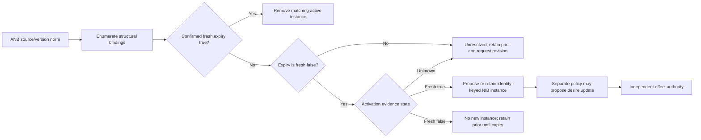
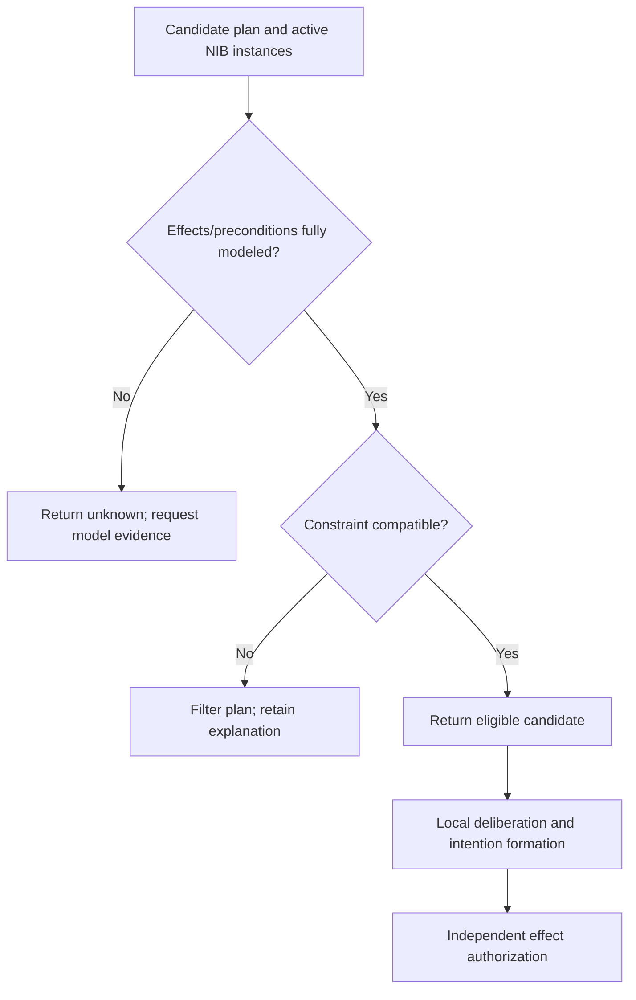

# Norm instantiation through belief grounding

## Source and operational boundary

The bodies read for this bundle are Tufiș and Ganascia, *Normative rational agents – A BDI approach* (RDA2 2012, pp. 37–43) and *Grafting Norms onto the BDI Agent Model* (2015, §§7.2–7.7), accessed 2026-09-24. The distinct 2014 CLAWAR work was metadata-only. The source bridge creates an active NIB instance from an activated, grounded ANB record; the abstract source record remains available. It does not establish the source claim as truth, update desires automatically, or authorize an external effect.

## What grounding must preserve

An ANB record has a source/version identity, modality, activation and expiry predicates, content, and variables. An NIB instance additionally keeps the exact bindings used to create it, evidence timestamps, and a stable identity. Without bindings, a later expiry check can accidentally evaluate the wrong entity. Without source/version identity, a revision cannot be reconciled safely.

The local completion below uses typed observations and a three-valued evaluator for each grounded atom:

| Evidence state | Reconciliation result |
| --- | --- |
| fresh true activation and fresh false expiry | propose or retain the bound active instance |
| fresh false activation | prevents **new** creation; a prior active instance remains until confirmed expiry |
| missing, stale, future-dated, malformed, or contradictory activation/expiry | unresolved; retain prior instance rather than silently treating evidence as false |
| fresh true expiry | remove only the matching bound instance, even if activation is unknown |

This is a constructed implementation policy, not a claim that the paper specified a freshness window or evidence type.



## Detailed constructed example: review records

A local repository policy version `review-policy@3` says: when a named asset has a fresh `requires_review(asset)=true` record and an explicit fresh `review_done(asset)=false` record, create the active prohibition `publish(asset)`. The example uses two bindings, `asset_a` and `asset_b`.

* `asset_a` has fresh true activation and fresh false expiry, so it yields `publish(asset_a)`.
* `asset_b` has fresh true activation but unknown expiry, so it is unresolved rather than published or activated.
* A fresh false activation prevents a new instance but does not retract an already active one; confirmed expiry is the retirement condition.
* A later fresh true `review_done(asset_a)` removes only `asset_a`’s instance.
* Repeating the first evidence snapshot is idempotent: its identity key prevents duplicates.

The records are a local policy example. They make no claim about legal review, compliance, release authority, or production runtime.

## Pure reconciliation example

The code returns a result. It does not mutate a caller’s ANB/NIB collections, execute a plan, or admit an effect. Tuple substitution changes only the argument of a flat unary predicate, never the predicate name or text inside an identifier.

```python
from dataclasses import dataclass
from typing import Mapping

@dataclass(frozen=True)
class Evidence:
    value: bool | None
    observed_at: int | None

@dataclass(frozen=True)
class AbstractNorm:
    norm_id: str
    version: str
    modality: str
    variable: str
    activate: tuple[str, str]
    expire: tuple[str, str]
    content: tuple[str, str]

@dataclass(frozen=True)
class NormInstance:
    identity: tuple[str, str, tuple[tuple[str, str], ...]]
    modality: str
    content: tuple[str, str]
    bindings: tuple[tuple[str, str], ...]
    source_version: str
    activated_at: int
    activation_evidence: tuple[Evidence, ...]
    expiry_evidence: tuple[Evidence, ...]

def substitute(term, bindings):
    if isinstance(term, tuple):
        if len(term) != 2:
            raise ValueError("example supports unary predicate tuples only")
        return (term[0], bindings.get(term[1], term[1]))
    return bindings.get(term, term)

def require_clock(now, max_age):
    if type(now) is not int or now < 0 or type(max_age) is not int or max_age < 0:
        raise ValueError("now and max_age must be nonnegative integer ticks")

def atom_state(atom, evidence, now, max_age):
    require_clock(now, max_age)
    records = evidence.get(atom, ())
    if not isinstance(records, (tuple, list)):
        return "UNKNOWN"
    fresh = []
    for record in records:
        if not isinstance(record, Evidence) or type(record.value) not in (bool, type(None)):
            return "UNKNOWN"
        tick = record.observed_at
        if type(tick) is not int or tick < 0 or tick > now:
            return "UNKNOWN"
        if now - tick <= max_age:
            fresh.append(record)
    values = {record.value for record in fresh}
    if not fresh or None in values or values == {True, False}:
        return "UNKNOWN"
    return "TRUE" if values == {True} else "FALSE"

def reconcile(norm, candidate_values, evidence, prior, now, max_age):
    require_clock(now, max_age)
    kept = {x.identity: x for x in prior}
    unresolved, added, removed = [], [], []
    for value in candidate_values:
        bindings = {norm.variable: value}
        key = (norm.norm_id, norm.version, tuple(sorted(bindings.items())))
        activation = atom_state(substitute(norm.activate, bindings), evidence, now, max_age)
        expiry = atom_state(substitute(norm.expire, bindings), evidence, now, max_age)
        # Confirmed binding-specific expiry retires even if activation is unknown.
        if expiry == "TRUE":
            if key in kept: removed.append(key); del kept[key]
            continue
        if activation == "TRUE" and expiry == "FALSE" and key not in kept:
            instance = NormInstance(key, norm.modality, substitute(norm.content, bindings),
                                    tuple(sorted(bindings.items())), norm.version, now,
                                    tuple(evidence[substitute(norm.activate, bindings)]),
                                    tuple(evidence[substitute(norm.expire, bindings)]))
            kept[key] = instance; added.append(key)
        elif activation == "UNKNOWN" or expiry == "UNKNOWN":
            unresolved.append((key, activation, expiry))
    return {"instances": tuple(sorted(kept.values(), key=lambda x: x.identity)),
            "added": tuple(added), "removed": tuple(removed),
            "unresolved": tuple(unresolved)}
```

## Activation, expiry, and recovery

The bridge checks activation and expiry for **each** binding. It never treats absent evidence as false. A stale fact and simultaneous fresh true/false facts produce `UNKNOWN`; this preserves an existing instance and records an unresolved binding for revision. A source/version change produces a different identity key, so a caller can reconcile it deliberately rather than overwriting an earlier source record.

This bounded example assumes validated norm records, flat predicate tuples with one declared variable, a caller-supplied binding list, and prior instances from the same pure reconciler. It retains creation evidence, not a durable audit history. Missing binding coverage and source revision reconciliation remain caller responsibilities. Invalid/future observation records make the atom unknown even alongside otherwise fresh evidence; old well-formed observations are excluded by the local freshness window.

The same mechanics apply to conjunctions and multiple variables only when the evaluator can enumerate bindings and report completeness. For example, a separately implemented three-valued evaluator can make `AND` false if any child is false, true if all are true, otherwise unknown; `OR` true if any child is true, false if all are false, otherwise unknown. A stricter evidence-coverage policy is a separate gate, not a different logical OR. A constructed hysteresis policy may use `queue_depth > 80` to activate and `queue_depth < 60` to expire. Between those hysteresis bounds, preserve prior activation until the declared expiry predicate becomes true; never infer expiry merely from activation becoming false. A temporal predicate can compare typed integer ticks only after rejecting future or stale observations. These are local evaluator examples, not source thresholds. An evaluator error or partial candidate list is `UNKNOWN`, never `false`.

## Plan filtering after instantiation

An active instance makes a content constraint available to plan filtering. Filtering still needs plan effects, preconditions, resources, time, and interference evidence. It does not execute a plan. A local policy may decide whether to propose a desire update from the active instance, and an effect authority separately decides whether an external action may occur.



## Failure and recovery table

| Failure | Observable condition | Pure recovery result |
| --- | --- | --- |
| missing predicate | no evidence record | `UNKNOWN`, no new instance |
| stale record | newest record exceeds local age | `UNKNOWN`, preserve prior instance |
| contradictory record | fresh true and false | `UNKNOWN`, request belief revision |
| repeated snapshot | same source/version/binding key | retain one instance |
| expiry for one binding | fresh true expiry for that key | remove only that key |
| source revision | version changes | separate identity; require explicit reconciliation policy |

These methods retain grounding, multiple bindings, activation/expiry, plan filtering, and recovery detail without claiming a runtime authorization path.
