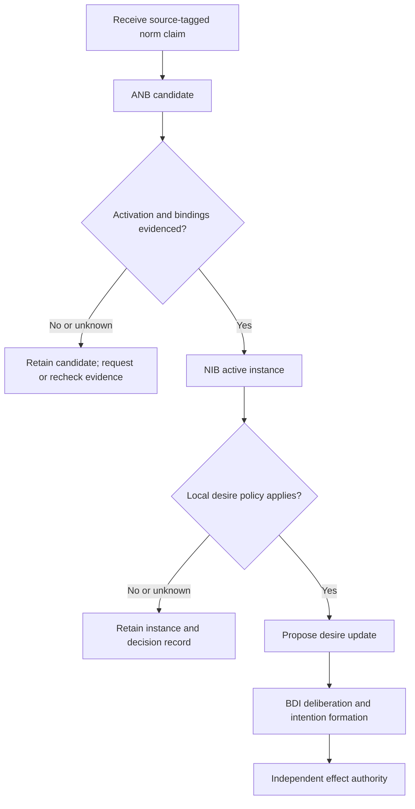

# Recognition, active instances, and desire internalization

## Source boundary

The primary bodies read are Tufiș and Ganascia, *Normative rational agents – A BDI approach* (RDA2 2012, pp. 37–43) and *Grafting Norms onto the BDI Agent Model* (2015, §§7.2–7.7), accessed 2026-09-24. The distinct 2014 CLAWAR publication was metadata-only. These sources model deliberation, not legal/ethical correctness or authority for an external effect.

The source distinguishes recognition from adherence. This bundle uses three records: ANB for a recognized source-tagged candidate, NIB for an active bound instance, and a separate policy decision for a desire proposal. ANB is not verified truth; absence of a desire proposal does not erase an active NIB instance.

## Record contract

| Layer | Preserve | Later transition |
| --- | --- | --- |
| recognized ANB candidate | source/issuer claim, version, modality, content, activation/expiry conditions, scope | instantiate each evidenced binding |
| active NIB instance | source identity, concrete bindings, activation evidence and time, expiry evidence | retire only under the declared expiry/revision policy |
| desire decision | exact instance and local policy version, model snapshot, accepted/deferred/rejected disposition, reasons | form or revise an intention under BDI policy |
| effect receipt | requested operation, applicable admission decision, actual observed result | compare observation against the intended/modelled result |

This is a local audit contract, not a claim that the papers specify these exact fields or cryptographic enforcement. If a transport reports another agent's policy, preserve who reported it and the original issuer separately. Recognizing the report does not prove the issuer's authority or that the other agent internalized it.

## Constructed temporal trace

1. At `t0`, a workspace source reports `retention@2: F(export(asset))` while a review record is active. ANB stores its identity, scope, conditions, and provenance; no binding or desire exists yet.
2. At `t1`, fresh evidence binds `asset_a` and establishes activation with false expiry. NIB records that active instance. ANB remains available for new bindings.
3. At `t2`, a local desire policy defers adoption because its applicability is unknown. The active NIB instance remains; the deferral is neither norm expiry nor permission to export. An independently enforced hard rule may still deny the effect.
4. At `t3`, activation becomes false while expiry remains false. Under [the local grounding policy](norm-instantiation-through-belief-grounding.md), no new instance is created, but the prior instance remains until confirmed expiry.
5. At `t4`, expiry is confirmed for `asset_a`. Only that instance retires. Reconsider any existing intention explicitly; retiring a record does not cancel an already admitted operation.
6. At `t5`, `retention@3` arrives. Preserve both source versions and reconcile their applicability; do not overwrite a still-active instance by matching only its text.

## Integrating with a BDI cycle

Snapshot source records and evidence, reconcile binding-specific activation/expiry, then prepare policy-bound desire proposals. Validate that the snapshot is still applicable when adopting a proposal. Intention selection uses actual capability and joint feasibility, while effect admission remains independent. A failed plan changes observed beliefs and may trigger replanning; it does not retroactively make the norm unrecognized.

Resource limits can force bounded deliberation. Preserve pending candidates and the stopping reason. Do not turn a timeout into `rejected`, a missing observation into `false`, or an unselected goal into a claim that its source norm no longer applies. For multi-agent designs, transmit source/version/binding and disposition separately; one agent's reported adoption is not evidence of another agent's commitment.

## Failure distinctions

| Observation | Record to inspect | Recovery |
| --- | --- | --- |
| norm source not recognized | ANB missing | request source/provenance evidence |
| activation unknown | ANB candidate and evidence | keep pending; do not create a new instance |
| active instance lacks desire proposal | NIB and local policy result | retain instance; review policy applicability |
| source changes during deliberation | version-bound snapshot | reconcile and re-evaluate before adoption |
| effect denied | effect receipt | preserve deliberation and the source record |
| observed violation was accidental | execution/model discrepancy | record the failure, not a fabricated deliberate choice |

This architecture represents deliberation and evidence. It makes no claim about human moral development, universal compliance, or correctness of a policy just because it is represented.
