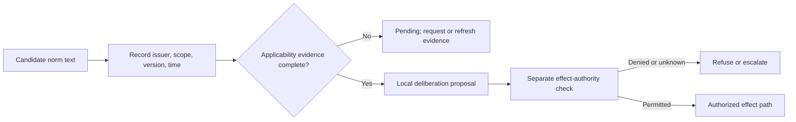
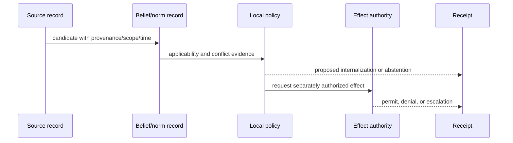

# Normative BDI source boundary and authority trace

Tufiș and Ganascia, “Grafting Norms onto the BDI Agent Model” (2015), DOI [10.1007/978-3-319-21548-8_7](https://link.springer.com/chapter/10.1007/978-3-319-21548-8_7), was read at §§7.2–7.7 depth on 2026-09-24 from an author-hosted full text; publisher metadata was cross-checked. Its model addresses norm instantiation/internalization and conflict. It does not prove a norm is ethical, legally binding, safe, or authorized for an effect. “A Normative Extension for the BDI Agent Model” is distinct 2014 CLAWAR work (metadata only here); the 2012 RDA2 paper is also distinct.

The diagrams are local design boundaries. They do not add mechanisms to the source paper.

Source bodies supporting the model: [2012 RDA2 paper, printed pp. 37–43](https://ceur-ws.org/Vol-885/paper6.pdf) and [author-uploaded 2015 chapter, §§7.2–7.7](https://www.researchgate.net/publication/286854510_Grafting_Norms_onto_the_BDI_Agent_Model). The exact executable interfaces in this bundle are local worked completions, not copied source implementations. The source model's acquisition and coherence limitations remain open; its fictional scenario is not an empirical ethical validation.
