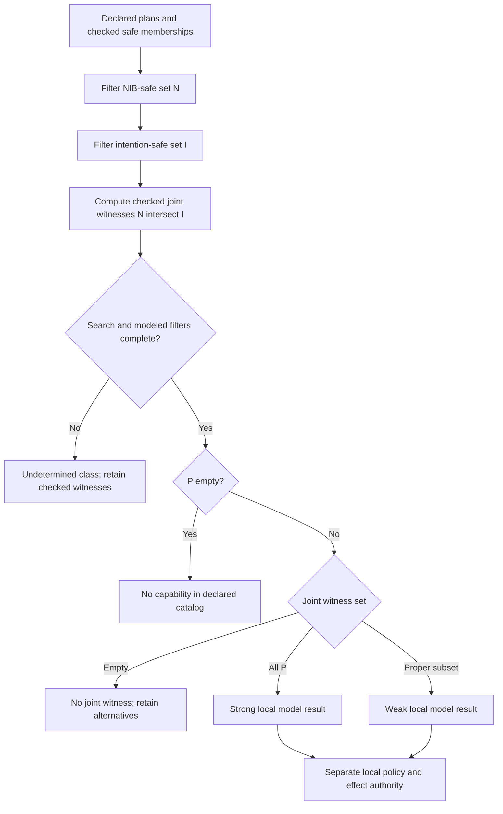
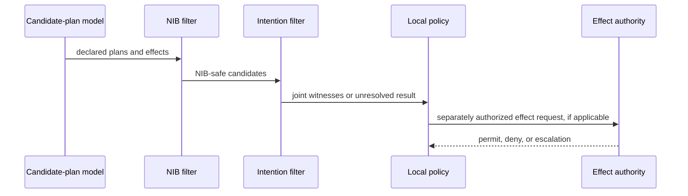

# Consistency classes for norm and intention candidates

## Source and local completion

The bodies read for this bundle are Tufiș and Ganascia, *Normative rational agents – A BDI approach* (RDA2 2012, pp. 37–43) and *Grafting Norms onto the BDI Agent Model* (2015, §§7.2–7.7), accessed 2026-09-24. The 2014 CLAWAR work was metadata-only. The source defines strong consistency with a universal safe-plan condition and weak consistency with an existential safe-plan condition. For a nonempty all-safe set, those predicates overlap. The following **local disjoint completion** does not claim to replace the paper’s quantifiers.

Plan–norm consistency concerns declared plan effects against active NIB prohibitions, permission exceptions, and obligation effects. Equal positive effects do not conflict merely because they are equal; complementary effects or a forbidden effect can. Plan–intention consistency needs an explicit interference relation over effects, preconditions, resources, or time. Neither relation authorizes an external effect.

## Local disjoint classes and joint witness

Let `P` be the declared candidate set and let `N` and `I` be the candidates safe against NIB and intentions, respectively.

| Preconditions | Result |
| --- | --- |
| candidate search/effects/interference incomplete or unknown | `UNDETERMINED` |
| complete `P` is empty | `NO_CAPABILITY` |
| complete nonempty `P`, `N ∩ I` empty | `NO_JOINT_WITNESS` |
| complete nonempty `P`, every candidate in `N ∩ I` | `STRONG_LOCAL` |
| complete nonempty `P`, nonempty proper `N ∩ I` | `WEAK_LOCAL` |

The intersection is essential. For `P={p1,p2}`, `N={p1}`, and `I={p2}`, both marginal safe sets are nonempty but there is no jointly safe plan. A classifier that checks only each marginal set would incorrectly claim a feasible adoption path.



## Detailed constructed workflow example

A release-preparation workspace has three fully modeled candidate plans for asset `a17`:

| Plan | Declared effects/resources | NIB-safe? | intention-safe? |
| --- | --- | --- | --- |
| `p1` create redacted preview | uses preview quota; no protected export | yes | yes |
| `p2` publish full artifact | creates protected export | no: active prohibition forbids this effect | yes |
| `p3` defer publication | preserves export boundary | yes | no: consumes the same exclusive review slot as an active intention |

Here `P={p1,p2,p3}`, `N={p1,p3}`, `I={p1,p2}`, and the joint witness set is `{p1}`. The result is `WEAK_LOCAL`: it records one jointly safe candidate, not a schedule, composition order, or permission to publish. Preconditions, resource locks, timing, and interference must still be checked before any separate effect authority admits an operation.

A second fixture with `P={p1,p2}`, `N={p1}`, and `I={p2}` yields `NO_JOINT_WITNESS`. A verified hard retention policy can rule out `p2` directly when it applies; it is not a defect merely because it has fixed precedence.

## Pure classifier

The function is pure and result-producing. It does not add to NIB, update desires, choose a schedule, or execute a plan. A caller must supply declared coverage and an explicit intention-safety relation. Membership in either safe set means that candidate was actually checked against the corresponding predicate in this model; unchecked candidates cannot be inserted as safe. The coverage flags say whether the whole declared search/model was assessed. An incomplete run cannot establish a universal class or negative result, but it preserves any already checked joint witnesses in `joint_safe`. `UNDETERMINED` refers to the complete consistency classification, not denial of an observed witness.

```python
from dataclasses import dataclass

@dataclass(frozen=True)
class ConsistencyResult:
    status: str
    joint_safe: frozenset[str]
    norm_safe: frozenset[str]
    intention_safe: frozenset[str]

def classify_joint_candidates(plans, norm_safe, intention_safe, *, complete, effects_known, interference_known):
    flags = (complete, effects_known, interference_known)
    if any(type(flag) is not bool for flag in flags):
        raise ValueError("coverage flags must be booleans")
    def plan_ids(values):
        if not isinstance(values, (set, frozenset, list, tuple)):
            raise ValueError("plan ids must be an explicit collection")
        if any(type(value) is not str or not value for value in values):
            raise ValueError("plan ids must be nonempty strings")
        return frozenset(values)
    plans, norm_safe, intention_safe = map(plan_ids, (plans, norm_safe, intention_safe))
    if not norm_safe <= plans or not intention_safe <= plans:
        raise ValueError("safe sets must be subsets of declared plans")
    joint = norm_safe & intention_safe
    if not all(flags):
        return ConsistencyResult("UNDETERMINED", joint, norm_safe, intention_safe)
    if not plans:
        return ConsistencyResult("NO_CAPABILITY", joint, norm_safe, intention_safe)
    if not joint:
        return ConsistencyResult("NO_JOINT_WITNESS", joint, norm_safe, intention_safe)
    if joint == plans:
        return ConsistencyResult("STRONG_LOCAL", joint, norm_safe, intention_safe)
    return ConsistencyResult("WEAK_LOCAL", joint, norm_safe, intention_safe)
```

## Source quantifiers, local result, and application boundary

The source universal `all safe` and existential `some safe` predicates are preserved as paper definitions. The local result above makes them disjoint only after a complete, nonempty, effect-known search and after intersecting NIB-safe and intention-safe sets. `STRONG_LOCAL` does not mean every composition or scheduling order works: it says only that each declared candidate survived the modeled filters. Resource, temporal, precondition, and multi-plan interference checks remain independent.

A result may be passed to a local deliberation policy as a proposal. That policy may retain an unresolved candidate, choose among candidates only under an applicable declared rule, or escalate. An external effect always requires separate authorization.

## Failure and recovery table

| Condition | Do not infer | Pure result |
| --- | --- | --- |
| missing side effect | harmlessness | `UNDETERMINED` |
| incomplete candidate enumeration | no capability | `UNDETERMINED` |
| norm-safe and intention-safe sets differ | joint feasibility | calculate intersection |
| empty joint set | which norm to drop | `NO_JOINT_WITNESS` and retain alternatives |
| verified hard constraint applies | a soft trade-off | apply its declared precedence |
| later evidence changes a filter | prior result remains current | rerun classifier with versioned evidence |



This preserves plan filtering, weak/strong distinctions, empty and unknown states, and explanation records without turning a local classification into an adoption or runtime authority.
