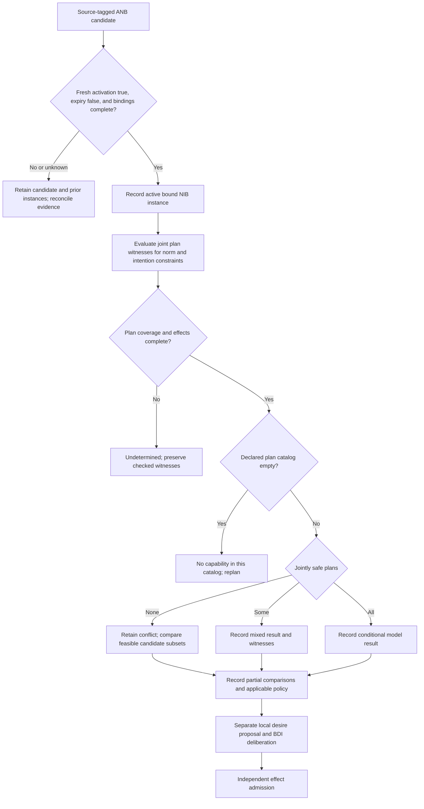
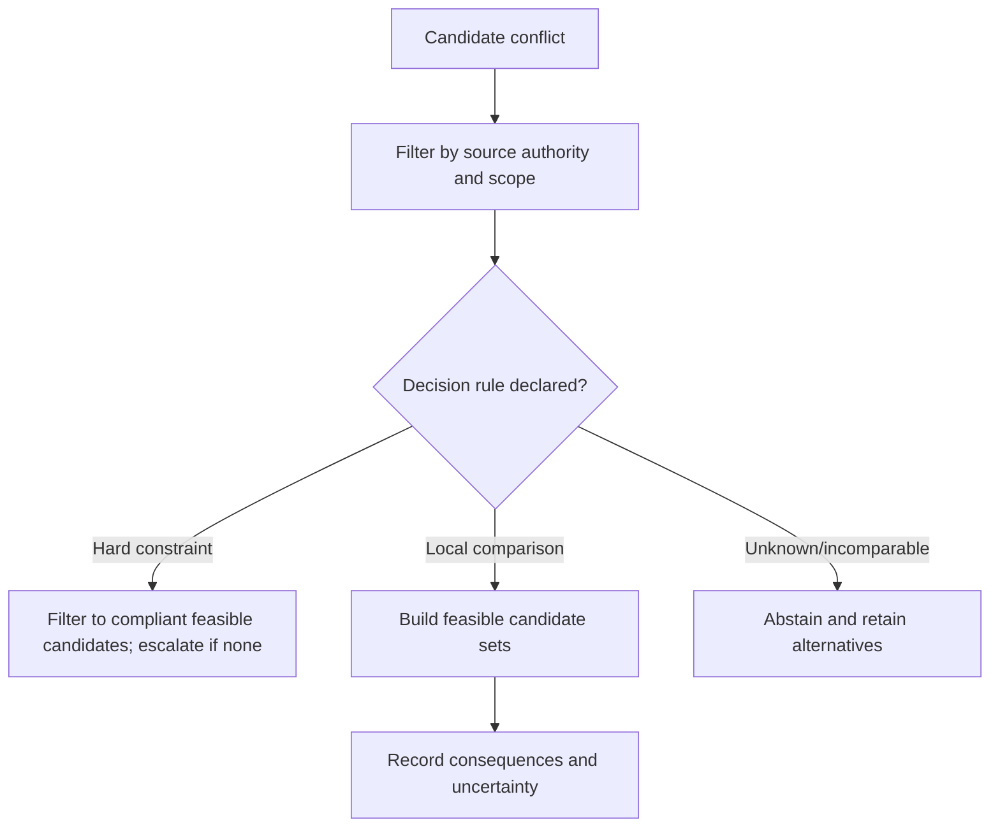
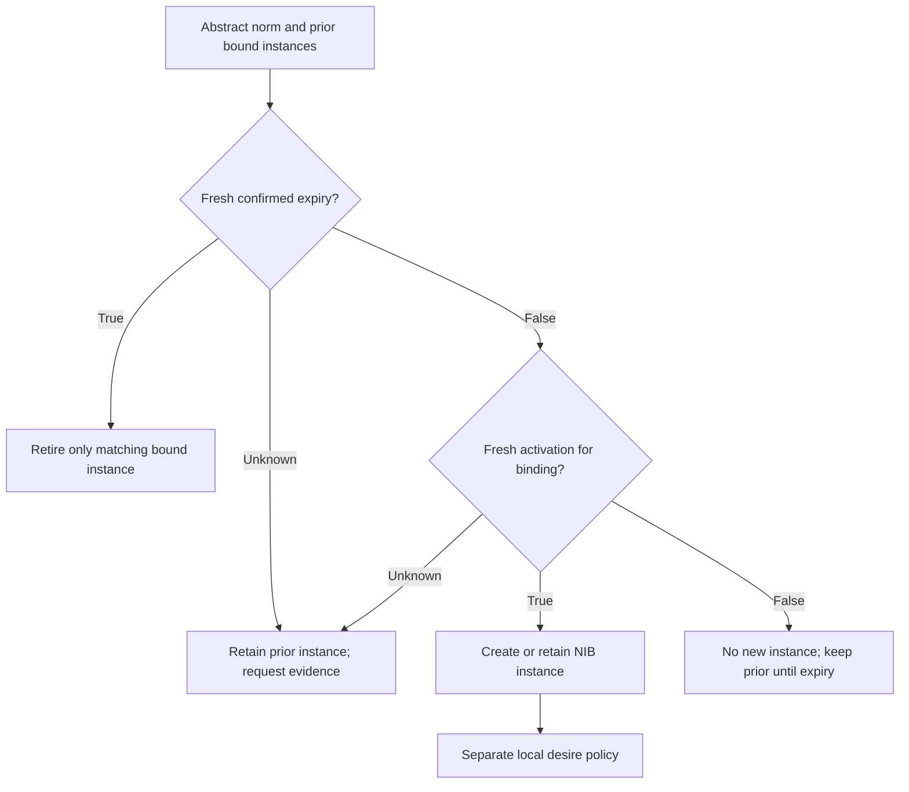
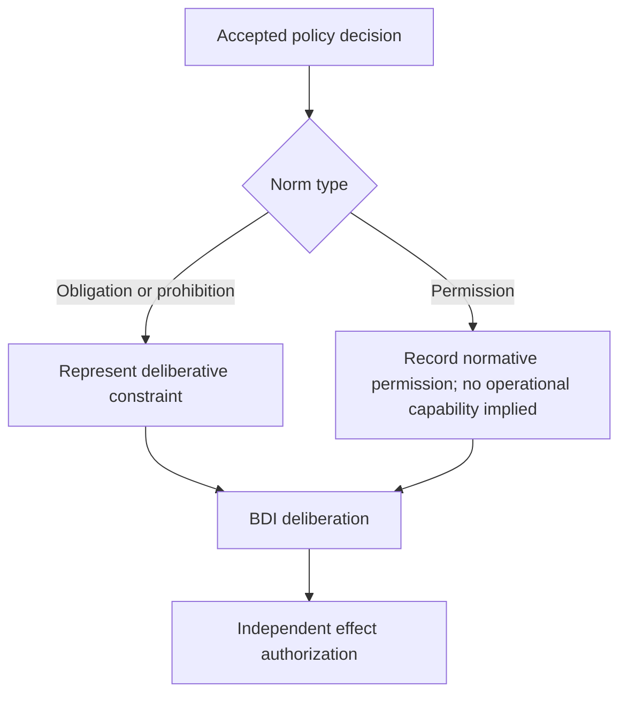

# SKILL: Normative BDI Agent Architecture

**Description**: A framework for building rational agents that can recognize, evaluate, and selectively adopt norms while resolving conflicts through consequence-based reasoning. Enables agents to make principled decisions when rules, obligations, and goals are mutually incompatible.

**Activation triggers**: norm conflicts, ethical dilemmas, rule prioritization, obligation conflicts, multi-stakeholder requirements, policy compliance, autonomous agent design, moral reasoning systems

---

## Decision Points

### 1. Norm Adoption Decision Tree

### 2. Algorithm Selection for Conflict Resolution

### 3. Norm Instantiation Trigger Points

### 4. Integration Strategy Selection

---

## Failure Modes

### 1. **Over-Adoption Loop**
**Symptoms**: Agent accepts every detected norm, system becomes increasingly constrained, eventually reaches deadlock where no action satisfies all norms.
**Detection Rule**: If norm adoption rate > norm resolution rate AND available action space shrinking over time.
**Recovery**: Record activated instances independently of adoption. Before proposing desires, check joint feasibility, model coverage, and applicable hard constraints. Preserve conflicts and partial comparisons; never silently drop active norms.

### 2. **Rubber Stamp Conflict Resolution**
**Symptoms**: A priority is applied without its source, scope, or exception conditions.
**Detection Rule**: The record cannot say whether the priority is a verified hard constraint or a local preference.
**Recovery**: Apply a verified applicable hard priority directly. Use partial-order consequence comparison only for conflicts the governing policy leaves unresolved.

### 3. **Recognition Bypass**
**Symptoms**: Agent acts on norms without proper instantiation, applies abstract rules directly to concrete situations, misses variable binding.
**Detection Rule**: If agent behavior references undefined variables or fails condition checks that should prevent norm activation.
**Recovery**: Enforce Abstract Norm Base → Norm Instance Base pipeline; validate all variable bindings before action.

### 4. **Consequence Myopia**
**Symptoms**: Agent evaluates only immediate effects of norm violations, misses cascading consequences that make "safe" choice actually worse.
**Detection Rule**: If chosen actions consistently produce unexpected negative downstream effects that weren't considered.
**Recovery**: Extend consequence evaluation depth; use explicit causal chain analysis; implement worst-case scenario planning.

### 5. **Parallel Decision Systems**
**Symptoms**: Norm reasoning and goal reasoning operate independently, creating internal conflicts and unpredictable behavior switching.
**Detection Rule**: If agent explanations reference competing "modules" or show inconsistent reasoning across similar situations.
**Recovery**: Keep internal deliberation traceable while retaining independent effect enforcement; do not treat either as an override.

---

## Worked Examples

### R781 and baby Travis (source toy model)

The source’s fictional R781/Travis plan base assumes `feed(R781, Travis)` requires `love(R781, Travis)` and that feeding is its only modeled route to `healed(Travis)`. A prohibition and received obligation concern the same literal. It is not a clinical claim that love heals a child, a death-risk claim, or a real-world ethics rule.

1. ANB records the received, source-tagged candidate norm. Activation and bindings may create an active NIB instance.
2. The model exposes the alternative subsets and the source belief rules needed to compare their consequences.
3. If the relation is incomplete or outcomes are incomparable, it retains alternatives and returns `UNDETERMINED` or `INCOMPARABLE`.
4. A separately declared local policy may propose a desire update. Independent authority admits or denies any external effect.

A verified hard safety constraint is applied as such; it is not a symptom merely because it produces the same precedence in every applicable case.

---

## Reference Files

- `references/desire-internalization-as-norm-adoption-mechanism.md` — Explains how an applicable local policy proposes desires while preserving source beliefs, active instances, and separate intention formation. **Read when** deciding how to represent adopted norms in agent mental state.
- `references/maximal-non-conflicting-subsets-for-action-selection.md` — Describes algorithm for finding compatible goal/obligation/prohibition combinations. **Read when** implementing conflict resolution between multiple norms.
- `references/norm-instantiation-through-belief-grounding.md` — Shows how to bind variables in abstract norms to concrete situations. **Read when** converting abstract norms to actionable instances.
- `references/normative-conflict-resolution-through-consequence-ranking.md` — Details consequence-based ranking for choosing between conflicting norm sets. **Read when** recording partial-order comparison or incomparability among candidate subsets.
- `references/separation-of-norm-recognition-and-norm-internalization.md` — Distinguishes ANB recognized candidates, active NIB instances, and separate desire internalization. **Read when** designing norm detection vs. commitment mechanisms.
- `references/three-types-of-consistency-for-norm-adoption.md` — Defines strong/weak/no consistency checks for norm compatibility. **Read when** evaluating complete, empty, and incomplete plan-search results.
- `references/source-boundary-and-authority-trace.md` — Source scope, provenance, and independent effect authorization boundary. **Read when** a norm label risks being confused with legal/ethical or runtime authority.

## Quality Gates

**Task completion checklist:**

- [ ] **Consistency Scope**: Record joint witnesses, complete empty catalogs, and incomplete/unknown results separately from complete nonempty classifications
- [ ] **Consequences Ranked**: For each conflict, modeled adverse outcomes recorded with partial-order comparisons, multiple maxima, incomparabilities, and unknowns  
- [ ] **Comparison Accounted For**: Comparable outcomes and incomparabilities are recorded; any tie policy is local, declared, and applicable
- [ ] **Variables Grounded**: All abstract norms properly instantiated with concrete entities from belief base
- [ ] **Integration Complete**: Active instances considered through explicit local desire policy and BDI deliberation
- [ ] **Violations Explicit**: Distinguish deliberate policy choices from accidental execution failures and unknown outcomes
- [ ] **Recognition Preserved**: Abstract Norm Base maintains awareness of all detected norms (adopted and rejected)
- [ ] **Future Monitoring**: System tracks environmental changes that might trigger norm re-evaluation
- [ ] **Explanation Ready**: Agent can articulate why it followed/violated each relevant norm
- [ ] **Subset Evidence**: Record the declared universe, consistency oracle, search coverage, and any actual maximality certificate; do not label a bounded candidate maximal without proof

---

## Scope and method selection

Use a simpler policy engine when verified scope and precedence already determine the decision. Use constraint solving for joint feasibility under inviolable rules; normative deliberation may use that result but cannot relax the rules on its own. Use expected-utility methods only when probabilities and utilities are actually the declared decision model.

A real-time design needs a measured deliberation budget, a defined timeout disposition, and a separately justified reactive controller. This source alone does not prove that BDI reasoning is too slow or safe enough for a deadline. Static policies and a single stakeholder can still contain conflicts; stakeholder count and update frequency do not determine applicability.

Read the seven references above for grounding, finite candidate enumeration, source predicates versus operational consistency labels, policy-bound desire proposals, and partial-order comparisons. The examples are local model completions, not deployed runtime or ethical/legal guarantees.
