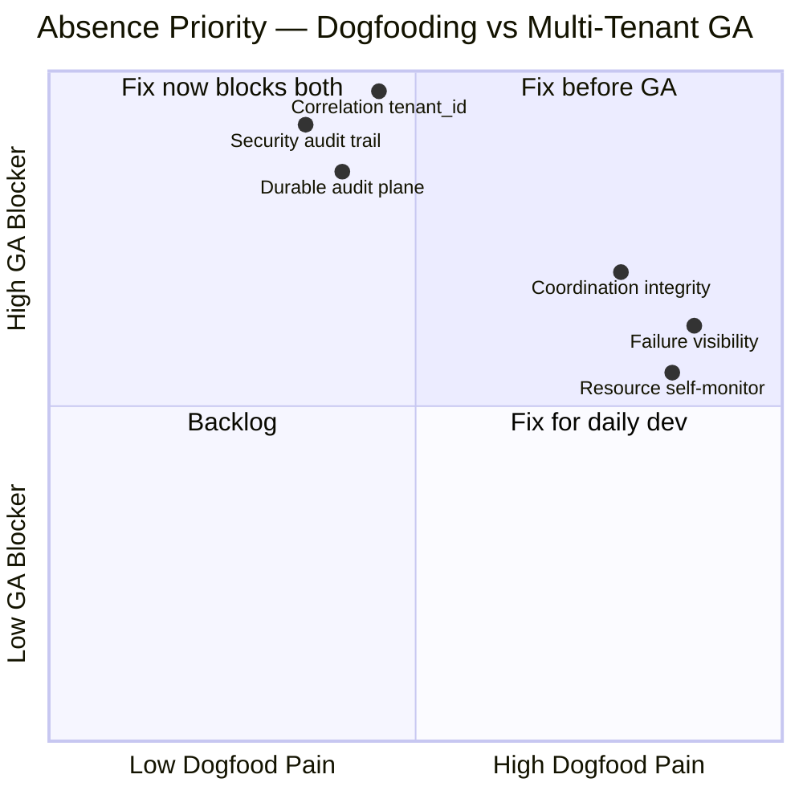
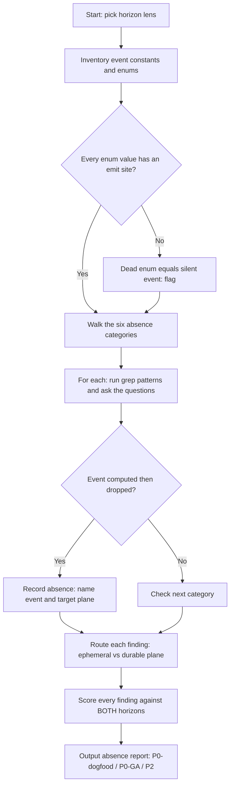

# Observability Absences Audit

Find the events a service *should* emit and doesn't. This is the inverse of a
how-to-log skill: instead of teaching good log lines, it hunts the **silence** —
security actions that vanish, coordination decisions computed then dropped, a
process that monitors everything except itself, crashes with no handler, and logs
that can't be attributed to any tenant.

## When to Use

✅ **Use for**:
- Auditing a daemon / coordination service / multi-tenant backend for *missing*
  telemetry before dogfooding or before multi-tenant GA
- "What should we be logging but aren't?" reviews
- Finding **dead enums** (a defined event type with zero emit sites = a silent event)
- Diagnosing why an incident couldn't be reconstructed, or why a tenant can't be
  shown who touched their data
- Spotting the absence of `requestId` / `actorId` / `tenantId` threading

❌ **NOT for**:
- Implementing the logging itself — use `logging-observability`,
  `structured-logging-design`, or `opentelemetry-instrumentation`
- Building dashboards / alert rules — use `grafana-dashboard-builder` or
  `observability-apm-expert`
- General code review or bug-finding unrelated to telemetry gaps
- Log *volume / cost* reduction (the opposite problem)

---

## Two Horizons — Always Score Absences Against Both

Every absence is prioritized against **two P0 bars**, never one. An absence can be
P2 for a solo developer dogfooding and P0 for the same code shipped multi-tenant.
State both. Never collapse them into a single "priority".

| Horizon | The bar | What becomes P0 here |
|---|---|---|
| **P0 dev-dogfooding** | "Can I debug my own daemon at 2am?" | crash visibility (cat 4), self-monitoring (cat 3), coordination facts (cat 2) |
| **P0 multi-tenant-GA** | "Can a tenant be shown who touched their data, and can we bill/audit per tenant?" | correlation/`tenant_id` (cat 5), security audit trail (cat 1), durable plane (cat 6) |



---

## The Audit Method



**Step 1 — Inventory the vocabulary.** Grep for event/enum constants
(`ActivityType.*`, log-type strings, metric names). For each, grep its emit sites.
Any constant with **zero emits is a silent event** — the highest-signal absence,
because someone already decided it mattered and then never fired it.

**Step 2 — Walk the six categories.** For each, run the grep patterns and answer the
questions in `references/absence-catalog.md`. Grep only *locates code sites*; the
absence is a judgement made by reading the surrounding code. This is not keyword
classification — you are finding functions and catch-blocks to inspect, not matching
strings to labels.

**Step 3 — Route each finding to a plane.** For every absence, decide whether the
missing event belongs on the **ephemeral log/metric plane** or the **durable
queryable audit plane** (`references/event-plane-routing.md`). A security event
routed to stdout is *effectively still absent*.

**Step 4 — Score against both horizons** and emit the report.

---

## The Six Absence Categories

Full detection detail (grep patterns, questions, fix shapes) lives in
`references/absence-catalog.md`. Summary:

1. **SECURITY audit trail** — token mint / validate-**reject** / revoke, permission
   grants, secret access, membership changes landing only in ephemeral logs or
   nowhere. A tenant must be shown who touched their data.
2. **COORDINATION integrity** — lock steal / **expire** / contention, port-claim
   conflicts, split-brain / stale-runtime replacement *computed then dropped*. (Real: a daemon-reconciliation
   module written **because of** a split-brain incident logged nothing durable.)
3. **RESOURCE self-monitoring** — no alarm on the daemon's own DB / WAL / write growth
   (the **313 GB blind spot**: a SQLite file grew to 313 GB unnoticed).
4. **FAILURE visibility** — no global `unhandledRejection` / `uncaughtException`
   handler; no degraded-mode signal when an optional dependency fails to load.
5. **CORRELATION / attribution** — no `requestId` / `actorId` / `tenantId` threaded
   through logs, metrics, and audit. The **#1 multi-tenant blocker**: in one real
   audit `tenant_id` appeared *literally nowhere*.
6. **Ephemeral vs durable plane** — the second question after "should we log this?":
   *on which plane?* Security/coordination/crash facts belong on the durable,
   queryable plane; rates and live signals belong on the ephemeral plane.

---

## Concrete Audit Checklist

Run top-to-bottom. Mark each **PASS / ABSENT**, and for ABSENT tag the horizon(s).

```
SILENT EVENTS
- Every event enum / log-type constant has at least one emit site
- No "defined but never fired" event (e.g. LOCK_EXPIRE declared, never emitted)

SECURITY (cat 1)  — mostly P0-GA
- Token mint emits a durable audit row
- Token validate-REJECT emits durable {actor, tenant, reason, ts} (not just 401)
- Token revoke / expire is audited
- Permission / scope grant or change is audited
- Secret / credential ACCESS (read) is recorded, not just rotation
- Membership add/remove produces an audit row with actor + tenant

COORDINATION (cat 2)  — P0-dogfood, forensic at GA
- Lock expire is distinguishable from clean release in the record
- Lock steal / force-release emits a durable row (who won, who evicted)
- Lock contention depth (waiters) is counted as a metric
- Port-claim conflict is logged with both claimants
- Split-brain detection + stale-runtime replacement writes a durable forensic row

RESOURCE (cat 3)  — P0-dogfood
- Something samples the daemon's own DB + WAL size on a timer
- A threshold alarm fires (durable RESOURCE_ALARM) before disk fills
- Largest unbounded tables have a bound AND the bound/retention is monitored
- Write-rate / row-growth is a metric

FAILURE (cat 4)  — P0-dogfood
- Exactly one global unhandledRejection handler writes durably before exit
- Exactly one global uncaughtException handler does the same
- Optional-dependency load failure emits DEGRADED_MODE{component, reason}
- No empty catch {} or .catch(()=>{}) swallowing errors silently

CORRELATION (cat 5)  — P0-GA, unblocks 1-4
- tenant_id / tenantId appears in the codebase at all (grep: zero = five-alarm)
- requestId is threaded so two log lines from one request can be joined
- actorId attributes every mutating action
- Correlation is carried implicitly (AsyncLocalStorage), not hand-threaded
- Logger auto-merges correlation into every line/metric/audit row

PLANE ROUTING (cat 6)
- No security / coordination / crash event lives ONLY on the ephemeral plane
- Durable audit table is indexed for the query you'll actually run (tenant, time)
- Retention job exists AND its last-run / rows-pruned is itself monitored
```

---

## Anti-Patterns

### Anti-Pattern: A Defined Enum Proves the Event Is Logged

**Novice**: "The code has a `LOCK_EXPIRE` activity type, so lock expiry is in the
audit trail."
**Expert**: A declared constant proves only that someone *intended* to log it. Grep
its emit sites — a constant with **zero emits is a silent event**, and it's the
highest-signal absence precisely because the intent was recorded and then abandoned.
The most safety-critical paths (replace-stale, expire, reject) are the ones most likely to
be declared-but-never-fired, because they were added under incident pressure and the
emit call was the part that got dropped.
**Detection**: `grep -rnoE "ActivityType\.[A-Z_]+" | sort -u` for the declared set,
then grep each one's usage. Any with a single hit (the declaration) is absent.

### Anti-Pattern: It's Logged, So It's Observable

**Novice**: "The token reject calls `console.warn`, so we have a security trail."
**Expert**: An event on the **ephemeral plane** is effectively absent for any question
asked *after* it rotated away. A tenant's "who accessed my data last Tuesday?" needs a
**durable, queryable** row, not a log line that shipped to a 3-day-retention store and
aggregated into oblivion. "Logged" and "auditable" are different planes; conflating
them is the second-most-common absence after having no log at all.
**Timeline**: pre-multi-tenant, stdout was fine (one operator, tailing live) →
multi-tenant GA makes the durable plane a hard requirement, because attribution and
"show me who touched my data" are per-tenant contractual questions.

### Anti-Pattern: Correlation Can Be Added Later

**Novice**: "We'll thread `tenant_id` through the logs when we productionize."
**Expert**: Correlation is not a feature you bolt on; it's a **field on every emit on
both planes**, and retrofitting it means touching every log/metric/audit call site —
unless you carry it implicitly. Establish `{ requestId, actorId, tenantId }` in
`AsyncLocalStorage` at request entry and auto-merge it in the governed logger *before*
you have thousands of call sites. `tenant_id` appearing *nowhere* in a multi-tenant
codebase is the #1 GA blocker and blocks categories 1-4 from being attributable.
**Detection**: `grep -rniE 'tenant_?id' lib/ src/` returning zero in a service that
serves more than one tenant.

---

## Output Contract

Produce an **absence report**, not a code diff (this skill audits; it does not
implement). For each finding:

```
[category] <missing event name>
  where:   <file:line of the code that computes-but-drops it>
  plane:   ephemeral | durable   (and why)
  horizon: P0-dogfood | P0-GA | P2   (score BOTH horizons)
  fix:     <one-line event shape, e.g. SECURITY_TOKEN_REJECT{actor,tenant,reason,ts}>
```

Group by horizon so the reader sees the dogfooding P0s and the GA P0s as two
separate lists. Put the silent-event list (dead enums) up top — it's the cheapest,
highest-confidence set of fixes.

---

## References

Consult these for deep dives — they are NOT loaded by default:

| File | Consult When |
|------|-------------|
| `references/absence-catalog.md` | Running the audit — grep patterns, questions, and fix shapes for all six categories |
| `references/event-plane-routing.md` | Deciding ephemeral vs durable for a specific finding, or auditing the durable plane's own health |
