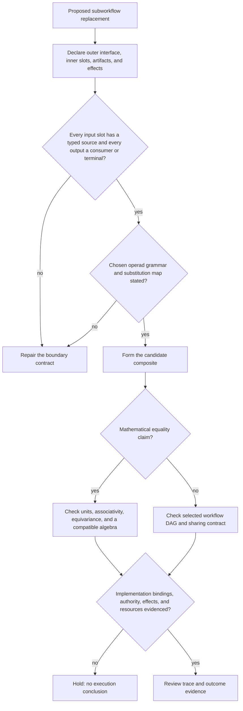

# Subworkflow boundary, slot, and contract review

The first branch reviews formal substitution; the second reviews a chosen workflow restriction. Both retain implementation, authority, effect, and observation obligations outside the operad laws.
