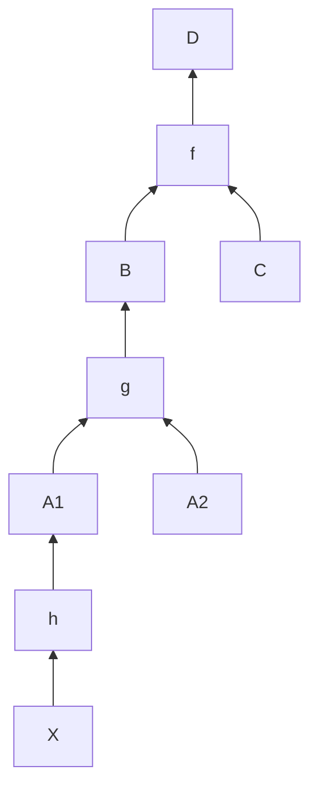

# Same substitution tree, two groupings

```mermaid
flowchart BT
  X[X] --> H[h]
  H --> A1[A1]
  A1 --> G[g]
  A2[A2] --> G
  G --> B[B]
  B --> F[f]
  C[C] --> F
  F --> D[D]
```

The diagram fixes slots. Re-parenthesizing this same substitution tree is the operad law; replacing an operation is a different claim.
