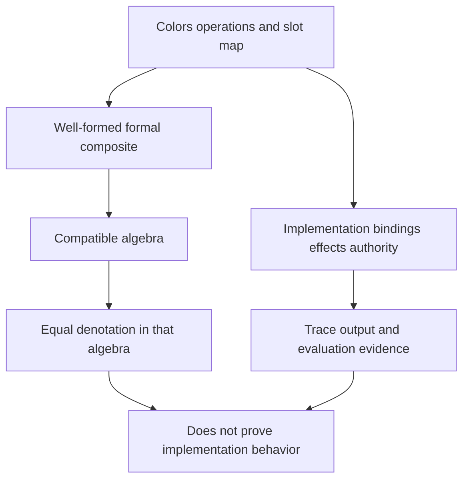

# Formal law versus deployment evidence

```mermaid
flowchart TD
  S[Colors operations and slot map] --> L[Well-formed formal composite]
  L --> A[Compatible algebra]
  A --> E[Equal denotation in that algebra]
  S --> I[Implementation bindings effects authority]
  I --> O[Trace output and evaluation evidence]
  E --> N[Does not prove implementation behavior]
  O --> N
```
