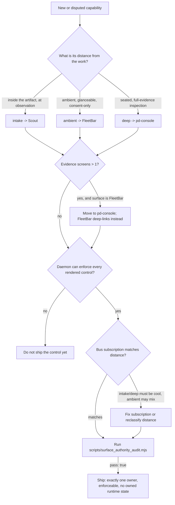

# Operator Surface Authority Designer

Decide which one of Scout, FleetBar, or pd-console owns a capability — by distance-from-work, not by which surface was fastest to build it in.

## Use This For

- Placing a new capability on Scout, FleetBar, or pd-console when speccing Agent Harbor's operator triad.
- Reconciling a mockup or prototype that built the same affordance on two surfaces before either was canonical.
- Deciding whether a capability's evidence weight means it belongs on pd-console instead of FleetBar's popover.
- Choosing a capability's hot-bus vs. cool-bus subscription so it matches its declared distance.
- Auditing an existing operator-surface spec for authority spread, ungated controls, or a surface quietly owning runtime state before implementation locks it in.

## Do Not Use This For

- Choosing SDK/CLI/MCP/GUI/API/webhook surfaces for developers who consume the product programmatically (`developer-surface-strategist`).
- Designing the concrete interaction flow, copy, or motion within one already-assigned surface (`agentic-coding-ux-designer`).
- Implementing the hot-bus/cool-bus transport itself — the multiplexed WebSocket, message envelopes, latency budgets (`swarm-invocation-designer`).

## Distance-Based Authority Model

1. **Classify the capability's distance.** Is the operator acting at the point of observation (`intake`), glancing at ambient status or granting consent (`ambient`), or seated doing deep inspection (`deep`)? See `references/distance-based-authority-model.md`.
2. **Assign the one canonical surface for that distance.** `intake` → Scout, `ambient` → FleetBar, `deep` → pd-console. Never let a capability claim two surfaces, and never leave one with no valid surface at all.
3. **Weigh the evidence.** If a capability needs more than one screen of evidence to evaluate, it does not belong on FleetBar regardless of its distance label — move it to pd-console and leave a deep link.
4. **Check daemon enforceability.** A surface may render a control only if the daemon can actually back the decision it represents (acceptance criterion 6). If the daemon can't enforce it yet, the control doesn't ship yet either.
5. **Pick the bus subscription.** `intake` and `deep` capabilities subscribe to the cool bus (Work Intents and transcript events are cool-bus objects); `ambient` capabilities may legitimately mix hot and cool. See `references/hot-bus-cool-bus-subscription-contract.md`.
6. **Confirm no surface owns runtime state.** Every surface renders daemon truth and submits commands through the same envelopes — a locally-cached, treated-as-authoritative slice of state on any surface is a defect, not a performance optimization.
7. **Confirm adapter boundaries.** Native surfaces do not shell out to CLI or MCP internally. Scout, FleetBar, pd-console, CLI, and MCP all enter through the shared daemon contract / Surface Gateway path; CLI and MCP are automation adapters, not hidden implementation dependencies for the operator surfaces.
8. **Audit before you build, and again before you ship.** Run `scripts/surface_authority_audit.mjs` against the spec at design time, and again against the shipped reality.

## Output Contract

Produce a capability authority table plus a machine-checkable audit:

- `capabilities[]`: `name`, `assignedSurface` (`scout`/`fleetbar`/`pd-console`), `distance` (`intake`/`ambient`/`deep`), `evidenceScreens`, `daemonEnforceable`, `busSubscription` (`hot`/`cool`).
- `surfacesOwnRuntimeState`: must be `false` for every capability's surface.

Use `scripts/surface_authority_audit.mjs` to score a spec matching `schemas/surface-authority-spec.schema.json` and return `{ pass, score, findings, recommendations }`.

## Anti-Patterns

### One Capability, Two Homes (Or No Home)

**Novice**: "It's easier to keep the FleetBar version around too, in case pd-console isn't open" — or a typo'd surface name (`"browser-tab"`, a retired dashboard) survives from an earlier prototype.
**Expert**: Each capability belongs to exactly one surface by distance-from-work. A capability claimed by two surfaces will drift the moment one implementation changes and the other doesn't; a capability claimed by no valid surface has no enforceable owner at all.
**Detection**: `surface_authority_audit.mjs` fires `capability-multi-surface` (critical) when the same capability name is assigned to more than one distinct surface, when `assignedSurface` is outside `{scout, fleetbar, pd-console}`, or when a valid `assignedSurface` disagrees with the canonical surface for its declared `distance`.

### FleetBar Grows A Console

**Novice**: "Just add a diff viewer to the popover, it's more convenient than deep-linking out."
**Expert**: Anything requiring more than one screen of evidence belongs in pd-console, not FleetBar. FleetBar deep-links into pd-console rather than growing panes — a menu-bar popover that needs multiple screens of context to evaluate is a console feature wearing FleetBar's chrome.
**Detection**: `surface_authority_audit.mjs` fires `deep-evidence-in-fleetbar` (critical) when a capability assigned to `fleetbar` has `evidenceScreens > 1`, and often co-fires `capability-multi-surface` when the capability's `distance` is actually `deep`.

### A Button (And A Bus) The Daemon Can't Back

**Novice**: Render the approve/deny control immediately because the UI is ready, wire it to the daemon "in a follow-up," and let a surface cache its own roster copy "for snappiness" while the wiring lands.
**Expert**: No surface may render a control the daemon cannot enforce, and no surface owns runtime state — both break the guarantee that all three surfaces render the same daemon truth and degrade identically when the daemon dies. A capability's bus subscription must match its distance too: `intake`/`deep` capabilities are durable cool-bus objects (Work Intents, transcript events), not ephemeral hot-bus chatter.
**Detection**: `surface_authority_audit.mjs` fires `unenforceable-control-rendered` (critical) when `daemonEnforceable` is false, `surface-owns-runtime-state` (critical) when `surfacesOwnRuntimeState` is true, and `bus-distance-mismatch` (critical) when an `intake`/`deep` capability's `busSubscription` isn't `cool`.

### Native Surface Calls The Automation Adapter

**Novice**: Have FleetBar or pd-console run `pd ...` or call MCP tools internally because the command already exists and the UI needs the same behavior.
**Expert**: CLI and MCP are automation adapters for agents, CI, scripts, emergency repair, and integrations. Native operator surfaces use the shared daemon contract / Surface Gateway path directly so operator truth, automation truth, and policy enforcement stay one thing.
**Detection**: Surface specs or implementation notes mention FleetBar, Scout, or pd-console invoking CLI/MCP as their internal path instead of submitting the shared command/query/event envelope.

## References

| File | Load When |
| --- | --- |
| `references/distance-based-authority-model.md` | Deciding or reviewing which surface owns a capability by its intake/ambient/deep distance, or resolving a two-surface claim. |
| `references/hot-bus-cool-bus-subscription-contract.md` | Picking or auditing a capability's hot/cool bus subscription, especially for intake/deep capabilities. |
| `examples/expected-output.md` | Need a worked example auditing a concrete operator-surface spec, weak-then-fixed. |
| `examples/sample-input.json` | Need a complete spec that already passes the audit, as a starting fixture. |
| `templates/output-template.md` | Need a fill-in-the-blank capability authority table. |
| `schemas/surface-authority-spec.schema.json` | Need to validate a spec's structure before running the audit. |
| `scripts/surface_authority_audit.mjs` | Need deterministic scoring of a proposed or shipped operator-surface authority spec. |
| `agents/openai.yaml` | Need a subagent descriptor for delegated surface-authority review. |

<!-- BEGIN BUNDLE INDEX (auto: index_references.py) -->

## Skill Bundle Index

*Every file in this skill, and when to open it. Auto-generated; run `scripts/index_references.py --fix`.*

**root**
- [`CHANGELOG.md`](CHANGELOG.md) — Operator Surface Authority Designer — Changelog — - Initial skill creation - Distance-based authority model (intake/ambient/deep) defined - Reference files and deterministic surface_authorit
- [`README.md`](README.md) — Operator Surface Authority Designer — Decide which of the three operator surfaces — Scout, FleetBar, pd-console — owns a capability, by distance-from-work, and audit the placemen

**`agents/`**
- [`agents/openai.yaml`](agents/openai.yaml) — openai (data/schema)

**`examples/`**
- [`examples/expected-output.md`](examples/expected-output.md) — Example Output: Operator Surface Authority Designer — Scenario: a team is speccing Agent Harbor's operator triad.
- [`examples/sample-input.json`](examples/sample-input.json) — sample input (data/schema)

**`references/`**
- [`references/distance-based-authority-model.md`](references/distance-based-authority-model.md) — Distance-Based Authority Model — Use this when deciding which of the three operator surfaces — Scout, FleetBar, pd-console — should own a given capability, or when reviewing
- [`references/hot-bus-cool-bus-subscription-contract.md`](references/hot-bus-cool-bus-subscription-contract.md) — Hot-Bus / Cool-Bus Subscription Contract — Use this when deciding (or auditing) which message plane a capability's data should ride, or when a `bus-distance-mismatch` finding needs ju

**`schemas/`**
- [`schemas/surface-authority-spec.schema.json`](schemas/surface-authority-spec.schema.json) — surface authority spec.schema (data/schema)

**`scripts/`**
- [`scripts/surface_authority_audit.mjs`](scripts/surface_authority_audit.mjs)

**`templates/`**
- [`templates/output-template.md`](templates/output-template.md) — Operator Surface Authority Decision — Fill in one row per capability before assigning it to a surface.

<!-- END BUNDLE INDEX -->
