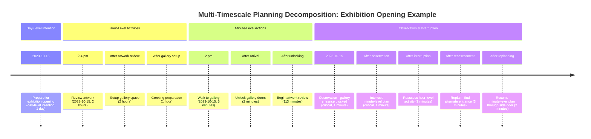

# Multi-Timescale Planning Decomposition

```mermaid
timeline
    title Multi-Timescale Planning Decomposition: Exhibition Opening Example
    
    section Day-Level Intention
        2023-10-15 : Prepare for exhibition opening (day-level intention, 1 day)
    
    section Hour-Level Activities
        2-4 pm : Review artwork (2023-10-15, 2 hours)
        After artwork review : Setup gallery space (2 hours)
        After gallery setup : Greeting preparation (1 hour)
    
    section Minute-Level Actions
        2 pm : Walk to gallery (2023-10-15, 5 minutes)
        After arrival : Unlock gallery doors (2 minutes)
        After unlocking : Begin artwork review (113 minutes)
    
    section Observation & Interruption
        2023-10-15 : Observation - gallery entrance blocked (critical, 1 minute)
        After observation : Interrupt minute-level plan (critical, 1 minute)
        After interruption : Reassess hour-level activity (2 minutes)
        After reassessment : Replan - find alternate entrance (3 minutes)
        After replanning : Resume minute-level plan through side door (2 minutes)
```
