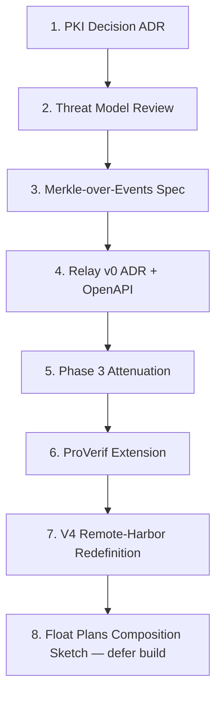

# pd-relay-zero-trust

Authoritative skill for designing and shipping the Port Daddy event relay under a zero-trust threat model. The relay is the cloud-side fabric that lets local daemons, CI runners, and apps publish/subscribe across machines without inbound holes, without trusted intermediaries reading payloads, and with cryptographic non-equivocation of every event stream.

This skill is deliberation-aware: most decisions fork into a four-voice debate (ACME specialist for PKI fluency, proponent / pragmatic / antagonist for design pressure-testing) before producing an ADR.

---

## When to Use

✅ **Use for**:
- Choosing PKI for the relay (ACME vs OIDC vs Web-of-Trust vs hybrid)
- Designing the daemon → relay handshake and outbound SSE transport
- Specifying per-publisher Merkle event chains (apply ADR-0014 primitive)
- Writing Phase 3 Macaroon-style attenuation for delegated publishers (GH Actions, Slack)
- E2E payload encryption between publisher and subscriber (relay sees only metadata)
- Extending ProVerif models to cover daemon ↔ relay ↔ daemon
- Killing Part XVII scope creep — redefining "remote harbor" as shared keypair + relay namespace
- Drafting the threat model and adversary catalog for the relay
- Generating ADRs for any of the above decisions

❌ **NOT for**:
- Local-only daemon work (use `port-daddy` and `daemon-development` skills)
- Generic zero-trust theory unrelated to PD (use `agentic-zero-trust-security`)
- Float Plan economic settlement — deferred until after the relay ships
- Frontend or dashboard work
- Generic harbor-card refactors that don't involve the wire

---

## Sequencing (Hard Order)

The decisions below have dependencies. Do not skip ahead.



**Why this order**: PKI choice constrains the handshake. Threat model determines what the Merkle chain must commit to. Merkle primitives are pure functions and can land before the relay. Relay v0 needs PKI + Merkle. Attenuation refines the auth model already in v0. ProVerif cannot model what isn't specified. V4 redefinition only makes sense once the actual relay shape is committed. Float Plans compose over the relay; do not couple them to it.

---

## Task Branches

Pass `argument-hint` to enter a specific branch. Each branch loads only the references it needs.

### `pki-decide`
Drives the deliberation between ACME, OIDC, Web-of-Trust, and hybrids. Outputs ADR-0021.

```
Deliberate:
├─ Load references/pki-options-acme.md, pki-options-oidc.md, pki-options-web-of-trust.md
├─ Score with scripts/pki_decision.py against criteria in references/pki-decision-matrix.md
├─ Fork: dispatch agents/proponent.md (argues for proposed choice)
├─ Fork: dispatch agents/pragmatic.md (argues for fastest shippable + reversible)
├─ Fork: dispatch agents/antagonist.md (red-teams every option)
├─ Consult agents/acme-specialist.md for ACME-specific detail when ACME is in contention
└─ Synthesize: write templates/ADR-PKI-Decision.md filled in
```

### `design-relay`
Produces the Relay v0 ADR + OpenAPI surface.

```
Build:
├─ Load references/relay-architecture.md, threat-model.md
├─ Confirm PKI ADR (0021) is accepted, else block
├─ Generate openapi.yaml (or update if exists)
├─ Validate handshake with scripts/verify_relay_handshake.py against schemas/relay-handshake.schema.json
└─ Output: templates/ADR-Relay-Architecture.md filled in
```

### `build-merkle`
Implements per-publisher Merkle event chains (ADR-0014 primitive in its natural home).

```
Implement:
├─ Load references/merkle-chain-design.md
├─ Schema: schemas/event-envelope.schema.json, schemas/merkle-chain-head.schema.json
├─ Use scripts/chain_verify.py and scripts/chain_anchor.py
├─ Wire into lib/ (defer — PR after spec is accepted)
└─ Walk examples/chain-verification.md
```

### `attenuate`
Phase 3 Macaroons-style capability attenuation for delegated publishers.

```
Specify:
├─ Load references/harbor-card-attenuation.md
├─ Schema: schemas/attenuated-card.schema.json
├─ Use scripts/attenuate_card.py to generate sample chains
└─ Walk examples/attenuation-walkthrough.md
```

### `encrypt`
End-to-end payload encryption envelope so the relay sees only metadata.

```
Specify:
├─ Load references/e2e-payload-encryption.md
├─ Use scripts/e2e_encrypt.py for round-trip tests
└─ Reuse note-encryption envelope; do not invent new crypto
```

### `extend-proverif`
Symbolic-model extension covering daemon ↔ relay ↔ daemon.

```
Model:
├─ Load references/proverif-relay-extension.md
├─ Pair with skill proverif-tamarin-protocol-modeling
├─ Extend templates/proverif-relay.pv
└─ Walk examples/proverif-extension-example.md
```

### `redefine-v4`
Kill Part XVII scope creep; redefine remote harbor as shared keypair + relay namespace.

```
Reframe:
├─ Load references/v4-remote-harbor-redefinition.md
├─ Diff current V4-DAG.md and v4.dag.yaml
└─ Output: templates/ADR-V4-Remote-Harbor-Redefinition.md filled in
```

### `threat-review`
Walks the adversary catalog and enumerates assumptions.

```
Review:
├─ Load references/threat-model.md
├─ Run scripts/threat_review.py to checklist findings
└─ Update threat model for any new surface introduced by the proposed change
```

---

## Subagents (Deliberation Set)

The relay is high-stakes; one voice is not enough. Four subagents live in `agents/`:

| Subagent | Role | Dispatch When |
|----------|------|---------------|
| `acme-specialist` | ACME / Let's Encrypt / draft-ietf-acme expertise. Knows DV/OV/EV, ARI, ACME-DNS, CAA. | PKI option includes ACME |
| `proponent` | Argues for the proposed design, marshals strongest evidence | Always, after a candidate is named |
| `pragmatic` | Argues for fastest shippable path with clean reversibility | Always |
| `antagonist` | Red-teams: assumes bad-faith relay, hostile network, key compromise | Always |

Synthesis is the human's responsibility (or the calling agent's), not a subagent's. Each subagent returns a structured opinion (see `agents/*.md` for output contracts). The synthesis becomes the body of the ADR.

---

## Threat Model Snapshot (Full Catalog in `references/threat-model.md`)

**In-scope adversaries**:
- A1: Honest-but-curious relay operator (observes metadata, may store)
- A2: Malicious relay operator (rewrites, equivocates, drops)
- A3: Network-on-path (passive + active)
- A4: Compromised publisher (forges events under stolen card)
- A5: Compromised subscriber (replays, exfiltrates)
- A6: Compromised daemon (issues bad cards)

**Out-of-scope**:
- Side-channel timing attacks against AES-256-GCM
- Quantum attacks on Ed25519 (separate roadmap item)
- Physical key extraction from `~/.port-daddy/master.key`
- Long-tail compromise of the publishing OS

**Invariants we preserve**:
- I1: Relay never sees payload plaintext
- I2: Subscribers detect equivocation by the relay (per-publisher Merkle)
- I3: Stolen card is bounded by `exp`, `cap`, `aud` and revocable
- I4: Capability attenuation never expands rights (only contracts)
- I5: Loss of relay does not lose past evidence (chain heads are anchored)

---

## Anti-Patterns

### Conflating Auth with Encryption
**Novice**: "Harbor cards authorize the publisher; therefore the relay can read payloads."
**Expert**: Auth and confidentiality are orthogonal. Card = "you can publish to this channel." E2E envelope = "only the channel's subscribers can read." The relay enforces auth and routes ciphertext.
**Detection**: Code paths that decrypt at the relay; APIs that take plaintext as required.

### Re-implementing the Sync Protocol (Part XVII Trap)
**Novice**: "Remote harbors need bidirectional state replication between daemons."
**Expert**: The *user-facing win* of remote harbors is "my fleet sees my CI's events." That's pub/sub federation, not state sync. Part XVII is 1,500 LOE we don't need.
**Timeline**: V4-DAG.md (v3.x) over-spec'd this. ADR-0023 (this skill's output) deletes the scope creep.

### Trusted Sequencer for Merkle Order
**Novice**: "The relay mints the next hash; everyone trusts the relay."
**Expert**: Per-publisher chains. Each publisher signs their own chain head; subscribers verify against the publisher's key. The relay persists chains but is not the trust root.
**LLM mistake**: LLMs reach for centralized sequencers because they're operationally simpler. Resist.

### Float Plans on the Critical Path
**Novice**: "Wire economic settlement into the relay handshake; bill per event."
**Expert**: SaaS billing ≠ Float Plans. Float Plans are agent-to-agent work contracts that compose *over* the relay later. Coupling them blocks the relay on a paper.
**Detection**: Any ADR draft that mentions credits, escrow, or anchors in the handshake spec.

### Premature Phase 3 Universalism
**Novice**: "Every card is attenuated by default."
**Expert**: Phase 3 is for *delegation across daemon boundaries* (GH Action, Slack bot). Local agent ↔ daemon stays Phase 2. Don't pay attenuation cost where it has no benefit.

### "Formally Verified Relay" Without ProVerif Extension
**Novice**: "Anchor Protocol is formally verified, so the relay is too."
**Expert**: Existing ProVerif coverage is agent ↔ daemon. Adding the relay moves the trust boundary. Until `extend-proverif` ships, do not put "formally verified" within ten paragraphs of "relay" in marketing.

---

## Quality Gates (Per Decision)

```
□ ADR template filled in (no [PLACEHOLDER] left)
□ Threat model lists which invariants the change preserves or weakens
□ All four subagents dispatched; their reports cited in ADR
□ OpenAPI surface matches schemas/ JSON schemas (run validate_skill.py)
□ Scripts under scripts/ run with --selftest and exit 0
□ At least one example walkthrough exists for the new primitive
□ References cite specific RFC / paper / ADR sections (not "see whitepaper")
□ NO mention of Float Plans on the critical path
□ NO mention of state-sync between daemons (Part XVII trap)
□ If touching crypto: ProVerif task added to backlog
```

---

## Reference Files

| File | Consult When |
|------|-------------|
| `references/zero-trust-foundations.md` | Need NIST SP 800-207 / BeyondCorp grounding for an argument |
| `references/pki-options-acme.md` | Evaluating ACME (Let's Encrypt, ACME-DNS, ARI, ZeroSSL) |
| `references/pki-options-oidc.md` | Evaluating OIDC (GitHub OIDC, Google, Auth0, custom IdP) |
| `references/pki-options-web-of-trust.md` | Evaluating cross-cert / WoT / SSH-style TOFU |
| `references/pki-decision-matrix.md` | Scoring PKI options against criteria; running pki_decision.py |
| `references/merkle-chain-design.md` | Specifying or implementing per-publisher Merkle chains |
| `references/relay-architecture.md` | Drafting the relay handshake, transport, namespacing |
| `references/harbor-card-attenuation.md` | Phase 3 Macaroon-style attenuation specification |
| `references/e2e-payload-encryption.md` | Specifying E2E envelope; reusing note-encryption design |
| `references/proverif-relay-extension.md` | Extending the symbolic model to cover the relay |
| `references/float-plans-deferred.md` | Composing Float Plans over the relay later — and what NOT to wire now |
| `references/v4-remote-harbor-redefinition.md` | Killing Part XVII scope creep; redefining remote harbors |
| `references/threat-model.md` | Adversary catalog, invariants, out-of-scope rationale |

## Schemas

| File | Used By |
|------|---------|
| `schemas/script-io.schema.json` | All scripts wrap their stdin/stdout against this envelope |
| `schemas/harbor-card.schema.json` | Phase 2 harbor card JWT payload |
| `schemas/attenuated-card.schema.json` | Phase 3 attenuated chain |
| `schemas/event-envelope.schema.json` | Wire format for events on the relay |
| `schemas/merkle-chain-head.schema.json` | Signed chain head |
| `schemas/relay-handshake.schema.json` | Daemon → relay opening exchange |

## Scripts

| Script | Purpose |
|--------|---------|
| `scripts/pki_decision.py` | Score ACME/OIDC/WoT against weighted criteria |
| `scripts/verify_relay_handshake.py` | Verify a captured handshake against schema + sig |
| `scripts/chain_verify.py` | Walk a per-publisher chain; detect breaks/forks |
| `scripts/chain_anchor.py` | Sign + emit a chain head suitable for external anchoring |
| `scripts/attenuate_card.py` | Generate a Phase 3 attenuated card chain |
| `scripts/e2e_encrypt.py` | AES-256-GCM envelope wrap/unwrap; round-trip selftest |
| `scripts/threat_review.py` | Walk threat model checklist against a proposal |
| `scripts/validate_skill.py` | Skill self-check (frontmatter, references, schema validity) |

## Templates

| Template | Output |
|----------|--------|
| `templates/ADR-PKI-Decision.md` | ADR-0021 |
| `templates/ADR-Relay-Architecture.md` | ADR-0022 |
| `templates/ADR-V4-Remote-Harbor-Redefinition.md` | ADR-0023 |
| `templates/relay-handshake-message.json` | Reference handshake payload |
| `templates/attenuated-card.json` | Reference Phase 3 chain |
| `templates/proverif-relay.pv` | Skeleton ProVerif model |

## Examples

| Example | Walks Through |
|---------|---------------|
| `examples/handshake-trace.md` | Full daemon → relay handshake with crypto traces |
| `examples/chain-verification.md` | Detecting equivocation and forks in a Merkle chain |
| `examples/attenuation-walkthrough.md` | Macaroons-style chain for a GH Actions publisher |
| `examples/proverif-extension-example.md` | Extending an existing ProVerif file for the relay |

## OpenAPI

`openapi.yaml` — relay surface (handshake, publish, subscribe, chain head, revocation broadcast, key discovery).

---

## Subagent Output Contract (Common)

Each subagent returns:

```yaml
verdict: accept | reject | accept-with-conditions
confidence: low | medium | high
top_three_reasons: [...]
top_three_risks: [...]
ship_blocker: true | false
ship_blocker_explanation: <if true>
suggested_amendments: [...]
references_cited: [...]
```

The synthesizer cross-tabulates verdicts. Any `ship_blocker: true` from `antagonist` requires explicit refutation in the ADR's Consequences section.
