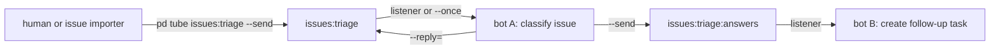

# `pd tube`: a hands-on tutorial
`pd tube` is a conversational pipe over Port Daddy message channels. It works against the local daemon today and is designed to compose with the future relay.
The command publishes to `POST /msg/:channel` and reads from `GET /msg/:channel?after=N&limit=M`. The daemon did not need new routes for this feature. Tube adds
a small envelope, a CLI, and a local cursor file. Use this tutorial when you want to send a message, listen as JSON lines, reply to a prior message, inspect the
stored envelope, and understand why repeated listener runs do not reprint everything. The examples use these channels:
```text
tutorial:hello
tutorial:threads
tutorial:history
tutorial:foreign
ci:test-failed
debug:agent-thoughts
issues:triage
issues:triage:answers
```
If you have old messages on those channels, clear them before replaying:
```bash
pd channels clear tutorial:hello --raw-channel
pd channels clear tutorial:threads --raw-channel
pd channels clear tutorial:history --raw-channel
pd channels clear tutorial:foreign --raw-channel
```
Most examples pass `--json`. That makes stdout one JSON object per line, which is what scripts and `jq` want.

## 1. Setup
You need a working Port Daddy checkout, the `pd` CLI on `PATH`, and a running local daemon. You also need a shell that can pipe stdin into commands. Check the
CLI first:
```bash
pd --help
```
You should see `tube` in the top-level command list. If the daemon is not running, start it:
```bash
pd start
```
Then verify daemon reachability:
```bash
pd status
```
Example output:
```text
Port Daddy is running
  Version: 3.11.0 (56cb287aab4c)
  PID: 20554
  Uptime: 37m
  Active ports: 17
  Runtime: nominal
  Fleet: 1 project(s), 8 agent(s), 3/8 launchable
  Bosun: idle - daemon heartbeat writer active; pd-bosun supervisor binary available
  Last activity: 34s ago
```
Your version, PID, uptime, and fleet counts will differ. The key fact is that `pd status` can talk to the daemon. `pd tube` is not a direct database command. It
needs the message API exposed by the daemon. If `pd status` fails, fix daemon health before debugging tube. You can confirm the tube usage surface by omitting
the channel:
```bash
pd tube
```
Expected output:
```text
ERROR: Usage: pd tube <channel> [--send | --reply=<id> | --since=<id> | --once | --no-history]
```
The full practical surface is:
```bash
pd tube <channel>                # listen, default mode
pd tube <channel> --since=<id>   # resume after a known message id
pd tube <channel> --once         # one poll pass, then exit
pd tube <channel> --limit=N      # backfill cap when no cursor exists
pd tube <channel> --no-history   # ignore and do not update the cursor file
pd tube <channel> --send         # read stdin to EOF and post top-level
pd tube <channel> --reply=<id>   # read stdin to EOF and post a reply
```
Listen mode is long-running. It polls, prints new messages, backs off when quiet, and exits when you press `Ctrl+C`. Use `--once` for scripts. Use `--send` or
`--reply=<id>` for publishing. For clean tutorial runs, remove old cursor files too:
```bash
rm -f ~/.port-daddy/tube-history-tutorial_hello.json
rm -f ~/.port-daddy/tube-history-tutorial_threads.json
rm -f ~/.port-daddy/tube-history-tutorial_history.json
```
Those files are explained in section 4.

## 2. One-shot send and listen
Open two terminals. Terminal A will listen. Terminal B will send. In Terminal A, start a JSON-lines listener:
```bash
pd tube tutorial:hello --json
```
At first it may print nothing. That is normal. Without `--send`, `--reply`, or `--once`, tube is a long-running listen. It blocks because it is waiting for new
channel messages. Leave Terminal A open. In Terminal B, send a message:
```bash
echo "hi from terminal B" | pd tube tutorial:hello --send --sender terminal-b --json
```
Example sender output from a live run:
```json
{"ok":true,"id":31052,"channel":"tutorial:hello"}
```
The sender receives the daemon message id. Terminal A prints one JSON line:
```json
{"id":31052,"sender":"terminal-b","createdAt":1777437468542,"body":"hi from terminal B"}
```
The listener output is intentionally compact. It prints the decoded body, not the internal storage envelope. Stop Terminal A with `Ctrl+C`. Now do one bounded
read:
```bash
pd tube tutorial:hello --once --no-history --json
```
Example output:
```json
{"id":31052,"sender":"terminal-b","createdAt":1777437468542,"body":"hi from terminal B"}
```
`--once` means one poll pass and exit. `--no-history` means ignore the on-disk cursor and do not write it. Together they are good for quick inspections. If you
run without `--no-history`, tube may print nothing:
```bash
pd tube tutorial:hello --once --json
```
Empty output is a successful result. It means there were no messages after the stored cursor. Use `--limit` to cap initial backfill when no cursor exists:
```bash
pd tube tutorial:hello --once --no-history --limit=1 --json
```
With one message on the channel, the output is still:
```json
{"id":31052,"sender":"terminal-b","createdAt":1777437468542,"body":"hi from terminal B"}
```
Send mode reads stdin until EOF. These are valid:
```bash
echo "short note" | pd tube tutorial:hello --send
printf 'multi-line\nbody\n' | pd tube tutorial:hello --send
jq -c . event.json | pd tube tutorial:hello --send
```
The tube body is stored as a string. If you pipe JSON, the body is JSON text. Your consumer can parse it later. Empty stdin fails:
```bash
pd tube tutorial:hello --send </dev/null
```
Expected output:
```text
ERROR: tube: stdin was empty - nothing to send
```
Interactive TTY stdin also fails instead of hanging:
```text
ERROR: tube: --send / --reply needs a body on stdin (pipe one in, e.g. `echo hi | pd tube ...`)
```
That guard catches the common mistake of typing `--send` without a pipe.

## 3. Threading and replies
The daemon's message table does not model thread parents. Tube carries threading in its payload envelope. A top-level message is stored like this:
```json
{
  "v": 1,
  "kind": "tube.msg",
  "body": "first threaded note"
}
```
A reply adds `inReplyTo`:
```json
{
  "v": 1,
  "kind": "tube.msg",
  "body": "reply from bob",
  "inReplyTo": 31054
}
```
The kind constant is:
```typescript
export const TUBE_ENVELOPE_KIND = 'tube.msg';
```
Start clean:
```bash
pd channels clear tutorial:threads --raw-channel
rm -f ~/.port-daddy/tube-history-tutorial_threads.json
```
Publish a parent message:
```bash
printf 'first threaded note\n' | pd tube tutorial:threads --send --sender alice --json
```
Example output:
```json
{"ok":true,"id":31054,"channel":"tutorial:threads"}
```
Use that id as the reply parent:
```bash
printf 'reply from bob\n' | pd tube tutorial:threads --reply=31054 --sender bob --json
```
Example output:
```json
{"ok":true,"id":31055,"channel":"tutorial:threads"}
```
Read the channel through tube:
```bash
pd tube tutorial:threads --once --no-history --json
```
Example output:
```json
{"id":31054,"sender":"alice","createdAt":1777437476521,"body":"first threaded note"}
{"id":31055,"sender":"bob","createdAt":1777437486175,"body":"reply from bob","inReplyTo":31054}
```
The `inReplyTo` field came from the envelope. It did not come from daemon-native threading. There is no current `pd messages` read command for stored rows. The
real messaging CLI surfaces are `pd pub`, `pd sub`, `pd channels`, and `pd tube`. For storage inspection, query the daemon endpoint directly:
```bash
curl -sS "http://127.0.0.1:$(cat ~/.port-daddy/daemon.port)/msg/tutorial%3Athreads?limit=10" \
  | jq '.messages[] | {id, payload, sender, createdAt}'
```
Example output:
```json
{
  "id": 31054,
  "payload": {
    "v": 1,
    "kind": "tube.msg",
    "body": "first threaded note"
  },
  "sender": "alice",
  "createdAt": 1777437476521
}
{
  "id": 31055,
  "payload": {
    "v": 1,
    "kind": "tube.msg",
    "body": "reply from bob",
    "inReplyTo": 31054
  },
  "sender": "bob",
  "createdAt": 1777437486175
}
```
Tube decodes this storage shape into consumer-friendly JSON lines. That envelope is the thread model. `--reply` validates that the parent id is a positive
number:
```bash
printf 'body\n' | pd tube tutorial:threads --reply=0 --json
```
Expected output:
```text
ERROR: tube: invalid parent id 0
```
It does not validate that the parent exists. This can succeed even if `999999` is absent:
```bash
printf 'orphan reply\n' | pd tube tutorial:threads --reply=999999 --sender bob --json
```
Build parent-existence validation in your consumer if that matters. Tube also surfaces foreign messages on the same channel. Publish a non-tube payload:
```bash
pd pub tutorial:foreign '{"kind":"not-tube","body":"from pd pub"}' \
  --sender legacy-bot \
  --json \
  --raw-channel
```
Example output:
```json
{
  "success": true,
  "id": 31053,
  "message": "published to tutorial:foreign"
}
```
Read it with tube:
```bash
pd tube tutorial:foreign --once --no-history --json
```
Example output:
```json
{"id":31053,"sender":"legacy-bot","createdAt":1777437476413,"body":"{\"kind\":\"not-tube\",\"body\":\"from pd pub\"}","foreign":true}
```
The `foreign` flag means the payload was not a `tube.msg` envelope. This matters during migrations because a channel can contain older `pd pub` traffic or
custom JSON. Filter if you only want tube messages:
```bash
pd tube tutorial:foreign --once --no-history --json | jq 'select(.foreign != true)'
```

## 4. History guard mechanics
The history guard is a local cursor file. It is single-channel and single-machine. It is not synchronized across machines until a relay-backed mode exists. The
default path is:
```text
~/.port-daddy/tube-history-<safe-channel>.json
```
For `tutorial:history`, the safe slug is `tutorial_history`, so the file is:
```text
~/.port-daddy/tube-history-tutorial_history.json
```
`safeChannelSlug` replaces path-unfriendly characters with underscores:
```text
br:repo:work:a/b -> br_repo_work_a_b
plain            -> plain
""               -> channel
```
Start clean:
```bash
pd channels clear tutorial:history --raw-channel
rm -f ~/.port-daddy/tube-history-tutorial_history.json
```
Publish two messages:
```bash
printf 'one\n' | pd tube tutorial:history --send --sender demo --json
printf 'two\n' | pd tube tutorial:history --send --sender demo --json
```
Example output:
```json
{"ok":true,"id":31056,"channel":"tutorial:history"}
{"ok":true,"id":31057,"channel":"tutorial:history"}
```
Run one listen pass:
```bash
pd tube tutorial:history --once --json
```
Example output:
```json
{"id":31056,"sender":"demo","createdAt":1777437496996,"body":"one"}
{"id":31057,"sender":"demo","createdAt":1777437497565,"body":"two"}
```
That pass writes the highest seen id. Inspect the file:
```bash
jq . ~/.port-daddy/tube-history-tutorial_history.json
```
Example output:
```json
{
  "lastSeenId": 31057,
  "updatedAt": 1777437497565
}
```
Run the same listener again:
```bash
pd tube tutorial:history --once --json
```
Expected output:
```text
```
No output means no messages after the cursor. Now publish another message:
```bash
printf 'three\n' | pd tube tutorial:history --send --sender demo --json
```
Example output:
```json
{"ok":true,"id":31058,"channel":"tutorial:history"}
```
Read again:
```bash
pd tube tutorial:history --once --json
```
Example output:
```json
{"id":31058,"sender":"demo","createdAt":1777437498182,"body":"three"}
```
The updated cursor looks like:
```json
{
  "lastSeenId": 31058,
  "updatedAt": 1777437498492
}
```
The file store writes atomically with a temporary file and rename. That avoids half-written cursor JSON after interruption. A long-running listener uses the
same file. Start it:
```bash
pd tube tutorial:history --json
```
Stop it with `Ctrl+C`. Restart it:
```bash
pd tube tutorial:history --json
```
Previously printed messages should not re-emit. To replay recent messages without touching the cursor, use `--no-history`:
```bash
pd tube tutorial:history --once --no-history --limit=2 --json
```
Example output:
```json
{"id":31057,"sender":"demo","createdAt":1777437497565,"body":"two"}
{"id":31058,"sender":"demo","createdAt":1777437498182,"body":"three"}
```
`--no-history` ignores the file and does not update it. That makes ad hoc inspection safe while another listener owns the cursor. Use `--since=<id>` when you
know the resume point:
```bash
pd tube tutorial:history --once --since=31056 --json
```
Example output:
```json
{"id":31057,"sender":"demo","createdAt":1777437497565,"body":"two"}
{"id":31058,"sender":"demo","createdAt":1777437498182,"body":"three"}
```
`--since` asks for ids strictly greater than the supplied id. It overrides the history file. Unless you also pass `--no-history`, it can still advance the
cursor. Invalid numeric options fail early:
```bash
pd tube tutorial:history --limit=abc --once
```
Expected output:
```text
ERROR: tube: invalid --limit: abc
```
The guard is defense in depth. The daemon should honor `after=`. Tube still filters at or below the cursor after decoding. That protects consumers if a backend
returns overlapping windows. Treat the built-in cursor as convenience state, not a durable job ledger. If a bot must prove exactly-once processing, store the
processed id in that bot's own state.

## 5. Composition patterns
Tube composes well because it reads stdin, writes JSON lines, and exits cleanly in `--once` mode.

### Recipe 1: CI bot notification
Publish a test failure:
```bash
printf 'unit tests failed on main\n' | pd tube ci:test-failed --send --sender ci --json
```
Drain one poll pass on a cron job:
```bash
pd tube ci:test-failed --once --json | jq -r '.body' | xargs -r notify-send
```
On macOS, replace `notify-send`:
```bash
pd tube ci:test-failed --once --json | jq -r '.body' | while read -r body; do
  osascript -e "display notification \"$body\" with title \"Port Daddy CI\""
done
```
Keep history enabled for a single-machine cron consumer. Each cron run advances the cursor. If the consumer should own repo-local state instead, store the id
yourself:
```bash
LAST_ID="$(cat .pd-ci-last-id 2>/dev/null || echo 0)"
pd tube ci:test-failed --once --since="$LAST_ID" --json \
  | tee .pd-ci-drain.jsonl \
  | jq -r '.body' \
  | xargs -r notify-send
jq -r '.id' .pd-ci-drain.jsonl | tail -1 > .pd-ci-last-id
```
Use a small limit when first attaching to a noisy channel:
```bash
pd tube ci:test-failed --once --limit=10 --json
```

### Recipe 2: Conversation log
Record a channel as JSONL:
```bash
pd tube debug:agent-thoughts --json > thoughts.jsonl
```
That command blocks and appends one message per line until stopped. Watch just the bodies:
```bash
tail -f thoughts.jsonl | jq -r .body
```
Publish a sample line:
```bash
printf 'checking the daemon cursor before retrying\n' \
  | pd tube debug:agent-thoughts --send --sender agent-a --json
```
The log receives:
```json
{"id":31101,"sender":"agent-a","createdAt":1777437600000,"body":"checking the daemon cursor before retrying"}
```
Filter by sender:
```bash
jq -c 'select(.sender == "agent-a")' thoughts.jsonl
```
Filter replies:
```bash
jq -c 'select(has("inReplyTo"))' thoughts.jsonl
```
Replay the last ten without touching the live cursor:
```bash
pd tube debug:agent-thoughts --once --no-history --limit=10 --json
```

### Recipe 3: Two-bot pipe
Bot A reads issue requests from `issues:triage`. Bot A replies on that channel for human context. Bot A also publishes clean actions to `issues:triage:answers`.
Bot B watches the answer channel.

Create a request:
```bash
printf 'Issue #42: FleetBar shows an empty activity panel\n' \
  | pd tube issues:triage --send --sender issue-importer --json
```
Example output:
```json
{"ok":true,"id":32001,"channel":"issues:triage"}
```
Bot A reads:
```bash
pd tube issues:triage --once --json
```
Example output:
```json
{"id":32001,"sender":"issue-importer","createdAt":1777437700000,"body":"Issue #42: FleetBar shows an empty activity panel"}
```
Bot A replies:
```bash
printf 'Classified as operator-ux regression; needs settled FleetBar screenshot.\n' \
  | pd tube issues:triage --reply=32001 --sender triage-bot --json
```
Example output:
```json
{"ok":true,"id":32002,"channel":"issues:triage"}
```
Bot A publishes an action:
```bash
printf 'Open task: reproduce FleetBar empty activity panel and attach screenshot evidence.\n' \
  | pd tube issues:triage:answers --send --sender triage-bot --json
```
Example output:
```json
{"ok":true,"id":32003,"channel":"issues:triage:answers"}
```
Bot B watches:
```bash
pd tube issues:triage:answers --json | while read -r line; do
  body="$(printf '%s\n' "$line" | jq -r .body)"
  printf 'creating follow-up task: %s\n' "$body"
done
```
For local development, use one pass:
```bash
pd tube issues:triage:answers --once --json \
  | jq -r '.body' \
  | while read -r body; do
      printf 'creating follow-up task: %s\n' "$body"
    done
```
The reply keeps conversation context. The second channel gives another bot a clean subscription target. For richer automation, put compact JSON in the body:
```bash
jq -nc \
  --arg issue "42" \
  --arg action "capture-fleetbar-screenshot" \
  '{issue:$issue, action:$action}' \
  | pd tube issues:triage:answers --send --sender triage-bot --json
```
Parse it downstream:
```bash
pd tube issues:triage:answers --once --json \
  | jq -r '.body | fromjson | [.issue, .action] | @tsv'
```
Tube does not validate body schemas. It transports a string body and optional reply id. Schema discipline belongs to the bots using the channel.

## Closer: pitfalls, troubleshooting, and relay composition
Common pitfalls:
- `pd tube <channel>` blocks because listen mode is long-running by default.
- `--send` and `--reply` need piped stdin or redirected stdin.
- Empty stdin exits non-zero with `tube: stdin was empty - nothing to send`.
- Interactive TTY stdin exits non-zero with the "needs a body on stdin" error.
- Foreign messages are printed with `foreign: true`.
- A stale daemon can make a new source command look broken; run `pd status` first.
- Busy channels can produce a large first backfill; use `--limit=` or `--since=`.
- `--reply=<id>` checks that the id is positive, but it does not check that the parent exists.
- The history guard is a local cursor, not multi-machine sync.
Troubleshoot from the daemon outward:
```bash
pd status
pd start
curl -sS "http://127.0.0.1:$(cat ~/.port-daddy/daemon.port)/msg/tutorial%3Ahistory?limit=5" | jq .
jq . ~/.port-daddy/tube-history-tutorial_history.json
```
If the cursor file is corrupt, tube ignores it and behaves as if no cursor exists. If the cursor points past messages you want, use `--since=<id>` or
`--no-history`. If you are seeing old channel traffic, look for `foreign: true`. The relay composition is straightforward: the envelope stays the client
contract.
```json
{"v":1,"kind":"tube.msg","body":"hello","inReplyTo":123}
```
The local daemon carries that envelope today. The future relay can carry the same envelope later. Scripts that use tube as a JSONL producer or stdin consumer
should not need client-side rewrites when the relay backend appears. End references:
- [Relay architecture](../references/relay-architecture.md)
- [Relay handshake trace](handshake-trace.md)
- [Canonical tube behavior tests](../../../tests/unit/tube.test.ts)
- [Phone integration master plan, Track B1](../../../docs/plans/PHONE-INTEGRATION-MASTER-PLAN.md#track-b1)
