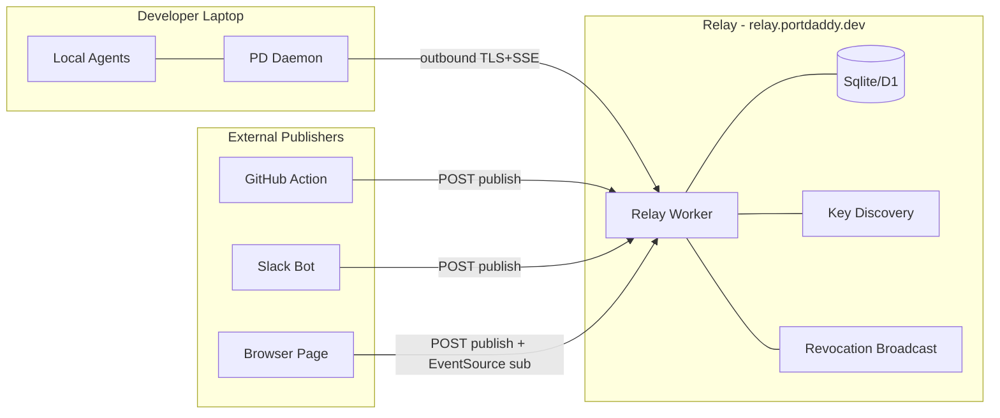

# Relay v0 Architecture

**Load when**: drafting the Relay v0 ADR or designing the handshake / transport / namespacing.

## Goals

- Federate **events** between local PD daemons and external publishers (CI, browser, bots)
- Outbound-only from daemons (no inbound holes)
- E2E encrypted payloads (relay sees metadata only)
- Per-publisher Merkle event chains
- Harbor-fingerprint namespacing
- Trusted-but-minimized relay (we run it; we cannot read content)

## Non-Goals (v0)

- **State replication** between daemons (Part XVII trap — see `v4-remote-harbor-redefinition.md`)
- **Decentralization** (relay is a single trust party for routing; see antagonist's writeup)
- **Float Plan settlement** (deferred — see `float-plans-deferred.md`)
- **Multi-region** active-active (single region for v0; replicate stateless workers later)
- **Custom transport** (use HTTPS + SSE; no QUIC, no websockets)

## Architecture overview



## Wire transports

- **Daemon → Relay**: TLS 1.3 outbound HTTPS. Long-lived SSE (text/event-stream) for inbound events; short HTTPS POSTs for outbound publish + handshake.
- **External publisher → Relay**: HTTPS POST per event. Optional SSE for receiving replies.
- **External subscriber → Relay**: HTTPS GET with `Accept: text/event-stream` (EventSource).

Why SSE over WebSockets:
- Works through every corporate proxy
- Native browser support without library
- Auto-reconnect with last-event-id
- One-direction-per-stream matches our model
- No protocol upgrade dance

If we need bidirectional later (one stream both ways), websockets is a tactical add. Don't pre-commit.

## Namespacing

Channel name on the wire:

```
<harbor_fingerprint>:<scoped-channel-name>
```

Where `harbor_fingerprint = SHA256(harbor_pub_key)` (lowercase hex, 64 chars). E.g.:

```
3a4b...c2:swarm:general
3a4b...c2:ui:button-clicked
9f1d...88:ci:pr-opened
```

Two daemons publishing to the same `harbor_fingerprint` are necessarily in the same harbor (= they share the harbor keypair, exchanged out-of-band). Two daemons in different harbors cannot collide on namespace because their fingerprints differ.

Reserved prefixes (relay-managed):
- `_relay:status` — relay heartbeat per fingerprint
- `_relay:revocations` — revocation broadcast per harbor
- `_relay:keys` — published Ed25519 pubkeys for daemons in this harbor

## Handshake (sequence diagram)

```mermaid
sequenceDiagram
  participant D as Daemon
  participant R as Relay
  D->>D: Generate Ed25519 ephemeral nonce_c
  D->>D: Issue self-signed harbor card with cap=[...]
  D->>R: POST /v1/handshake { client_hello, card, subscriptions, nonce_c, sig }
  R->>R: Verify card sig against issuer fingerprint in identity registry
  R->>R: Verify subscription caps match card.cap
  R->>R: Allocate session_id, mint nonce_s
  R->>R: For each accepted sub, look up tip_seq + tip_hash
  R-->>D: 200 { server_hello, session, accepted_subs[], rejected_subs[], sig }
  D->>D: Verify nonce_c echoed; verify relay sig against pinned relay key
  D->>R: GET /v1/subscribe/<session_id> (SSE; long-lived)
  R-->>D: event: { envelope_1 }
  R-->>D: event: { envelope_2 }
  Note over D,R: Heartbeat every 25s
```

## Identity registry on the relay

The relay maintains a key-to-identity mapping so it can verify cards:

| Field | Source |
|-------|--------|
| daemon_fingerprint | hash of Ed25519 pubkey |
| pub_key | full Ed25519 pubkey (32 bytes) |
| identity_proof | { method: "acme" | "oidc" | "wot", details } |
| identity_proof_expires_at | unix timestamp |
| harbor_memberships | list of harbor_fingerprints this daemon may transit through |
| revoked | bool + reason if true |

Population:
- ACME: relay accepts an enrollment that includes ACME challenge proof
- OIDC: relay accepts an exchange of OIDC token → PD card (registers the daemon's pubkey claimed by that identity)
- WoT: out-of-band; manual register via dashboard

## Capability enforcement at publish

For a publish request:
1. Decode `card` (or attenuated chain) from request.
2. Verify card signature against identity registry.
3. Walk attenuated chain (if present), applying caveats.
4. Check `card.cap` includes `(op="pub", channel matches)`.
5. Check rate limits per `cap.rate_per_min`.
6. Check `len(ciphertext) ≤ cap.max_payload_bytes`.
7. Verify chain continuity: load last `(sender, seq)` from store; reject if `prev_hash` doesn't match or `seq` is not last+1.
8. Verify Ed25519 sig over `this_hash`.
9. Persist envelope.
10. Fan-out to subscribers of `(harbor_fingerprint, channel)`.

## Revocation propagation

Two paths:

1. **Relay-side**: when a daemon revokes a card, daemon POSTs to `/v1/revoke` with the JTI and a revocation signature. Relay invalidates the JTI; future publish attempts using that card are refused.
2. **Subscriber-side**: subscribers can subscribe to `_relay:revocations` per harbor to be told which JTIs have been revoked. (Useful for client-side card stores.)

Revocation budget: ≤ 5 seconds end-to-end (revoke call → all subscribers see the broadcast).

## Storage model

D1 (Cloudflare) or SQLite if self-hosted:

- `events(sender, channel, seq, prev_hash, this_hash, iat, arrived_at, ciphertext, sig)` — primary by (sender, seq), index by (channel, arrived_at)
- `chain_heads(sender, channel, tip_seq, tip_hash, issued_at, signed_head, anchors_json)` — primary by (sender, channel)
- `identities(daemon_fingerprint, pub_key, identity_proof_json, expires_at, revoked)` — primary by daemon_fingerprint
- `harbor_members(harbor_fingerprint, daemon_fingerprint)` — many-to-many
- `revocations(jti, revoked_at, revoking_daemon, reason)` — primary by jti
- `audit_log(at, daemon_fingerprint, action, target, ip)` — append-only

Note absent fields: no payloads (E2E), no agent personal data.

## Cloudflare Workers + Durable Objects target

- Each (harbor_fingerprint, channel) maps to a Durable Object → strong ordering, low coordination.
- D1 for identity + revocation tables.
- Workers KV for JWKS / pinned key caching.
- R2 for archived events past retention.
- DO alarms for chain head emission timing.

This makes geographic distribution natural and keeps cold start low. Self-hosted alternative: a single Node/Deno server with SQLite, behind any TLS terminator.

## Failure modes

| Failure | Behavior |
|---------|----------|
| Relay down | Daemons reconnect with backoff; events queue locally up to disk limit; replay on reconnect with `from_seq` |
| Daemon offline | Subscribers see no new events from that daemon; chain head is stale; subscribers can detect via heartbeat |
| Ciphertext garbled | Sig fails; relay rejects with 422; chain not advanced |
| Chain break | Subscriber surfaces error; does not auto-recover; operator investigates |
| Rate limit exceeded | 429 with Retry-After; cap.rate_per_min governs |
| Card expired mid-stream | Daemon refreshes card via in-band rotation message; relay accepts new card if same kid + valid rotation chain |

## Operational targets (v0)

- Publish-to-subscriber p50 latency: < 200ms intra-region
- Publish throughput: 1000 events / second / harbor
- Storage: 7d default retention
- Cost: free tier ≤ 10k events/day; paid tiers for more

## What we explicitly DON'T do in v0

- Multi-region
- WebSockets
- gRPC
- Custom binary protocol
- Float Plans (economic settlement on the wire)
- Daemon-to-daemon state sync (Part XVII)
- Federation between relays
- Decentralized routing

Each of these is a v1+ conversation with its own ADR.

## Migration path if we change PKI later

The relay's identity registry is keyed on (pub_key, identity_proof). Adding a new proof method (e.g., adding OIDC after ACME) is a column-only change. Switching primary auth requires backfilling proofs for existing daemons. The wire format is stable across PKI choices because cards don't reveal *how* the daemon was identified — only *that* it was.

## Reading list

- `pki-decision-matrix.md`
- `merkle-chain-design.md`
- `e2e-payload-encryption.md`
- `threat-model.md`
- ADR-0014 (Anchor Protocol)
- ADR-0019 (Declarative Fleet YAML) — fleet config will reference relay channels
- ADR-0013 (Unified Harbor Model)
- IPC-PROTOCOL-DESIGN.md (for transport pattern parallels)
