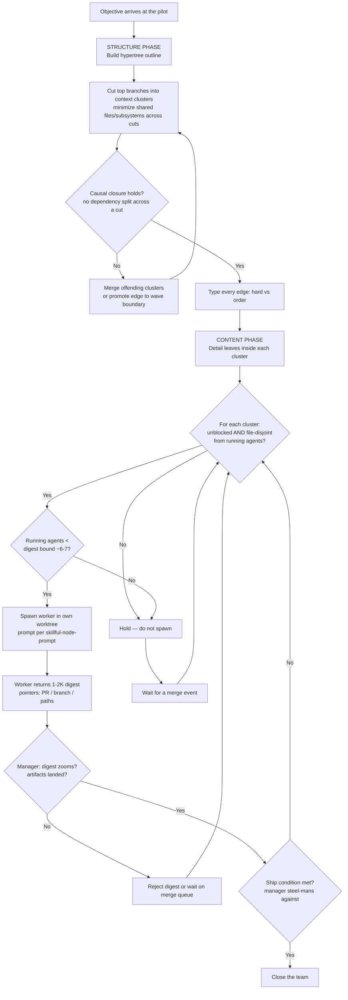

# Pilot Hypertree Execution

## The Doctrine

Operator directive (2026-08-22): port-daddy's planning always does hypertree
context-cluster execution — the pilot working as `manager-driven-team-orchestrator`
+ `dag-isolation-manager` + `dag-parallel-executor`, with per-node prompts per
`skillful-node-prompt`.

This is not one option among several. It is the standing rule for how the pilot
(and any planner lane) turns an objective into running agents. The reasoning is
the HyperTree Planning result (see the `hypertree-planning` skill, arriving via
its own import PR): complex work fails from **structural mismatch between problem
complexity and reasoning organization**, not from insufficient effort. A 60-step
sequential chain accumulates error; a hypertree of independent branches reduces
effective depth and lets independent branches run in parallel. The doctrine
binds that insight to port-daddy's concrete execution machinery.

## When to Use

- The pilot receives an objective that will take more than one agent or more
  than one sitting.
- Any planner lane is about to decompose work into tasks, waves, or PRs.
- An operator asks "how should we split this?" or "how many agents?"

NOT for: choosing the clustering algorithm (use `agent-context-partitioner`),
writing the per-node prompt text (use `skillful-node-prompt`), or pricing token
spend (use `context-economics-for-agent-swarms`). This skill is the doctrine
that sequences those skills; they carry the mechanics.

## Rule 1 — Structure Phase Before Content Phase

Build the hypertree **outline** before committing to any detail. Two distinct
phases, never interleaved:

1. **Structure phase**: produce the hypertree skeleton. The root is the
   objective. Top-level branches are **context clusters** (defined below). No
   implementation decisions are made here — only decomposition decisions.
2. **Content phase**: fill in leaf detail (specific edits, specific tests,
   specific PRs) inside each branch, guided by the outline.

Why the separation matters: premature detail commitment (picking the fix before
picking the partition) causes cascading revisions when the structure turns out
wrong, and the outline is itself the coordination protocol — each branch knows
its scope from its parent cut, so no central message-passing is needed for
branches to stay out of each other's way.

### Context clusters, causal closure, typed edges

Top-level branches are **context clusters**: groups of tasks chosen to
**minimize shared context across the cut**. The unit of sharing is concrete:
files and subsystems. Two tasks that edit the same file, or reason over the
same subsystem's invariants, belong in the same cluster. Two tasks whose file
sets are disjoint belong in different clusters. (This is the min-cut framing
from `agent-context-partitioner`: the optimal partition minimizes mutual
information across the cut, and file overlap is the cheap, honest proxy.)

Two hard constraints on every cut:

- **Causal closure**: a dependency is never split across a cut. If task B needs
  task A's output to even start, A and B live in the same cluster — or the edge
  between their clusters becomes an explicit wave boundary. No cluster may
  silently depend on another cluster's in-flight work.
- **Typed edges**: every edge in the outline is labeled either
  - `hard` — data/artifact dependency: downstream consumes upstream's output
    (a schema, an exported function, a merged PR). Hard edges force wave
    ordering.
  - `order` — preference/merge-hygiene dependency: both could run in parallel
    but landing one first avoids conflict churn (e.g. two clusters touching
    the same lockfile or the roadmap ledger). Order edges shape the merge
    queue, not the spawn schedule.

  An edge with no type is a planning bug: untyped edges get treated as hard by
  timid planners (killing parallelism) or ignored by eager ones (splitting a
  dependency).

## Rule 2 — Cluster-to-Agent Assignment and Spawn Discipline

The mapping from clusters to agents:

- **Sequential same-file chain → ONE agent.** Tasks that form a dependent chain
  over the same files share a single agent. Splitting the chain buys nothing
  (the second agent blocks on the first anyway) and costs a full context
  handoff plus merge risk on the shared files.
- **File-disjoint clusters → parallel agents.** Each unblocked, file-disjoint
  cluster gets its own agent in its own worktree.
- **K is chosen by spawn discipline, not ambition.** Spawn an agent only when
  its cluster is (a) unblocked — every inbound `hard` edge satisfied by a
  merged artifact — and (b) file-disjoint from every currently running agent.
  Cap concurrent agents at the **merge-queue / orchestrator digest bound**:
  the number of 1–2K digests the manager can actually read and steel-man per
  round, and the number of PRs the merge queue can land without conflict
  churn. Empirically for port-daddy this is **~6–7 concurrent agents**. Past
  that bound, additional agents degrade the manager (digest skimming) before
  they add throughput.
- **Waves are gated on merges, not schedules.** Wave N+1 starts when wave N's
  artifacts (PRs) actually land, not when a clock says so. A wave boundary is
  a set of satisfied `hard` edges. If wave N is partially landed, spawn only
  the wave-N+1 clusters whose specific inbound edges are satisfied — waves are
  a bookkeeping convenience, not a barrier.

## Rule 3 — Execution Roles

The pilot runs the plan wearing three skills at once, plus one per node:

| Concern | Skill | The doctrine's binding |
|---|---|---|
| Orchestration | `manager-driven-team-orchestrator` | The pilot is the manager: it delegates clusters, reads returned digests, decides per round which clusters are active, adds/retires roles as evidence arrives, and **steel-mans against shipping** — the ship condition is stated before wave 1, and the manager argues the strongest case that it is NOT yet met before closing. |
| Isolation | `dag-isolation-manager` | Every worker runs in its **own linked worktree**, never the main checkout. Worktree-per-agent is the file-level enforcement of the cluster cut: an agent physically cannot conflict with a cluster it was cut away from. Child agents inherit the parent's isolation level or stricter. |
| Parallelism | `dag-parallel-executor` | Waves execute with controlled parallelism: dependencies checked before spawn, `maxParallelism` = the digest bound, wave completion means all artifacts landed (merged) before dependent clusters start. |
| Per-node prompts | `skillful-node-prompt` | Each spawned agent's prompt is a hypertree itself: four independent branches — **Identity** (skills/expertise), **Context** (upstream digests, whiteboard), **Task** (the cluster's scope, focus files), **Protocol** (tool limits, output contract, escalation). The outline's cluster definition feeds the Task branch directly. |

Note the resolution of an apparent conflict: `hypertree-planning` warns against
over-centralized manager bottlenecks, yet this doctrine names a manager. The
synthesis is that the **outline does the coordination** (branches are scoped by
structure, not by manager micromanagement) while the manager does only what
structure cannot: read digests, judge evidence, decide ship. The manager never
holds worker transcripts, so it never becomes the context bottleneck the
warning is about.

## Rule 4 — Context Economics

Per `context-economics-for-agent-swarms`, budgets by role:

- **The orchestrator holds the plan plus 1–2K digests only.** Its window is:
  the hypertree outline, the ship condition, and one 1–2K digest per completed
  cluster. Never raw tool output, never worker transcripts.
- **Workers return pointers, not transcripts.** A worker's digest names PR
  numbers, branch names, and file paths — artifacts the manager (or a
  successor agent) can re-fetch — plus the one decision or blocker that needs
  the manager. Isolation IS compaction: the parent never sees the bloat.
- **Digests must zoom.** Every digest line deep-links to its artifact (PR,
  diff, note). A digest claim with no backing artifact link is over-flattened
  and is rejected — send it back. This is what lets the manager steel-man
  honestly: it can always drill from the claim to the diff.

## Decision Flow

## Worked Example — the 2026-08-22 Wave 1

The real wave-1 partition run under this doctrine on 2026-08-22. Structure
phase produced five context clusters, cut on file/subsystem disjointness:

| Cluster | Scope (subsystem cut) | Branch (pointer, per Rule 4) |
|---|---|---|
| identity | identity write-boundary audit; identity/auth surface only | `claude/identity-write-boundary-audit` |
| cli-tube | CLI tube coast-guard hardening; `cli/` surface only | `claude/cli-tube-coast-guard` |
| receipts | atomic receipt acceptance; receipts subsystem only | `claude/receipt-atomic-acceptance` |
| website | website endpoint work; `website/` static + endpoints | `codex/3-28-website-endpoint-core` |
| roadmap-merge | roadmap snapshot conflict fix; roadmap ledger only | `claude/roadmap-snapshot-conflict-fix` |

Doctrine checkpoints as they played out:

- **Cut quality**: the five clusters are pairwise file-disjoint (identity,
  cli, receipts, website, roadmap ledger are distinct subsystems), so all five
  could run as parallel agents — K=5, under the ~6–7 digest bound, so no
  cluster was held back by spawn discipline.
- **Typed edge**: roadmap-merge carried an `order` edge toward every other
  cluster — each landed PR appends to the roadmap ledger, so landing the
  snapshot-conflict fix early reduced merge churn for the rest. It was an
  order edge, not hard: nobody consumed its output to start. So it ran in
  parallel but was prioritized in the merge queue.
- **Same-file chain kept whole**: the website cluster internally contained a
  sequential chain (endpoint core → static endpoint cleanup) over overlapping
  files. Per Rule 2 that chain shares one lane, sequenced within the cluster —
  it was NOT split into two concurrent agents.
- **Isolation**: each cluster ran in its own linked worktree under the
  scratchpad, never the main checkout.
- **Digests**: each worker returned branch + PR pointers (the table above is
  literally the digest form), and the manager gated wave 2 on those PRs
  landing — not on a schedule.

The expert move: the partition was chosen so that the *merge queue*, not the
agents, was the only shared resource — which is exactly what the digest bound
prices.

## Anti-Patterns

1. **Premature detail commitment.** Deciding implementation specifics before
   the outline exists. Symptom: wave-1 agents get respawned with rewritten
   prompts when the structure shifts. Fix: no content-phase work until the
   cluster cut passes causal closure.
2. **Forced sequential reasoning.** Running file-disjoint clusters through one
   agent "to keep context." Symptom: one long-lived session whose quality
   decays with length (context rot) while independent work queues behind it.
   Fix: cut on file-disjointness and spawn.
3. **Splitting a same-file chain.** Assigning two agents to a dependent chain
   over the same files. Symptom: agent 2 idles, then merge-conflicts with
   agent 1. Fix: one agent per chain; the chain is the cluster.
4. **Unbounded K past the merge queue.** Spawning every unblocked cluster at
   once because parallelism feels like progress. Symptom: the manager skims
   digests it cannot steel-man; PRs stack up in conflict churn. Fix: hold at
   the ~6–7 digest bound; a held cluster costs nothing, a skimmed digest
   costs correctness.
5. **Transcript-shaped digests.** Workers returning their reasoning history
   instead of pointers. Symptom: orchestrator window fills with prose that
   cannot be verified. Fix: reject any digest line that does not deep-link to
   an artifact.
6. **Schedule-gated waves.** Starting wave N+1 because wave N "should be done
   by now." Symptom: downstream agents build against unmerged, still-mutable
   branches. Fix: waves gate on merge events only.
7. **Untyped edges.** An outline whose edges carry no hard/order label.
   Symptom: either false serialization (everything waits) or a split
   dependency (something builds on air). Fix: typing edges is part of the
   structure phase's definition of done.

## Quality Gates

- [ ] A hypertree outline exists before any content-phase work begins.
- [ ] Every top-level branch is a context cluster with an explicit file/subsystem scope.
- [ ] The cut passes causal closure: no `hard` dependency crosses a cluster boundary without a wave boundary.
- [ ] Every edge is typed `hard` or `order`; no untyped edges.
- [ ] Sequential same-file chains are each assigned to exactly one agent.
- [ ] Every spawned agent's cluster is unblocked and file-disjoint from all running agents at spawn time.
- [ ] Concurrent K never exceeds the merge-queue/orchestrator digest bound (~6–7).
- [ ] Every worker runs in its own linked worktree, never the main checkout.
- [ ] Every per-node prompt has the four `skillful-node-prompt` branches (Identity / Context / Task / Protocol).
- [ ] The orchestrator's window holds only the plan + 1–2K digests; no worker transcripts.
- [ ] Every digest line deep-links to an artifact (PR number, branch, or file path).
- [ ] Wave N+1 clusters start only after their inbound `hard` edges are satisfied by merged artifacts.
- [ ] The ship condition was stated before wave 1, and the manager steel-manned against it before closing.

## NOT-FOR Boundaries

- **Choosing the partitioning algorithm** (EAC, METIS+FM, BIRCH, K selection)
  → `agent-context-partitioner`. This doctrine says clusters exist and what
  constraints they satisfy; that skill computes them.
- **Writing the node prompt text** → `skillful-node-prompt`.
- **Manager round mechanics** (role catalog, activation, ship judgment)
  → `manager-driven-team-orchestrator`.
- **Isolation profile details** (trust levels, resource limits)
  → `dag-isolation-manager`.
- **Wave execution mechanics** (retries, batching, error strategy)
  → `dag-parallel-executor`.
- **Token accounting and compaction mechanics**
  → `context-economics-for-agent-swarms`.
- **The underlying research framing** (hypertrees vs chains vs trees, error
  accumulation math) → `hypertree-planning`.
