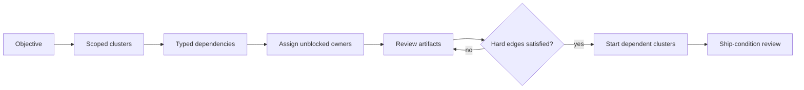

# Pilot Hypertree Execution

This is the operational Port Daddy planning lane. Use `hypertree-planning` for the research method if decomposition itself is uncertain. The local Port Daddy runtime may be under an operator halt; obey the current repository instructions and use permitted tool-native and Git workflows only.

## Execution contract

1. State the objective and ship condition. Draft the outline: clusters with file and subsystem scope, deliverables, and integration checks.
2. Type cross-cluster edges. A **hard** edge means a downstream task needs a concrete upstream artifact; an **order** edge means sequence reduces merge churn but does not block work.
3. Keep a same-file dependent chain with one owner. Run unblocked, file-disjoint clusters in parallel only when their integration and review load can be handled.
4. Give each worker an owned file set, exact linked worktree and feature branch, inherited safety constraints, and an output contract. Require root/branch/worktree proof before writes.
5. Integrate on satisfied artifact dependencies, not a timer. Verify each returned digest against its diff, tests, and exact commit before opening dependent work.
6. Before declaring completion, test the ship condition against the strongest remaining counterexample; state local, hosted, merged, and deployed status separately.

```mermaid
flowchart LR
  O[Objective] --> C[Scoped clusters]
  C --> E[Typed dependencies]
  E --> A[Assign unblocked owners]
  A --> R[Review artifacts]
  R --> G{Hard edges satisfied?}
  G -->|yes| N[Start dependent clusters]
  G -->|no| R
  N --> S[Ship-condition review]
```

## Boundaries

- File disjointness is a useful conflict proxy, not proof that reasoning contexts are independent. Name shared invariants and integration ownership.
- The prior skill's “six to seven agents” is a historical Port Daddy operating heuristic, not a universal cap. Choose concurrency from actual review capacity, merge queue, and resource limits.
- Worktree isolation does not prevent semantic merge conflict. Inspect interfaces and shared artifacts at integration.
- A pointer digest must lead to inspectable evidence; a branch name alone is not validation.

## Source material

`sources/prior-entry/SKILL.md` preserves the former operational doctrine, worked wave example, and detailed gates. Use it when the current Port Daddy workflow needs those specifics, but check current operator rules and repo state first. This skill does not authorize the halted local runtime.
