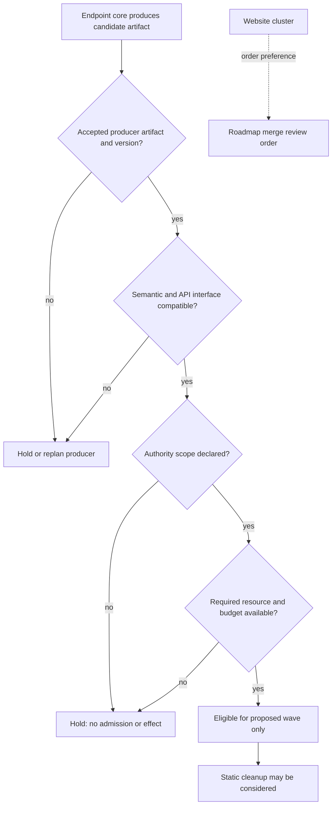

# Pilot edge semantics and admission boundary

A hard producer-to-consumer relation requires an accepted artifact and the consumer’s semantic-interface, authority, and resource checks. The order edge only records review preference. Eligibility is not dispatch, completion, or authorization for an external effect.
