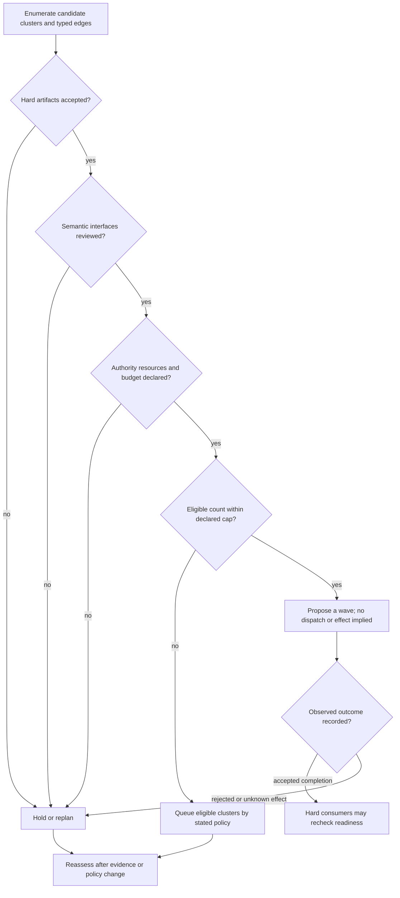

# Pilot wave policy: eligibility, capacity, and evidence

The cap governs proposed-wave admission only. A consumer becomes eligible only after its specific accepted hard artifact and its own admission checks; an unknown prior effect remains unresolved rather than becoming success.
