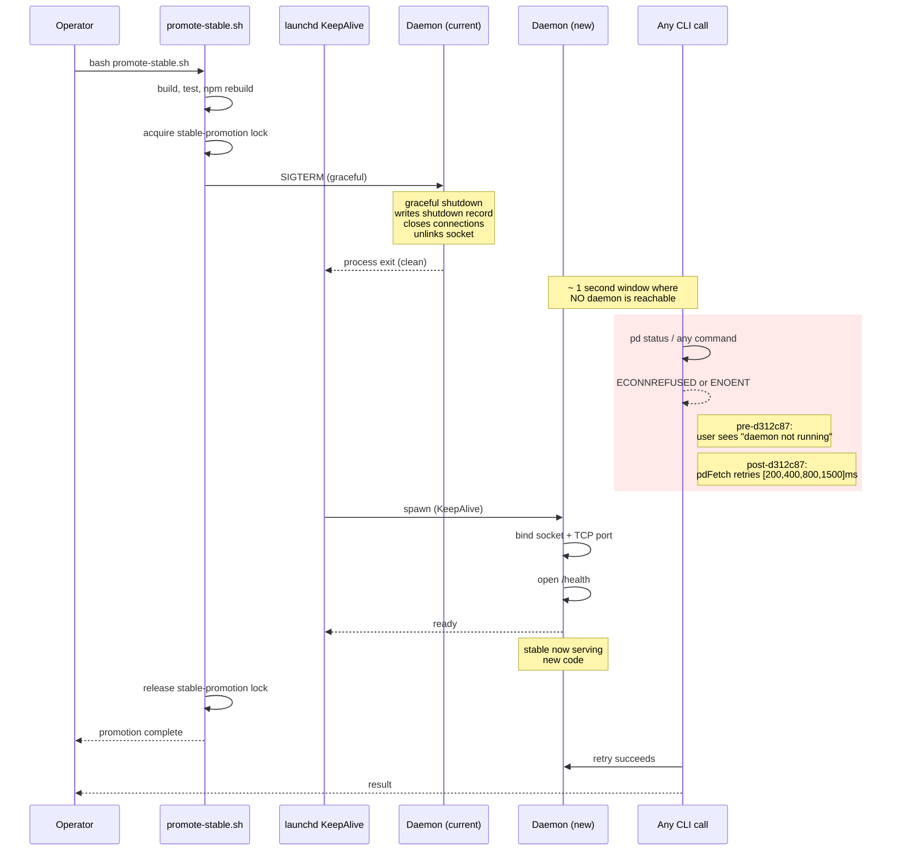

# Diagram 05: Promote-Stable Timing & The Respawn Window

The launchd respawn window is invisible without a timeline. This diagram shows it.

## Sequence

## Key timings

| Event | Approx duration | Notes |
|---|---|---|
| `bash promote-stable.sh` start to lock-acquired | 1-2 s | depends on `pd lock` round-trip |
| build + test + npm rebuild | 30-90 s | dominates total time |
| SIGTERM → process exit | <100 ms | graceful shutdown is fast |
| Process exit → launchd respawn | ~700-1000 ms | launchd's own poll cadence |
| New daemon → socket bound | ~200 ms | better-sqlite3 init + Fastify boot |
| Socket bound → /health green | ~50 ms | warm-up |
| **Total CLI-blackout** | **~1 s** | the window pdFetch retries through |

## Why retry is the right fix

Alternatives considered:

- **Pre-warm new daemon, swap, kill old**: requires daemon coordination (port juggling). Complex.
- **Hold all CLI calls until promotion lock releases**: serializes ALL CLI through promote-stable.sh duration (30-90s). Worse UX than transient retries.
- **Operator-side coordination**: ask users to run `--during-promote` flag. Manual = forgotten = same UX.
- **Retry at the CLI layer (chosen)**: invisible to user, opt-out via env, no daemon changes.

## Detection rules

Your CLI is in a respawn window if BOTH:

1. `pd status` returned ECONNREFUSED or ENOENT in the last <2s.
2. `launchctl list | grep portdaddy` shows `PID -` (mid-respawn).

If only #1: real outage, escalate.
If only #2: launchd thinks it's mid-respawn but connection works → cache lag, ignore.

## Related

- `examples/08-launchd-respawn-window.md` — the full incident writeup.
- `decisions/something-broke.md` "Is the daemon process alive?" branch.
- `cli/utils/fetch.ts:139` — `DAEMON_RECONNECT_DELAYS_MS`.
- `references/error-codes-and-recovery.md` — ECONNREFUSED entry.
